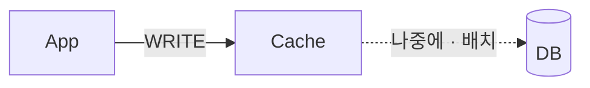
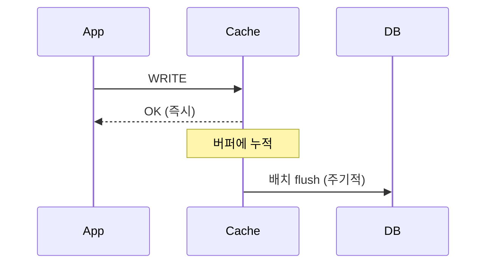

# Write Back (Write Behind)

> **`behind` / `back`** — 뒤에서, 나중에

쓰기는 캐시에서 끝내고, **DB 반영은 뒤로 미룬다.**
앱은 캐시 속도로 응답을 받고, DB에는 나중에 모아서 한 번에 쓴다.
빠른 대신, 미뤄둔 사이에 캐시를 잃으면 그 데이터도 함께 사라진다.

---

쓰기를 캐시에만 반영하고, **일정 주기로 모아서 DB에 기록**한다. 캐시가 큐 역할을 한다.

## 동작

## 장점

| 항목 | 내용 |
|-----|-----|
| 쓰기 부하 감소 | 쓰기 쿼리 횟수와 비용이 크게 줄어든다 |
| 응답 지연 | 쓰기 응답이 캐시 속도로 끝난다 |
| DB 장애 내성 | DB가 잠시 죽어도 쓰기를 계속 받을 수 있다 |

## 단점

| 항목 | 내용 |
|-----|-----|
| **데이터 유실** | flush 전 캐시가 죽으면 그 사이 쓰기가 **영구 소실된다** |
| 조회 일관성 | DB를 직접 읽는 다른 시스템은 아직 반영되지 않은 값을 본다 |
| 불필요 적재 | 읽히지 않을 데이터도 캐시를 차지한다 → TTL 필수 |
| 복잡도 | flush 주기·실패 재시도·순서 보장을 설계해야 한다 |

## flush 전까지 캐시가 Source of Truth다

다른 전략에서 SoT는 항상 DB지만, Write Back은 다르다.
Oracle Coherence 문서가 이를 명시한다.

> "write-behind effectively **makes the cache the system-of-record**
> (until the write-behind queue has been written to disk),
> business regulations must allow **cluster-durable** (rather than disk-durable) storage of data."

즉 flush 전 구간에서는 **캐시에만 존재하는 데이터**가 있고, 이때 캐시 유실은 곧 데이터 소실이다.
캐시는 본래 영속성을 보장하지 않으므로, Write Back은 그 전제를 깨는 구성이다.

### 추가 요건

| 요건 | 내용 |
|-----|-----|
| DB 트랜잭션 실패 불가 | 캐시 트랜잭션이 DB 트랜잭션보다 먼저 끝나므로, 실패 시 되돌릴 수단이 없다 |
| 순서 재배열 허용 | write-behind는 DB 갱신 순서를 바꿀 수 있어 참조 무결성 제약이 이를 허용해야 한다 |
| 멱등성 | 재시도·병합(write-coalescing) 때문에 저장 연산이 멱등해야 한다 |

## 적합성

| 적합 | 부적합 |
|-----|-------|
| 쓰기가 매우 빈번하고 유실을 감수할 수 있는 데이터 — 로그, 조회수, 센서 데이터, 게임 전투 로그 | 금융 거래, 주문, 권한 등 유실이 허용되지 않는 데이터 |

## 관련

- [write-through.md](write-through.md) · [write-around.md](write-around.md)

## Reference

- [Oracle Coherence - Read-Through, Write-Through, Write-Behind, Refresh-Ahead](https://docs.oracle.com/cd/E16459_01/coh.350/e14510/readthrough.htm)
