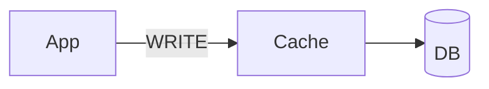
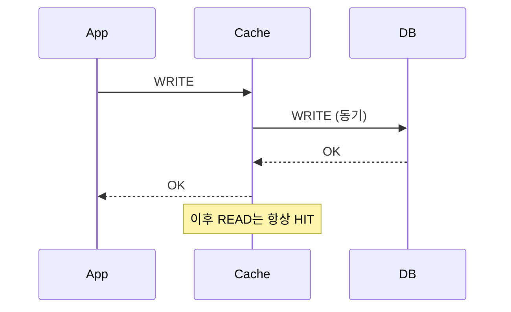

# Write Through

> **`through`** — ~를 통과해서

쓰기가 **캐시를 통과해** DB로 간다. 캐시에 쓰면 DB까지 함께 써진다.
쓰기가 끝난 순간 캐시에도 최신 값이 있으므로, 바로 읽어도 최신이다.



---

쓰기 시 캐시와 DB를 **함께 반영**한다. 읽을 때 항상 최신을 보장한다.

## 두 가지 형태를 구분한다

| 형태 | 쓰기 주체 | 캐시의 위치 |
|-----|---------|-----------|
| **정통 Write-Through** | 캐시가 DB 쓰기를 대행 | 쓰기 경로의 **관문** |
| **애플리케이션 갱신** (`@CachePut`) | 애플리케이션이 DB와 캐시에 각각 | 관문이 아님 |

두 형태를 같은 이름으로 부르는 자료가 많지만, 실패 특성이 다르다.

## 동작



## 장점

| 항목 | 내용 |
|-----|-----|
| 최신성 | 읽을 때 항상 최신 값이 보장된다 |
| 유실 없음 | 쓰기가 DB에 동기 반영되므로 캐시 장애 시에도 데이터가 남는다 |
| MISS 없음 | 쓰기 직후 조회에서 DB를 읽지 않는다 |

## 단점

| 항목 | 내용 |
|-----|-----|
| 쓰기 2회 | 매 쓰기마다 캐시·DB 두 번 기록되어 쓰기가 잦으면 성능 부담 |
| 불필요 적재 | 읽히지 않을 데이터도 캐시를 차지한다 → TTL 필수 |
| 조합 캐시 부담 | 캐시가 여러 소스의 조합이면 쓰기 경로가 조립 로직을 알아야 한다 |

## 애플리케이션 갱신 (`@CachePut`) 의 추가 위험

```java
@Transactional
@CachePut(cacheNames = CachePolicy.Name.USER, key = "#result.id")
public User update(Long id, UpdateRequest request) {
    return userService.update(id, request);
}
```

| 항목 | 내용 |
|-----|-----|
| **롤백 불일치** | 롤백되면 DB=기존값, Cache=새값으로 **불일치가 지속된다** |
| 실행 순서 | `@CachePut`도 `@CacheEvict`와 같은 order 불확실성을 갖는다 |

| 방식 | 실패 시 비용 |
|-----|-----------|
| 삭제 | 캐시 미스 1회 |
| 갱신 | **잘못된 데이터 제공** |

Redis 공식 cache-aside 가이드의 권고는 반대 방향이다 →
[why-invalidate-not-update.md](../concepts/why-invalidate-not-update.md)

## 적합성

| 적합 | 부적합 |
|-----|-------|
| 데이터 유실이 허용되지 않고 읽기 최신성이 중요한 경우 | 쓰기가 빈번한 경우, 조합·파생 캐시 |

## 조합

| 읽기 전략 조합 | 비고 |
|--------------|-----|
| [Read Through](../read/read-through.md) | 최신성 + 정합성 모두 보장 (예: AWS DAX) |
| [Look Aside](../read/look-aside.md) | 흔히 `@CachePut` 형태로 쓰인다 |

## 관련

- [write-around.md](write-around.md) · [write-back.md](write-back.md)

## Reference

- [Oracle Coherence - Write-Through Caching](https://docs.oracle.com/cd/E16459_01/coh.350/e14510/readthrough.htm)
- [Microsoft - Cache-Aside pattern (staleness after writes)](https://learn.microsoft.com/en-us/azure/architecture/patterns/cache-aside)
