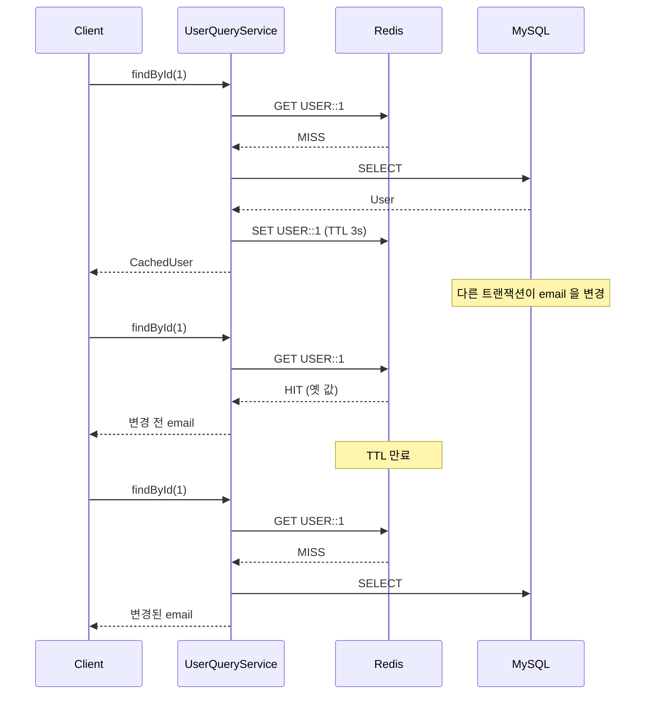

# TTL Only

무효화 코드를 한 줄도 쓰지 않는 전략이다.
DB가 바뀌어도 캐시에 알리지 않고, 키가 스스로 만료될 때까지 기다린다.

그래서 이 모듈이 증명하려는 명제는 하나다.
**옛 값이 보이는 기간의 상한이 TTL과 일치한다.**
상한이 확정되면 "얼마나 틀릴 수 있는가"를 숫자로 답할 수 있고,
그 숫자를 받아들일 수 있는 데이터에는 무효화 장치가 아예 필요 없다.

## Environment

- Java 21
- Spring Boot 3.5.0
- Hibernate 6.6.15.Final
- MySQL 8.4.4
- Redis 7
- Testcontainers 1.21.3

## 동작



변경을 캐시에 전파하는 경로가 없다.
최신성은 오직 TTL이 끝나는 시점에만 회복된다.

## 구성

| 클래스 | 역할 |
|-------|-----|
| `UserCachePolicy` | 캐시 이름·TTL·값 타입을 선언한다. `invalidatedByTtlOnly()` 로 무효화 주인이 없음을 명시 |
| `UserQueryService` | `@Cacheable` 만 선언한다 |
| `UserCommandService` | 캐시를 전혀 모른다 |

`CacheSpec.invalidatedByTtlOnly()` 는 단순한 표시가 아니다.
코어의 기동 검증이 "규칙이 소유하지 않는 캐시"를 기본적으로 거부하기 때문에,
이 선언이 없으면 애플리케이션이 뜨지 않는다.
TTL에만 의존하겠다는 결정을 코드에 남기도록 강제하는 장치다.

## 설정

무효화 신호 소스를 **하나도 선언하지 않는다.**

```java
@Configuration
public class CacheConfig extends AbstractCacheConfig {

    @Override
    protected CachePolicies cachePolicies() {
        return CachePolicies.of(UserCachePolicy.values());
    }
}
```

`JpaEntityChangeConfig` 나 `EntityChangeEventConfig` 를 선언하지 않았으므로
리스너 빈이 컨텍스트에 존재하지 않는다. 쓰지 않는 전략의 빈을 떠안지 않는다는 뜻이고,
이것을 `CacheConfigTest` 가 테스트로 고정한다.

TTL·지터 같은 값은 `service.cache` 아래에 모은다.

```yaml
service:
  cache:
    expiration:
      not-found-ttl: 30s
      jitter-ratio: 0.1
```

## TTL 을 3초로 둔 이유

운영 값이 아니라 **관측을 위한 값**이다.
stale 지속시간을 실제로 재려면 테스트가 만료를 기다려야 하는데,
10분으로 두면 그 명제를 검증할 수 없다.

TTL에는 `ttl-jitter-ratio` 만큼의 흔들림이 함께 적용된다.
같은 시각에 적재된 키들이 동시에 만료되면서 DB로 몰리는 것을 막기 위해서다.

## 검증

```bash
./gradlew :spring-cache:cache-invalidation-strategy:ttl-only:test
./gradlew :spring-cache:cache-invalidation-strategy:ttl-only:test -Ptestcontainers
```

기본 경로는 로컬 공유 DB(`_settings/docker/docker-compose.yml`)를 쓰고,
`-Ptestcontainers` 는 컨테이너를 띄워 접속 정보만 덮어쓴다.
스키마명·`ddl-auto`·샘플 데이터는 두 경로가 동일하다.

| 테스트가 고정한 동작 |
|-------------------|
| 첫 조회만 DB를 읽고 이후는 캐시가 응답한다 |
| TTL 만료 전에는 변경 전 값을 반환한다 |
| TTL이 만료되면 변경된 값을 반환한다 |
| 관측된 stale 지속시간이 TTL을 넘지 않는다 |
| not-found도 캐시되어 존재하지 않는 키가 DB를 반복해서 때리지 않는다 |
| 캐시에 저장된 값에 타입 힌트(`@class`)가 없다 |

## 언제 이 전략으로 충분한가

| 적합 | 부적합 |
|-----|-------|
| 코드 테이블, 설정값처럼 변경이 드문 데이터 | 변경 직후 최신값이 보여야 하는 데이터 |
| TTL만큼 틀려도 업무상 문제가 없는 데이터 | 금액·재고·권한처럼 오차가 곧 사고인 데이터 |

## 관련 문서

- [docs/invalidation/ttl-only.md](../docs/invalidation/ttl-only.md)
- [docs/concepts/ttl.md](../docs/concepts/ttl.md)
- [docs/concepts/stampede.md](../docs/concepts/stampede.md)
