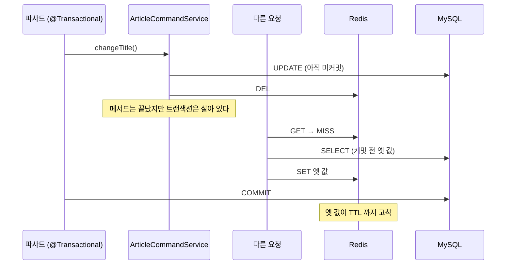
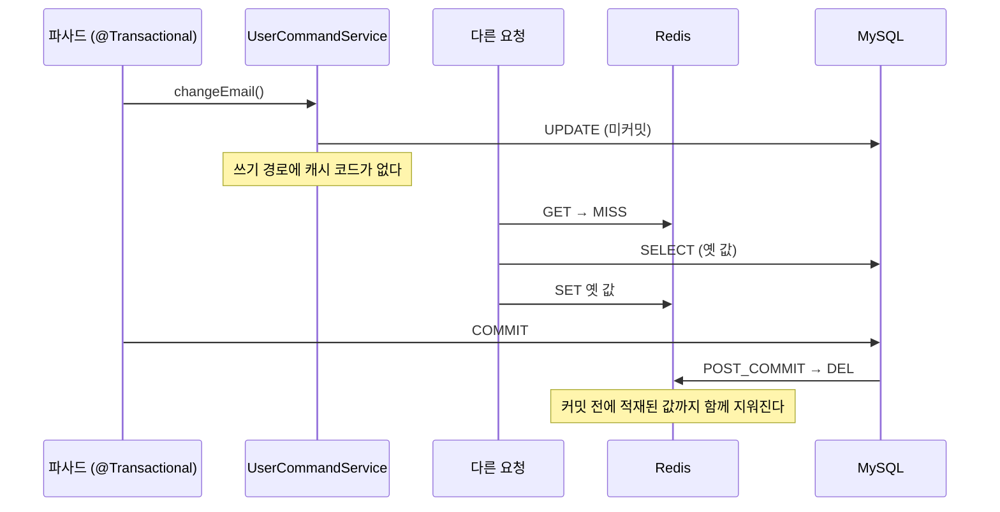
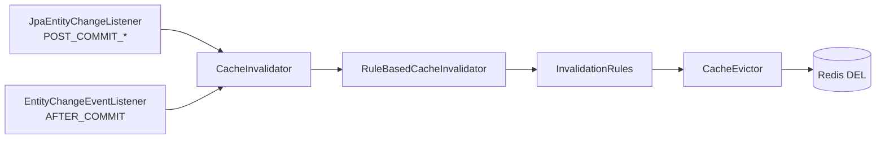

# Write Invalidate

DB를 바꾼 쪽이 옛 캐시를 지우는 전략이다.
새 값으로 고쳐 넣지 않고 **지우기만** 한다. 다시 만드는 일은 다음에 읽는 쪽이 맡는다.

문제는 "지운다"가 아니라 **"언제 지우는가"** 다.
커밋보다 먼저 지우면, 지운 자리에 다른 요청이 아직 커밋되지 않은 옛 값을 다시 채워 넣는다.
그러면 무효화를 분명히 했는데도 옛 값이 TTL까지 남는다.

이 모듈은 세 가지 무효화 방식을 한자리에 두고 그 차이를 테스트로 드러낸다.

## Environment

- Java 21
- Spring Boot 3.5.0
- Hibernate 6.6.15.Final
- MySQL 8.4.4
- Redis 7
- Testcontainers 1.21.3

## 세 가지 방식

| 엔티티 | 무효화 경로 | 쓰기 코드에 캐시가 보이는가 | 커밋 이후 보장 |
|-------|-----------|------------------------|-------------|
| `Article` | `@CacheEvict` | 보인다 | 없음 |
| `User` | Hibernate `POST_COMMIT_*` | 안 보인다 | 있다 |
| `User` | Spring `@TransactionalEventListener(AFTER_COMMIT)` | 발행 코드만 | 있다 |

같은 엔티티에 두 방식을 함께 걸면 엔티티 이벤트가 `@CacheEvict` 의 실패를 가려버린다.
그래서 엔티티를 나눴고, 이 분리 자체가 리스너의 대상 선별이 동작한다는 증거가 된다.

## 왜 커밋 전에 지워지는가

`@CacheEvict` 와 `@Transactional` 은 둘 다 우선순위 기본값이 `Integer.MAX_VALUE` 다.
동률일 때의 상대 순서는 Spring이 보장하지 않는다.

이 PoC 환경에서 프록시 체인을 열어 보면 캐시가 바깥, 트랜잭션이 안쪽이다.
배치만 보면 안전해 보인다. 그런데 이건 **그 메서드가 트랜잭션을 직접 소유할 때만** 성립한다.



쓰기 메서드가 바깥 트랜잭션에 참여하는 순간, 어드바이저 배치와 무관하게
evict가 바깥 커밋보다 먼저 끝난다. 파사드가 여러 쓰기를 한 트랜잭션으로 묶으면 바로 성립하는 조건이다.

`RedisCacheManager` 의 `transactionAware()` 를 켜면 이 창은 닫힌다.
다만 `put` 도 함께 지연되기 때문에, 지연된 `put` 이 커밋 직후의 `evict` 보다 늦게 착지할 수 있다.
이 모듈은 완화책을 적용하지 않은 상태를 기준으로 삼는다. 문제를 먼저 보여주는 것이 목적이기 때문이다.

## 커밋 이후에 지우면 어떻게 달라지는가



커밋 전에 끼어든 조회가 옛 값을 다시 심어도, 무효화가 그 뒤에 오므로 함께 걷어낸다.

## 무효화 파이프라인

두 소스는 발생원일 뿐이고, 그 아래는 공유한다.



어느 경로로 들어오든 같은 규칙과 같은 evictor를 통과한다.
`InvalidationSource` 로 어느 쪽이 무효화했는지만 구분해 기록하므로,
두 소스를 함께 켜도 운영에서 추적이 가능하다.

## 설정 확장

모듈은 코어 설정을 **상속**하고, 필요한 신호 소스만 골라 켠다.

```java
@Configuration
@Import({JpaEntityChangeConfig.class, EntityChangeEventConfig.class})
public class CacheConfig extends AbstractCacheConfig {

    @Override
    protected CachePolicies cachePolicies() {
        return CachePolicies.of(UserCachePolicy.USER, ArticleCachePolicy.ARTICLE);
    }

    @Override
    protected List<InvalidationRule> invalidationRules() {
        return List.of(EvictableEntityRule.owning(UserCachePolicy.USER));
    }
}
```

`AbstractCacheConfig` 는 파이프라인만 확정하고 나머지는 재정의 가능한 메서드로 연다.

| 확장점 | 기본값 | 언제 재정의하나 |
|-------|------|--------------|
| `cachePolicies()` | 없음 (필수) | 항상 |
| `invalidationRules()` | 빈 목록 | 무효화 대상을 산출해야 할 때 |
| `cacheSerialization()` | `JsonCacheSerialization` | 직렬화 형식을 바꿀 때 |
| `cacheExpiration(..)` | `JitteredCacheExpiration` | 만료·지터 규칙을 바꿀 때 |

신호 소스는 `@Import` 로 고른다. 선언하지 않으면 그 리스너 빈은 등록되지 않는다.

## 개발자가 작성하는 것

| 작성한다 | 작성하지 않는다 |
|---------|-------------|
| `CachePolicy` enum (캐시 이름·TTL·값 타입) | evict 호출 코드 |
| 조회 메서드의 `@Cacheable` | 쓰기 메서드의 `@CacheEvict` |
| 엔티티의 `CacheEvictable` 또는 별도 `InvalidationRule` | 트랜잭션 훅 등록 |

`UserCommandService` 에는 캐시라는 단어가 등장하지 않는다.
무효화가 서비스 메서드 선언이 아니라 **엔티티가 커밋됐다는 사실**에서 파생되기 때문이다.
새 쓰기 경로를 추가해도 빠뜨릴 자리가 없다.

## 실행

```bash
./gradlew :spring-cache:cache-invalidation-strategy:write-invalidate:test
./gradlew :spring-cache:cache-invalidation-strategy:write-invalidate:test -Ptestcontainers
```

경합은 스레드 타이밍이 아니라 **바깥 트랜잭션 경계**로 재현한다.
`TransactionTemplate` 이 커밋 시점을 쥐고, 조회는 다른 스레드에서 수행해
호출자의 트랜잭션에 참여하지 않게 한다. 어드바이저 순서에 의존하지 않으므로 결과가 항상 같다.

미보장 동작인 어드바이저 순서 자체는 테스트로 고정하지 않았다.
버전 업그레이드에서 바뀌는 것이 정상이고, 고정하면 거짓 실패가 된다.

## 테스트가 고정한 동작

| 상황 | `@CacheEvict` (Article) | 엔티티 이벤트 (User) |
|-----|------------------------|--------------------|
| 쓰기가 트랜잭션을 직접 소유 | 변경값 반환 | 변경값 반환 |
| 바깥 트랜잭션 참여, 커밋 전 | 캐시가 이미 비워짐 | 캐시 유지 |
| 커밋 전 조회가 끼어듦 | **옛 값 고착** | 커밋 후 무효화가 걷어냄 |
| 롤백 | 캐시는 이미 삭제됨 (미스 1회 손실) | 무효화 없음 |
| 지연 로딩 프록시로 변경 | 해당 없음 | 무효화됨 |

그 밖에 다음을 고정한다.

- `CacheEvictable` 을 구현하지 않은 엔티티는 같은 커밋에 섞여 있어도 무효화되지 않는다
- 무효화 대상 키를 얻으려고 DB를 다시 읽지 않는다
- Redis가 죽어도 커밋은 성공하고 호출자에게 예외가 새어나가지 않는다
- JPA를 거치지 않은 변경을 애플리케이션 이벤트로 알려도 같은 파이프라인이 캐시를 지운다

마지막 항목이 중요하다.
커밋 이후에 실행되는 코드에서 예외를 던지면 DB는 이미 커밋된 상태인데 호출자는 롤백으로 오해한다.
Hibernate의 after-completion 큐는 `CacheException` 외의 예외를 다시 던지므로,
무효화 실패를 리스너 경계에서 흡수하지 않으면 이 사고가 실제로 일어난다.

## 관련 문서

- [docs/invalidation/write-invalidate.md](../docs/invalidation/write-invalidate.md)
- [docs/invalidation/entity-event-invalidate.md](../docs/invalidation/entity-event-invalidate.md)
- [docs/concepts/dual-write.md](../docs/concepts/dual-write.md)
