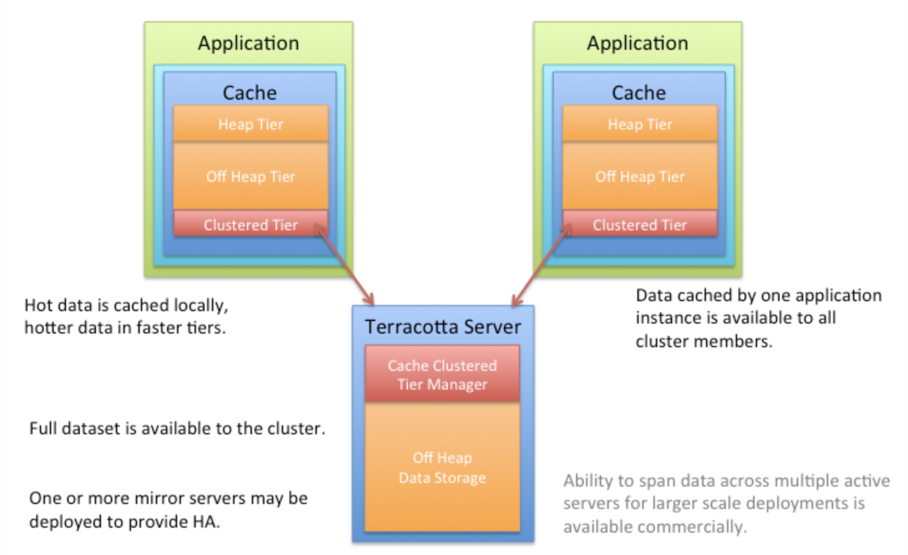

# EHCache2

## Storage Tiers

- `MemoryStore`: 캐시 요소를 보관하는데 사용되는 Heep 메모리 (Java GC 대상)
  - 직렬화 가능 여부에 관계없이 모든 데이터를 허용
  - 가장 빠른 옵션
  - Thread-Safe : 여러 동시 스레드에서 사용하기에 스레드로부터 안전
- `OffHeapStore`: MemoryStore에 오버플로 용량 제공. 사용 가능한 RAM에 의해서만 크기가 제한됩니다. Java GC 대상이 아니다. `Terracotta BigMemory` 제품에서만 사용할 수 있다.
  - byte 단위로 데이터가 저장되기 때문에 직렬화가 가능한 데이터만 가능
  - 직렬화할 수 없는 데이터들은 경고 로그만 알려주고 데이터는 삭제된다.
- `DiskStore`: 메모리 내 캐시 요소를 백업하고 다른 계층에 오버플로 용량 제공.
  - byte 단위로 데이터가 저장되기 때문에 직렬화가 가능한 데이터만 가능
  - DiskStore 계층은 캐시의 로컬(독립 실행형) 인스턴스에만 사용할 수 있습니다. 분산 캐시(BigMemory Max에서만 사용 가능)를 사용하는 경우 디스크 계층 대신 `Terracotta Server Array`가 사용
  - 디스크에 대한 쓰기/읽기는 ObjectInputStream 및 Java 직렬화 메커니즘을 사용

> [Ehcache2 - store tiers](https://www.ehcache.org/generated/2.9.0/html/ehc-all/index.html#page/Ehcache_Documentation_Set%2Fco-store_storage_tiers.html%23)

## EHCache2 설정

- CacheManager
- [https://www.ehcache.org/apidocs/2.9/](https://www.ehcache.org/apidocs/2.9/)
- [https://www.ehcache.org/ehcache.xml](https://www.ehcache.org/ehcache.xml)

### CacheManager XML 설정

- `ehcache.xml`

```java
<ehcache updateCheck="false">
  <diskStore path="java.io.tmpdir"/>
  <defaultCache maxEntriesLocalHeap="1000" eternal="false" timeToIdleSeconds="1200" timeToLiveSeconds="1200">
  </defaultCache>
  <cache name="member"
         maxEntriesLocalHeap="1000"
         eternal="false"
         overflowToDisk="true"
         diskPersistent="false"
         timeToIdleSeconds="300"
         timeToLiveSeconds="600"
         diskExpiryThreadIntervalSeconds="1"
         memoryStoreEvictionPolicy="LRU">
  </cache>
</ehcache>
```

> [net.sf.ehcache:ehcache:2.10.6]((https://www.ehcache.org/generated/2.9.0/html/ehc-all/))

### ehcache.xml, ehcache-failsafe.xml

CacheManager의 기본 생성자 또는 팩토리 메소드가 호출되면, Ehcache는 클래스 경로의 최상위 레벨에서 `ehcache.xml` 파일을 찾는다.

만약 기존 `ehcache.xml` 설정 파일로 인한 구성을 실패하게 되면, Ehcache는 클래스 경로에서 `ehcache-failsafe.xml` 을 찾아 대체한다. 따라서 ehcache-failsafe.xml의 파일은 의 JAR에 패키지되어 항상 구성되어야한다.

### XML:Elements

- [EhCache User Guid: XML Configuration](https://www.ehcache.org/generated/2.9.0/html/ehc-all/#page/Ehcache_Documentation_Set%2Fco-cfgbasics_xml_configuration.html%23wwconnect_header)
- [https://www.ehcache.org/ehcache.xml](https://www.ehcache.org/ehcache.xml)
- [TTI 와 TTL 차이점](https://stackoverflow.com/questions/2583429/how-to-differentiate-between-time-to-live-and-time-to-idle-in-ehcache)

- 캐시 메모리 관리 차원
- **`<ehcache>`**
  - updateCheck
    - CacheManager가 새로운 버전인지 인터넷을 통해 체크 여부를 지정하는 선택적 boolean flag
    - default: updateCheck="true"
- **`<diskStore>`** : 캐시에 대해 디스크 지속성을 사용하도록 설정했거나 클러스터되지 않은 인덱스 검색을 사용하는 경우 구성 필요. 디스크가 구성되어 있지 않고 디스크 저장소가 필요한 캐시가 생성되면 경고가 발생하며  `java.io.tmpdir`으로 자동으로 사용.
  - path
- **`<defaultCache>`**
  - 다음 설정은 `CacheManager.add(String cacheName)` 에 생성된 캐시에 적용 (직접 생성하는 캐시에 대한 기본 설정)
  - maxEntriesLocalHeap
    - 메모리에 만들 수 있는 최대 개체 수 설정
  - eternal
    - 영속성 캐시 설정, 캐시가 영구한지 여부 설정. 영구할 경우 시간 초과가 무시되고 Element가 만료되지 않는다.
  - timeToIdleSeconds (TTI)
    - 캐시가 만료되기전, 해당 초동안 캐시가 호출되지 않으면 삭제
  - timeToLiveSeconds (TTL)
    - 캐시가 만료되기전, 해당 초가 지나면 캐시 삭제
- **`<cache>`**
    - 하나의 캐시를 사용할 때마다 구현
    - name
      - 캐시의 이름을 지정
    - overflowToDisk
        - 오버플로우된 항목에 대해 disk에 저장할 지 여부
    - diskPersistent
        - 캐시를 disk에 저장하여, 서버 로드 시 캐시를 말아 둘지 설정
    - diskExpiryThreadIntervalSeconds
        - Disk Expiry thread의 작업 수행 간격 설정, 기본 120 초
    - memoryStoreEvictionPolicy
      - `maxEntriesLocalHeap` 한계치에 도달하면 수행할 Cache Eviction 정책 (메모리 공간 확보를 위해 캐시 데이터 삭제)
      - `LRU`, Least Recently Used
        - 가장 오랫동안 호출 되지 않은 캐시를 삭제
      - `LFU`, Less Frequently Used
        - 호출 빈도가 가장 적은 캐시를 삭제
      - `FIFO`, First In First Out
        - 캐시가 생성된 순서대로 가장 오래된 캐시를 삭제
    - maxEntriesLocalHeap
    - eternal
    - timeToIdleSeconds
    - timeToLiveSeconds

## EHCache3

JCache (JSR-107, The Java Temporary Caching API) Provider

### 분산 캐시 설정

EHCache + Terracotta Server Array

- [Ehcache3 - clustered-cache](https://www.ehcache.org/documentation/3.1/clustered-cache.html)



### EHCache3 TTI 이슈 -> 더이상 지원하지 않는 이슈

- 만료 처리 관련
  - [https://stackoverflow.com/questions/43412225/set-up-both-ttl-and-tti-in-ehcache-3-xml-configuration](https://stackoverflow.com/questions/43412225/set-up-both-ttl-and-tti-in-ehcache-3-xml-configuration)
  - [https://github.com/ehcache/ehcache3/issues/1097](https://github.com/ehcache/ehcache3/issues/1097)
  - [https://github.com/ehcache/ehcache3/issues/2909](https://github.com/ehcache/ehcache3/issues/2909)

**`<expiry>`** : 기존 ehcache 2.x 버전에서 캐시 유지 시간을 관리하는 tti, ttl을 표현하는 속성이다.

현재는 tti과 ttl을 함께 사용할 수는 없고, 원한다면 클래스를 새로 추가해서 두 속성 모두 사용되게 하면 된다. 

ttl, tti의 기본 단위는 seconds이다. (가독성을 위해 디폴트값을 명시적으로 표기했다)