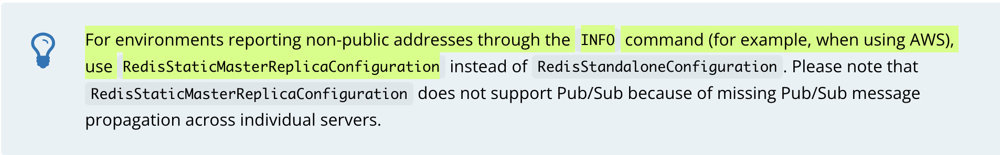

# Spring Data Redis

- Spring Boot 2.6.2
- Redis Client Jedis 3.8.0
- Java 8

## 학습 목표

- [Redis Connector Config](#redis-connector-config)
    - [Lettuce Connector Config](#lettuce-connector-config)
    - [Jedis Connector Config](#jedis-connector-config)
    - [Master-Slave Config](#write-to-master-read-from-replica)
- [High-availability Redis Config](#high-availability-redis-config)
    - [Redis Sentinel](#redis-sentinel-config)
    - [AWS ElastiCache Redis Config](#aws-elasticache-redis-config)

## Redis Connector Config

- [Lettuce Connector Config](#lettuce-connector-config)
- [Jedis Connector Config](#jedis-connector-config)
- [Master-Slave Config](#write-to-master-read-from-replica)

### Lettuce Connector Config

### Dependency

```xml

<dependencies>
    <dependency>
        <groupId>io.lettuce</groupId>
        <artifactId>lettuce-core</artifactId>
        <version>6.1.6.RELEASE</version>
    </dependency>
</dependencies>
```

### Lettuce Java Config

```java

@Configuration
class RedisConfig {
	@Bean
	public LettuceConnectionFactory redisConnectionFactory() {
		return new LettuceConnectionFactory(new RedisStandaloneConfiguration("server", 6379));
	}
}
```

### Jedis Connector Config

### Dependency

```xml

<dependencies>
    <dependency>
        <groupId>redis.clients</groupId>
        <artifactId>jedis</artifactId>
        <version>3.7.1</version>
    </dependency>
</dependencies>
```

### Jedis Java Config

```java
@EnableCaching
@Configuration
class RedisConfig {
	@Bean
	public JedisConnectionFactory redisConnectionFactory() {
		return new JedisConnectionFactory();
	}
}
```

### Write to Master Read from Replica

```java
@EnableCaching
@Configuration
public class RedisConfig {
	@Bean
	public RedisConnectionFactory redisConnectionFactory() {
		RedisConfiguration serverConfig = new RedisStandaloneConfiguration("server", 6379);
		LettuceClientConfiguration clientConfig = getClientConfig();
		return new LettuceConnectionFactory(serverConfig, clientConfig);
	}

	private LettuceClientConfiguration getClientConfig() {
		return LettuceClientConfiguration.builder()
			// master-replica(master-slave) replication strategy config.
			.readFrom(ReadFrom.REPLICA_PREFERRED)
			.build();
	}
}
```

> JedisClientConfiguration: Jedis replication strategy config class

| ReadFrom|Read mode|
|---------|----------|
|`MASTER` / `UPSTREAM`| Read master node only.|
|`MASTER_PREFERRED` / `UPSTREAM_PREFERRED`| Read the master node first.<br/>If the master node is unavailable, read the slave node.|
|`REPLICA` / @Deprecated `SLAVE`| Read from node only.|
|`REPLICA_PREFERRED` / `SLAVE_PREFERRED`| Read the slave node first.|
|`NEAREST`| Read from nearest node.|
|`ANY`|Read from any node.|
|`ANY_REPLICA`|Read from any slave node.|

## High-availability Redis Config

### Redis Sentinel Config

Spring Data Redis 에선 Redis의 HA(high-availability)를 실현하기 위해 [Redis Sentinel](https://redis.io/topics/sentinel) 을 지원한다.

```java
@EnableCaching
@Configuration
public class RedisConfig {
	// Jedis
	@Bean
	public RedisConnectionFactory jedisConnectionFactory() {
		return new JedisConnectionFactory(sentinelConfig());
	}

	// Lettuce
	@Bean
	public RedisConnectionFactory lettuceConnectionFactory() {
		return new LettuceConnectionFactory(sentinelConfig());
	}

	private RedisSentinelConfiguration sentinelConfig() {
		return new RedisSentinelConfiguration()
			.master("mymaster")
			.sentinel("127.0.0.1", 26379)
			.sentinel("127.0.0.1", 26380);
	}
}
```

> Configuration Properties <br/>
> `spring.redis.sentinel.master`: name of the master node. <br/>
> `spring.redis.sentinel.nodes`: Comma delimited list of host:port pairs. <br/>
> `spring.redis.sentinel.password`: The password to apply when authenticating with Redis Sentinel

## AWS ElastiCache Redis Config



- RedisStaticMasterReplicaConfiguration

```java
@EnableCaching
@Configuration
public class RedisConfig {
	@Bean
	public LettuceConnectionFactory redisConnectionFactory() {
		return new LettuceConnectionFactory(elastiCacheConfig());
	}

	private RedisConfiguration elastiCacheConfig(
            @Value("${redis.primary.host}") String masterHost,
            @Value("${redis.primary.port:6379}") int masterPort,
            @Value("${redis.replica.hostAndPort}") List<String> replicaHostAndPorts) {

      RedisStaticMasterReplicaConfiguration config = new RedisStaticMasterReplicaConfiguration(masterHost, masterPort);
      setReplicaNodes(config, replicaHostAndPorts);
      return config;
	}

	private void setReplicaNodes(RedisStaticMasterReplicaConfiguration config, List<String> replicaHostAndPorts) {
		for (String hostAndPort : replicaHostAndPorts) {
			String[] args = StringUtils.split(hostAndPort, ":");
			
			String replicaHost = args[0];
			int replicaPort = Integer.parseInt(args[1]);
			config.addNode(replicaHost, replicaPort);
		}
	}
}
```

## Reference

- [Redis Documentation](https://redis.io/documentation)
    - [Redis Sentinel](https://redis.io/topics/sentinel)
- [lettuce.io - Reference](https://lettuce.io/core/release/reference)
- [Spring Data Redis - Write to Master Read from Replica](https://docs.spring.io/spring-data/data-redis/docs/current/reference/html/#redis:write-to-master-read-from-replica)
- [Spring Data Redis - Redis Sentinel Support](https://docs.spring.io/spring-data/data-redis/docs/current/reference/html/#redis:sentinel)
- [docs.aws.amazon.com - Amazone Elasti Cache](https://docs.aws.amazon.com/ko_kr/AmazonElastiCache/latest/red-ug/GettingStarted.html)
- [aws.plainenglish.io - Caching with ElastiCache(Redis) and Spring Boot](https://aws.plainenglish.io/elasticache-with-spring-boot-eff7e634bbee)
- [ko.zevenet.com - Sentinel 모니터링으로 고 가용성 Redis 데이터베이스를 생성하는 방법](https://ko.zevenet.com/knowledge-base/howtos/how-to-create-a-highly-available-redis-database-with-sentinel-monitoring/)
