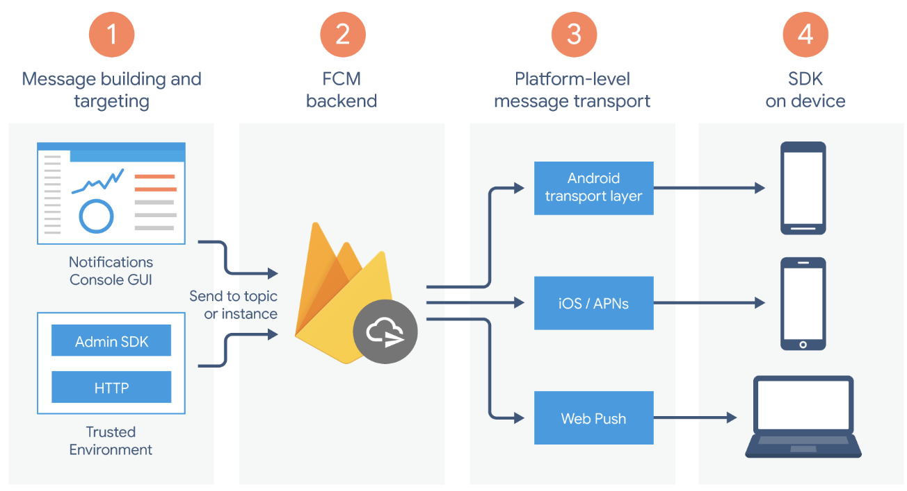
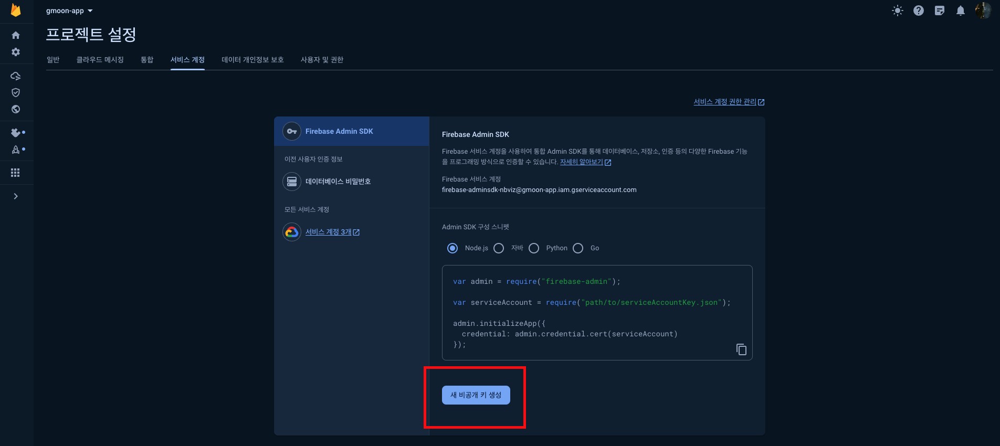

# FCM, Firebase Cloud Messaging

Google의 Firebase 플랫폼에서 제공하는 메시징 서비스로 Firebase Cloud Messaging(FMC)는 서버에서 클라이언트에게 메시지를 안정적으로 전달할 수 있는 방법을 제공한다. 

이를 통해 사용자에게 알림, 업데이트 및 맞춤형 내용을 실시간으로 전송할 수 있다.

## FCM Architecture 

1. Tooling to compose or build message requests. The Notifications composer provides a GUI-based option for creating notification requests. For full automation and support for all message types, you must build message requests in a trusted server environment that supports the Firebase Admin SDK or the FCM server protocol. This environment could be Cloud Functions for Firebase, App Engine, or your own app server.
2. The FCM backend, which (among other functions) accepts message requests, performs fanout of messages via topics, and generates message metadata such as the message ID.
3. A platform-level transport layer, which routes the message to the targeted device, handles message delivery, and applies platform-specific configuration where appropriate. This transport layer includes:
   - Android transport layer (ATL) for Android devices with Google Play services
   - Apple Push Notification service (APNs) for Apple devices
   - Web push protocol for web apps 
4. The FCM SDK on the user’s device, where the notification is displayed or the message is handled according to the app’s foreground/background state and any relevant application logic.

### V1 Migration

- URL 변경
- OAuth 2.0 토큰 사용
- 페이로드 구조 수정
- 방화벽 확인
  - https://fcm.googleapis.com
  - https://accounts.google.com
  - https://oauth2.googleapis.com
  - https://www.googleapis.com

### FCM Message

메시지 페이로드 객체는 키와 값 쌍으로 이뤄진 json 데이터로 구성된다.

- [HTTP V1 payload](https://firebase.google.com/docs/reference/fcm/rest/v1/projects.messages?hl=ko#Notification)
- Legacy HTTP APIs
  - [HTTP Server Protocol](https://firebase.google.com/docs/cloud-messaging/http-server-ref?hl=ko#notification-payload-support)
  - [XMPP Server Protocol](https://firebase.google.com/docs/cloud-messaging/xmpp-server-ref?hl=ko#notification-payload-support)

메시지 데이터는 알림 메시지, 데이터 메시지로 구분된다.

- Notification messages
- Data messages

알림과 데이터 페이로드가 모두 포함된 메시지를 수신한 경우의 앱 동작은 앱이 백그라운드 상태인지 아니면 포그라운드 상태인지에 따라 다르다. 특히 수신 당시에 앱이 활성 상태였는지 여부에 따라 구분된다.

- background: 알림 페이로드가 앱의 알림 목록에 수신되며 사용자가 알림을 탭한 경우에만 앱에서 데이터 페이로드 처리
- foreground: 앱에서 페이로드가 둘 다 제공되는 메시지 객체 수신

time_to_live 플래그가 설정되지 않은 한 기본 제한 시간은 4주다.

자세한 페이로드 설정은 [FCM V1 REST Resource](https://firebase.google.com/docs/reference/fcm/rest/v1/projects.messages?hl=ko#resource:-message)를 참고하자.

### vapid

- https://developer.chrome.com/blog/web-push-interop-wins?hl=ko#introducing_vapid_for_server_identification

## ErrorCode

- [FCM V1 Reference - error code](https://firebase.google.com/docs/reference/fcm/rest/v1/ErrorCode?hl=ko)

## Firebase Admin SDK 

1. [FCM Console 접속](https://console.firebase.google.com/)
2. 프로젝트 선택
3. 프로젝트 설정 > 서비스 계정 > 비공개 키 생성

## Reference

- [firebase.google.com - reference v1](https://firebase.google.com/docs/reference/fcm/rest/v1/projects.messages?hl=ko)
- [firebase.google.com - Firebase Cloud Messaging](https://firebase.google.com/docs/cloud-messaging/server?hl=ko)
- [firebase.google.com - FCM REST](https://firebase.google.com/docs/reference/fcm/rest?hl=ko)
- [stackoverflow - The legacy Firebase Cloud Messaging (FCM) API is deprecated. what does it mean](https://stackoverflow.com/questions/78024354/the-legacy-firebase-cloud-messaging-fcm-api-is-deprecated-what-does-it-mean)
- [github - firebase quickstart messaging](https://github.com/firebase/quickstart-js/tree/master/messaging)
- [uracle wiki - FCM HTTP V1 guide](https://wiki.uracle.co.kr/push/server/fcm/httpv1-guide)
