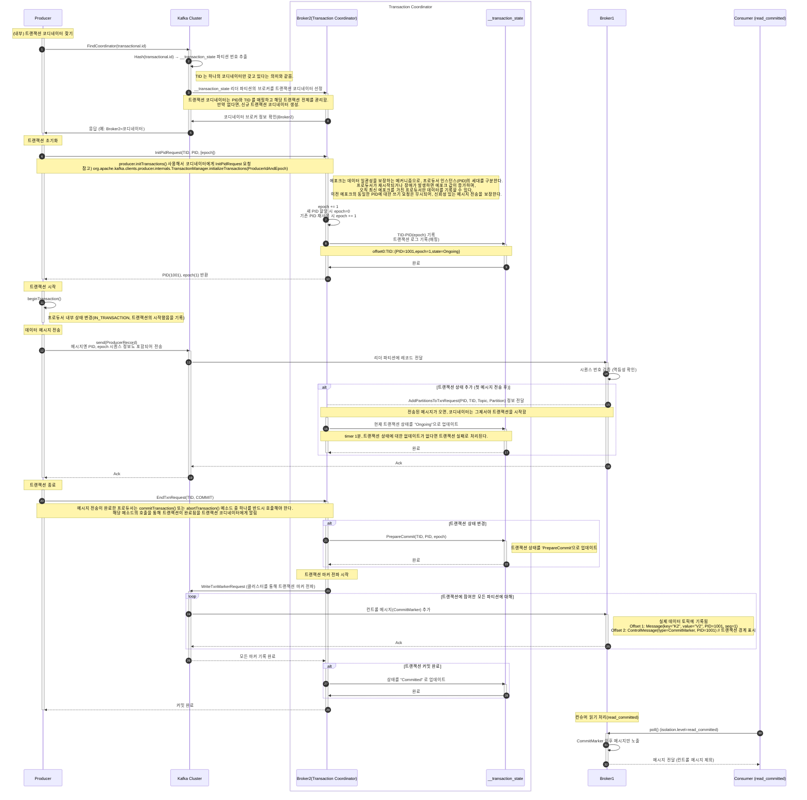

# Producer with Transaction

프로듀서 트랜잭션을 활용한 데이터 파이프라인에서 정확히 한번 메시지 전송을 수행하는 방법에 대해 소개한다.

## EOS(Exactly Once Semantics) with Transaction

"정확히 한 번"의 의미는 트랜잭션과 같은 `전체적인 프로세스 처리`를 의미하고, 요청에 대해 성공 또는 실패에 대해선 **전체 롤백(데이터 무결성)을 보장**해야한다.

멱등성 프로듀서는 정확히 한 번 전송한다는 의미는 아니다. 멱등성 프로듀서는 메시지 재전송시 브로커에 레코드의 중복 적재를 방지하는 옵션이다.

> 멱등성 브로커 = 중복 없는 전송(중복 레코드 적재 방지하기 위함)

- 멱등성 프로듀서 + Transaction

카프카의 트랜잭션 API 를 활용해 프로듀서 "정확히 한번" 발송을 보장한다. 트랜잭션 프로듀서의 메시지들은 원자적(atomic)한 성질을 띄게되어 전송에 성공하거나 실패하게 된다.

## Transaction coordinator 

카프카 서버엔 `트랜잭션 코디네이터` 존재하는 데, 프로듀서에 의해 전송된 메시지를 관리하며, 커밋 또는 중단 등을 표시한다.

- 트랜잭션을 시작, 커밋, 중단하는 역할
- 메시지 상태 관리
  - 특정 프로듀서가 전송한 메시지 트랜잭션을 추적한다.
  - 장애 발생 시 롤백 처리
- 트랜잭션 로그 관리
  - 트랜잭션 로그는 `__transaction_state` 내부 토픽에 의해 관리됨
    - `Transaction ID` 기반으로 관리됨
  - 이 토픽은 브로커가 관리하며, 프로듀서가 직접 관여하지 않는다.
  - 로그에는 트랜잭션 ID, 프로듀서 ID, 상태(예: Ongoing, CompleteCommit 등), 관련 파티션 정보 등이 기록된다.
- 트랜잭션 마킹
  - 커밋 또는 중단 시도를 `__transaction_state`에 기록하여 트랜잭션 상태를 명확히 표시한다.
- 컨트롤러 메시지 처리
  - 클라이언트와 브로커 간 통신을 위해 특별한 유형의 메시지를 사용한다.
  - 이 메시지는 애플리케이션에 노출되지 않으며, 트랜잭션의 정상 여부를 판단하는 데 사용된다.

### 2. `__transaction_state` 토픽

`__transaction_state`은 트랜잭션 프로듀서가 처음 실행될 때, Lazy 방식으로 카프카 브로커 자체에 의해 내부 토픽으로 자동 생성되며, 트랜잭션 코디네이터가 직접 관리한다.

- Kafka가 트랜잭션의 상태를 관리하기 위한 내부 로그로서 트랜잭션 메타데이터만 기록된다.
- 컨트롤러 브로커(트랜잭션 코디네이터)가 이 토픽을 관리하면서 트랜잭션 일관성을 유지
- 트랜잭션 메타데이터만 기록된다.
- 기존 토픽과 마찬가지로 파티션, 리플리케이션 팩터 존재.
- 관련 설정
  - transaction.state.log.load.buffer.size
  - transaction.state.log.min.isr
  - transaction.state.log.num.partitions
  - `transaction.state.log.replication.factor` 
    - [중요] 반드시 클러스터 내 브로커 수 이하로 설정해야함. 트랜잭션이 정상적으로 작동하지 않음!
  - transaction.state.log.segment.bytes

### 3. 컨트롤러 메시지

컨트롤러 메시지는 트랜잭션의 커밋/중단 상태를 마킹하기 위한 내부 전용 메시지다.

- 트랜잭션 커밋 마킹을 위한 메타 데이터다.
- `__transaction_state` 토픽이 아닌 대상 데이터 토픽 파티션에 기록된다.
- 컨트롤러 브로커가 Kafka 내부 트랜잭션을 유지하는 데 사용
    - 브로커와 클라이언트(프로듀서 or 컨슈머) 통신에만 사용.
- 애플리케이션 레벨(클라이언트)에선 노출되지 않음
    - 컨트롤 메시지는 컨슈머에게 노출되어서는 안 되며, `read_committed` 설정을 통해 필터링됨.
- 트랜잭션 코디네이터가 상태를 결정할 때 활용

```text
// 로그 세그먼트 내 실제 저장 형태
Partition Log:
Offset 0: Message(key="K1", value="V1", PID=1001, seq=0)  
Offset 1: Message(key="K2", value="V2", PID=1001, seq=1)
Offset 2: ControlMessage(type=CommitMarker, PID=1001)  // 트랜잭션 경계 표시
```

장애 복구 용이성
- 브로커 장애 시 오프셋 순서로 트랜잭션 상태 재구성 가능

```text
복구 프로세스:
1. 오프셋1 메시지 발견 → "미확정" 상태로 분류
2. 오프셋2 컨트롤 메시지 발견 → 오프셋1을 "커밋됨"으로 변경
```

주의 사항
- 컨트롤 메시지 크기: 일반 메시지 대비 약 50% 작음 (헤더만 저장)
- 성능 영향: 초당 10만 트랜잭션 시 약 1.5MB의 추가 스토리지 사용 발생.

## Transaction Producer

``` java
package com.gmoon.springkafkaproducer.basic;

import lombok.extern.slf4j.Slf4j;
import org.apache.kafka.clients.producer.KafkaProducer;
import org.apache.kafka.clients.producer.Producer;
import org.apache.kafka.clients.producer.ProducerConfig;
import org.apache.kafka.clients.producer.ProducerRecord;
import org.apache.kafka.common.serialization.StringSerializer;
import org.junit.jupiter.api.Disabled;
import org.junit.jupiter.api.DisplayName;
import org.junit.jupiter.api.Test;

import java.util.Properties;

@Slf4j
@Disabled
@DisplayName("정확히 한 번")
class ProducerExactlyOnceSendTest {

	/**
	 * @see <a href="https://kafka.apache.org/documentation/#usingtransactions">Apache Kafka - Using Transactions</a>
	 * */
	@Test
	void withTransaction() {
		Properties props = new Properties();
		props.put(ProducerConfig.KEY_SERIALIZER_CLASS_CONFIG, StringSerializer.class.getName());
		props.put(ProducerConfig.VALUE_SERIALIZER_CLASS_CONFIG, StringSerializer.class.getName());
		props.put(ProducerConfig.BOOTSTRAP_SERVERS_CONFIG, "localhost:9092");

		// 1. 멱등성 프로듀서 설정
		props.put(ProducerConfig.ENABLE_IDEMPOTENCE_CONFIG, "true");
		props.put(ProducerConfig.ACKS_CONFIG, "all");
		props.put(ProducerConfig.RETRIES_CONFIG, "5");
		props.put(ProducerConfig.MAX_IN_FLIGHT_REQUESTS_PER_CONNECTION, "5");
		// 1. 트랜잭션 ID 설정(TRANSACTIONAL_ID_CONFIG)
		// 동일한 transactional.id 한에서 정확히 한번을 보장한다.
		// 프로듀서 프로세스마다 고유한 아이디로 설정해야함, 다중 프로듀서 설정시 프로듀서마다 다른 아이디로 설정해야 함.
		props.put(ProducerConfig.TRANSACTIONAL_ID_CONFIG, "pid01-tx01");

		Producer<String, String> producer = new KafkaProducer<>(props);
		try {
			producer.initTransactions(); // 2. 트랜잭션 초기화
			producer.beginTransaction(); // 3. 트랜잭션 시작

			var record = new ProducerRecord<String, String>("topic.sample", "callback");
			producer.send(record);
			producer.flush();
			// 4. 트랜잭션 커밋
			producer.commitTransaction();
		} catch (Exception e) {
			// 5. 트랜잭션 중단
			producer.abortTransaction();
			throw new RuntimeException(e);
		} finally {
			producer.close();
		}
	}
}
```

1. 멱등성 프로듀서 + 트랜잭션 ID 설정
2. 트랜잭션 초기화
3. 트랜재션 시작 
4. 트랜재션 커밋 
5. 트랜재션 중단 

## 고려할 점

- 트랜잭션이 필요한 이유: Exactly-Once Semantics (EOS) 보장
- 카프카 구조상 컨슈머에서도 `isolation.level=read_committed` 옵션을 같이 설정해줘야 커밋된 데이터를 소비하여 EOS 보장 가능.
- `enable.idempotence=true`로 설정하면 기본적으로 트랜잭션을 활성화하지 않아도 중복 방지가 가능
- 좀비 트랜잭션 주의!!
  - `transaction.timeout.ms` 값을 너무 길게 설정하면 좀비 트랜잭션(장애 발생 후 트랜잭션이 클린업되지 않는 문제)이 발생할 수 있음, `transaction.max.timeout.ms`와 함께 조정해야 함

## 트랜잭션 프로듀서 시퀀스그램



## Reference

- [Apache Kafka - 4.7 Using Transactions](https://kafka.apache.org/documentation/#usingtransactions)
- [Confluent - Connector Developer Guide](https://docs.confluent.io/platform/current/connect/devguide.html)
