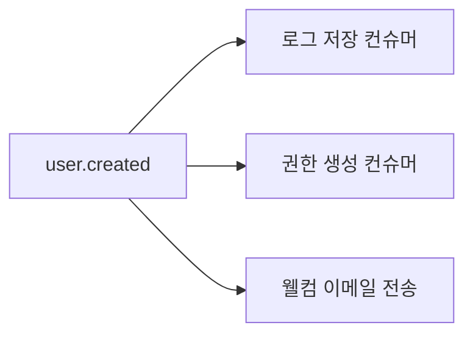

# Kafka Topic Naming Convention Guide

토픽 네이밍엔 표준은 없지만, 조직 내 일관성이 가장 중요하다.

- **"이벤트 이름은 요청이 아닌, 발생한 사실이어야 한다."**  
- `Tell, Don't Ask` — `Loose Coupling`을 위한 핵심 원칙

- [1. Tell, Don't Ask](#1-tell-dont-ask)
- [2. 올바른 사례 vs 문제적 사례](#2-올바른-사례-vs-문제적-사례)
- [3. 프로듀서-컨슈머 관점 분리 필요성](#3-프로듀서-컨슈머-관점-분리-필요성)
- [4. 시간적 일관성 보장](#4-시간적-일관성-보장)
- [5. 확장성 고려한 네미이 패턴](#5-확장성-고려한-네이밍-패턴)
- [6. 실제 운영 시 주의점](#6-실제-운영-시-주의점)
- [7. 반드시 피해야 할 안티패턴](#7-반드시-피해야-할-안티패턴)
- [8. 마무리](#8-마무리)

## 1. Tell, Don't Ask

- 이벤트는 **프로듀서 관점의 사실**만을 말해야 한다.
- 이벤트 이름이 **컨슈머의 행동을 유도하거나 강제**하면 안 됨.
- **과거 시제(past tense)**로, 이미 발생한 사실을 명시하자.

```text
Good: user.created → 컨슈머는 이걸 보고 권한 설정, 로깅, 알림 전송 등 다양한 걸 자유롭게 할 수 있음.
Bad: user.need_validation
```

Your perspective is 100% correct.

이벤트 이름은 프로듀서의 시점에서, 발생한 순수한 "사실"만을 표현해야 한다. 컨슈머는 해당 이벤트를 해석해서 필요한 행동을 하면 되지, 이벤트 이름이 그 행동을 유도하거나 강제하면 안 된다. 의존성을 줄이기 위해서라도 이벤트는 **과거 시제(past tense)**로, 발생한 사실에 집중하는 게 좋다.

## 2. 올바른 사례 vs 문제적 사례

| 올바른 명명 (과거형 사실) | 문제적 명명 (의존성 내포)         |
|-----------------|-------------------------|
| `user.created`  | `user.need_validation`  |
| `order.placed`  | `order.wait_payment`    |
| `file.uploaded` | `file.ready_processing` |

## 3. 프로듀서-컨슈머 관점 분리 필요성

**프로듀서의 책임**: "무엇이 발생했는가"에 대한 사실만 기록
```text
// Good: 순수 이벤트 기록
producer.send("user.created", new UserCreatedEvent(userId));

// Bad: 컨슈머 의도 내포
producer.send("user.requires_activation", ...);
```

**컨슈머의 책임**: 수신한 이벤트를 기반으로 **자율적**으로 해석해 필요한 처리를 수행해야 함.


## 4. 시간적 일관성 보장

- 이벤트 이름은 항상 과거형
- 완료된 상태를 나타내야 함

```text
# 시간의 흐름에 따른 자연스러운 순서
user.created 
ㄴ→ user.password_changed 
     ㄴ→ user.deactivated
```

- `created`/`deleted`/`updated` 등 변경 완료 상태를 명시
- "하는 중"이 아닌 "했다"는 사실 강조

## 5. 확장성 고려한 네이밍 패턴

``` text
# 1. 도메인 이벤트 스타일
account.created.v1

# 2. CQRS 최적화형
billing.invoice.paid
```

## 6. 실제 운영 시 주의점

- 트랜잭션 경계
- 버전 관리

**트랜잭션 경계**
```text
// 이벤트 발행 전 DB 커밋 완료 필수
transactionManager.commit(); 
producer.send("order.completed", event);
```
  
**버저닝 전략**:
- `order.created.v1` → 스키마 변경 시 `v2` 추가
- 기존 컨슈머는 v1을 계속 소비할 수 있다.

## 7. 반드시 피해야 할 안티패턴

```bash
# 시스템 상태를 가정한 이름 (X)
payment.awaiting_confirmation

# 처리 요청형 이름 (X)
data.request_cleansing

# 특정 컨슈머를 위한 이름 (X)
report.generate_monthly
```

## 8. 마무리

- 이벤트는 상태 변화만 표현해야 함
- 컨슈머의 행동을 암시해서는 안 됨
- Loose Coupling은 명명에서부터 시작된다
 
```text
"이벤트는 발생한 사실을 말하고,
그걸 어떻게 해석할지는 컨슈머가 결정한다."
```

이벤트 이름은 **상태 변화 선언**에 집중해야 하며, 어떤 처리가 필요하다는 암시는 불필요한 의존성을 유발한다. 
토픽 이름이 `user.created`라면, 이는 "사용자가 생성되었다"는 사실만을 알리며, "어떤 후속 작업"이 필요한지는 모든 컨슈머가 자율적으로 결정해야 한다. 

이 방식이 마이크로서비스 환경에서 진정한 `loose coupling`을 달성하는 유일한 방법이다.
