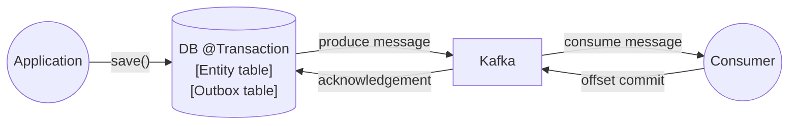
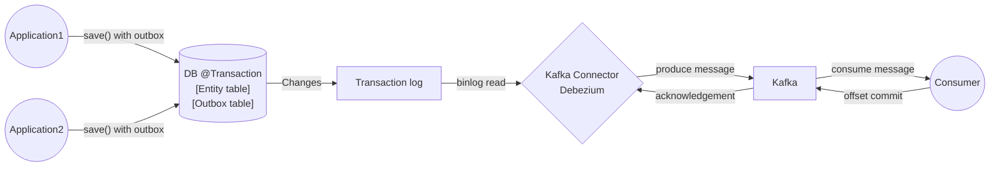
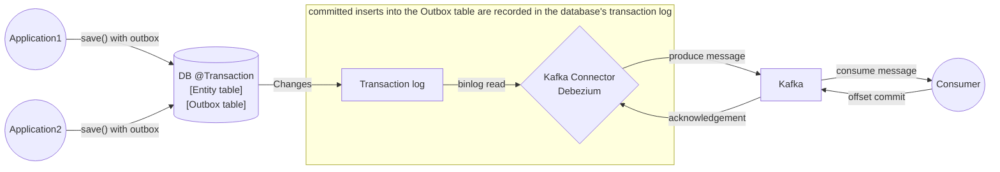

# Transactional Outbox Pattern

## 왜 필요한가?

DB → Kafka 전송 과정에서 메시지가 유실될 수 있다.

```java
@Transactional
public void handleSuccessfulLogin(String userId) {
    User user = userRepository.find(userId);
    saveLoginLog(user);

    SuccessLoginEvent event = new SuccessLoginEvent(user);
    transactionalProducer.send(event);
}
``` 

위 코드처럼 Kafka 메시지를 직접 전송하면, 
**DB 저장과 메시지 전송이 하나의 트랜잭션으로 묶이지 않기 때문에 메시지 유실 위험**이 있다.

- DB 저장은 성공했지만 Kafka 전송은 실패한 경우 → 이벤트 유실
- Kafka 전송은 성공했지만 DB 롤백된 경우 → 유효하지 않은 이벤트 발생

## 패턴의 목적

Transactional Outbox 패턴은 DB 상태와 Kafka 메시지 간의 불일치를 방지하기 위한 전략이다.

Kafka처럼 외부 메시징 시스템을 사용할 때 자주 발생하는 문제는, DB는 정상적으로 반영되었지만 메시지는 유실되거나 중복 전송되는 상황이다. 이 패턴은 이름 그대로 Outbox 테이블을 두고, DB 트랜잭션 안에서 도메인 데이터와 메시지를 함께 저장한 뒤, Kafka 전송은 트랜잭션 외부에서 별도로 처리하는 방식이다.

이를 통해 다음과 같은 효과를 얻을 수 있다.

- DB 데이터와 Kafka 메시지의 **일관성 유지**
- 메시지 **유실 또는 중복 전송 처리 가능**

## 패턴 구조



- 하나의 트랜잭션에서 도메인 데이터 + 메시지(Outbox) 저장
- 메시지 전송은 **트랜잭션 외부의 별도 프로세스**에서 수행

## 프로듀서 측 처리

Outbox 테이블에 카프카로 전송할 메시지 저장

```java
@Transactional
public void handleSuccessfulLogin(String userId) {
    User user = userRepository.find(userId);
    saveLoginLog(user);

    OutboxMessage message = OutboxMessage.builder()
            .id(UUID.randomUUID().toString())
            .aggregateId(userId)
            .type("UserLoginSuccess")
            .payload(toJson(user))
            .build();
    outboxMessageRepository.save(message);
}
```

Outbox 테이블에 저장하는 메시지 구조 예시:

- `id`: 이벤트 ID (Kafka 메시지 키로 사용 가능)
- `aggregateId`: 연관된 도메인 객체 ID
- `type`: 이벤트 타입 (예: `"UserLoginSuccess"`)
- `payload`: 직렬화된 이벤트 내용 (JSON 등)

## 메시지는 누가 Kafka로 전송할까?

패턴에서 메시징 시스템으로 메시지를 전송하는 방식은 크게 두 가지가 있다.

- Polling Publisher
- Transaction log tailing



- Polling Publisher
  - 주기적으로 Outbox 테이블을 폴링하여 메시지를 읽고 Kafka로 전송
  - 전송 성공 시 Outbox 상태 변경 또는 삭제
- Transaction log tailing
  - DB 바이너로그(binlog) + CDC(Change Data Capture) 방식
  - Debezium 등 CDC 툴이 DB binlog를 감지하여 Kafka로 전송
  - Outbox 테이블은 일반적인 DB 테이블처럼 insert만 하면 된다

### Polling vs CDC 비교

| 항목      | Polling Publisher | CDC (Debezium) |
|---------|-------------------|----------------|
| Latency | 높음 (주기적 폴링)       | 낮음 (실시간 스트리밍)  |
| DB 부하   | 중간 (쿼리 실행)        | 낮음 (binlog 기반) |
| 구현 복잡도  | Low               | Medium         |
| 확장성     | Limited           | High           |


## 컨슈머 측: 멱등성 보장

Kafka는 기본적으로 **at-least-once** 전송을 보장한다. 따라서 메시지 중복 처리 전략이 필요하다.

```java
@KafkaListener(topics = "user.login", groupId = "mail-service")
@Transactional
public void consume(String message) {
    SuccessLoginEvent event = parseMessage(message);

    // 1. 이미 처리한 이벤트는 무시
    if (processedEventRepository.existsById(event.getId())) {
        return;
    }

    // 2. 실제 비즈니스 로직
    sendLoginSuccessEmail(event.getUserId());

    // 3. 처리 완료 기록
    processedEventRepository.save(new ProcessedEvent(event.getId()));
}
```

- `event.id`는 Outbox에서 생성한 UUID
- `processed_event` 테이블을 두고, 처리 여부를 기준으로 **멱등성(idempotency)** 확보

## 마무리



**Transactional Outbox 패턴**은 Kafka와 같은 메시징 시스템을 안정적으로 사용할 수 있도록 도와준다.

- DB 트랜잭션 안에서 메시지를 Outbox에 저장
- Kafka 전송은 별도 프로세스(polling 또는 CDC)에서 수행
- 컨슈머는 메시지 키를 기준으로 **중복 메시지 방지** 처리 필요

## Reference

- [microservices.io - transaction log tailing](https://microservices.io/patterns/data/transaction-log-tailing.html)
- [Confluent - Connect](https://docs.confluent.io/platform/current/connect/index.html)
  - [Confluent - Event Sourcing pattern explained](https://developer.confluent.io/courses/microservices/the-transactional-outbox-pattern/)
- [Apache Kafka - Connect](https://kafka.apache.org/documentation.html#connect)
  - [Apache Kafka - Quickstart Connect](https://kafka.apache.org/quickstart#quickstart_kafkaconnect)
- [Debezium - Source connect mariadb](https://debezium.io/documentation/reference/stable/connectors/mariadb.html)
