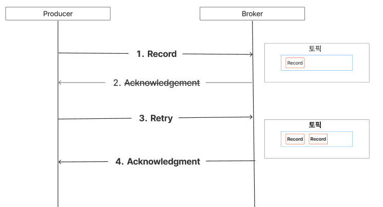
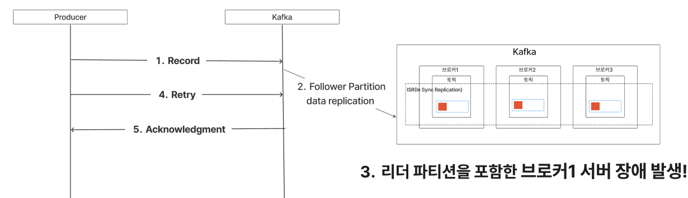
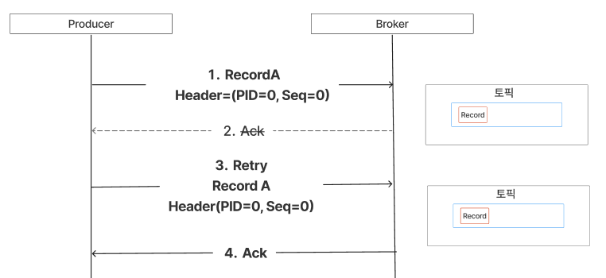

# Kafka Producer

프로듀서의 역할은 데이터를 생성하여 카프카 브로커에게 전달하는데 있다.

- `Topic`에 해당하는 메시지를 생성
- 특정 `Topic`으로 데이터를 publish
- 처리 실패/재시도

## Dependency

`org.apache.kafka:kafka-clients:${version}`

버전 호환성: 카프카의 브로커 버전과 클라이언트의 하위 버전을 완벽하게 모든 버전에 대해서 지원하지 않는다.

```text
# 일부 카프카 버전은 특정 클라이언트 버전을 지원하지 않을 수 있다.
kafka-clients -X-> kafka broker
   0.10.0             0.10.0   
```

## 프로듀서의 신뢰성 있는 메시지 전송

아파치 카프카와 같은 분산 이벤트 스트리밍 플랫폼을 사용하거나 메시지 브로커를 활용하다 보면 항상 마주치는 문제는 바로 얼마나 메시지를 신뢰할 수 있는지다.

이번 글에선 카프카 프로듀서에서 어떻게 하면 메시지를 카프카에게 신뢰성이 있는 메시지를 발송할 수 있는지에 대해 알아보려 한다.

- [1. 메시지 전달 시멘틱](#1-메시지-전달-시멘틱--message-delivery-semantics-)
- [2. 프로듀서의 적어도 한번 메시지 전송](#2-프로듀서의-적어도-한번-메시지-전송)
  - [2.1. 네트워크 장애로 AKS 응답을 받지 못한 경우](#21-네트워크-장애로-aks-응답을-받지-못한-경우)
  - [2.2. 브로커의 ISR 복제 지연 또는 리더 선출 시나리오](#22-브로커의-isr-복제-지연-또는-리더-선출-시나리오)
- [3. 멱등성 프로듀서](#3-멱등성-프로듀서)
  - [3.1. 멱등적 프로듀서 작동 원리](#31-멱등적-프로듀서-작동-원리)
  - [3.2. 멱등성 프로듀서 설정](#32-멱등성-프로듀서-설정)
- [4. 메시지 전송 방식](#4-메시지-전송-방식)
  - 

## 1. [메시지 전달 시멘틱(message delivery semantics)](https://kafka.apache.org/documentation/#semantics)

프로듀서는 [메시지 전달 시멘틱](../docs/message-delivery-semantics.md) 기반으로 메시지 전송 전략을 선정해야한다.

| 유형                     | 신뢰성 | 동작 방식                     | 사용 사례          | 구현 조건 (Kafka 기준)                                          |
|------------------------|-----|---------------------------|----------------|-----------------------------------------------------------|
| 최대 한 번(At most once)   | 낮음  | 전송 후 응답 확인 없음. 재시도 없음.    | 실시간 모니터링, 로깅   | `acks=0`, `retries=0`                                     |
| 적어도 한 번(At Least Once) | 중간  | 재시도로 유실 방지 but 중복 가능성 있음. | 주문 처리, 이벤트 트래킹 | `acks=all`, `retries>0`                                   |
| 정확히 한 번(Exactly Once)  | 최고  | 중복 없이 한 번만 처리 보장.         | 금융 거래, 정산 시스템  | 멱등성 프로듀서(`acks=all`, `enable.idempotence=true`) + 트랜잭션 설정 |

## 2. 프로듀서의 적어도 한번 메시지 전송

아파치 카프카를 기본 옵션으로 사용할 경우, '적어도 한번'을 보장한다는 것은 특정 장애 상황에서 메시지가 중복될 수 있음을 의미한다.

일반적으로 장애가 발생하지 않는다면, 카프카는 기본적으로 '정확히 한번'을 수행한다.

달리 말하자면 프로듀서에서도 특정 상황에 따라 중복된 메시지가 발행할 수 있다.

- 네트워크 장애로 AKS 응답을 받지 못한 경우.
- 브로커의 ISR 복제 지연이나 리더 선출 시나리오에서도 중복 발생 가능.

### 2.1. 네트워크 장애로 AKS 응답을 받지 못한 경우



1. 프로듀서가 카프카로 레코드 전송
2. 카프카는 지정된 토픽의 파티션에 레코드를 저장
3. 카프카 서버 네트워크 장애 발생
4. ack 미응답
5. 프로듀서는 데이터 유실로 판단하여, 재전송 시도
6. 재전송된 레코드로 인한 중복 데이터 발생

### 2.2. 브로커의 ISR 복제 지연 또는 리더 선출 시나리오



1. 프로듀서가 카프카로 레코드 전송
2. 파티션 리더가 프로듀서로부터 레코드를 받아, 팔로워들에게 복제를 완료함.
3. 파티션 리더가 있는 브로커에서 장애 발생
4. 리더 역할을 할 새로운 브로커가 선출 진행
5. 프로듀서는 타임아웃이 발생하여 응답을 받지 못한 채 메시지를 재전송.
6. 재전송된 레코드는 새로운 파티션 리더에게 도달하지만, 해당 메시지는 이미 저장되어 있어 중복이 발생

## 3. 멱등성 프로듀서

동일한 작업을 여러 번 실행해도 한 번 실행한 것과 결과가 같은 서비스를 멱등적(idempotent) 이라고 한다.

카프카에선 프로듀서의 중복된 재전송 처리를 막기위해 `멱등성 프로듀서` 기능을 제공하고 있다.

카프카의 멱등적 프로듀서 기능은 자동으로 이러한 중복을 탐지하여 처리한다.

> 멱등성 프로듀서 값은 3.0+ 부터는 true 기본 값 설정된다.

### 3.1. 멱등적 프로듀서 작동 원리

멱등성 프로듀서는 기본 프로듀서와 달리 레코드를 브로커로 전송할 때 PID(Producer unique ID) 와 시퀀스 넘버(Sequence Number)를 함께 전달한다.

브로커는 PID와 Seq 가지고 있다가 중복 적재 요청이 오면 이후에 요청된 중복 레코드는 적재하지 않는다.



1. 멱등성 프로듀서는 레코드 전송시 PID(Producer Id) 와 Sequence Number(메시지 번호) 를 헤더에 포함해 전송한다.
2. 브로커는 레코드를 저장할 때, PID 와 Seq을 메모리에 함께 기록한다.
3. 프로듀서가 재전송하더라도, 브로커는 PID와 Seq 를 비교하여 중복된 메시지가 판단한다.
    - 메시지 식별자 = PID + Seq + 토픽 및 파티션
    - 브로커는 메시지들을 추적하기 위해 고유한 “메시지 식별자"를 사용
4. ack 응답
    - 만약 브로커에 이미 저장된 레코드가 있다면?
    - → 브로커는 메시지를 중복 저장하지 않고 ack 응답.

### 3.2. 멱등성 프로듀서 설정

멱등성 프로듀서 설정은 다음과 같다.

```text
# 카프카 3.0 이상 기본적으로 멱등성 프로듀서 설정 값이 활성화 되어 있다.
acks=all
enable.idempotence=true
retries>0
```

| 설정                                    | 설명                                                                                                                                                                                                                                  | 기본값                           |
|---------------------------------------|-------------------------------------------------------------------------------------------------------------------------------------------------------------------------------------------------------------------------------------|-------------------------------|
| enable.idempotence                    | 프로듀서 멱등성 활성화 옵션<br/>중복 방지 (Exactly-Once 보장)                                                                                                                                                                                         | true<br/>Kafka 3.0+ 기본 활성화 적용 |
| acks                                  | 프로듀서 acks와 관련된 옵션 (0, 1, all(-1)) <br/>- 0=ack 응답 확인 없음, 재시도 하지 않음,  최대 한번(At most once)<br/>- 1=리더 파티션에 레코드가 전송되면 ack 응답<br/> 리더가 레코드를 로컬 기록한 즉시, 리더 파티션에서 장애가 발생되면 메시지 유실<br/>- all=리더는 모든 팔로우 파티션들이 레코드를 복제가 성공되어야지만 ack 응답<br/> | all                           |
| max.in.flight.requests.per.connection | ACK를 받지 않는 상태에서 하나의 커넥션에서 보낼 수 있는 최대 요청 수<br/> 주의 사항:<br/>- enable.idempotence=false 이고 1보다 크게 설정되어 있다면 재전송 시 레코드 순서가 변경될 수 있음.<br/>- 설정 값은 5이하로 설정해야 한다. 5이상 설정시 처리량은 증가하지만, 병렬 요청 증가로 인해 시퀀스 번호 추적이 어려워 순서 보장이 깨질 수 있다.           | 5                             |
| retries                               | ack를 받지 못한 경우 재시도 처리 횟수<br/> `delivery.timeout.ms`  에 설정된 제한된 시간안에 처리되지 못한다면 실패로 간주한다.<br/> 일반적으로 메시지 재시도는 delivery.timeout.ms  를 제어하는 걸 권장.                                                                                        | 2147483647                    |
| delivery.timeout.ms                   | 메시지 전송 실패시 최대 지연시간                                                                                                                                                                                                                  | 120000 (2 minutes)            |

> [참고 카프카 프로듀서 설정](https://kafka.apache.org/documentation/#producerconfigs)

## 4. 메시지 전송 방식

카프카 프로듀서는 메시지를 전송할 때 세 가지 방식으로 동작할 수 있다. 각 방식은 전송 신뢰성과 성능에 따라 선택된다.

| 방식       | 속도  | 신뢰성 | 유실 가능성 |  
|----------|-----|-----|--------|  
| 파이어 앤 포겟 | ⚡⚡⚡ | ❌   | 높음     |  
| 동기 전송    | ⚡   | ⚡⚡⚡ | 없음     |  
| 비동기 전송   | ⚡⚡  | ⚡⚡  | 낮음     |  

1. 파이어 앤 포겟 (Fire-and-Forget)
    - 방식: 메시지를 보내고 결과를 확인하지 않는다.
    - 특징:
        - 빠르지만, 메시지 유실 가능성이 있다.
        - 카프카의 자동 재시도로 대부분 전송되지만, 치명적 오류나 타임아웃 시 데이터 유실 가능성 있음
    - 주의 사항: 재시도 불가한 오류나 타임아웃이 발생할 경우 메시지가 유실되며, 애플리케이션에서는 성공 여부나 예외 정보를 알 수 없다.
    - 적합한 경우:
        - 데이터 유실이 허용되는 실시간 모니터링, 로깅 등
2. 동기 전송 (Synchronous Send)
    - 방식: `send()` 후 `Future.get()`으로 응답을 기다린다.
    - 특징:
        - 메시지 전송 성공/실패를 즉시 확인할 수 있다.
        - 실패 시 예외가 발생하므로 재처리가 가능하다.
        - 블로킹 방식이라 처리 속도가 느려진다.
    - 주의 사항: 동기적으로 처리하면 성능에 영향을 미칠 수 있으며, 메시지 전송이 완료될 때까지 기다려야 하므로 시스템 지연이 발생할 수 있다.
    - 적합한 경우:
        - 금융 거래, 주문 처리 등 신뢰성이 중요한 시스템
3. 비동기 전송 (Asynchronous Send with Callback)
    - 방식: `send()`에 콜백을 등록해 비동기로 결과를 처리한다.
    - 특징:
        - 전송 속도는 빠르지만, 실패 시 콜백에서 예외를 받아 처리해야 한다.
        - 콜백 내에서 블로킹 작업을 하면 성능 저하가 발생할 수 있다.
    - 적합한 경우:
        - 높은 처리량이 필요하면서도 실패 처리가 필요한 시스템
    - 주의 사항: 콜백 함수를 작성해야 하며, 실패 시 적절한 예외 처리나 재시도 로직을 구현해야 할 수 있다.

- 속도가 중요하다면 → 파이어 앤 포겟
- 신뢰성이 중요하다면 → 동기 전송
- 균형 잡힌 처리가 필요하다면 → 비동기 전송

## Reference

- [Kafka - Producer configs](https://kafka.apache.org/documentation/#producerconfigs)
- [Kafka - Message Delivery Semantics](https://kafka.apache.org/documentation/#semantics)
