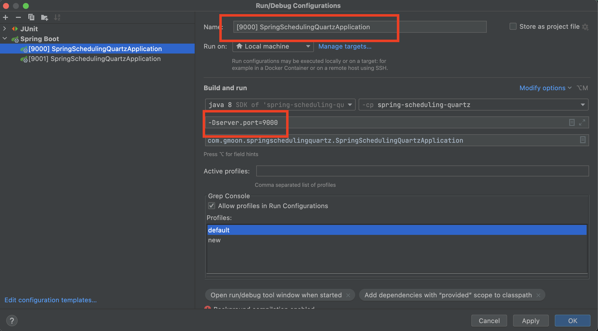

# Spring Quartz

**`Quartz`** 는 Java 및 J2SE 및 J2EE 환경에서 동작되도록 설계된 대표적인 **오픈소스 스케쥴러 프레임워크다.**

- 복잡한 일정 주기마다 작업을 관리할 수 있다. 
- 간단하고 유연하며 확장 가능한 스케쥴러 기능을 제공한다.
- 애플리케이션의 런타임 환경 관리를 담당한다.
- 멀티 스레드 아키텍처를 기반으로 동작되며 확장성을 보장한다. 

본 문서에 사용한 전체 소스는 [GitHub](https://github.com/gmoon92/Toy/tree/master/spring-event/spring-quartz-cluster) 을 참고하자

## Environment

- Spring boot 2.5.5
- Quartz 2.3.2
- Java 8
- MySql
- Maven
- IntelliJ
- MacOs

## Life cycle

Quartz 프레임워크가 시작되면 `Scheduler`가 `Job`을 실행하는 데 사용하는 작업자 스레드 세트를 초기화한다.

이 방법을 통해 `Quartz`의 `Scheduler`가 동시에 많은 작업을 실행할 수 있다. 
또한, 스레드 환경을 관리하기 위해 느슨하게 결합된 ThreadPool 관리 구성 요소 집합에 의존한다.

## Interface keywords

- Scheduler: 프레임워크의 스케줄러와 상호 작용하기 위한 기본 API
- Job: 실행되하고자 하는 컴포넌트를 구현하기 위한 인터페이스
- JobDetail: Job을 정의하는데 사용될 인터페이스
- Trigger: Job이 수행될 일정을 결정하는 컴포넌트
- JobBuilder: JobDetail 인스턴스를 생성하는데 사용된다. Job 인스턴스들을 정의할 수 있다.
- TriggerBuilder: Trigger 인스턴스를 생성하는데 사용된다.

## Dependency

```xml
<dependency>
    <groupId>org.springframework.boot</groupId>
    <artifactId>spring-boot-starter-quartz</artifactId>
</dependency>
```

## Quartz Scheduler

`Scheduler` 인터페이스는 Quartz 의 메인 인터페이스다.

- JobDetail 및 Trigger 레지스트리를 유지 관리한다. 
- Scheduler 에 연결된 Trigger 실행할 때(예약된 시간에 도달할 때) Job 실행을 담당한다.

## SchedulerFactory

Scheduler 인스턴스는 `SchedulerFactory`에 의해 생성된다.

```java
SchedulerFactory factory = new StdSchedulerFactory();
Scheduler scheduler = factory.getScheduler();
```

- 이미 생성/초기화 된 스케줄러는 Scheduler를 생산한 동일한 `SchedulerFactory` 를 통해 찾아 사용할 수 있다. 
- Scheduler 가 생성된 후에는 "대기" 모드에 있으며 Job 하기 전에 start() 메서드가 호출한다.

## Create Job From JobDetail

Job 은 Job 인터페이스를 구현하는 클래스를 정의하고 JobDetail에 정의한다.

```java
// Job interface 구현
@Slf4j
public class SimpleJob implements Job {
  @Override
  public void execute(JobExecutionContext context) {
    JobDetail detail = context.getJobDetail();
    JobKey key = detail.getKey();
    String nameOfJob = key.getName();
    String nameOfGroup = key.getGroup();
    log.info("{} Job execute...", getClass().getSimpleName(), nameOfJob, nameOfGroup);
  }
}

// Register Job in JobDetail 
JobKey jobKey = new JobKey("nameOfJob", "nameOfGroup");
JobDetail jobDetail = JobBuilder.newJob(SimpleJob.class)
        .withIdentity(jobKey)
        .usingJobData(dataMap)
        .build();
```

## Trigger

Trigger 는 스케쥴러에 등록할 Job 에 대해 실행 일정을 정의하는 구성 요소다.

```java
String nameOfTrigger = "simpleTrigger";
Trigger trigger = TriggerBuilder.newTrigger()
        .withIdentity(nameOfTrigger, jobKey.getGroup())
        .withPriority(priority)
        .withSchedule(getSchedulerBuilder())
        .startNow()
        .build();
```

## Scheduler 에 Job 과 Trigger 등록

```java
// Job Trigger 등록
scheduler.scheduleJob(jobDetail, trigger);

// 스케쥴러 실행
scheduler.start();
```

## Quartz Clustering

`Quartz` 의 가장 큰 장점은 애플리케이션 수준에서 클러스터링을 지원한다는 점이다.

데이터베이스 기반으로 클러스터링을 지원하기 때문에 내부적으로 필요한 스키마를 생성하자.

- [Quartz JobStore - MySql](https://github.com/quartz-scheduler/quartz/blob/master/quartz-core/src/main/resources/org/quartz/impl/jdbcjobstore/tables_mysql.sql)
- [Quartz JobStore - SqlServer](https://github.com/quartz-scheduler/quartz/blob/master/quartz-core/src/main/resources/org/quartz/impl/jdbcjobstore/tables_sqlServer.sql)
- [Quartz JobStore - Oracle](https://github.com/quartz-scheduler/quartz/blob/master/quartz-core/src/main/resources/org/quartz/impl/jdbcjobstore/tables_oracle.sql)

> 참고로 필자는 엔티티를 통한 스케쥴러 조회 및 엔버스 히스토리를 관리하기 위해 Mysql 기반으로 도메인을 구성했다. <br/>
> 소스는 [GitHub](https://github.com/gmoon92/Toy/tree/master/spring-event/spring-quartz-cluster/src/main/java/com/gmoon/springquartzcluster/quartz/job_store) 을 참고하자.

## Spring Quartz Properties

다음으로 `spring-quartz` 프로퍼티를 설정해주자 

```properties
## application.yml
spring:
  quartz:
    job-store-type: jdbc
    jdbc:
      initialize-schema: never
    # http://www.quartz-scheduler.org/documentation/2.4.0-SNAPSHOT/configuration.html#configuration-of-database-clustering-achieve-fail-over-and-load-balancing-with-jdbc-jobstore
    properties:
      ###########################
      # main scheduler
      ###########################
#      "[org.quartz.scheduler.instanceName]": NON_CLUSTERED
      "[org.quartz.scheduler.instanceId]": AUTO
      "[org.quartz.scheduler.instanceIdGenerator.class]": com.gmoon.springquartzcluster.quartz.core.CustomInstanceIdGenerator
      ###########################
      # thread pool
      ###########################
#      "[org.quartz.threadPool.class]": org.quartz.simpl.SimpleThreadPool
      "[org.quartz.threadPool.threadCount]": 20
      "[org.quartz.threadPool.threadPriority]": 5
      "[org.quartz.threadPool.threadNamePrefix]": gmoon-quartz-pool
      ###########################
      # job-store
      ###########################
#      "[org.quartz.jobStore.class]": org.quartz.impl.jdbcjobstore.JobStoreTX
#      "[org.quartz.jobStore.driverDelegateClass]": org.quartz.impl.jdbcjobstore.StdJDBCDelegate
      "[org.quartz.jobStore.tablePrefix]": QUARTZ_
      "[org.quartz.jobStore.useProperties]": true
#      "[org.quartz.jobStore.misfireThreshold]": 60000
      "[org.quartz.jobStore.isClustered]": true
      "[org.quartz.jobStore.clusterCheckinInterval]": 20000
```

> 자세한 Quartz 옵션은 [www.quartz-scheduler.org - Database clustering](http://www.quartz-scheduler.org/documentation/2.4.0-SNAPSHOT/configuration.html#configuration-of-database-clustering-achieve-fail-over-and-load-balancing-with-jdbc-jobstore) 을 참고하자

## org.springframework.scheduling.quartz.QuartzJobBean

Spring Quartz 에선 `org.quartz.Job` 인터페이스를 확장한 `QuartzJobBean` 추상 클래스를 지원한다.

Spring Quartz 기반으로 구성하기 위해 QuartzJobBean 를 구현하여 빈으로 등록해주자.

```java
@Slf4j
@Component
@RequiredArgsConstructor
public class ServerStatusCheckJob extends QuartzJobBean {
  private final ServiceStatusCheckService service;

  @Override
  protected void executeInternal(JobExecutionContext context) throws JobExecutionException {
    JobDetail jobDetail = context.getJobDetail();
    JobKey key = jobDetail.getKey();
    String jobName = key.getName();

    log.info("start {}, {}", jobName, LocalDateTime.now());
    service.checkAll();
  }
}
```

## Spring Quartz Configuration

Spring Quartz 는 `QuartzAutoConfigurationAuto` 에 의해 SchedulerFactoryBean 을 통해 내부적으로 **`org.quartz.Scheduler`** 를 생성하고 빈으로 등록해준다.

별도의 커스텀을 할 필요가 없다면, application.properties 에 Quartz 관련 설정과
`JobDetail`, `Trigger` 를 빈으로 등록만 해주면 된다. 

```java
@Slf4j
@Configuration
public class QuartzScheduleConfig {
  @Bean
  public JobDetailFactoryBean jobDetail() {
    JobDetailFactoryBean jobDetail = new JobDetailFactoryBean();
    jobDetail.setJobClass(ServerStatusCheckJob.class);
    jobDetail.setName(ServerStatusCheckJob.class.getSimpleName());
    jobDetail.setDescription("Service health check job.");
    jobDetail.setDurability(true);
    return jobDetail;
  }

  @Bean
  public SimpleTriggerFactoryBean trigger(JobDetail job) {
    JobKey key = job.getKey();
    String jobName = key.getName();

    SimpleTriggerFactoryBean trigger = new SimpleTriggerFactoryBean();
    trigger.setName("trigger_" + jobName);
    trigger.setJobDetail(job);
    trigger.setRepeatInterval(3_000);
    trigger.setRepeatCount(SimpleTrigger.REPEAT_INDEFINITELY);
    return trigger;
  }
}
```

## Clustering Test

마지막으로 스케쥴러에 등록된 Job 들이 클러스터링이 되는지 확인해보자.

- 어플리케이션의 port 를 달리 설정하여 각각 실행한다.
  - Spring boot `server.port` 프로퍼티를 활용한다.
- 먼저 실행된 어플리케이션의 스케쥴러는 실행된다.
- 추후에 실행된 어플리케이션의 스케쥴러는 대기 상태가 이뤄진다.

## IntelliJ VM Config



## Run Application

우선 9000 포트로 설정한 어플리케이션을 실행한다.


- 스케쥴러가 정상적으로 동작된다.
- 9001 포트 어플리케이션을 실행한다.

다음으로 먼저 실행된 9000 포트 어플리케이션을 종료하자.


 
Quartz 스케쥴러 클러스터링이 정상 동작됨을 확인해볼 수 있다.

- 9000 어플리케이션의 종료 시간은 **`18:52:51,154`**
- 9000 어플리케이션의 스케쥴러가 종료되자마자 
- 9001 어플리케이션의 스케쥴러가 **`18.53.04`** 시간에 시작됨을 확인해볼 수 있다.

## Reference

- [Spring integration - scheduling-quartz](https://docs.spring.io/spring-framework/docs/current/reference/html/integration.html#scheduling-quartz)
- [Baeldung - Introduction to Quartz](https://www.baeldung.com/quartz)
- [Baeldung - Scheduling in Spring with Quartz](https://www.baeldung.com/spring-quartz-schedule)
- [Hibernate - hibernate mapping types](https://www.tutorialspoint.com/hibernate/hibernate_mapping_types.htm)
- [Quartz - GitHub](https://github.com/quartz-scheduler)
  - [Quartz JobStore - MySql](https://github.com/quartz-scheduler/quartz/blob/master/quartz-core/src/main/resources/org/quartz/impl/jdbcjobstore/tables_mysql.sql)
  - [Quartz JobStore - SqlServer](https://github.com/quartz-scheduler/quartz/blob/master/quartz-core/src/main/resources/org/quartz/impl/jdbcjobstore/tables_sqlServer.sql)
  - [Quartz JobStore - Oracle](https://github.com/quartz-scheduler/quartz/blob/master/quartz-core/src/main/resources/org/quartz/impl/jdbcjobstore/tables_oracle.sql)
  - [Quartz - GitHub Best practices](https://github.com/quartz-scheduler/quartz/blob/master/docs/best-practices.adoc)
- [Quartz - Examples index](http://www.quartz-scheduler.org/documentation/2.4.0-SNAPSHOT/examples/index.html)
  - [Quartz - tutorials](http://www.quartz-scheduler.org/documentation/2.4.0-SNAPSHOT/tutorials/index.html)
  - [Quartz - Database Clustering](http://www.quartz-scheduler.org/documentation/2.4.0-SNAPSHOT/configuration.html#configuration-of-database-clustering-achieve-fail-over-and-load-balancing-with-jdbc-jobstore)
- ETC
  - [Spring Boot Quartz Scheduler Example: Building an Email Scheduling app](https://www.callicoder.com/spring-boot-quartz-scheduler-email-scheduling-example/)
  - [https://github.com/jlinn/quartz-redis-jobstore](https://github.com/jlinn/quartz-redis-jobstore)
  - [Spring Boot using Quartz in mode Cluster](https://medium.com/javarevisited/spring-boot-using-quartz-in-mode-cluster-e1d71e4af4b9)
  - [Quartz-3 Multi WAS 환경을 위한 Cluster 환경의 Quartz Job Scheduler 구현](https://blog.advenoh.pe.kr/spring/Multi-WAS-%ED%99%98%EA%B2%BD%EC%9D%84-%EC%9C%84%ED%95%9C-Cluster-%ED%99%98%EA%B2%BD%EC%9D%98-Quartz-Job-Scheduler-%EA%B5%AC%ED%98%84/)
