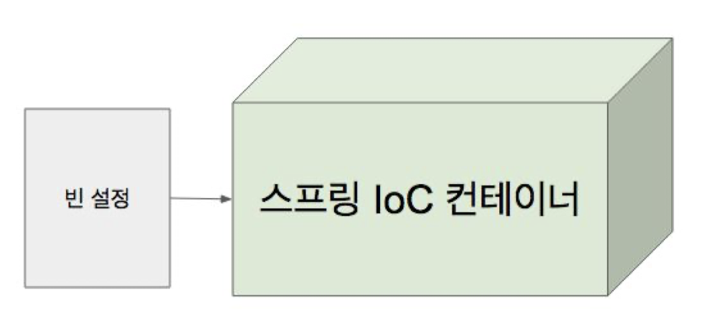

# IoC 컨테이너

## 1. 스프링 IoC 컨테이너와 빈

Inversion of Control: 의존 관계 주입(Dependency Injection)이라고도 하며, 어떤 객체가 사용하는 의존 객체를 직접 만들어 사용하는게 아니라,아니라 주입 받아 사용하는 방법을 말 함.

### 1.1. 스프링 IoC 컨테이너

- BeanFactory
  - Spring IoC Container 가장 최상위의 인터페이스, 핵심!!..
- 애플리케이션 컴포넌트의 중앙 저장소.
- 빈 설정 소스로 부터 빈 정의를 읽어들이고, 빈을 구성하고 제공한다.

### 1.2. 빈

- 스프링 IoC 컨테이너가 관리 하는 객체.
- 장점 
  - 의존성 관리 
  - 스코프 
    - 싱글톤: 하나 
    - 프로포토타입: 매번 다른 객체 
    - 라이프사이클 인터페이스

### 1.3. [ApplicationContext](https://docs.spring.io/spring-framework/docs/5.0.8.RELEASE/javadoc-api/org/springframework/context/ApplicationContext.html)

- [BeanFactory](https://docs.spring.io/spring-framework/docs/5.0.8.RELEASE/javadoc-api/org/springframework/beans/factory/BeanFactory.html)
- 메시지 소스 처리 기능 (i18n)
- 이벤트 발행 기능
- 리소스 로딩 기능
- ...

## 2. IoC 컨테이너 2부: 
## ApplicationContext와 다양한 빈 설정 방법

### 2.1. 스프링 IoC 컨테이너의 역할

- 빈 인스턴스 생성
- 의존 관계 설정
- 빈 제공

### 2.2. AppcliationContext

- ClassPathXmlApplicationContext (XML)
- AnnotationConfigApplicationContext (Java)

### 2.3. 빈 설정

- 빈 명세서
- 빈에 대한 정의를 담고 있다.
  - 이름 
  - 클래스 
  - 스코프 
  - 생성자 아규먼트 (constructor) 
  - 프로퍼트 (setter) 
  - ..
- 빈 주입
  - @Autowired
  - @Inject

### 2.4. 컴포넌트 스캔

- 설정 방법 
  - XML 설정에서는 context:component-scan 
    - Spring 2.0 부터 애노테이션 설정
  - 자바 설정에서 @ComponentScan
- 특정 패키지 이하의 모든 클래스 중에 @Component 애노테이션을 사용한 클래스를 빈으로 자동으로 등록 해 줌.