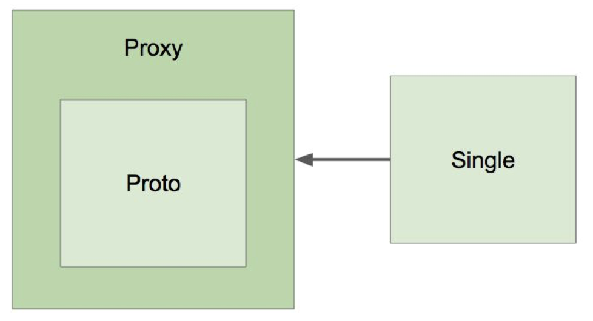

## IoC 컨테이너 5부: 빈의 스코프

### 스코프

- 싱글톤
- 프로토타입 
  - Request 
  - Session 
  - WebSocket 
  - ...

### 프로토타입 빈이 싱글톤 빈을 참조하면?

- 아무 문제 없음.

### 싱글톤 빈이 프로토타입 빈을 참조하면?

- 프로토타입 빈이 업데이트가 안되네?

- 업데이트 하려면 
  - scoped-proxy 
  - Object-Provider 
  - Provider (표준)

프록시 (https://en.wikipedia.org/wiki/Proxy_pattern)

### 싱글톤 객체 사용시 주의할 점

- 프로퍼티가 공유.
- ApplicationContext 초기 구동시 인스턴스 생성.