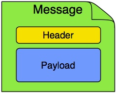
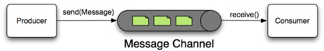
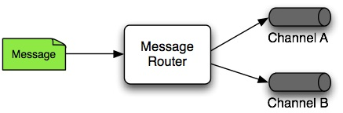
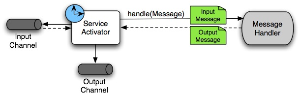
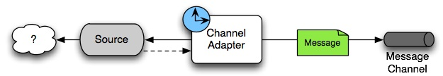

# [Spring Integration](https://spring.io/projects/spring-integration/)

## Overview

- Spring Integration는 [Enterprise Integration Patterns](https://www.enterpriseintegrationpatterns.com/)를 지원한다.
- 각 Integration 패턴은 하나의 `Component`로 구현되고 이를 통해 파이프라인으로 메시지가 데이터를 운반한다.
- Spring Integration을 사용해서 데이터가 이동하는 파이프 라인으로 다양한 컴포넌트들을 조립할 수 있다.
    - 런타임 메시지 라우팅 변환
    - 비즈니스 로직과 통합 로직간의 관심사 분리
    - 컴포넌트의 모듈화와 컴포넌트간의 느슨한 결합(loosely coupled)

## Integration Components

- [Message](#Message)
- [MessageChannel](#MessageChannel)
- [Message Endpoint](#Message-Endpoint)
- [Message Transformer](#Message-Transformer)
- [Message Filter](#Message-Filter)
- [Message Router](#Message-Router)
- [Splitter](#Splitter)
- [Aggregator](#Aggregator)
- [ServiceActivator](#ServiceActivator)
- [Channel Adapter](#Channel-Adapter)
- [Endpoint Bean Names](#Endpoint-Bean-Names)
- [Configuration and @EnableIntegration](#Configuration-and-EnableIntegration)
- [Programming Considerations](#Programming-Considerations)
- [Finding Class Names for Java and DSL Configuration](#finding-class-names-for-java-and-dsl-configuration)

### Message

메시지는 `header`와 `payload`로 구성



- header: 메타 데이터 구성, 다운스트림 컴포넌트에서 참고할만한 메타 정보를 관리
  - id
  - timestamp
- payload: 데이터

### MessageChannel

[`pipes-and-filters`](https://learn.microsoft.com/ko-kr/azure/architecture/patterns/pipes-and-filters) 아키텍처에서 `pipe` 를 의미한다.



- filter: 메시지를 생산하거나, 처리(소비)하는 역할
  - 비즈니스 로직, 일반적으로 서비스 계층에서 관리 
- pipe: 필터간의 메시지 전송하는 역할
  - Spring integration 모듈에서 파이프 관련 인터페이스 및 컴포넌트 지원.

> [파이프-필터 패턴 (Pipe-filter pattern)](https://towardsdatascience.com/10-common-software-architectural-patterns-in-a-nutshell-a0b47a1e9013):
> 이 패턴은 데이터 스트림을 생성하고 처리하는 시스템에서 사용할 수 있다. 각 처리 과정은 필터 (filter) 컴포넌트에서 이루어지며, 처리되는 데이터는 **파이프 (pipes)를 통해 흐른다.** 이 파이프는
> 버퍼링 또는 동기화 목적으로 사용될 수 있다. (활용 컴파일러. 연속한 필터들은 어휘 분석, 파싱, 의미 분석 그리고 코드 생성을 수행한다.)

두 구성 요소들 끼리는 느슨한 결합 상태가 유지되도록 파이프가 필터간에 메시지를 전송한다.

- 프로듀서는 `채널`을 통해 메시지를 발행한다.
- 컨슈머는 `채널`을 통해 메시지를 받아간다.
- [채널은 구현체](https://docs.spring.io/spring-integration/reference/channel/implementations.html)에 따라 point-to-point 또는 publish-subscribe 방식을 지원한다.
  - 메세지 채널 구현체에 따라 컨슈머 수가 달라진다.

### Message Endpoint

`Message Endpoint`는 [`pipes-and-filters`](https://learn.microsoft.com/ko-kr/azure/architecture/patterns/pipes-and-filters) 아키텍처에서 `filter` 를 의미한다.

> endpoint: 요청을 받아 응답을 제공하는 서비스를 사용할 수 있는 지점. 메시지 채널의 끝

Spring Integration 은 IoC 를 통해 통합 로직과 비즈니스 로직의 책임 분리 목적이다. 이는 Spring Integration에서 메시지 인프라스트럭처를 담당하고, 개발자는 도메인 모델에 집중할 수 있도록 한다. 

> 이상적으론 애플리케이션 코드에 메시지 객체나 메시지 채널을 알지 못해야 한다는 뜻이다.

도메인 관련 코드는 Spring Integration에서 제공하는 메시지 처리 인프라에 `연결`하면 된다. 이 [메시지 인프라스턱처](https://exactly-once.github.io/posts/messaging-infrastructure/)와 `연결`을 담당하는 컴포넌트가 메시지 엔드포인트다.  메시지 엔드포인트는 애플리케이션 코드를 메시지 처리 프레임워크에 비침투적인(non-invasive) 방식으로 연결해주는 역할을 한다. 

> 메시지 엔드포인트는 메시지 채널에 연결해 메시지를 보내거나 받는 모든 Component 를 의미한다.

### Message Transformer

메시지의 내용이나 구조를 변환하고, 수정을 마친 메시지를 반환하는 역할을 한다.

예를들어 메시지 페이로드를 json 형식에서 object 형식으로 변환하거나 헤더의 값을 추가/수정/제거한다. 

### Message Filter

메시지를 출력 채널(output channel)로 전달할지 말지를 결정하는 `엔드포인트 유형`이다.

메시지 필터엔 `boolean test()` 메소드만 존재하고, 메시지 헤더, 페이로드의 값에 따라 무시하거나 예외를 던지기도 한다.

### Message Router

메시지를 수신해야 하는 메시지 채널을 결정한다.



- 일반적으로 메시지 헤더 기반으로 다음 메시지 채널을 결정한다.
- 응답 메시지를 보낼 수 있는 엔드포인트(ex. 서비스 액티베이터(service activator))에서 출력 채널을 정적으로 설정하여 동적으로 메시지 채널을 라우팅할 수 있다.

> 메시지 필터는 여러 컨슈머에 대해 필터링을 한다면(pub-sub 환경), 메시지 라우터는 사전에 메시지를 전송할 채널을 결정할 수 있다. 

### Splitter

엔드포인트 유형으로 입력 채널(input channel)에서 수신한 메시지를 여러 메시지로 분할하고, 각각의 출력 채널로 전송하는 일을 담당하고 있다.

일반적으로 복합(Composite) 페이로드 객체를 세분화한 페이로드를 담고 있는 여러 메시지로 나누는 데 사용한다.

### Aggregator

애그리게이터는 스플리터와 정반대의 개념이다.

여러 메시지를 하나의 메시지로 결합하는 엔드포인트다.

> 파이프라인 앞쪽에 스플리터를 갖고 있는 다운스트림 컨슈머인 경우가 많다. <br/>
> 애그리게이터는 스플리터의 컨슈머 상태(집계하는 메시지들)를 유지해야 하며, 언제 완전한 메시지 그룹이 준비되는지를 판단하고, 필요 시 타임아웃으로 처리해야 하기 때문에 기술적으로 스플리터보다 더 복잡한 편이다.

### ServiceActivator

서비스 엑티베이터는 서비스 인스턴스를 메시지 시스템에 연결하기 위한 엔드포인트다.

- 반드시 하나의 input 메시지 채널을 구성해야 한다.
- output 메시지 채널은 선택 사항이다.
    - 호출한 서비스 메소드가 void 가 아닌 반환 값이 존재한다면, output 메시지 채널도 구성할 수 있다.



1. 요청 메시지의 페이로드를 추출하고 변환한다.
2. 서비스 객체(handle)를 호출해 요청 메시지를 처리한다.
   - 필요한 경우엔 서비스 객체가 반환한 값도 변환한다.
3. 서비스 객체가 응답한 메시지는 output 메시지 채널로 전송한다. 
   - 출력 메시지 채널을 설정하지 않을 경우 메시지 헤더 `return address` 값에 지정된 채널로 응답을 전송한다.

> `request-reply` 서비스 엑티베이터는 타겟 객체의 메소드를 입출력 메시지 채널에 연결해준다.

### [Channel Adapter](https://docs.spring.io/spring-integration/reference/channel-adapter.html)

채널 어뎁터는 메시지 채널을 다른 시스템이나 전송 구성 요소에 연결해주는 엔드포인트다.



- 소스 시스템을 메시지 채널에 연결해주는 인바운드 채널 어뎁터
- 메시지를 메시지 채널로 전달하거나 받는다.

### [Endpoint Bean Names](https://docs.spring.io/spring-integration/reference/overview.html#endpoint-bean-names)

Spring Integration 에서 입력 채널 엔드포인트(메시지를 수행하는(Consuming) 엔드포인트)는 컨슈머와 메시지 핸들러라는 두 가지 빈으로 구성된다.

```java
@Configuration
public class MessageFlowConfig {
    
	@Bean
	public IntegrationFlow inSendMail(ConnectionFactory connectionFactory) {
		String queueName = AmqpMessageDestination.SEND_MAIL.value;
		return IntegrationFlows
		  .from(Amqp.inboundAdapter(connectionFactory, queueName))
		  // <int:service-activator id = "inSendMail" ... />
		  .handle(mailService, "send") // @ServiceActivator
		  .get();
	}
}
```

- Consumer: inSendMail (the id)
- Message Handler: inSendMail.send

5.0.4 버전 부터 `@EndpointId` 을 이용해 빈 이름을 변경할 수 있다.

```java
@Configuration
public class MessageConfig {

	@EndpointId("someService") // 1
	@Bean("someService.handler") // 2
	@ServiceActivator(inputChannel = "inSomeChannel")
	public MessageHandler someHandler() {
		// ...
		return handler;
	}
}
```

- Consumer: someService (the id) // 1
- Message Handler: someService.handler // 2

### Configuration and @EnableIntegration

[@EnableIntegration](https://docs.spring.io/spring-integration/docs/latest-ga/api/org/springframework/integration/config/EnableIntegration.html) 어노테이션은 4.0 부터 도입됐다. Spring Integration 인프라 구성 관련 빈 등록을 활성화한다.

- MessageHandler: 메시지 엔드포인트 빈
- ConsumerEndpointFactorBean: 메시지 핸들러와 입력 채널을 주입받는 빈(컨슈머)

> org.springframework.boot.autoconfigure.integration.IntegrationAutoConfiguration

```java
@Configuration
@EnableIntegration
@ComponentScan(basePackageClasses = {MyConfiguration.class})
public class MyIntegrationConfiguration {
}
```

- `errorChannel`, `LoggingHandler`, poller 를 위한 `taskScheduler`, `jsonPath`(SpEL-function) 등등
- @IntegrationComponentScan 로 [어노테이션 기반](https://docs.spring.io/spring-integration/reference/configuration/annotations.html)으로 메시징 인프라를 구성할 수 있게 됐다.
  - @ComponentScan 으론 메시징 인프라를 구성할 수 없어, XML 설정 기반으로 구성했다.
  - 참고 [@MessagingGateway](https://docs.spring.io/spring-integration/reference/gateway.html#messaging-gateway-annotation)

### Programming Considerations

- 가능하다면 POJO(Plain Old Java Objects) 방식으로 구성해라.
- 빈 초기화 단계에서 메시지를 전송하지 마라
  - `InitializingBean`, `@PostConstruct` 메소드 호출 시점엔 애플리케이션 컨텍스트가 아직 초기화되지 않은 상태이며, 이때 메시지를 전송하면 실패할 가능성이 크다.
  - 초기화 단계에서 메시지를 전송해야 한다면, `ApplicationListener`를 구현하고, `ContextRefreshedEvent`를 기다려야된다. 아니면 `SmartLifecycle`을 구현해서 빈을 후반 `phase`에 두고 `start()` 메소드에서 메시지를 전송해라.

### Finding Class Names for Java and DSL Configuration

EIP 구현에 필요한 일급 객체(first-class-citizen)은 `Message`, `Channel`, `Endpoint` 다.

- org.springframework.messaging.`Message`
- org.springframework.messaging.`MessageChannel`
- org.springframework.integration.endpoint.`AbstractEndpoint`
  - `EventDrivenConsumer`: used when we subscribe to a SubscribableChannel to listen for messages. 
  - `PollingConsumer`: used when we poll for messages from a PollableChannel.

메시징 어노테이션이나 자바 DSL을 사용할 땐, 프레임워크가 자동으로 적절한 어노테이션과 BeanPostProcessor 구현체를 통해 컴포넌트들을 생성해준다. 컴포넌트들을 수동 설정할 땐, `ConsumerEndpointFactoryBean`를 활용하는게 좋다. `ConsumerEndpointFactoryBean`는 `inputChannel` 속성을 기반으로 어떤 `AbstractEndpoint` 컨슈머 구현체를 생성할 지 쉽게 결정할 수 있다.

ConsumerEndpointFactoryBean 는 또 다른 일급 객체 `org.springframework.messaging.MessageHandler` 에게 메시지 처리를 위임한다.

`MessageHandler` 인터페이스의 구현 목적은 엔드포인트가 채널에서 컨슘한 메시지를 처리하기 위함이다. 

Spring Integration에 있는 모든 EIP 구성 요소들은 `MessageHandler` 구현체다. 자바 설정을 이용해서 Spring Integration 애플리케이션을 개발할 땐, Spring Integration 모듈을 조사해서 @ServiceActivator 설정에 사용할 적당한 `MessageHandler` 구현체를 찾아봐야한다.

- org.springframework.messaging.MessageHandler
  - MessageFilter
  - AbstractMessageSplitter
  - MessageTransformingHandler
  - AggregatingMessageHandler
  - AbstractBrokerMessageHandler
  - AbstractAmqpOutboundEndpoint
  - ...

인바운드 메시지 플로우 측에는 `polling`과 `listening` 동작으로 나뉜다.

- listening: 메시지 기반
  - 일반적으로 리스너 컴포넌트들은 메시지를 만들 준비가 된 타겟 클래스 구현체 하나만 있으면 된다. 
  - listening 컴포넌트는 단반향(one-way) 구현체 또는 request-reply 구현체일 수 있다.
- polling
  - 폴링 인바운드 엔드포인트들은 `listener API`를 제공하지 않거나 listening 방식으로 사용하지 않는 프로토콜을 위한 엔드포인트다.
    - 파일 기반 프로토콜(FTP), 데이터베이스(RDBMS, NoSQL) 등
  - 주기적으로 폴링 태스크를 시작하는 `poller` 설정과, 타겟 프로토콜에서 데이터를 읽고 다운스트림 통합 플로우를 위한 메시지를 생성하는 `메시지 소스` 클래스로 구성된다. 
  - 타겟 애플리케이션을 개발할 땐, 메시지 소스 컴포넌트가 더욱더 중요하다. 모두 `MessageSource` 인터페이스를 구현하고 있다.
  - 타겟 프로토콜에 필요한 모든 인바운드, 아웃바운드 클래스들은 개발 Spring Integration 모듈에 찾을 수 있다.

예를 들어, 폴링 인바운드 메시지 플로우는 다음과 같다.

```java
@Configration
public class IntegrationConfig {
	
    @Bean
    @InboundChannelAdapter(value = "fooChannel", poller = @Poller(fixedDelay="5000"))
    public MessageSource<?> storedProc(DataSource dataSource) {
        return new JdbcPollingChannelAdapter(dataSource, "SELECT * FROM foo where status = 0");
    }
}
```

## Reference

- [Spring Integration](https://docs.spring.io/spring-integration/reference/index.html)
    - [Spring AMQP](https://docs.spring.io/spring-amqp/reference/)
        - [5.5.16](https://docs.spring.io/spring-integration/docs/5.5.16/reference/html/amqp.html#amqp)
        - [messaging-channels](https://godekdls.github.io/Spring%20Integration/messaging-channels/)
    - [Spring JMS](https://docs.spring.io/spring-framework/reference/integration/jms.html)
- [Spring blog - Spring Integration Java DSL: Line by line tutorial](https://spring.io/blog/2014/11/25/spring-integration-java-dsl-line-by-line-tutorial/)
- [baeldung - Spring AMQP](https://www.baeldung.com/spring-amqp)
- [github springprojects - spring-integration-samples](https://github.com/spring-projects/spring-integration-samples/blob/main/README.md)
- [10 Common Software Architectural Patterns in a nutshell](https://towardsdatascience.com/10-common-software-architectural-patterns-in-a-nutshell-a0b47a1e9013)
- https://stackoverflow.com/questions/29989581/spring-integration-inbound-vs-outbound-channel-adapters
  https://godekdls.github.io/Spring%20Integration/overview/
- [Messaging infrastructure](https://exactly-once.github.io/posts/messaging-infrastructure/)
