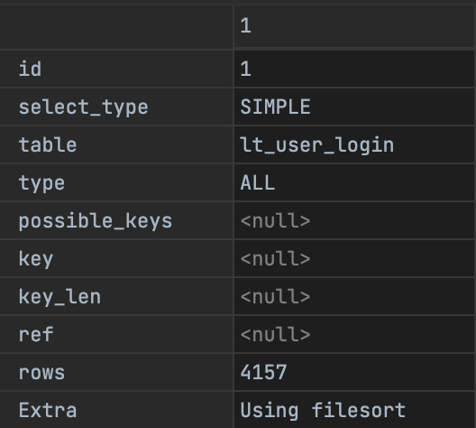

# Spring JPA Pagination

## Environment

- Spring boot 2.6.4
- QueryDsl 5.0.0
- MySql 8.0.20

## TOC

- [Offset-based Pagination](#offset-based-pagination)
  - [Offset-based Pagination Query Example](#offset-based-pagination-query-example)
  - [Offset-based Pagination 문제점](#offset-based-pagination-문제점)
  - [Offset-based Pagination 은 언제 사용해야 할까](#offset-based-pagination-은-언제-사용해야-할까)
- [Cursor-based Pagination](#cursor-based-pagination)
  - [조회 기준이 될 커서](#조회-기준이-될-커서)
  - [Cursor-based Pagination Query Example](#cursor-based-pagination-query-example)
    - [Cursor-based Pagination 첫 페이지](#cursor-based-pagination-첫-페이지)
    - [Cursor-based Pagination 다음 페이지](#cursor-based-pagination-다음-페이지)
    - [Cursor-based Pagination 문제점](#cursor-based-pagination-문제점)
- [순서를 보장하지 않은 커서](#순서를-보장하지-않은-커서)
- [트레이드 오프](#트레이드-오프)
  - [QueryDsl Cursor](#querydsl-cursor)

## Offset-based Pagination

데이터베이스의 `OFFSET`(페이지 번호), `LIMIT`(페이지 사이즈) 키워드를 사용하여 '페이지' 단위로 요청/응답 구현

- 가장 대중적인 페이지 처리 방식
- 유저가 지정한 페이지에 대한 데이터를 조회할 수 있다는 장점
    - 사용자는 UI에서 직접 페이지를 선택하여 조회 가능
    - 전체 페이지 수를 알 수 있음

### Offset-based Pagination Query Example

```sql
# 페이지 1 조회
SELECT *
FROM lt_user_login
ORDER BY attempt_dt DESC,
         id DESC
-- LIMIT 0, 5
LIMIT 5     -- 조회할 데이터 갯수 제한
OFFSET 0;   -- 시작할 row number = LIMIT * (페이지 번호 -1)
```

|     | id  |username|access_device| attempt_dt          |succeed|
|-----|-----|---|---|---------------------|---|
| 1   | 54  |admin|WEB| 2022-03-26 13:33:42 |false|
| 2   | 53  |admin|WEB| 2022-03-25 13:33:42 |false|
| 3   | 52  |admin|WEB| 2022-03-25 13:33:42 |false|
| 4   | 51  |admin|WEB| 2022-03-24 13:33:42 |false|
| 5   | 50  |admin|WEB| 2022-03-24 12:34:43 |false|

| id  | select_type | table         | type  | possible_keys | key            | key_len |ref| rows |Extra|
|-----|-------------|---------------|-------|---------------|----------------|---------|---|------|---|
| 1   | SIMPLE      | lt_user_login | index | `<null>`      | idx_attempt_dt | 4       |`<null>`| 4045    ||

다음 2 페이지는 LIMIT 수 만큼 OFFSET 증가 

```sql
# 페이지 2 조회
SELECT *
FROM lt_user_login
ORDER BY attempt_dt DESC,
         id DESC
-- LIMIT 5, 5
LIMIT 5     -- 조회할 데이터 갯수 제한
OFFSET 5;   -- 시작할 row number = LIMIT * (페이지 번호 -1)
```

|     | id  |username|access_device| attempt_dt          |succeed|
|-----|-----|---|---|---------------------|---|
| 1   | 49  |admin|WEB| 2022-03-24 11:33:42 |false|
| 2   | 48  |admin|WEB| 2022-03-23 15:33:42 |false|
| 3   | 47  |admin|WEB| 2022-03-23 13:33:42 |false|
| 4   | 46  |admin|WEB| 2022-03-22 13:33:42 |false|
| 5   | 45  |admin|WEB| 2022-03-21 12:34:43 |false|

| id  | select_type | table         | type  | possible_keys | key            | key_len |ref| rows |Extra|
|-----|-------------|---------------|-------|---------------|----------------|---------|---|------|---|
| 1   | SIMPLE      | lt_user_login | index | `<null>`      | idx_attempt_dt | 4       |`<null>`| 4045   ||

### Offset-based Pagination 문제점

- 중복 데이터 발생 위험
    - 페이지 1번 데이터 조회
    - 그 사이에 누군가 신규 데이터 저장
    - 페이지 2번 데이터를 조회한다면 데이터가 밀려 1번 페이지에서 보았던 중복된 데이터가 노출
- 대부분의 RDBMS 에서 OFFSET 쿼리의 퍼포먼스 이슈
    - 조회된 `row` 수와 쿼리 성능은 반비례
    - `Table full scan` 발생
        - `OFFSET` 위치를 계산하고, 필요한 데이터를 찾을 때까지 `Table full scan` 발생
        - `OFFSET`은 모든 데이터를 생성한 후 지정된 갯수만 순회하여 자르는 방식.
    - `Row lookup` 으로 인한 성능 저하 발생 위험
        - 페이징하는 동안 지나치는 row 들을 바라보며 성능 저하 위험 발생
        - Clustering index 고려
    - `Offset-based Pagination`의 조회 성능은 오로지 row 수에 영향이 미친다.



실행 계획의 `type` 속성 값이 `ALL` 임으로 `Table full scan`이 발생된다는 점을 알 수 있다.

> `ORDER BY` 와 `OFFSET` 으로 인해 `Using filesort` 발생.

### Offset-based Pagination 은 언제 사용해야 할까

1. 데이터의 변화가 거의 없다. 중복 데이터가 노출될 염려가 없다.
2. 중복 데이터가 노출되어도 크게 문제가 없을 경우.
3. 애초에 조회될 row 수가 많지 않아 성능 고려 대상이 아닌 경우.

## Cursor-based Pagination

응답한 마지막 `row` 의 순서상 다음 `row` 수 n개 요청/응답 구현

- 중복될 데이터가 발생하지 않는다.
- `Cursor-based Pagination`은 기준이 될 `커서 데이터`가 중요하다.
    - 오프셋 기반 페이지네이션은 `조회할 페이지가 중요`하지만, 커서 기반 페이지는 클라이언트가 응답 받은 row 순서상 `마지막 데이터`(cursor)가 중요하다.
- 조회할 row 수가 많을 수록 성능 대비 좋다.
    - 인덱스가 적용된 컬럼을 기준으로 조회하기에 `Table full scan` 이 발생하지 않는다. 성능상 OFFSET 방식의 단점을 보안한 방식이다.
    - 따라서 `Cursor-based Pagination`을 `No-Offset Pagination`이라고도 한다.

### 조회 기준이 될 커서

Cursor-based Pagination 방식에서 조회 기준이 될 컬럼 또는 조합 데이터를 커서(`cursor`)라 한다.

커서 컬럼의 선택 기준은 다음과 같다.

- **`Unique`**: 고유해야 한다.
- **`Orderable`**: 순서를 보장한다.
- **`Immutable`**: 데이터가 수정되지 않는다.

JPA에서 제공하는 `자동 키 생성 전략`으로 `Oracle`의 `시퀀스`(sequence) 또는 `MySQL`의 `AutoIncrement` 기능을 사용하여 기본 키를 생성하고 있다면, 기본 키를 커서(`cursor`)로써 사용하는 것이 일반적이다.

- `GenerationType.SEQUENCE`: 시퀀스 기능 사용
  - 데이터베이스에서 시퀀스 기능을 지원해야만 사용가능한 전략으로 DBMS에 종속적인 식별자 할당 전략
  - `Oracle`, `PostgreSQL`, `DB2`, `H2`
- `GenerationType.IDENTITY`: MySQL 의 `AUTO_INCREMENT` 컬럼과 같이 DBMS에서 자동으로 할당
  - `MySQL`, `PostgreSQL`, `SQL Server`, `DB2`

### Cursor-based Pagination Query Example

```sql
SELECT *
FROM lt_user_login
WHERE id < #id   -- [1] cursor 로 id 컬럼 사용
ORDER BY id DESC -- [2] 내림차순 id 정렬
LIMIT 5;         -- [3] 커서의 기준점부터 5개 조회  
```

1. 커서로 id 사용
2. 순서를 보장하기 위해 커서(`id`) 내림차순 정렬
    - 내림차순 정렬로 조회 조건(`[1]`)은 파라미터 커서보다 작아야한다.
    - 오름차순(`ASC`) 정렬이라면 당연히 조회 파라미터보다 커야 한다.
3. 커서의 기준점부터 조회된 row 갯수 제한

커서 조회 조건은 정렬을 기준으로 동적으로 변경되어야 한다.

```sql
## DESC(내림차순) 정렬
SELECT *
FROM lt_user_login
WHERE [커서 컬럼] < #커서
ORDER BY [커서 컬럼] DESC
LIMIT 5;

## ASC(오름차순) 정렬
SELECT *
FROM lt_user_login
WHERE [커서 컬럼] > #커서
ORDER BY [커서 컬럼] ASC 
LIMIT 5;
```

### Cursor-based Pagination 첫 페이지

예를 들어 첫 페이지 쿼리는 기준이 될 커서를 구할 수 없으므로 `ORDER BY`로 커서를 정렬하고 `LIMIT` 으로 제한한다.

```sql
# 페이지 1 조회
SELECT *
FROM lt_user_login
ORDER BY id DESC
LIMIT 5 -- 조회할 데이터 갯수 제한
```

|     | id  |username|access_device| attempt_dt          |succeed|
|-----|-----|---|---|---------------------|---|
| 1   | 54  |admin|WEB| 2022-03-26 13:33:42 |false|
| 2   | 53  |admin|WEB| 2022-03-25 13:33:42 |false|
| 3   | 52  |admin|WEB| 2022-03-25 13:33:42 |false|
| 4   | 51  |admin|WEB| 2022-03-24 13:33:42 |false|
| 5   | 50  |admin|WEB| 2022-03-24 12:34:43 |false|

| id  | select_type | table         | type  | possible_keys | key            | key_len |ref| rows |Extra|
|-----|-------------|---------------|-------|---------------|----------------|---------|---|------|---|
| 1   | SIMPLE      | lt_user_login | index | `<null>`      | PRIMARY | 202     |`<null>`| 5    ||

### Cursor-based Pagination 다음 페이지

조회된 마지막 row 의 커서(id) 를 기준으로 현재 페이지를 조회한다. 

```sql
SELECT *
FROM lt_user_login
WHERE id < 50
ORDER BY id DESC
LIMIT 5;
```

|     | id  |username|access_device| attempt_dt          |succeed|
|-----|-----|---|---|---------------------|---|
| 1   | 49  |admin|WEB| 2022-03-24 11:33:42 |false|
| 2   | 48  |admin|WEB| 2022-03-23 15:33:42 |false|
| 3   | 47  |admin|WEB| 2022-03-23 13:33:42 |false|
| 4   | 46  |admin|WEB| 2022-03-22 13:33:42 |false|
| 5   | 45  |admin|WEB| 2022-03-21 12:34:43 |false|

| id  | select_type | table         | type  | possible_keys | key            | key_len |ref| rows | Extra       |
|-----|-------------|---------------|-------|---------------|----------------|---------|---|------|-------------|
| 1   | SIMPLE      | lt_user_login | range | PRIMARY      | PRIMARY | 202     |`<null>`| 4045   | Using where |

### Cursor-based Pagination 문제점

- 특정 페이지를 지정하여 조회할 수 없다.
  - 오로지 현재 조회된 페이지 데이터(rows) 기준으로 전/후만 조회할 수 있다.
- 기본 키가 순서를 보장할 수 없다면 고려해야할 부분이 있다.
  - 데이터가 많을 경우 데이터베이스 성능 문제로 시퀀스 생성 방식보단 `UUID`로 설정하는 경우가 있다.
  - 이 경우엔 기본 키는 순서(`Orderable`)를 보장할 수 없다.

## 순서를 보장하지 않은 커서

아래 도메인처럼 기본 키의 `자동 키 생성 전략`을 `UUID`로 생성된다면, 순서를 보장할 수 없기에 커서 데이터로써 온전히 사용할 수 없다.

```java
@Getter
@Entity
public class UserLoginLog implements Serializable {
	@Id
	@GeneratedValue(generator = "system-uuid")
	@GenericGenerator(name = "system-uuid", strategy = "uuid2")
	private String id;

	//...

	@CreatedDate
	@Column(name = "attempt_dt", updatable = false)
	private LocalDateTime attemptDt;
}
```

순서를 보장할 수 있는 커서 데이터를 만들기 위해선 `기본 키(UUID)`와 순서를 보장할 수 있는 컬럼을 함께 사용하여 구성하여 사용해야 한다.

`UserLoginLog` 도메인에선 @Id, @CreatedDate 어노테이션이 지정된 필드를 커서 데이터로 활용하는 것도 하나의 방안이 될 수 있다.

`Cursor-based Pagination`의 첫 페이지 조회 쿼리는 동일하다.

- `ORDER BY`: 기준이 될 커서 데이터 순서 보장하기 위한 정렬 
- `LIMIT`: 조회 결과 데이터 제한 

```sql
SELECT * 
FROM lt_user_login
ORDER BY attempt_dt DESC, 
         id DESC 
LIMIT 5;
```

|     | id |username|access_device| attempt_dt |succeed|
|-----|----|---|---|---------------------|---|
| 1   | ef5ea471-5842-4d64-aea6-95ccc1d29bb8 |admin|WEB| 2022-03-25 12:34:43 |false|
| 2   | 297fc817-7150-4acf-b226-6c85adc1cba9 |admin|WEB| 2022-03-24 13:33:42 |false|
| 3   | 9196b997-e5b6-481a-9586-3f8aba10c47c |admin|WEB| 2022-03-24 13:33:42 |false|
| 4   | 4b850e4e-823f-4d9e-a2f2-e73aa52d7302 |admin|WEB| 2022-03-24 13:33:42 |false|
| 5   | 302dc710-3dd4-4303-bd4e-957ab55e46a3 |admin|WEB| 2022-03-24 13:33:42 |false|

순서를 보장하지 않는 기본 키를 사용한 경우엔 다음 페이지 쿼리 조건이 다르므로 주의 깊게 보자.

다음 페이지의 조건은 아래와 같다.

```sql
SELECT * 
FROM lt_user_login
WHERE (
            attempt_dt < '2022-03-24 13:33:42' -- [1]
        OR (attempt_dt = '2022-03-24 13:33:42' 
                AND id < '302dc710-3dd4-4303-bd4e-957ab55e46a3') -- [2]
    )
ORDER BY attempt_dt DESC, 
         id DESC
LIMIT 5;
```

1. 내림차순 정렬로 첫 페이지의 마지막 행의 생성 일자보다 작아야한다.
2. `OR` 조건이 중요하다.

우선 아래 데이터를 살펴보자.

```sql
SELECT * 
FROM lt_user_login
ORDER BY attempt_dt DESC, 
         id DESC 
LIMIT 10;
```

|       | id |username|access_device| attempt_dt              |succeed|
|-------|----|---|---|-------------------------|---|
| 1     | ef5ea471-5842-4d64-aea6-95ccc1d29bb8 |admin|WEB| 2022-03-25 12:34:43     |false|
| 2     | 297fc817-7150-4acf-b226-6c85adc1cba9 |admin|WEB| 2022-03-24 13:33:42     |false|
| 3     | 9196b997-e5b6-481a-9586-3f8aba10c47c |admin|WEB| 2022-03-24 13:33:42     |false|
| 4     | 4b850e4e-823f-4d9e-a2f2-e73aa52d7302 |admin|WEB| 2022-03-24 13:33:42     |false|
| **`5`** | 302dc710-3dd4-4303-bd4e-957ab55e46a3 |admin|WEB| **`2022-03-24 13:33:42`** |false|
| **`6`** | `a723a9e9-291f-4f54-929a-f8c40dbba024` |admin|WEB| **`2022-03-24 13:33:42`**     |false|
| **`7`** | `2b4cb31b-3b46-4b94-924a-395c1cea9bc4` |admin|WEB| **`2022-03-24 13:33:42`**     |false|
| 8     | `678a256c-79f4-4f36-809d-b167e0ff44b4` |admin|WEB| 2022-03-22 09:30:21     |false|
| 9     | `9c85cefb-edbd-4bf1-abf6-67ab76c92e14` |admin|WEB| 2022-03-21 20:33:43     |false|
| 10    | `f91fa5a9-e479-4615-9314-067dfe7d6feb` |admin|WEB| 2022-03-20 13:33:44     |false|

첫 페이지에서 마지막 행(`5`)의 생성 일자가 `2022-03-24 13:33:42` 이다.

```sql
WHERE attempt_dt < '2022-03-24 13:33:42' -- [1]
```

기존 커서 방식처럼 생성 일자만 비교한다면 `6`, `7` 행이 제외되어 `8`행부터 조회된다.  

```sql
SELECT *
FROM lt_user_login
WHERE (
            attempt_dt < '2022-03-24 13:33:42' -- [1]
          OR (attempt_dt = '2022-03-24 13:33:42'
          AND id < '302dc710-3dd4-4303-bd4e-957ab55e46a3') -- [2]
        )
ORDER BY attempt_dt DESC, 
         id DESC
LIMIT 5;
```

`6`, `7` 행을 조회하기 위해선, `[2]` 생성 일자가 같으면서도 id 내림차순 정렬임으로 파라미터보다 작도록 설정한다.  

위 쿼리는 아래 쿼리와 동일하다.

```sql
SELECT *
FROM lt_user_login
WHERE attempt_dt <= '2022-03-24 13:33:42'
  AND id < '302dc710-3dd4-4303-bd4e-957ab55e46a3'
ORDER BY attempt_dt DESC, 
         id DESC
LIMIT 5;
```

| id  | select_type | table         | type  | possible_keys | key            | key_len |ref| rows | Extra       |
|-----|-------------|---------------|-------|---------------|----------------|---------|---|------|-------------|
| 1   | SIMPLE      | lt_user_login | range | PRIMARY,idx_attempt_dt      | idx_attempt_dt | 206     |`<null>`| 4045   | Using where |

비록 쿼리 조건은 지저분해졌지만, 실행 계획을 보면 단일 인덱스 컬럼의 조건으로 유형은 `range`에 `Using where`로 성능이 개선됐다.

> [stackoverflow - MySQL cursor based pagination with multiple columns](https://stackoverflow.com/questions/38017054/mysql-cursor-based-pagination-with-multiple-columns)

## 트레이드 오프

하지만 기준이 될 커서 데이터가 생성 일지가 아니라면, 클라이언트는 커서 데이터를 요청해줘야 한다.

또한 백엔드에선 클라이언트의 요청에 맞게 동적으로 커서 데이터 조건을 수정하고 정렬(`ORDER BY`)도 이에 맞게 맞춰줘야 한다.

- 클라이언트: 요청 파라미터에 커서 데이터 추가 
- 백엔드: 요청된 커서 데이터에 맞게 조건 추가, 정렬 변경

백엔드에서 커서 데이터를 직접 제어할 수 있있다면, 클라이언트의 사용 편의성과 기존 쿼리 조건도 간단하게 해결할 수 있다. 

```sql
SELECT id,
       username,
       access_device,
       attempt_dt,
       succeed,
       CONCAT(attempt_dt, LPAD(id, 50, '0')) AS 'cursor'
FROM lt_user_login
WHERE CONCAT(attempt_dt, LPAD(id, 50, '0')) > '2022-03-24 13:33:4200000000000000302dc710-3dd4-4303-bd4e-957ab55e46a3'
ORDER BY attempt_dt DESC
       , id DESC
LIMIT 5;
```
| id  | select_type | table         | type | possible_keys | key            | key_len |ref| rows | Extra       |
|-----|-------------|---------------|--|---------------|----------------|---------|---|------|-------------|
| 1   | SIMPLE      | lt_user_login | index | `<null>`      | idx_attempt_dt | 4     |`<null>`| 5   | Using where |

실행 계획을 살펴보면 `index` 에 `Using where` 로 쿼리 성능도 괜찮다. 심지어 `rows` 수치도 4045에서 5로 대폭 줄어들었다.

### QueryDsl Cursor

위 쿼리를 `Spring data jpa`와 `QueryDsl`를 사용하면 다음과 같다.

```java
@Service
@RequiredArgsConstructor
public class UserLoginLogService {
	private final JPAQueryFactory factory;

	@Transactional(readOnly = true)
	public UserLoginLogListVO getUserLoginLogListVO(UserLoginLogListVO listVO) {
		String cursor = listVO.getCursor();
		Order cursorOrder = Order.DESC;

		JPAQuery<UserLoginLogListVO.Data> query = factory
		  .select(
			new QUserLoginLogListVO_Data(userLoginLog.username, userLoginLog.accessDevice,
			  userLoginLog.attemptIp, userLoginLog.succeed,
			  cursor()) // [1] cursor alias
		  )
		  .from(userLoginLog)
		  .where(cursorPagination(cursor, cursorOrder)) // [2] cursor pagination
		  .orderBy(userLoginLog.attemptDt.desc(), userLoginLog.id.desc()) // [3] order by
		  .limit(5);

		List<UserLoginLogListVO.Data> list = query.fetch();
		listVO.setList(list);

		// [4] 조회된 마지막 행의 커서 데이터 응답 및 다음 페이지 존재 여부 
		String lastRowCursor = getLastRowCursor(list);
		listVO.setCursor(lastRowCursor);
		listVO.setHasNextPage(hasNextPage(lastRowCursor, cursorOrder));
		return listVO;
	}

	@Transactional(readOnly = true)
	public boolean hasNextPage(String cursor, Order cursorOrder) {
		return factory.selectOne()
		  .from(userLoginLog)
		  .where(cursorPagination(cursor, cursorOrder))
		  .orderBy(userLoginLog.attemptDt.desc(), userLoginLog.id.desc())
		  .fetchOne() != null;
	}

	// 현재 조회된 마지막 행의 커서 데이터 조회
	private String getLastRowCursor(List<UserLoginLogListVO.Data> list) {
		return list.stream()
		  .map(UserLoginLogListVO.Data::getCursor)
		  .reduce((data, other) -> other)
		  .orElse("-1");
	}

	private BooleanExpression cursorPagination(String cursor, Order cursorOrder) {
		boolean isFirstPage = StringUtils.isBlank(cursor);
		if (isFirstPage) { // 첫 페이지라면 조건 skip
			return null;
		}

		if (Order.ASC == cursorOrder) {
			return cursor().gt(cursor);
		}

		if (Order.DESC == cursorOrder) {
			return cursor().lt(cursor);
		}

		throw new RuntimeException("must be specify the order of cursor data.");
	}

	private StringExpression cursor() {
		return Expressions.stringTemplate("CONCAT({0}, LPAD({1}, 50, '0'))", userLoginLog.attemptDt, userLoginLog.id);
	}
}
```

1. 클라이언트에게 응답할 커서 데이터 생성
2. 클라이언트가 요청한 커서 데이터 비교
3. 순서를 보장하기 위한 커서 데이터 정렬
4. 조회된 마지막 행의 커서 데이터 응답 및 다음 페이지 존재 여부

```sql
select userloginl0_.username                                           as col_0_0_,
       userloginl0_.access_device                                      as col_1_0_,
       userloginl0_.attempt_ip                                         as col_2_0_,
       userloginl0_.succeed                                            as col_3_0_,
       concat(userloginl0_.attempt_dt, LPAD(userloginl0_.id, 50, '0')) as col_4_0_
from lt_user_login userloginl0_
where concat(userloginl0_.attempt_dt, LPAD(userloginl0_.id, 50, '0')) < ?
order by userloginl0_.attempt_dt desc, userloginl0_.id desc
limit ?
```

## 마무리

일반적으론 아래와 같다면 오프셋 기반 페이지네이션을 고려해도 된다.

1. 사용자가 UI 에서 페이지를 선택하여 데이터를 조회해야 한다.
2. 중복된 데이터가 노출되도 상관없다.
3. 테이블에 관리되는 데이터가 적다.
   - 데이터의 `C/U/D` 가 빈번하지 않다.

그외 대부분의 상황에선 커서 기반 페이지네이션을 사용하는 것이 무조건적으로 좋다.

하지만 커서 데이터로써 2 가지 이상 조합해야할 컬럼이 많아질수록 성능이 느려질 수 있다. 되도록 별도의 조건을 추가하지 않는게 바람직하다.

## Reference

- [Mysql Explain](./doc/mysql-explain.md)
- [www.mysqlkorea.com - explain](http://www.mysqlkorea.com/sub.html?mcode=manual&scode=01&m_no=21444&cat1=7&cat2=217&cat3=227&lang=k)
- [wikipedia - Natural key](https://en.wikipedia.org/wiki/Natural_key)
- [wikipedia - Surrogate key](https://en.wikipedia.org/wiki/Surrogate_key)
- [stackoverflow - MySQL cursor based pagination with multiple columns](https://stackoverflow.com/questions/38017054/mysql-cursor-based-pagination-with-multiple-columns)
- [기억보단 기억을 - 페이징 성능 개선하기 No Offset 사용하기](https://jojoldu.tistory.com/528)
- [velog.io @minsangk - cursor-based pagination](https://velog.io/@minsangk/%EC%BB%A4%EC%84%9C-%EA%B8%B0%EB%B0%98-%ED%8E%98%EC%9D%B4%EC%A7%80%EB%84%A4%EC%9D%B4%EC%85%98-Cursor-based-Pagination-%EA%B5%AC%ED%98%84%ED%95%98%EA%B8%B0)
- [elky84.github.io - MySQL Limit + Offset 쿼리 성능 문제](https://elky84.github.io/2018/10/05/mysql/)
