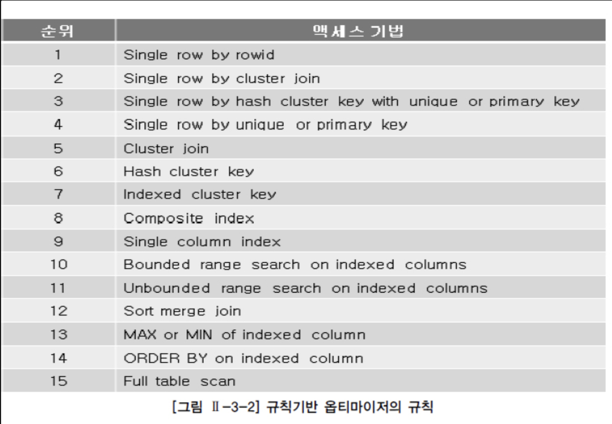

# SQL 조회 성능 튜닝과 Index

SQL 튜닝의 핵심은 디스크 I/O를 얼마만큼 최소화하고, 데이터베이스 버퍼에서 처리할 수 있도록 질의 처리 과정에서 액세스하는 페이지 수를 최소화하는 것이 튜닝의 핵심이다.

## Page

MySQL에서 페이지(Page)는 InnoDB 스토리지 엔진이 데이터를 저장하고 관리하는 기본 단위로써, 디스크와 메모리(버퍼풀)에 데이터를 페이지 단위로 읽고 쓴다.

- 기본 단위: 페이지는 기본적으로 16KB 크기로 동일한 크기로 구성된다.
    - 페이지 크기는 서버 설정으로 조정할 수
      있다. [MySQL 8.0 innodb file space](https://dev.mysql.com/doc/refman/8.0/en/innodb-file-space.html) 를 참고하자.
- 데이터 저장: 테이블의 행(row), 인덱스, 데이터 딕셔너리 정보를 포함한 다양한 데이터가 페이지 단위로 저장된다.
- 디스크 I/O 효율성: InnoDB는 디스크 I/O 효율성을 높이기 위해 페이지 단위로 데이터를 읽고 쓴다.
    - 한 번에 큰 덩어리의 데이터를 읽고 쓰므로 **디스크 접근 횟수를 줄일 수 있다.**

페이지 종류는 다음과 같다.

- Data Pages: 실제 테이블의 행 데이터를 저장한다.
    - 각 페이지는 여러 행을 포함할 수 있으며, 행이 커질 경우 여러 페이지에 걸쳐 저장될 수 있다.
- Index Pages: 인덱스 데이터를 저장한다.
    - B-트리 구조를 사용하여 인덱스를 관리하며, 각 인덱스 페이지는 인덱스 키와 해당 데이터 위치를 포함한다.
- Undo Log Pages: 트랜잭션 롤백을 위해 필요한 언두 정보를 저장한다.
    - 이는 ACID 특성을 유지하고 트랜잭션의 원자성을 보장하기 위해 사용한다.
- Redo Log Pages: 트랜잭션 커밋 후 변경된 데이터를 기록하여 장애 발생 시 데이터 복구에 사용한다.
- System Pages: 시스템 메타데이터를 저장한다.
    - 시스템 메타데이터: 데이터 딕셔너리 정보, 공간(테이블스페이스) 정보 등

페이지는 디스크 I/O 효율성을 높이기 위해 설계됐다.

- 버퍼 풀(Buffer Pool)
    - InnoDB는 디스크 I/O를 최소화하기 위해 페이지를 메모리에 캐시한다.
    - 버퍼 풀은 자주 사용되는 페이지를 메모리에 유지하여 성능을 향상시킨다.
- 페이지 분할과 병합
    - 데이터가 추가되거나 삭제될 때 페이지는 분할(split)되거나 병합(merge)될 수 있다.
    - 이는 B-트리 구조를 유지하고 성능을 최적화하기 위해 필요하다.

핵심은 한번의 디스크 I/O 로 많은 페이지를 읽는것이 중요하며, 버퍼 풀의 메모리 캐싱을 활용하여 성능을 최적화할 수 있다. 그래서 페이지에 저장되는 개별 데이터의 크기를 최대한 작게 하여, 1개의 페이지에 많은
데이터들을 저장할 수 있도록 하는 것이 상당히 중요하다.

DB 성능 개선 혹은 쿼리 튜닝은 디스크 I/O 자체를 줄이는 것이 핵심인 경우가 많다.

## B+tree

대부분 RDBMS의 인덱스 구조는 B-트리 기반으로 동작한다.

MySQL InnoDB는 시퀀셜 접근과 메모리 효율성을 고려하여, B-tree 를 확장된 B+tree 자료 구조 기반으로 인덱스를 구성한다.

- 정렬된 데이터: B-트리는 정렬된 데이터 구조다.
    - 데이터를 검색할 때 정렬된 인덱스를 사용하여 검색 범위를 빠르게 좁힐 수 있다.
    - B+tree는 리프 노드간 "연결 리스트"로 유지함으로 시퀀셜 접근에 효율적이다.
    - 범위 검색의 효율성
        - 선택적인 디스크 접근
            - 인덱스는 검색 범위를 좁히는 데 효율적이다. 예를 들어, WHERE 절에서 특정 범위를 검색할 때, 인덱스는 해당 범위에 해당하는 데이터만 읽기 때문에 전체 테이블을 스캔하는 것보다 훨씬
              적은 디스크 접근이 필요하다.
        - 연속적인 디스크 블록 접근
            - 인덱스가 정렬되어 있기 때문에, 범위 검색 시 디스크 블록의 연속적인 부분을 접근하게 되어 디스크 I/O의 효율성을 높인다.
- 높이(Hierarchy): B-트리의 높이는 비교적 낮다.
    - 이는 검색 시 디스크 블록(페이지)을 읽는 횟수를 줄이는 데 도움이 됩니다. 예를 들어, 트리의 높이가 3인 경우 최악의 경우에도 3번의 디스크 접근만으로 원하는 데이터를 찾을 수 있다.
    - B+tree는 리프 노드에만 키와 데이터를 저장하고, 리프 노드를 제외한 내부 노드에선 키만을 관리한다.
    - 따라서 한 노드에 많은 키를 관리할 수 있음으로 비교적 깊이는 줄어들고 메모리 효율성과 캐시 히트율을 높일 수 있다.
- 노드 당 많은 키: B-트리의 각 노드는 여러 개의 키를 포함할 수 있어, 한 번의 디스크 I/O로 많은 키를 읽을 수 있다. 이는 메모리 효율성을 높이고 디스크 접근 횟수를 줄인다.

### 비용 기반 옵티마이저

쿼리 실행 계획의 인덱스는 옵티마이저가 선정한다.

기본적으로 MySQL 8 버전 "비용 기반 옵티마이저"(CBO) 기반으로 동작된다.

- **비용기반(Cost-Based) 옵티마이저 (CBO)**
    - 사용자 쿼리를 위해 후보군이 될만한 실행계획을 도출
        - → 데이터 딕셔너리(Data Dictionary)에 미리 수집해 둔 통계정보를 이용해 각 실행계획의 예상비용을 산정
        - → 그중 **가장 낮은 비용의 실행계획 하나를 선택하는 옵티마이저**.
    - CBO가 사용하는 통계정보로는 `데이터량`, `컬럼 값의 수`, `컬럼 값 분포`, `인덱스 높이`, `클러스터링 팩터` 등이 있다.
    - MySQL8 히스토그램 수집
        - `ANALYZE TABLE {table_name}`: 인덱스 통계 데이터 갱신 read lock 발생되므로 주의.
- 규칙기반(Rule-Based) 옵티마이저 (RBO)
    - 각 액세스 경로에 대한 우선순위 규칙에 따라 실행계획을 만드는 과거의 옵티마이저
    - 데이터 특성을 나타내는 통계정보를 전혀 활용하지 않고 단순한 규칙에만 의존하기 때문에 대량 데이터를 처리하는 데 부적합.
    - Query 실행 계획 우선 순위
        - from join
        - where
        - group by
        - having
        - select
        - order by
        - limit



### Index dive

`비용기반 옵티마이저` 는 실행 계획을 세우기 위해, 실제 테이블의 데이터를 샘플링해서 확인 후, 최종 사용할 실행 계획을 선택한다. 샘플링 과정에서 CPU 사용량이 급증할 수 있다.

이 과정을 `index dive`, `random index dive` 라고 한다.

기본적으로 아래와 같은 기준으로 **기준값을 초과할 경우**, `index dive` 방식이 아니라 **인덱스 통계 정보**를 바탕으로 실행계획을 세울 수 있도록 하는 `index statistics` 사용한다.

- `range_optimizer_max_mem_size`
    - MySQL 5.6: `10`
    - MySQL 5.7.4: `200`

여기선 자세히 다루진 않겠지만, 옵티마이저 튜닝을 통해 디비 성능을 개선할 수도 있다.

### 인덱스 컬럼 선정 기준

- 갱신이 자주되지 않는 컬럼인가?
- 분포도가 좋은 컬럼인가?
    - 분포도는 낮을 수록 좋다. (유니크할 수록 좋다.)
- 조건절에 자주 사용되는 컬럼인가?
- 조인절에 연결되어 있는 컬럼인가?
- 정렬에 사용되는 컬럼인가?
    - 기본적으로 인덱스를 구성하면 데이터가 정렬되어 저장된다.
    - 따라서 인덱스를 잘 활용하면 높은 성능을 기대할 수 있다.
    - 이외에도 인덱스를 추가할 때 정렬 인덱스를 구성할 수 있다.
    - CREATE INDEX 인덱스이름 ON 테이블이름 (필드이름 DESC)
      CREATE INDEX 인덱스이름 ON 테이블이름 (필드이름 ASC)

### 검색 조건에 맞는 복합 인덱스 구성

- 카디널리티가 높은 순서를 기반으로 인덱스를 생성
    - 유니크한 값의 정도를 카디널리티라고 함.
- 동등 비교 조건 (eq 비교, ==)
- 정렬에 사용하는 필드
- 범위 조건
    - `<`, `>`
    - `WHERE IN` 절
        - in 절은 list 갯수에 따라 실행 계획이 달라 질 수 있다.
        - `eq_range_index_dive_limit` eq column 갯수
        ```sql
        WHERE id IN ( 'id1', 'id2', 'id3', 'id4', 'id5' ....)
        
        -- 실제 옵티마이저는 in 절은 다음과 같이 해석하고 동작.
        WHERE (
                id = 'id1'
             OR id = 'id2'
             OR id = 'id3'
             OR id = 'id4'
             OR id = 'id5'
             ...
        )
        ```

## 튜닝 포인트

다음 조회 쿼리는 실제 운영에서 발생되고 있던 슬로우 쿼리를 개선했던 조회 쿼리를 축약한 샘플 쿼리다.

```sql
-- example query
-- 관리자 페이지 48s -> 124ms 개선
EXPLAIN
SELECT
    -- 불필요한 프로젝션 정리.
    team0_.id,
    team0_.type,
    team0_.status,
    -- 스칼라 서브 쿼리 적용, slow query 유발되는 join 절 제거
    (SELECT user2_.name
     FROM tb_user user2_
     WHERE user2_.company_id = company0_.id
       AND role = 'ADMIN') AS col_12_0_
FROM tb_team team0_
         INNER JOIN tb_company company0_ ON team0_.company_id = company0_.id
WHERE
  -- loose index scan 설정
  -- 테이블 풀 스캔을 방지하고자 강제 where index range 설정
    (team0_.created_dt BETWEEN '1900-01-01' AND '2099-01-01')

  -- 커버링 인덱스 적용
  AND (team0_.company_id IN (SELECT company4_.id
                             FROM tb_company company4_
                             -- like 문자열 검색 조건
                             WHERE (company4_.name LIKE 'gmoon%')))
ORDER BY team0_.created_dt DESC
LIMIT 15 -- no offset
```

1. 반드시 튜닝 전/후 실행 계획과 인덱스를 확인하자.
2. 범위 조건 보다 eq 비교 권장
3. 불필요한 Join 절은 있는지
    - 검색 조건에 Join 테이블의 필드를 필터링을 하는 경우라면 데이터 양에 따라, 스칼라 서브 쿼리 방식이 성능이 좋을 수 있다.
    - Join vs 스칼라 서브 쿼리 → 두 방식 성능 검증 필요.
4. 부정문보다는 긍정문 사용
    - 옵티마이저가 쿼리를 실행하기 전 긍정문으로 변경하고 쿼리 실행.
    - 특히 not in 절은 성능에 취약
5. like 문자열 검색 조건 확인 ‘test%’
    - table full scan or index full scan 이 되지 않도록 like 문자열 검색 조건 확인.
    - `where username like '%gmoon%` -> table full scan or index full scan
6. 커버링 인덱스 적용
7. no-offset
8. loose index scan 고려
    - 검색 조건과 테이블의 데이터 양에 따라 의도했던 인덱스를 타지 않는 경우 발생.
    - table full scan 보다 index full scan 이 성능이 더 빠르므로 강제적으로 인덱스 컬럼의 범위를 지정하여 index 를 타도록하는 기법
    - 올바른 튜닝 방식은 아니다. 차선책으로 고려해볼만 하다.
    - loose index scan 조건
        1. 인덱스가 SELECT 리스트의 모든 부분을 커버하는 경우. 즉, 커버링 인덱스가 적용되는 경우
        2. `SELECT DISTINCT`, `SELECT ... GROUP BY` 또는 단일 튜플 SELECT 문인 경우
        3. `MIN/MAX` 함수를 제외한 모든 집계 함수가 `DISTINCT`를 포함하는 경우
        4. `COUNT(*)`가 사용되어선 안 됨
        5. 부분 키(`subkey`)의 카디널리티(고유 값의 개수)가 전체 인덱스의 카디널리티보다 100배 작은 경우

## 마무리

테이블에 데이터가 많을 수록 인덱스 저장 비용도 고려해야한다.

기본적으로 MySQL innodb 스토리지엔진 인덱스 구조는 B-Tree 구조로 되어 있기 때문에, 트리의 깊이가 깊을 수록 별도의 저장 비용이 든다. 특히 Replication DB 구조라면 불필요하게 추가된
인덱스는 복제 지연을 유발할 수 있음으로, 인덱스 최적화에 있어 백분위, 분포도를 따져 인덱스를 선정해야 한다. 쿼리를 개선한다고 인덱스를 무작정 다 설정하는 것은 답이 아니다.

또한, MySQL 8 버전 옵티마이저는 CBO 기반으로 동작하고 있기 때문에, Join 절의 테이블의 데이터 양과 인덱스 구성에 따라 실행 계획이 예상과 다르게 슬로우 쿼리가 발생할 수 있다. 인덱스 추가 후 실행
계획을 기반으로 조회 성능을 비교 검증하는 습관을 가져야 한다.

### Reference

- MySQL 8.0
    - [innodb file space](https://dev.mysql.com/doc/refman/8.0/en/innodb-file-space.html)
    - [B-tree](https://dev.mysql.com/doc/refman/8.0/en/glossary.html#glos_b_tree)
    - [glos system tablespace](https://dev.mysql.com/doc/refman/8.0/en/glossary.html#glos_system_tablespace)
    - [Query Optimizations](https://mariadb.com/kb/ko/query-optimizations/)
        - [MySQL 8.0 - server-system-variables](https://dev.mysql.com/doc/refman/8.0/en/server-system-variables.html)
            - `eq_range_index_dive_limit`
            - `range_optimizer_max_mem_size`
        - [optimization-and-indexes](https://mariadb.com/kb/ko/optimization-and-indexes/)
            - [optimization-strategies](https://mariadb.com/kb/en/optimization-strategies/)
        - [optimization-and-tuning](https://mariadb.com/kb/ko/optimization-and-indexes/)
- [MySQL5.6 IN(val1, …, valN) 를 index range scan 작동원리](http://small-dbtalk.blogspot.com/2016/02/)
- [당근 기술 블로그 - Index Dive 비용 최적화](https://medium.com/daangn/index-dive-%EB%B9%84%EC%9A%A9-%EC%B5%9C%EC%A0%81%ED%99%94-1a50478f7df8)
- [d2 - 성능 향상을 위한 SQL 작성법](https://d2.naver.com/helloworld/1155)
