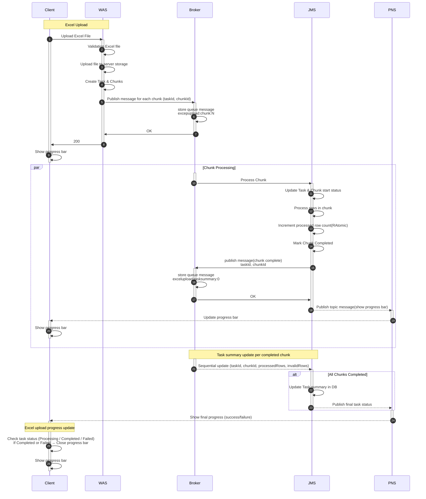

# Spring POI

Excel 데이터를 **annotation 기반으로 파싱하고 VO로 매핑**하며, **SAX streaming + callback/parallel processing**을 활용하여 대용량 업로드를 처리하는 Spring Boot/Gradle 레퍼런스 구현입니다.

커스텀 Excel 업로드 기능을 빠르게 도입할 수 있도록 실전 아키텍처(매핑/검증/변환/진행률/병렬처리)를 예제로 제공합니다.

## Features

- Annotation 기반 Excel → VO 매핑
- Converter / Validator 확장 가능
- SAX 기반 streaming parser
- Callback 방식의 Row 처리
- MQ 기반 병렬 처리 및 Task/Chunk 단위 집계
- Progress bar 실시간 업데이트 지원

## Components

- **`@ExcelComponent`**: Excel 관련 커스텀 Bean marking annotation
    - `ExcelValidator`, `ExcelConverter` 선언에 사용
    - Thread-safe property scope
- **`@ExcelModel`**: Excel VO 매퍼 클래스 marking annotation
- **`@ExcelProperty`**: VO 필드 marking annotation (title, comment, required, validator, converter 등 지정 가능)
- **`ExcelConverter`**: Excel cell → VO field 변환 인터페이스
    - `ExcelEnumConverter`: Enum 타입 전용 변환기
- **`ExcelValidator`**: 셀 값 검증기 인터페이스
    - `ExcelBatchValidator`: 배치 기반 검증기 (ex. 1000건 단위 DB 중복 체크)
- **`AbstractSaxXlsxHandler`**: `XSSFReader` + `XMLReader` 연결하여 SAX 이벤트 처리
    - `SaxXlsxHandler`: 실제 파싱 + 변환
    - `SaxDataRowCountHandler`: 데이터 수 집계
- **`RowCallback`**: `<row>` 단위 callback 인터페이스
- **`ExcelRowHandler`**: 비즈니스 로직 처리 인터페이스
    - 예: `UserExcelCreateImporter` (사용자 등록 Excel 업로드 처리)
- **`ExcelSheet`**: 시트의 행들을 VO로 매핑한 도메인 객체
- **`ExcelSheetType`**: 시트별 매퍼 클래스 ↔ 핸들러 1:1 매핑 Enum

## 주요 엔티티

- **ExcelUploadTask**: 엑셀 업로드 작업 단위
- **ExcelUploadChunk**: Chunk 단위 병렬 처리 관리
- **ExcelUploadInvalidRow**: 유효하지 않은 행 관리 (에러 메시지 및 원본 데이터 저장)

> 본 라이브러리는 Spring Batch가 아닌 MQ 기반 stream processing 구조를 전제로 함.

## Processing Flow



## Usage

1. VO 클래스에 `@ExcelModel` / `@ExcelProperty` 지정
2. `ExcelRowHandler` 구현체 작성 (비즈니스 로직 처리)
3. `ExcelSheetType` 에 VO + Handler 매핑
4. `ExcelService#upload` 호출

업로드 시:

- 파일은 서버 스토리지에 저장
- Task/Chunk 생성 후 MQ 메시지 발행
- 각 Chunk 병렬 처리 → RAtomic으로 row 카운트
- 처리 후 토픽 메시지 발행 (실시간 진행률 업데이트)
- Chunk 완료 시 Task 집계 업데이트 → 최종 상태 발행

### 1) Excel 모델 정의 (@ExcelModel, @ExcelProperty)

엑셀 헤더를 VO 필드에 매핑하고, 필수 여부/검증기/변환기를 선언합니다.

````java

@ExcelModel
@Getter
@ToString
public class ExcelUserVO extends BaseExcelModel {

	@Serial
	private static final long serialVersionUID = -4927708429575302180L;

	@ExcelProperty(
		 title = "사용자 아이디",
		 comment = "사용자 아이디는 필수 입력 값입니다.",
		 required = true,
		 validator = {
			  LineBreakNotAllowedValidator.class,
			  UniqueCellValueValidator.class,
			  UsernameValidator.class
		 }
	)
	private String username;

	@ExcelProperty(title = "사용자 비밀번호", required = true)
	private String password;

	@ExcelProperty(title = "사용자 이름", required = true)
	private String userFullname;
	
	// ...
}

````

### 2) 행 처리기 구현 (ExcelRowHandler)

파싱된 각 Row(VO)를 받아 비즈니스 로직을 수행합니다.

```java
@Component
@RequiredArgsConstructor
public class UserExcelCreateImporter extends AbstractExcelRowHandler<ExcelUserVO> {

	@Override
	protected void applyRow(ExcelUserVO excelVO) {
		// TODO 비즈니스 처리
	}
}

```

### 3) 시트 타입 등록 (ExcelSheetType)

시트별로 VO와 Row 처리기(핸들러)를 1:1로 매핑합니다.

```java

@RequiredArgsConstructor
@Getter
public enum ExcelSheetType implements Serializable {
	USER(ExcelUserVO.class, UserExcelCreateImporter.class);

	private final Class<? extends BaseExcelModel> excelModelClass;
	private final Class<? extends ExcelRowHandler<?>> excelRowProcessorClass;
	private final String signature;

	<T extends BaseExcelModel> ExcelSheetType(
		 Class<T> excelModelClass,
		 Class<? extends ExcelRowHandler<T>> excelRowProcessorClass
	) {
		this.excelModelClass = excelModelClass;
		this.signature = generateSignature(excelModelClass);
		this.excelRowProcessorClass = excelRowProcessorClass;
	}
}
```

### 4) 업로드 호출 (ExcelService#upload)

파일을 저장하고 Task/Chunk 생성 → MQ 발행까지 수행합니다. 반환값으로 업로드 작업(Task)을 확인할 수 있습니다.

```java
    public ExcelUploadTask upload(File file, ExcelSheetType sheetType, Locale locale, String timezone) {
	Path uploadedExcelFile = getExcelFilePath(file);

	long dataRowCount = getDataRowCount(sheetType, uploadedExcelFile);
	ExcelUploadTask saved = taskService.save(
		 sheetType,
		 dataRowCount,
		 file.getName(),
		 locale,
		 timezone
	);

	uploadExcelFile(saved, file);
	return saved;
}
```

## Performance

- 기존: 1,000 rows → **2분 30초**
- 개선: 1,000 rows → **25초**
- 개선: 5,000 rows → **48초**
- 생산성: 기존 커스텀 구현 약 1주 → 본 라이브러리 사용 시 약 1시간
