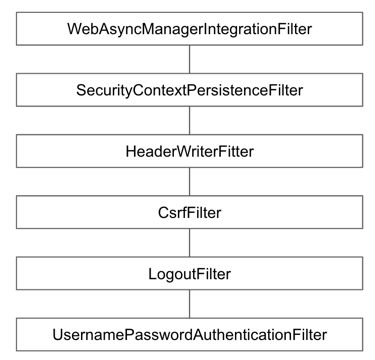

# UsernamePasswordAuthenticationFilter
## 폼 인증 처리 필터

폼 로그인을 처리하는 인증 필터

- 사용자가 폼에 입력한 username과 password로 Authentcation을 만들고
- `AuthenticationManager`를 사용하여 인증을 시도한다.
- `AuthenticationManager`(ProviderManager)는 여러 `AuthenticationProvider`를 사용하여 인증을 시도하는데, 그 중에 `DaoAuthenticationProvider`는 `UserDetailsService`를 사용하여 UserDetails 정보를 가져와 사용자가 입력한 password와 비교한다.



UsernamePasswordAuthenticationFilter 필터가 AuthenticationManager 에게 사용자 인증 처리를 위임한다.

```java
public class UsernamePasswordAuthenticationFilter extends AbstractAuthenticationProcessingFilter {
  
  public static final String SPRING_SECURITY_FORM_USERNAME_KEY = "username";
  public static final String SPRING_SECURITY_FORM_PASSWORD_KEY = "password";
  
  private AuthenticationManager authenticationManager;

  //...
  public Authentication attemptAuthentication(HttpServletRequest request, HttpServletResponse response)
          throws AuthenticationException {

    //...
    
    // [1] 폼으로 부터 요청된 username, password 를 기반으로 토큰 생성
    UsernamePasswordAuthenticationToken authRequest = new UsernamePasswordAuthenticationToken(username, password);
    
    //...

    // [2] AuthenticationManager 를 통해 사용자 인층 처리
    return this.getAuthenticationManager().authenticate(authRequest);
  }

  protected AuthenticationManager getAuthenticationManager() {
    return this.authenticationManager;
  }
  
  //...
}
```

Spring Security 는 기본적인 AuthenticationManager 인터페이스 구현체 `ProviderManager`를 사용하여 인증 처리한다.


```java
public class ProviderManager implements AuthenticationManager, MessageSourceAware, InitializingBean {

  private AuthenticationEventPublisher eventPublisher = new NullEventPublisher();
  private List<AuthenticationProvider> providers = Collections.emptyList();
  
  @Override
  public Authentication authenticate(Authentication authentication) throws AuthenticationException {
    
  }
}
```

ProviderManager 는 여러개의 AuthenticationProvider 를 사용하여 인증 처리를 위임하여 각각 Provider에서 인증 시도를 처리하게 된다.

여러 `AuthenticationProvider` 중에서도 `DaoAuthenticationProvider`를 보게 되면 DaoAuthenticationProvider 는 최종적으로 `UserDetailsService`를 사용하여 UserDetails를 얻게 된다.

```java
public class DaoAuthenticationProvider extends AbstractUserDetailsAuthenticationProvider {

  //...
  private UserDetailsService userDetailsService;

  @Override
  protected final UserDetails retrieveUser(String username, UsernamePasswordAuthenticationToken authentication)
          throws AuthenticationException {
    prepareTimingAttackProtection();

    // [1] 토큰 기반으로 사용자 조회
    UserDetails loadedUser = this.getUserDetailsService().loadUserByUsername(username);
    if (loadedUser == null) {
      throw new InternalAuthenticationServiceException(
              "UserDetailsService returned null, which is an interface contract violation");
    }
    return loadedUser;
   
  }
}

public abstract class AbstractUserDetailsAuthenticationProvider
        implements AuthenticationProvider, InitializingBean, MessageSourceAware {

  @Override
  public Authentication authenticate(Authentication authentication) throws AuthenticationException {
    Assert.isInstanceOf(UsernamePasswordAuthenticationToken.class, authentication,
            () -> this.messages.getMessage("AbstractUserDetailsAuthenticationProvider.onlySupports",
                    "Only UsernamePasswordAuthenticationToken is supported"));
    //...
    if (user == null) {
      // [2] 구현체에서 구현한 방식으로 사용자 조회
      user = retrieveUser(username, (UsernamePasswordAuthenticationToken) authentication);
    }
    //...
    return createSuccessAuthentication(principalToReturn, authentication, user);
  }
}
```

UserDetailsService를 구현한 구현체를 통해 최종적으로 사용자 정보를 담고 있는 외부 리소스를 통해 값을 가져와 `UserDetails`에 담아준다.

예를들어 사용자 정보를 DB를 통해 관리한다고 한다면, 아래 코드처럼 `loadUserByUsername(...)` 메서드를 재정의하여 조회된 사용자 정보를 UserDetails 타입으로 정의해주면 된다.

```java
@Service
@RequiredArgsConstructor
public class AccountService implements UserDetailsService {
  private final AccountRepository accountRepository;
  private final PasswordEncoder passwordEncoder;

  @Override
  public UserDetails loadUserByUsername(String username) throws UsernameNotFoundException {
    Account account = Optional.ofNullable(accountRepository.findByUsername(username))
            .orElseThrow(() -> new UsernameNotFoundException(username));

    // User.builder를 사용하여 UserDetails 타입으로 반환
    return User.builder()
            .username(account.getUsername())
            .password(account.getPassword())
            .roles(account.getRole())
            .build();
  }
}
```

최종적으로 UsernamePasswordAuthenticationFilter 는 인증된 `Authentication`를 `SecurityContextHolder`에 담아준다.

