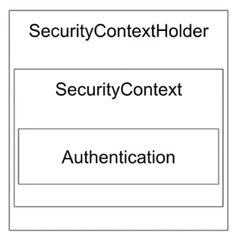

# Spring Security
# 아키텍처 

# SecurityContextHolder와 Authentication

SecurityContextHolder
- SecurityContext 제공, 기본적으로 ThreadLocal을 사용한다.
> ThreadLocal : 한 쓰레드 내에서 공유하는 저장소라 생각하면 된다. 객체를 파라미터를 넘기지 않아도, 데이터를 접근할 수 있다.

SecurityContext
- Authentication 제공
- SecurityContextHolder
- SecurityContext 
- Authentication

# Authentication

- Principal 과 GrantAuthority 제공

Principal (인증, 인증된 사용자 정보)
- "누구"에 해당하는 정보, (User 객체 타입)
- UserDetailsService에서 리턴한 그 객체, 그 
- 객체는 UserDetails 타입

GrantAuthority (권한)
- "ROLE_USER", "ROLE_ADMIN" 등 Principal이 가지고 있는 "권한"을 나타낸다.
- 인증 이후, 인가 미 권한 확인할 때 이 정보를 참조한다.

UserDetails
- 애플리케이션이 가지고 있는 유저 정보와 스프링 시큐리티가 사용하는 Authentication 객체 사이의 어댑터

UserDetailsService
- 유저 정보를 UserDetails 타입으로 가져오는 DAO (Data Access Object) 인터페이스
- 구현은 커스텀 가능 (Spring Data JPA 사용 가능)

SecurityContextHolder 인증된 정보만 담는다. Thread Local 를 사용하고 애플리케이션 어디서나 접근 가능하다. Thread가 다를 경우, 제대로된 Authentication를 반환 받을 수 없기 때문에, 다른 전략을 고민해야한다.

인증이 유저라면 SecurityContextHolder를 통해 Authentication(인증) 객체를 반환하여, 사용자 정보를 받을 수 있다. 

---

# AuthenticationManager와 Authentication

- 인증

