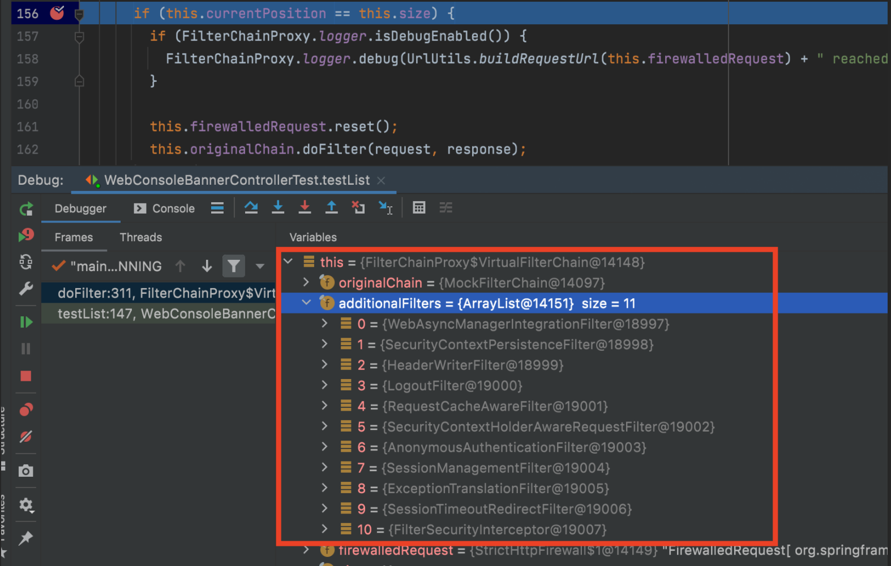

# 스프링 시큐리티 필터 체인과 함께 MockMVC 테스트 하기

일반적으로 컨트롤러 테스트 작성시 `MockMvc`를 사용하여 컨트롤러 테스트 작성을 한다.

이때 `MockMvc`는 HTTP 요청 처리를 하지 않고, Controller 를 호출하는 방식으로 인해, 시큐리티 체인과 함께 테스트를 할 수 없다.

만약 컨트롤러 테스트시 스프링 시큐리티 필터 체인과 함께 동작되는 환경에서 테스트를 진행해야된다면 다음을 참고하자. 

### 1. SecurityConfig 설정

1. 필터 체인에 인가가 필요한 request URI 에 대해 ant 패턴으로 `/user/**` 설정
2. request URI의 인가(authorization) 대한 필요한 Role은 `ADMIN`

```java
@Configuration
@EnableWebSecurity
public class SecurityConfig extends WebSecurityConfigurerAdapter {

  //... 생략
  @Override
  protected void configure(HttpSecurity http) throws Exception {
    http
      .authorizeRequests()
          .antMatchers("/user/**") // [1] Request URI 설정
              .hasAnyRole("ADMIN") // [2] Role 설정
    ;
  }

  //... 생략
}
```

### 2. MockMvc를 사용한 Controller 테스트

```java
@RunWith(SpringJUnit4ClassRunner.class)
@SpringBootTest
@WebAppConfiguration
public class UserControllerTest {

  @Autowired
  private WebApplicationContext context;
  private MockMvc mockMvc;

  @Before
  public void setUp() {
    mockMvc = MockMvcBuilders.webAppContextSetup(context)
            .build();
  }

  @Test
  @DisplayName("Security Chain이랑 같은 환경에서 도는건지")
  public void list() throws Exception {
    mockMvc.perform(MockMvcRequestBuilders.get("/user/list"))
            .andExpect(MockMvcResultMatchers.status().is3xxRedirection());
  }
}
```

다음 테스트 결과를 예상해보자면 인증된 사용자가 없음으로 로그인 페이지로 리다이렉트 될거라 생각하기 때문에 HTTP 응답 코드는 `responseCode=302` 로 예상한다.

1. SecurityContextHolder에 인증된 사용자가 없다.
2. 다음 테스트 코드는 시큐리티 필터에 의해 로그인 페이지로 리다이렉트(302)된다.

하지만, 테스트는 HTTP 응답 코드를 200 을 주며 테스트는 실패한다.

```text
java.lang.AssertionError: Range for response status value 200 
Expected :REDIRECTION
Actual   :SUCCESSFUL
```

### 3. 원인

MockMvc 테스트시 자체적으로 목 서블릿 컨테이너를 띄워 테스트를 수행한다. 이때 HTTP 요청 처리를 하지 않고, Controller 를 호출하는 방식으로 인해, 시큐리티 체인과 함께 테스트를 할 수 없다.

당연히 시큐리티 체인이 미적용되어 FilterChainProxy 에서 디버깅이 되지 않는 현상을 발견할 수 있다.

### 4. 해결 방안

따라서 MockMvc에 시큐리티 필터 체인을 설정하여 목 서블릿을 띄울수 있게 해야된다.

MockMVC에 스프링 시큐리티를 설정하는 방법으론 DelegatingFilterProxy 필터를 등록하는 방법과
SecurityMockMvcConfigurers 를 사용하는 두 가지 방법이 존재한다.

1. DelegatingFilterProxy 필터 등록
2. SecurityMockMvcConfigurers.springSecurity() 사용

### 4.1. DelegatingFilterProxy 필터 설정 방법

첫 번째 해결 방법으론 `MockMvcBuilders`의 addFilter 에 `DelegatingFilterProxy`를 전달하는 방법이다.

```java
@RunWith(SpringJUnit4ClassRunner.class)
@SpringBootTest
@WebAppConfiguration
public class UserControllerTest {

  @Autowired
  private WebApplicationContext context;
  private MockMvc mockMvc;

  @Before
  public void setUp() throws Exception {
    DelegatingFilterProxy delegatingFilterProxy = new DelegatingFilterProxy();
    delegatingFilterProxy.init(new MockFilterConfig(context.getServletContext(), BeanIds.SPRING_SECURITY_FILTER_CHAIN));

    mockMvc = MockMvcBuilders.webAppContextSetup(context)
            .addFilter(delegatingFilterProxy)
            .build();
  }
  
  //... 생략
}
```

`FilterChainProxy`에 설정된 `breakPoint`를 살펴보면 시큐리티 필터들이 정상적으로 적용됨을 확인할 수 있다.



테스트 결과 예상 시나리오대로 302 응답 코드를 확인해볼 수 있었다.

### 인증된 사용자가 로그인 했다고 가정 해본다면 ?

인가(authorization) 테스트를 위해 SecurityContextHolder에 인증된 사용자를 강제로 넣어 테스트를 진행해보자.

참고로 breakPoint는 스프링 시큐리티가 인가를 판단하는 최종적 end point인 AffirmativeBased 에 설정해주었다.

테스트 결과 SecurityContextHolder에 강제로 인증된 사용자를 주입하여 테스트가 통과되어야 되지만, 인증된 사용자가 없다는
annoymouseUser 를 나타내며 302 응답 코드를 뱉는다.

DelegatingFilterProxy 필터 적용 방식은 SecurityContextHolder에 적용된 Authentication 적용되지
않았다.

3.2. SecurityMockMvcConfigurers.springSecurity()

pom.xml spring-security-test 의존성 추가

```
<dependency>
    <groupId>org.springframework.security</groupId>
    <artifactId>spring-security-test</artifactId>
    <scope>test</scope>
    <version>${spring-security.version}</version>
</dependency>
```

mockMvcBuilders.apply(SecurityMockMvcConfigurers.springSecurity()); 추가

시큐리티 필터들이 적용됨을 확인했고, 사용자 인증/인가 필터가 정상적으로 적용되고 예상 시나리오에 맞게 테스트 통과


