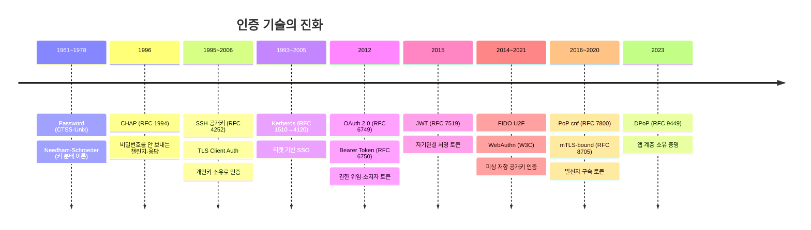
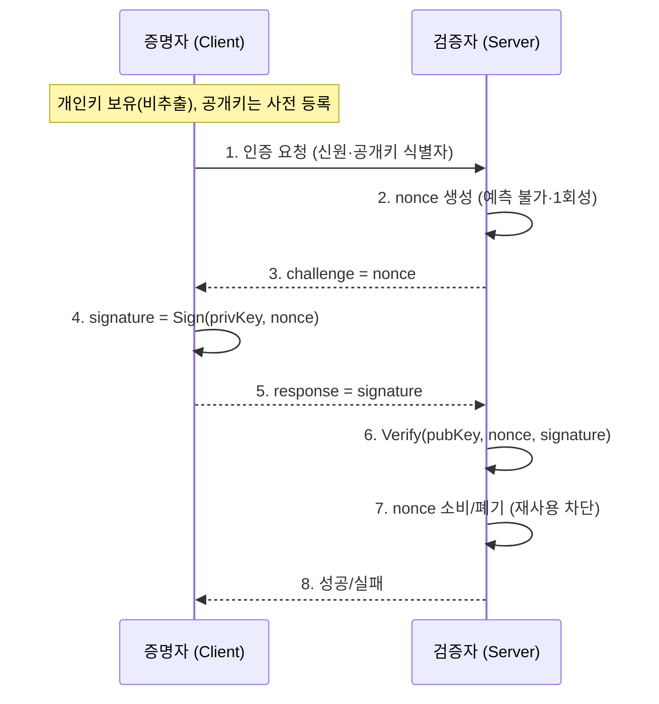
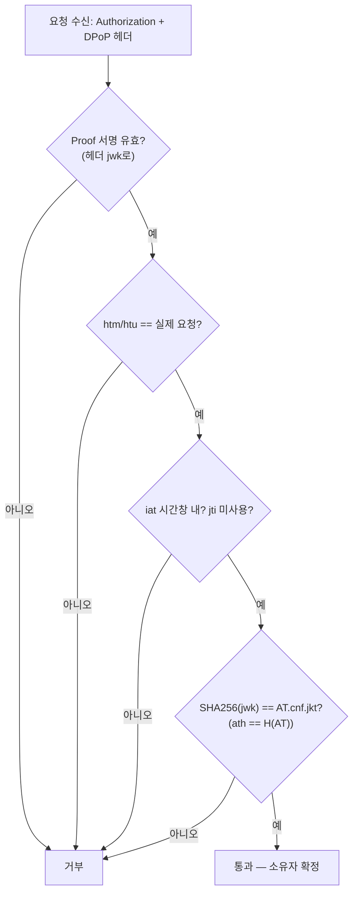
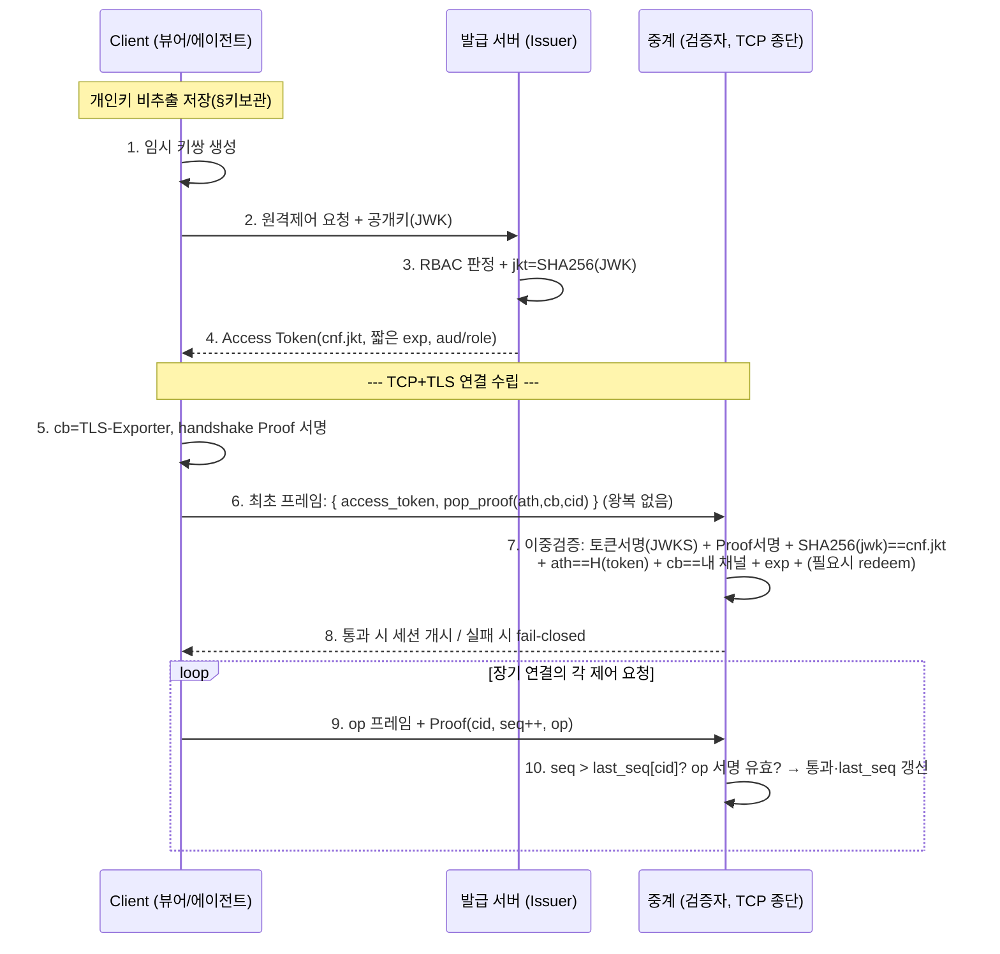

# 인증의 진화 — Challenge-Response에서 DPoP, 그리고 TCP 전용 PoP 설계까지

> 이 문서는 "DPoP를 어떻게 쓰는가"가 아니라 **"왜 이렇게 설계되었는가"**를 다룬다. 각 기술은 앞선 기술의 한계를 메우려고 등장했으므로, 진화의 사슬을 따라가면 설계 의도가 자연스럽게 드러난다. 모든 사실은 RFC·표준에 근거하며, 추측은 배제한다.

## 이 문서가 답하는 질문

- 최초의 인증은 무엇이었고, 왜 부족했는가?
- Challenge-Response는 무엇을 해결했고, 공개키가 더해지자 무엇이 달라졌는가?
- OAuth 2.0 Bearer Token의 편의와 그 대가(Replay)는 무엇인가?
- PoP는 왜 등장했고, 실제로 무엇을 "증명"하는가?
- DPoP는 Challenge-Response와 어떻게 다르며, 왜 HTTP Method·URL을 서명에 넣는가?
- HTTP가 아닌 TCP에서는 무엇으로 그것을 대체해야 하는가? 왜 DPoP를 그대로 못 쓰는가?
- 순수 TCP 원격제어 시스템의 PoP를 처음부터 설계한다면 어떤 구조가 옳은가?

---

# 1. 역사 — 왜 다음 기술이 필요했는가

인증의 역사는 **"공유 비밀을 네트워크에 흘리지 않으면서 상대를 확인하는 법"**을 향한 점진적 이동이다. 아래 연대표는 각 단계가 **직전 단계의 어떤 한계** 때문에 등장했는지를 축으로 정리한다.



## 1.1 Password (1960s~) — 그리고 그 원죄

최초의 실용 인증은 **비밀번호**다(MIT CTSS, 1961; Unix 해시 비밀번호, 1970년대). 문제는 근본적이다: **인증할 때마다 비밀 그 자체를 상대에게 보낸다.** 전송 구간을 도청하거나 서버가 침해되면 비밀이 그대로 노출된다. 이후 모든 인증 기술은 사실상 **"비밀을 보내지 않고 비밀을 아는 것을 증명"**하려는 시도다.

## 1.2 Challenge-Response / CHAP (RFC 1994, 1996) — 비밀을 안 보낸다

CHAP(PPP Challenge Handshake Authentication Protocol)는 **비밀번호를 네트워크에 보내지 않는다.** 서버가 예측 불가능한 **챌린지(난수)**를 보내면, 클라이언트는 `hash(challenge ‖ secret)`을 계산해 응답한다. 서버도 같은 계산을 해 비교한다. 도청자는 비밀을 못 얻고, 챌린지가 매번 바뀌므로 **응답 재사용(replay)도 막힌다.** 이것이 "챌린지-응답"의 원형이다. 다만 여전히 **양측이 같은 대칭 비밀을 공유**해야 한다는 한계가 남는다.

## 1.3 공개키 기반 인증 — SSH(RFC 4252, 2006) · TLS Client Auth

SSH 공개키 인증과 TLS 클라이언트 인증서는 **대칭 비밀 공유를 없앤다.** 클라이언트는 **개인키로 챌린지에 서명**하고, 서버는 **공개키로 검증**한다. 서버는 검증용 공개키만 가지면 되고, **비밀을 전혀 공유하지 않는다.** 서버가 침해돼도(공개키만 유출) 사칭이 불가능하다. RFC 4252의 표현대로 "개인키의 소유가 곧 인증"이다. 이 **"개인키 소유 증명"**이 훗날 PoP·DPoP·WebAuthn의 공통 뿌리다.

## 1.4 Kerberos(RFC 4120) — 티켓과 SSO

Kerberos(Needham-Schroeder 1978 이론 → RFC 1510 1993 → RFC 4120 2005)는 신뢰받는 제3자(KDC)가 **티켓**을 발급해, 사용자가 서비스마다 비밀번호를 반복 입력하지 않게 했다(SSO). "발급자가 서명/암호화한 토큰을 소지자가 제시한다"는 **토큰 기반 인증**의 원형이며, OAuth의 발상과 직결된다.

## 1.5 OAuth 2.0(RFC 6749, 2012) + JWT(RFC 7519, 2015) — 권한 위임과 자기완결 토큰

웹 API 시대에는 "사용자가 제3자 앱에 **비밀번호를 주지 않고** 제한된 권한만 위임"하는 문제가 생겼다. OAuth 2.0이 이를 **access token**으로 풀었고, JWT가 그 토큰을 **자기완결(서명된 클레임 묶음)**로 만들어 리소스 서버가 발급자 호출 없이 로컬 검증하게 했다. 그러나 OAuth 2.0의 access token은 기본이 **Bearer(소지자) 토큰**이다 — 여기서 다시 replay 문제가 부활한다(§3).

## 1.6 FIDO U2F(2014) · WebAuthn(W3C, 2019/2021) — 피싱 저항 공개키

FIDO/WebAuthn은 공개키 챌린지-응답을 브라우저·인증기(authenticator)로 가져왔다. 개인키는 기기 밖으로 안 나가고(비추출), 서명에 **origin/RP ID를 결속**해 **피싱 저항**을 얻었다. "개인키 소유 + 컨텍스트 결속"이라는 방향은 DPoP와 정확히 같다.

## 1.7 PoP(RFC 7800, 2016) → mTLS-bound(RFC 8705, 2020) → DPoP(RFC 9449, 2023)

Bearer의 한계를 토큰 계층에서 메우기 위해, **PoP(Proof-of-Possession)** 개념이 표준화됐다. RFC 7800은 토큰에 **`cnf`(confirmation) 클레임**을 넣어 "이 토큰은 특정 키의 소유자만 쓸 수 있다"를 선언한다. 이를 전송 계층(TLS 인증서)에 묶은 것이 mTLS-bound token(RFC 8705), 애플리케이션 계층(HTTP 헤더 + 서명 JWT)에 묶은 것이 **DPoP(RFC 9449)**다.

> **핵심 요약 (§1)**
> - 인증의 역사 = "비밀을 안 보내고 아는 것을 증명" → "대칭 비밀 공유마저 없앤 개인키 소유 증명"으로의 이동.
> - Bearer 토큰(2012)은 편의를 위해 이 흐름을 잠시 역행("소지=권한")했고, PoP/DPoP(2016~2023)가 다시 "소유 증명"으로 되돌렸다.
> - DPoP·WebAuthn·SSH는 모두 **개인키 소유 증명 + 컨텍스트 결속**이라는 같은 원리의 변주다.

---

# 2. Challenge-Response — 재사용을 구조적으로 막는 법

## 2.1 동작 원리

챌린지-응답의 목표는 **"방금 이 순간, 비밀(또는 개인키)을 가진 자가 응답했다"**를 증명하는 것이다. 구성요소:

- **Nonce (challenge)**: 검증자가 만든 **예측 불가능한 1회성 값**. 재사용 방지의 핵심.
- **전자서명 / 응답 생성**: 증명자가 개인키(또는 대칭 비밀)로 챌린지에 서명·해시.
- **Public Key Verification**: 검증자가 공개키로 서명 검증(대칭이면 같은 비밀로 재계산).
- **Replay Attack 방어**: 챌린지가 매번 다르므로, 과거 응답을 캡처해 재전송해도 **이번 챌린지와 안 맞아 거부**된다.

## 2.2 시퀀스 (공개키 기반)



- **3번(challenge)**이 이 방식의 정체성이다. 검증자가 신선도를 **직접 통제**하므로, 증명자의 시계나 별도 상태에 의존하지 않는다.
- **7번(nonce 소비)**이 replay를 닫는다. 같은 nonce는 두 번 통하지 않는다.

## 2.3 대가 — 왕복(Round Trip)

이 구조는 반드시 **1왕복**을 요구한다: 요청 → 챌린지 → 응답. 검증자가 챌린지를 "먼저 내려줘야" 하기 때문이다. 이 왕복 비용이 훗날 DPoP가 제거하려 한 지점이다(§5, §7).

> **핵심 요약 (§2)**
> - 챌린지-응답은 **검증자가 발급한 nonce**로 "지금 살아있는 소유자"를 증명하고 replay를 구조적으로 막는다.
> - 신선도 보증 주체가 **검증자**라는 점, 그 대가로 **1왕복이 필수**라는 점이 본질이다.

---

# 3. OAuth 2.0 Bearer Token — 편의의 대가

## 3.1 왜 "Bearer"인가

RFC 6750의 정의: **"토큰을 소지한 자(bearer)는 누구든 그 토큰으로 자원에 접근할 수 있다 — 암호 키의 소유를 증명하지 않고."** 이름 그대로 **"소지자 토큰"**이다. 지하철 승차권과 같다: 표를 가진 사람이 곧 승객이고, 표는 누가 쥐었는지 묻지 않는다.

## 3.2 장점

- **단순함**: 클라이언트는 `Authorization: Bearer <token>` 한 줄만 붙이면 된다. 키·서명·왕복이 필요 없다.
- **무상태 검증**: JWT라면 리소스 서버가 발급자 공개키(JWKS)로 로컬 검증 → 서버 간 통신 0회, 수평 확장 용이.
- **범용성**: HTTP를 타는 모든 곳에 즉시 적용.

## 3.3 치명적 한계 — Replay Attack

Bearer의 편의는 곧 약점이다. **"소지 = 권한"이므로, 토큰이 유출되는 순간 공격자는 정당한 클라이언트와 구별 불가능**하다.

- **토큰 탈취 경로**: 브라우저 저장소(XSS)·로그·프록시·TLS 종단 지점·감염 단말 등.
- **Replay Attack**: 공격자가 탈취한 토큰을 **그대로 재전송**하면 서명이 유효하므로 통과한다. 서명은 "발급자가 만든 진짜 토큰인가"만 증명할 뿐, **"이걸 낸 자가 정당한 소유자인가"는 증명하지 못한다.** (도장 찍힌 입장권을 주워도 도장은 여전히 진짜다.)

RFC 6750도 이를 인지해 "Bearer 토큰은 저장·전송 중 반드시 노출로부터 보호돼야 한다"고 못박는다. 즉 **Bearer의 안전은 전적으로 TLS(전송 보호)에 의존**한다 — 이것이 근본 취약점이다.

> **핵심 요약 (§3)**
> - Bearer = "소지자 토큰". 단순·무상태·범용이라는 강력한 장점.
> - 그러나 "소지=권한"이라 **탈취 → 재전송(replay)**에 무방비이며, 안전이 TLS에만 의존한다. 이 공백을 메우려 PoP가 등장한다.

---

# 4. PoP — 소유를 증명하는 토큰

## 4.1 등장 배경

PoP(Proof-of-Possession, RFC 7800)는 Bearer의 "소지=권한"을 **"소유 증명=권한"**으로 바꾼다. 발상은 챌린지-응답의 개인키 소유 증명을 **OAuth 토큰에 결합**하는 것이다.

## 4.2 Bearer vs PoP

| | Bearer Token | PoP Token |
|---|---|---|
| 신뢰 모델 | 소지한 자 = 권한자 | **개인키 소유를 증명한 자** = 권한자 |
| 탈취 시 | 즉시 오용 가능 | **개인키 없으면 무용지물** |
| 토큰 구조 | 클레임만 | 클레임 + `cnf`(키 바인딩) |
| 안전 의존 | 전송 보호(TLS)에 전적 의존 | 키 소유 + (보완적으로) 전송 보호 |

## 4.3 PoP가 실제로 증명하는 것

PoP는 **"이 토큰을 제시한 자가, 발급 시점에 토큰에 박제된 그 키(cnf)의 개인키를 지금 쥐고 있다"**를 증명한다. 발급자는 `cnf` 클레임에 **키의 지문(thumbprint)**을 서명해 넣고, 검증자는 제시자의 서명을 그 키로 검증한다. 토큰만 훔친 공격자는 개인키가 없어 서명을 못 만들어 실패한다.

> **핵심 요약 (§4)**
> - PoP는 Bearer의 "소지"를 "**개인키 소유 증명**"으로 교체한다.
> - 토큰을 특정 키에 암호학적으로 결속(`cnf`)해, **토큰 탈취만으로는 사용 불가능**하게 만든다(Sender-Constrained Token).

---

# 5. DPoP (RFC 9449) — 앱 계층 소유 증명

DPoP(Demonstrating Proof-of-Possession at the Application Layer, RFC 9449, 2023)는 PoP를 **HTTP 헤더 + 서명 JWT**로 구현한다. mTLS(전송 계층, 인증서·PKI 필요)와 달리 **PKI 없이** 브라우저·모바일 같은 public client에도 적용된다.

## 5.1 핵심 구성요소

| 요소 | 의미 |
|---|---|
| **DPoP Proof JWT** | 요청마다 클라이언트가 개인키로 서명해 `DPoP` 헤더에 싣는 단명 JWT |
| **JWK** | Proof JWT 헤더에 담기는 클라이언트 **공개키**(검증자가 이걸로 서명 검증) |
| **jkt** | 공개키의 **JWK Thumbprint(SHA-256, RFC 7638)** — 키의 고정 지문 |
| **cnf** | Access Token 안의 confirmation 클레임. `cnf.jkt`에 위 지문을 박제 |
| **Access Token Binding** | `SHA-256(Proof의 공개키) == AT.cnf.jkt` 대조로 "토큰↔키" 결속 확인 |
| **jti** | Proof의 고유 ID. 검증자가 재사용을 추적해 replay 차단 |
| **iat** | Proof 생성 시각. 검증자가 허용 시간창 밖이면 거부 |
| **htm** | 이 Proof가 결속된 **HTTP Method** (예: `POST`) |
| **htu** | 이 Proof가 결속된 **HTTP URI** (쿼리·프래그먼트 제외) |

## 5.2 왜 URL(htu)과 Method(htm)를 넣는가

DPoP의 진짜 방어력은 **증명을 "이 요청 전용"으로 묶는** 데서 나온다. `POST /transfer`용으로 만든 Proof는 `htm=POST, htu=.../transfer`가 서명돼 있어 `GET /balance`에 재사용할 수 없다. 즉 **htm/htu가 리플레이 표면을 요청 단위로 잘게 쪼갠다.** 여기에 `ath`(access token 해시)를 더하면 특정 토큰에도 결속되고, `iat`/`jti`가 시간·중복을 제한한다.

> 이것이 DPoP가 챌린지-응답의 **왕복 없이도** replay를 억제하는 방법이다: 서버가 nonce를 안 줘도, 클라이언트가 **"무엇을(htm/htu), 언제(iat), 고유하게(jti)"**를 스스로 서명해 넣기 때문이다. 대신 신선도를 클라이언트가 "주장"하므로, 검증자는 **iat 시간창 + jti 중복 추적**으로 이를 보완해야 한다. (더 강한 방어가 필요하면 RFC 9449는 서버가 `DPoP-Nonce`를 내려주는 **선택적 챌린지-응답**을 정의한다 — 즉 DPoP는 왕복을 "제거"한 게 아니라 "기본값에서 뺀" 것이다.)

## 5.3 DPoP vs Challenge-Response 비교

| 항목 | Challenge-Response (CHAP/SSH/WebAuthn) | DPoP (RFC 9449) |
|---|---|---|
| 신선도 보증 주체 | **검증자**(서버 발급 nonce) | **클라이언트**(iat) + 검증자(jti 추적) |
| 왕복(Round Trip) | **필수 1왕복** (challenge 먼저) | **0왕복**(선택적 `DPoP-Nonce` 시 1왕복) |
| 요청 결속 | 보통 없음(연결/세션 단위) | **htm/htu로 요청 단위 결속** |
| 상태 | nonce 관리 | jti 중복 추적(단기) |
| 적합 대상 | 연결 수립 1회 인증 | **무상태 다중 HTTP 요청** |

## 5.4 검증 순서 (요약)



> **핵심 요약 (§5)**
> - DPoP는 `cnf.jkt`로 토큰을 키에 묶고(PoP), Proof에 **htm/htu/iat/jti**를 서명해 요청 단위로 결속한다.
> - htm/htu 덕분에 **서버 왕복 없이** replay를 억제한다. 신선도는 클라가 주장(iat)하고 검증자가 보완(jti). 왕복이 필요하면 `DPoP-Nonce`로 챌린지-응답으로 승격한다.

---

# 6. TCP에서는? — Method·URI가 없다

## 6.1 왜 DPoP를 그대로 못 쓰는가

DPoP의 핵심인 `htm`/`htu`는 **HTTP 전용 개념**이다. 순수 TCP(예: 커스텀 바이너리 프로토콜, MQTT, 원격제어 데이터 채널)에는:

- **HTTP Method가 없다** — 연결은 "여는" 것이지 GET/POST가 아니다.
- **URI가 없다** — 붙는 엔드포인트가 사실상 하나라, htu로 "요청을 쪼갤" 대상이 없다.
- **HTTP 헤더가 없다** — TCP는 바이트 스트림이라 `DPoP:` 헤더를 실을 자리가 없다. 토큰·증명은 **연결 최초 프레임(핸드셰이크 프레임)**에 애플리케이션 규격으로 실어야 한다.

htm/htu를 억지로 채널 식별자로 매핑할 수는 있으나, 그러면 DPoP 증명은 **"시각 찍힌 서명 한 장"**으로 전락하고, 남는 replay 방어가 iat 시간창 + jti 캐시뿐이라 약해진다.

## 6.2 대체 Claim 후보 비교

TCP 전용 PoP의 Proof에 무엇을 서명할지 — HTTP의 htm/htu/iat/jti를 대신할 후보들:

| 후보 Claim | 무엇을 결속하나 | Replay 방어 기여 | 비고 |
|---|---|---|---|
| **timestamp** (`ts`/`iat`) | 시각 | 약함 — 시간창 내 재전송 가능 | 클라 시계 의존, 단독 부적합 |
| **nonce** (서버 발급) | 이번 연결의 신선도 | 강함 — 1회성 소비 | **1왕복 필요**(챌린지-응답) |
| **connectionId** (`cid`) | 특정 연결(세션) | 중간 — 다른 연결서 재사용 차단 | 세션 결속. 신선도 자체는 아님 |
| **sequence** (`seq`) | 연결 내 요청 순서 | **강함(연결 내)** — 단조 증가, 역행/중복 거부 | **TCP 순서 보장**을 활용. 상태=소켓 메모리(카운터) |
| **requestId** (`rid`, =jti) | 개별 요청 | 중간 — 중복 탐지엔 seen-set 필요 | 저장 부담(HTTP jti와 동일 문제) |
| **operation** (`op`) | 수행할 동작 | 요청 범위 결속 | HTTP의 htm/htu 대체 — "무엇을 하는 요청인가" |
| **channel binding** (`cb`, TLS exporter) | 물리 TLS 채널 | **매우 강함** — 다른 채널 재사용·live-relay 차단 | RFC 5705. TLS가 종단돼야 함 |

## 6.3 Replay를 막기 위해 무엇을 쓸 것인가 — TCP의 이점

**HTTP와 TCP의 결정적 차이**: HTTP 요청은 서로 독립적이고 로드밸런서로 흩어지므로, 중복 탐지에 **전역 jti 집합(공유 Redis)**이 필요하다. 반면 **하나의 TCP 연결은 순서가 보장되고 한 인스턴스에 고정(pinned)**된다. 따라서:

- 연결 내 요청 replay·재정렬은 **단조 증가 `seq`**로 막는 것이 가장 경제적이다. 검증자는 "마지막으로 본 seq"만 소켓 메모리에 들고 있다가 `seq ≤ last` 이면 거부한다 — **공유 DB 불필요.**
- 연결 자체(핸드셰이크)의 replay·live-relay는 **채널 바인딩(`cb`, TLS exporter)** 또는 **서버 nonce**로 막는다. 채널 바인딩은 왕복 0으로 nonce급 방어를 준다(단 TLS 종단 필요).
- `ts`는 보조(오래된 것 컷), `op`는 요청 범위 결속(htm/htu 대체).

> **핵심 요약 (§6)**
> - TCP엔 Method·URI·헤더가 없어 DPoP를 그대로 못 쓴다. 토큰·증명은 **연결 최초 프레임**에 싣는다.
> - htm/htu는 **`op`(동작)**로, 요청 단위 replay는 **`seq`(단조 증가, TCP 순서 활용)**로 대체한다.
> - HTTP의 전역 jti 캐시 문제가 TCP에선 **연결 로컬 seq 카운터**로 대폭 단순화된다.

---

# 7. 설계 철학 — 왜 그렇게 설계되었는가

- **챌린지-응답은 왜 왕복이 필요한가?** 신선도를 **검증자가 통제**하기 때문이다. 검증자가 예측 불가능한 nonce를 "먼저" 줘야, 증명자가 그것에 서명함으로써 "지금 이 순간" 살아있음을 검증자가 확신한다. 신선도의 근거를 검증자 쪽에 두는 대가가 왕복이다.
- **DPoP는 왜 왕복을 (기본에서) 제거했는가?** 목표가 **"무상태 HTTP에서 초당 수천 요청을 서버 왕복 없이 인증"**이기 때문이다. 요청마다 nonce를 내려주면 요청마다 왕복이 생겨 성능이 죽는다. 그래서 신선도를 **클라가 주장(iat) + 서버가 사후 필터(jti/창)**하는 우회책을 택했다. 대가는 잔여 리플레이 창과 시계 의존이다.
- **왜 Access Token과 공개키를 Binding(cnf)하는가?** Bearer의 "소지=권한"을 깨기 위해서다. 발급자가 토큰에 키 지문을 서명해 넣으면, **탈취자는 개인키가 없어** 그 토큰을 못 쓴다. 신뢰는 발급자 서명에서 전이된다.
- **왜 Proof에 URL(htu)이 포함되는가?** 증명을 **"이 요청 전용"**으로 묶어, 한 요청용 증명이 다른 엔드포인트로 재사용되는 것을 막기 위해서다. replay 표면을 요청 단위로 쪼갠다.
- **왜 TCP에서는 다른 값으로 대체해야 하는가?** htm/htu는 HTTP의 산물이다. TCP엔 그 개념이 없으므로, **연결(cb/cid)·동작(op)·순서(seq)**라는 TCP 고유의 컨텍스트로 "요청을 특정"해야 같은 방어력을 얻는다. 도구를 그대로 옮기지 말고, **그 도구가 풀던 문제**(요청 결속·신선도)를 매체에 맞는 수단으로 다시 푸는 것이 요점이다.

> **핵심 요약 (§7)**
> - 왕복의 유무는 **신선도를 검증자가 통제하느냐(왕복) vs 클라가 주장하느냐(무왕복)**의 트레이드오프다.
> - cnf 바인딩은 "소지→소유"로의 전환, htu는 "요청 단위 결속"이라는 목적을 위한 수단이다. TCP에선 그 **목적을 유지하되 수단(op/seq/cb)을 바꾼다.**

---

# 8. 종합 비교

| 항목 | Password | Challenge-Response | Bearer Token | PoP | DPoP |
|---|:--:|:--:|:--:|:--:|:--:|
| Replay 방어 | ❌ (비밀 자체 노출) | ✅ (nonce) | ❌ (소지=권한) | ✅ (키 소유) | ✅ (키+htu/jti) |
| Private Key 사용 | ✗ | 공개키 방식만 ✓ | ✗ | ✓ | ✓ |
| Public Key 검증 | ✗ | 공개키 방식만 ✓ | (JWT 서명 검증) | ✓ | ✓ |
| Challenge(서버 nonce) 존재 | ✗ | **✓ (핵심)** | ✗ | 구현 따라 | 선택(`DPoP-Nonce`) |
| Round Trip | 0 | **1 (필수)** | 0 | 구현 따라 | 0 (선택 시 1) |
| HTTP 의존성 | 낮음 | 낮음 | 중 | 낮음 | **높음(htm/htu)** |
| TCP 적용성 | 높음 | **높음** | 높음(헤더 필요) | 높음 | **낮음(HTTP 전용)** |
| Stateless | — | nonce 상태 | ✅ (JWT) | 대체로 ✅ | ✅ (jti만 단기 상태) |
| 구현 난이도 | 낮음 | 중 | **낮음** | 중 | 중~높음 |

> **핵심 요약 (§8)**
> - Bearer는 "무왕복·무상태·단순"의 정점이지만 replay에 무방비.
> - Challenge-Response는 replay를 확실히 막지만 왕복·연결지향.
> - DPoP는 둘의 절충(무왕복 + 키 소유 + 요청 결속)이나 **HTTP 의존**이 커 TCP엔 부적합 → 매체 전용 설계가 필요하다.

---

# 9. 자체 TCP PoP 설계 — HTTP 없는 원격제어 시스템

## 9.1 전제와 목표

**가정**: HTTP 없이 순수 TCP(또는 TCP 위의 커스텀/메시징 프로토콜)로 동작하는 원격제어 시스템. 뷰어가 대상 기기를 제어하며, 연결은 **장시간 유지**되고 그 위로 다수 제어 요청이 흐른다.

**목표**: ① Replay 방지 ② Token Binding ③ Private Key 증명 ④ Session Binding ⑤ 가능한 한 Stateless ⑥ Request 단위 검증 ⑦ 장기 연결 고려.

## 9.2 설계 원칙 (진화의 교훈 적용)

1. **소지→소유 (PoP)**: 발급 서버가 **원격제어 요청 시점**에 클라가 제출한 공개키의 지문을 토큰 `cnf.jkt`에 박제한다. → Bearer replay 원천 차단(§4).
2. **바인딩은 발급 시점에 확정**: 중계(검증자)는 키 협상·nonce 왕복 없이 **무상태 이중 검증**만 한다(§5의 무왕복 이점을 계승).
3. **htm/htu → op/cb/seq로 대체**: HTTP 개념을 TCP 컨텍스트로 치환(§6).
4. **신선도 = 채널 바인딩 우선**: 왕복 없이 nonce급 방어를 얻기 위해 Proof를 **TLS 채널(exporter, RFC 5705)**에 결속. TLS 종단 불가 시 서버 nonce로 폴백.
5. **연결 로컬 상태만**: 요청 단위 replay는 **단조 seq**(소켓 메모리)로. 공유 DB는 **단일사용(redeem)이 꼭 필요할 때만.**

## 9.3 Proof Claim 설계

**연결 수립용 Proof (handshake, 연결당 1회):**

```text
Header  = { "typ":"pop+jwt", "alg":"ES256", "jwk": <클라 공개키> }
Payload = {
  "ath": BASE64URL(SHA-256(access_token)),   // ② Token Binding
  "cb":  <TLS exporter 값 (RFC 5705)>,        // ④ Session/Channel Binding, ① anti-replay(연결)
  "cid": <connectionId>,                       // ④ 세션 식별(보조)
  "iat": <timestamp>                           // 보조 신선도
}
Signature = ECDSA(Header ‖ Payload, privateKey)  // ③ Private Key 증명
```

**요청 단위 Proof (장기 연결의 개별 제어 요청용):**

```text
Payload = {
  "cid": <connectionId>,   // 이 연결에 결속
  "seq": <단조 증가 정수>,  // ① 연결 내 replay·재정렬 차단
  "op":  <operation>,      // htm/htu 대체 — 무엇을 하는 요청인가
  "ts":  <timestamp>       // 보조
}
Signature = ECDSA(Payload, privateKey)
```

> 고빈도 제어 스트림에서 매 프레임 서명이 부담이면, **핸드셰이크에서 1회 PoP + 이후 스트림 무결성은 TLS에 위임**하고, **민감 동작(op)에만 요청 Proof**를 요구하는 절충이 현실적이다.

## 9.4 시퀀스



## 9.5 목표 대비 달성 방식

| 목표 | 달성 수단 |
|---|---|
| Replay 방지 | 연결: `cb`(채널 바인딩) → 다른 연결서 재사용 불가 / 요청: `seq` 단조 증가 → 연결 내 재전송·재정렬 거부 |
| Token Binding | `ath` = SHA-256(access_token) → Proof가 이 토큰 전용 |
| Private Key 증명 | Proof를 개인키로 서명, `cnf.jkt` 대조 |
| Session Binding | `cb`(TLS 채널) + `cid`(연결 식별) |
| Stateless 가능 여부 | 이중 검증은 순수 CPU 무상태. `seq`는 소켓 로컬 상태(공유 DB 아님). **단일사용(redeem)이 요구될 때만** 공유 스토어 |
| Request 단위 검증 | 요청 Proof의 `op`+`seq`로 개별 제어 검증 |
| 장기 연결 | 핸드셰이크 1회 PoP + TLS 스트림 무결성 + 민감 op별 Proof. 세션 강제 종료(`force_disconnect`) 제어 채널 별도 확보 |

## 9.6 경계와 전제 (정직하게)

- **TLS는 필요조건**: `cb`(채널 바인딩)와 스트림 기밀성·무결성은 TLS에 의존한다. **TLS가 중계에서 종단**돼야 하고, **인증서 검증(trust-all 금지)**과 **클라가 실제 `ssl://`로 붙는지** 교차 검증이 선행돼야 한다.
- **감염 단말은 범위 밖**: 개인키가 감염된 기기에서 실시간 오용되는 것은 이 프로토콜의 천장 밖이며, 상위 세션 탈취 탐지·기기 상태 검증 층이 맡는다.
- **실현성 게이트**: 대상 프로토콜/스택이 (a) 연결 최초 프레임에 토큰·Proof를 실을 여지, (b) TLS exporter 노출을 지원하는지 사전 확인이 필요하다.

> **핵심 요약 (§9)**
> - 순수 TCP PoP = **발급 시점 cnf 바인딩(무왕복) + 채널 바인딩(cb, 연결 replay) + 단조 seq(요청 replay) + ath(토큰 결속)**.
> - HTTP의 htm/htu/jti-캐시를 **op/seq/소켓-로컬 상태**로 치환해, 왕복·공유 DB 없이 동일 방어력을 목표로 한다.
> - 안전은 TLS(종단·인증서 검증·실제 ssl 사용) 전제 위에서만 성립한다.

---

# 부록 · 참고 표준

- [RFC 1994 — PPP Challenge Handshake Authentication Protocol (CHAP), 1996](https://www.rfc-editor.org/rfc/rfc1994.html)
- [RFC 4120 — Kerberos Network Authentication Service (V5), 2005](https://www.rfc-editor.org/info/rfc4120/)
- [RFC 4252 — The Secure Shell (SSH) Authentication Protocol, 2006](https://www.rfc-editor.org/rfc/rfc4252)
- [RFC 6749 — OAuth 2.0 Authorization Framework, 2012](https://datatracker.ietf.org/doc/html/rfc6749)
- [RFC 6750 — OAuth 2.0 Bearer Token Usage, 2012](https://www.rfc-editor.org/info/rfc6750/)
- [RFC 7519 — JSON Web Token (JWT), 2015](https://datatracker.ietf.org/doc/html/rfc7519)
- [RFC 7638 — JWK Thumbprint, 2015](https://datatracker.ietf.org/doc/html/rfc7638)
- [RFC 7800 — Proof-of-Possession Key Semantics for JWTs (cnf), 2016](https://www.rfc-editor.org/info/rfc7800/)
- [RFC 8705 — OAuth 2.0 Mutual-TLS & Certificate-Bound Access Tokens, 2020](https://www.rfc-editor.org/info/rfc8705/)
- [RFC 9449 — OAuth 2.0 Demonstrating Proof of Possession (DPoP), 2023](https://datatracker.ietf.org/doc/html/rfc9449)
- [RFC 5705 — Keying Material Exporters for TLS (채널 바인딩), 2010](https://datatracker.ietf.org/doc/html/rfc5705)
- [W3C WebAuthn Level 2, 2021](https://www.w3.org/TR/webauthn-2/)

*관련 문서: [DPoP/PoP 정공법 아키텍처](./dpop-pop-architecture.md) · [비HTTP 실시간 릴레이 DPoP 응용](sender-constrained-relay-architecture.md) · [릴레이 vs 티켓 head-to-head](./research/head-to-head-relay-vs-ticket.md)*
