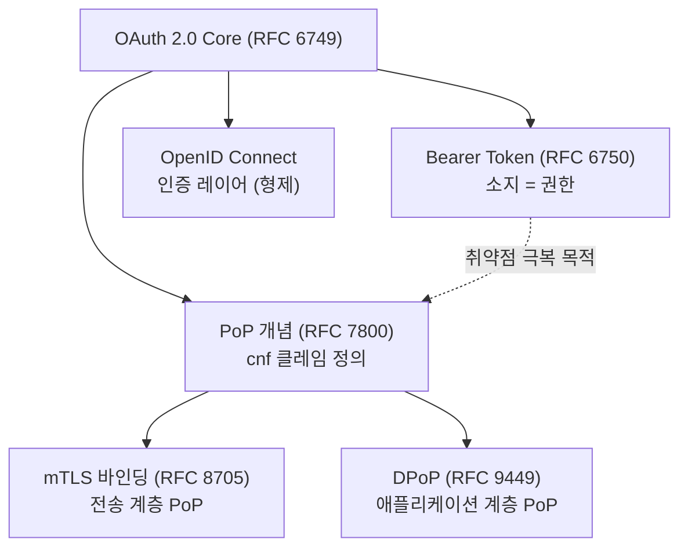
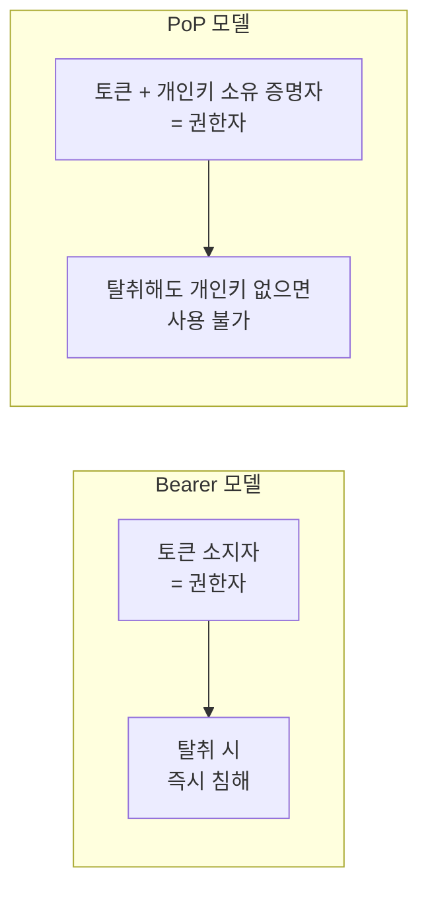
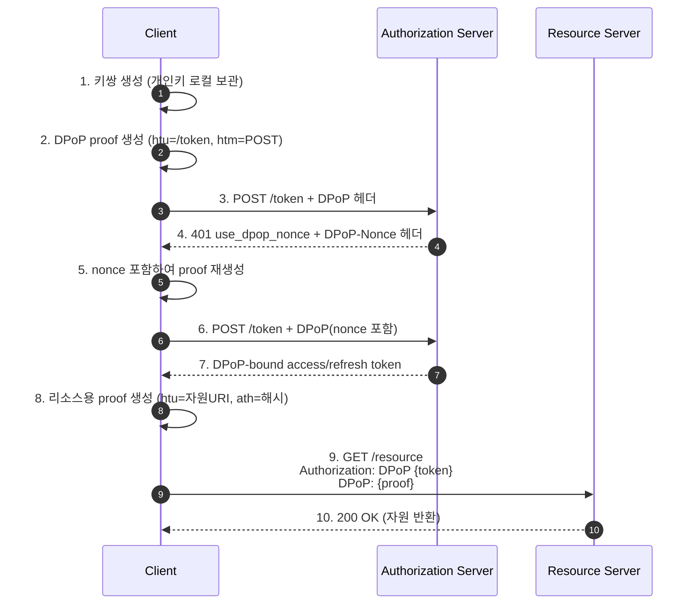
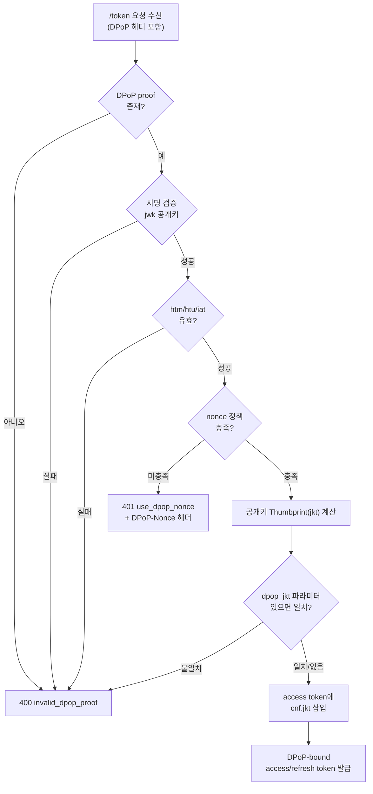
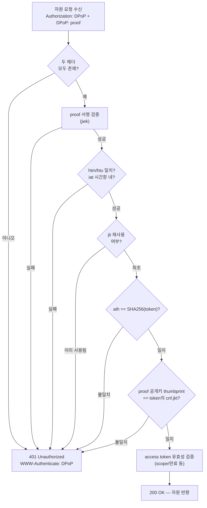
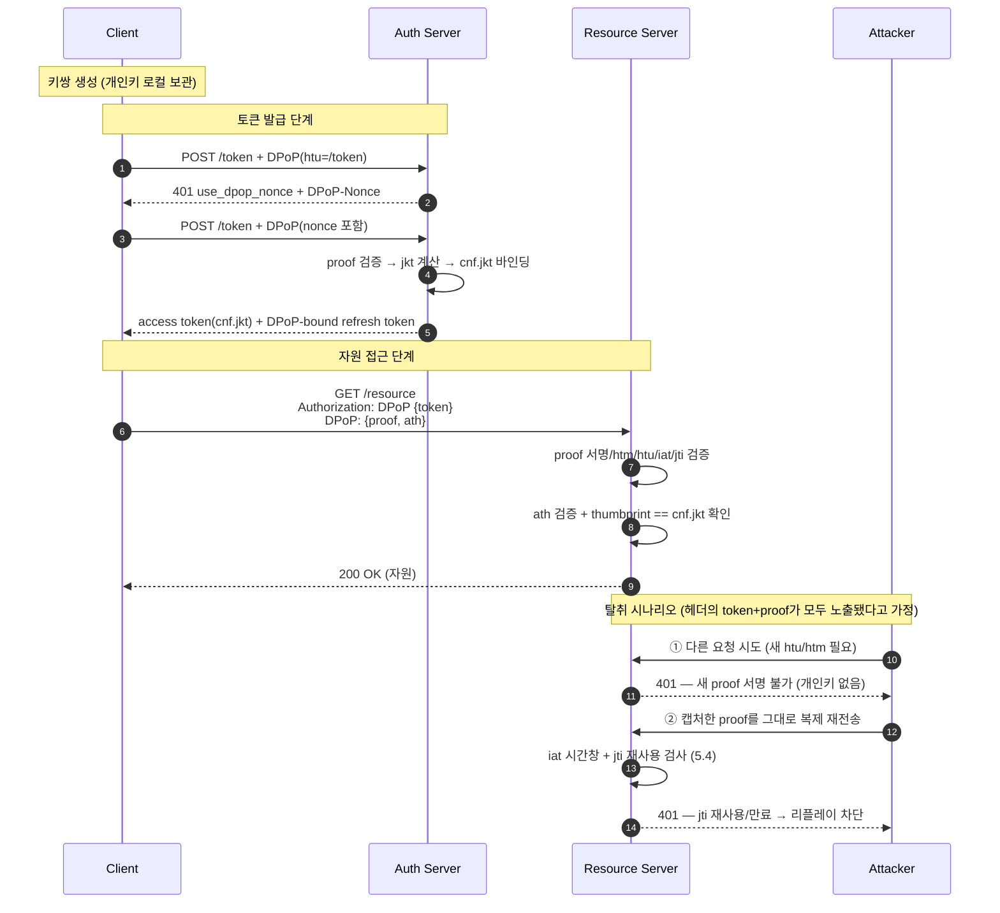

# DPoP / PoP 아키텍처

> Sender-Constrained Token — "토큰을 소지한 자"가 아니라 "키 소유를 증명한 자"만 자원에 접근하게 만드는 아키텍처

---

## 1. DPoP와 OAuth 2.0 / OIDC의 관계

DPoP의 계보는 다음과 같이 정리됩니다.

- **DPoP는 OAuth 2.0의 확장입니다.** (RFC 9449, 2023년 9월 표준화)
- **OIDC에서 파생된 확장은 아닙니다.** OIDC(OpenID Connect)는 OAuth 2.0 위에 인증(authentication) 레이어를 얹은 프로파일입니다. DPoP는 OAuth 2.0이 발급하는 access token / refresh token 자체를 키에 묶는(sender-constrain) 메커니즘이므로, OIDC와 병렬 확장(형제) 관계이며 OIDC의 하위 확장이 아닙니다.
- OIDC 흐름 안에서 DPoP를 함께 사용할 수 있습니다. OIDC가 발급하는 토큰도 결국 OAuth 2.0 토큰이기 때문입니다.



PoP는 상위 개념이고, DPoP와 mTLS는 그 구현체입니다.

---

## 2. 개요

| 용어 | 정의 |
| --- | --- |
| **PoP** (Proof-of-Possession) | 토큰을 특정 **암호 키에 바인딩**하고, 사용 시 그 키의 **소유를 증명**하도록 요구하는 개념. "sender-constrained token"과 동의어. |
| **DPoP** (Demonstrating Proof-of-Possession) | PoP를 **애플리케이션 계층(HTTP 헤더 + JWT)** 에서 구현한 표준(RFC 9449). 클라이언트가 비대칭 키쌍을 만들고, 매 요청마다 개인키로 서명한 **DPoP proof JWT**를 첨부한다. |

이 아키텍처가 겨냥하는 문제는 다음과 같습니다. Bearer 토큰(RFC 6750)은 "문자열을 가진 자가 곧 권한자"이므로, 탈취 위험을 짧은 만료 시간·refresh rotation·IP 바인딩 같은 완화책으로 줄이는 데 한계가 있습니다. PoP 아키텍처는 완화가 아니라 토큰을 암호 키에 바인딩해 탈취된 토큰 자체를 무력화합니다. RFC 9449 §2(Objectives)가 밝힌 DPoP의 1차 목표도 유출·탈취된 access token의 무단 사용 방지입니다.

---

## 3. 왜 PoP이 필요한가

Bearer 토큰(RFC 6750)은 "토큰 문자열의 소지" 자체를 권한으로 인정하기 때문에, 토큰이 한 번 유출되면 그것만으로 침해가 성립합니다. PoP은 이 "소지 = 권한" 등식을 "키 소유 증명 = 권한"으로 바꿔, 유출된 토큰을 무력화하는 아키텍처입니다.

### 3.1 Bearer 토큰의 근본 한계

Bearer 토큰의 정의 자체가 한계의 원인입니다. RFC 6750 §1은 Bearer 토큰을 "토큰을 소지한 어떤 주체든, 암호 키의 소유를 증명하지 않고도(without demonstrating possession of a cryptographic key) 연관된 자원에 접근할 수 있다"고 규정합니다. 즉 "문자열을 가진 자가 곧 권한자"이며, 이 단순함이 약점이 됩니다.

그래서 RFC 6750 §5(Security Considerations)는 Bearer 토큰을 유출로부터 반드시 보호해야 한다고 명시하고, TLS 사용·짧은 수명·안전한 저장을 요구합니다. Bearer 모델에서 보안은 "토큰을 유출시키지 않는" 예방에 의존하며, 일단 유출되면 그 토큰 자체를 무효화할 수단이 없습니다.

토큰 문자열은 다음 경로로 유출될 수 있고, 유출되는 순간 공격자와 정당한 클라이언트를 구분할 수 없습니다.

- 침해된 SPA / 악성 브라우저 확장 프로그램
- 과도한 로그 기록(access token이 로그에 기록되는 사고)
- TLS를 종단(terminate)하는 리버스 프록시·WAF·APM 구간에서의 노출
- 브라우저 저장소(localStorage) 유출, XSS

### 3.2 완화책의 한계

- **짧은 만료 시간**: 유출 창(window)을 줄일 뿐, 그 창 안에서는 방어되지 않음.
- **refresh token rotation**: refresh token 유출은 완화하나, access token 자체의 재사용은 막지 못함.
- **IP 바인딩**: 모바일·기업 프록시 환경에서 오탐이 잦고 우회도 쉬움.

### 3.3 근본 해법 — Sender-Constrained Token

토큰을 키에 바인딩하면, 토큰이 유출돼도 개인키가 없으면 사용할 수 없습니다. 그 결과 토큰 탈취만으로는 자원 접근이 불가능해집니다.

"토큰에 키를 결속한다"는 개념의 표준 기반은 RFC 7800(Proof-of-Possession Key Semantics for JWTs)이 정의한 **`cnf`(confirmation) 클레임**입니다. RFC 7800은 "이 토큰은 이 키의 소유자만 사용할 수 있다"를 토큰 안에 명시하는 표준 형식을 제공하며, 어떤 키를 어떻게 결속할지는 아래 두 표준이 구현합니다.

| 방식 | 계층 | 바인딩 수단 | 확인 클레임 |
| --- | --- | --- | --- |
| **mTLS** (RFC 8705) | 전송 계층 (TLS) | 클라이언트 인증서 | `cnf.x5t#S256` |
| **DPoP** (RFC 9449) | 애플리케이션 계층 (HTTP/JWT) | 비대칭 키쌍 + proof JWT | `cnf.jkt` |

---

## 4. 핵심 개념 — Bearer vs PoP



### 바인딩의 핵심: `cnf.jkt`

인증 서버는 토큰 발급 시 클라이언트 공개키의 **JWK Thumbprint(SHA-256 해시, RFC 7638)** 를 계산해 access token 안에 confirmation 클레임(`cnf.jkt`, RFC 9449 §6)으로 심습니다.

```json
{
  "sub": "user@example.com",
  "scope": "read:resource",
  "cnf": {
    "jkt": "2HR2BW5-tan1aI6yIPHVOHwirAy4kQGWULoQHKUO0s4"
  }
}
```

리소스 서버는 요청에 실려온 DPoP proof의 공개키로 thumbprint를 다시 계산해, 토큰 안 `cnf.jkt`와 일치하는지 확인합니다. 이 일치 확인이 "토큰을 해당 키의 소유자만 사용할 수 있다"는 보증을 제공합니다.

---

## 5. 세 관점의 아키텍처

DPoP 흐름에는 세 주체가 있습니다. 각 주체의 책임과 동작을 개별 다이어그램으로 정리합니다.

### 5.1 클라이언트(Client) 관점

**책임**

1. **비대칭 키쌍 생성 및 보관** — 개인키는 전송하지 않고 디바이스/메모리에 보관 (통상 EC P-256 / ES256).
2. **DPoP proof JWT 생성** — 매 요청마다 개인키로 서명.
3. `/token` 요청과 리소스 요청 각각에 `DPoP` 헤더 첨부.
4. **nonce 핸드셰이크** 처리 (서버가 요구할 경우).

**DPoP proof JWT 구조** (RFC 9449 §4.2)

```jsonc
// Header
{
  "typ": "dpop+jwt",        // 고정
  "alg": "ES256",           // 서명 알고리즘
  "jwk": { /* 공개키 (JWK) — 개인키는 절대 포함 금지 */ }
}
// Payload
{
  "jti": "XdPQLwZIH9pmlMhD",              // 고유 ID (replay 방지, 96bit+ 랜덤 또는 UUIDv4)
  "htm": "POST",                          // 요청 HTTP 메서드
  "htu": "https://as.example.com/token",  // 요청 URI (query/fragment 제외)
  "iat": 1755096729,                      // 생성 시각
  "ath": "-7JjHPHFqtqwNHk7dPoU4nL7SgIgLn8vdCiDq-LfovY",  // (리소스 요청 시) access token의 SHA-256 해시
  "nonce": "ZgmFr7UWLrJX0fHB"             // (서버 요구 시) 서버 제공 nonce
}
```

> `ath`는 리소스 서버에 access token을 제시할 때만 포함합니다. `/token` 요청 단계에는 아직 access token이 없으므로 넣지 않습니다.

**흐름**



---

### 5.2 인증 서버(Authorization Server) 관점

**책임**

1. `/token` 요청의 **DPoP proof 검증** (서명, `htm`/`htu`/`iat`/`jti`).
2. proof 공개키의 **thumbprint(`jkt`) 계산 → access token에 `cnf.jkt` 바인딩**.
3. public client에는 **DPoP-bound refresh token** 발급 (refresh token도 sender-constrained).
4. **nonce 발급** — 필요 시 `use_dpop_nonce` 오류와 `DPoP-Nonce` 헤더 반환.
5. (선택) **`dpop_jkt` 인가 요청 파라미터**로 인가 코드 단계부터 바인딩(End-to-End binding).

**검증/발급 로직**



---

### 5.3 리소스 서버(Resource Server) 관점

**책임**

1. `Authorization: DPoP {token}` 스킴 파싱 + `DPoP: {proof}` 헤더 파싱 (Bearer 아님).
2. proof **서명 검증** (헤더의 `jwk` 공개키로).
3. `htm`/`htu`/`iat`/`jti` 검증 + **`ath` = SHA-256(access token)** 일치 확인.
4. **핵심 바인딩 검증**: proof의 공개키 thumbprint == access token의 `cnf.jkt`.
5. **`jti` 재사용 추적** — replay 방지 (본 값 저장, 재사용 거부).
6. (선택) nonce 요구 시 `WWW-Authenticate: DPoP error="use_dpop_nonce"` 반환.

**검증 파이프라인**



> 핵심 단계는 G입니다. 요청에 실린 키와 토큰에 바인딩된 키 지문이 일치해야, 이 요청이 토큰의 정당한 소유자에게서 왔음이 확인됩니다.

### 5.4 리소스 서버의 리플레이 방어 로직

앞의 검증(서명·`cnf.jkt` 바인딩·`ath`)은 "이 요청을 개인키 소유자가 만들었나"를 증명할 뿐, "이미 한 번 쓴 proof를 그대로 복제해 다시 보낸 것"(리플레이)은 막지 못합니다. 공격자가 HTTP 헤더(`Authorization` + `DPoP`)를 통째로 캡처해 동일한 요청을 재전송하면 서명·바인딩·`ath` 검증은 모두 통과하기 때문입니다.

> `ath`는 proof를 특정 access token에 묶을 뿐 재사용을 막지 못합니다. 리플레이 방어는 반드시 아래의 `iat` 시간창 + `jti` 유일성(+ `htm`/`htu` 결속)까지 함께 검증해야 성립합니다.

리플레이를 실제로 막는 주체는 리소스 서버(검증자)입니다. `jti`·`nonce`는 proof 안의 데이터일 뿐, 리소스 서버가 아래 로직을 직접 구현하지 않으면 리플레이는 방어되지 않습니다. 클라이언트나 인증 서버가 대신 수행할 수 없습니다.

**2단 방어 — `iat` 시간창 + `jti` 유일성**

| 단계 | 무엇을 하나 | 막는 것 |
| --- | --- | --- |
| ① `iat` 시간창 | proof의 `iat`가 `now ± 허용오차`(예: 수십 초~수 분) 밖이면 거부 | 오래된 proof 재사용, `jti` 저장소 크기 제한 |
| ② `jti` 유일성 | 시간창 안에서 이미 본 `jti`를 저장하고, 재등장하면 거부 | 시간창 안에서의 복제 리플레이 |

```text
# 리소스 서버가 매 요청마다 실행하는 리플레이 방어 로직 (의사코드)
WINDOW = 60s                                   # iat 허용 시간창

if abs(now() - proof.iat) > WINDOW:            # ① 시간창 밖 → 만료
    reject("stale proof")

key = "dpop:jti:" + proof.jti
if store.exists(key):                          # ② 이미 본 jti → 리플레이
    reject("replayed jti")
store.setex(key, WINDOW, seen=1)               # 시간창 동안만 저장 (TTL = WINDOW)
# → 통과. 이 proof는 '사용됨'으로 기록되어 재사용 불가
```

두 검사를 함께 쓰는 이유는 다음과 같습니다. `jti`만 영구 저장하면 저장소가 무한히 커지고, 시간창만 있으면 창 안에서의 복제를 막지 못합니다. 둘을 결합하면 `jti`를 시간창 동안만 저장하면 충분합니다 — 창을 지난 복제 proof는 ①의 `iat` 검사에서 먼저 탈락하기 때문입니다.

**서버 nonce(선택) — 신선도 통제 강화.** `iat`는 클라이언트가 값을 자유롭게 정할 수 있어 서버가 시간을 통제하지 못합니다. 리소스 서버(또는 AS)가 `DPoP-Nonce`를 발급하고(`WWW-Authenticate: DPoP error="use_dpop_nonce"`) proof에 그 `nonce` 포함을 강제하면, 유효 창을 서버가 직접 통제할 수 있습니다. 이 DPoP 서버 nonce는 유사한 이름의 다른 값들과 달리 "서버가 값을 던지는" 챌린지-응답에 해당하며, 스펙 간 비교는 [9. 심화 개념](#9-심화-개념--인증-스펙별-챌린지논스nonce의-역할-비교)에서 다룹니다.

---

## 6. 통합 End-to-End 시퀀스



---

## 7. 언제 이 아키텍처를 선택하는가

### 7.1 선택 의사결정표

| 상황 | 권장 방식 | 이유 |
| --- | --- | --- |
| 내부 서버 간 통신, 인증서 인프라 이미 보유 | **mTLS** | 전송 계층 바인딩이 가장 강력, 이미 PKI 운영 중이면 추가 비용 적음 |
| SPA · 모바일 · public client | **DPoP** | 시크릿/인증서 안전 저장 불가한 환경. 헤더 기반이라 배포 간단 |
| 오픈뱅킹 · FAPI 2.0 · 고위험 금융 API | **DPoP 또는 mTLS (필수)** | 규제상 sender-constrained token 요구 |
| 저위험 1st-party API, 짧은 세션 | **Bearer로 충분** | PoP 오버헤드가 이득보다 클 수 있음 |
| TLS 종단 프록시/WAF/APM 구간이 많은 아키텍처 | **DPoP** | 전송 계층이 여러 번 끊겨도 애플리케이션 계층 바인딩은 유지 |

### 7.2 대표 적용 사례

- **FAPI 2.0 (Financial-grade API)** — DPoP를 sender-constraining 표준 옵션으로 채택.
- **오픈뱅킹 / PSD2** — 토큰 탈취 리스크가 곧 금전 손실이므로 PoP 사실상 필수.
- **SPA / 모바일 앱** — 클라이언트 시크릿을 안전하게 저장할 수 없는(public client) 한계를 DPoP로 보완.

### 7.3 DPoP vs mTLS 선택의 핵심

- **mTLS**: 보안 수준이 가장 높으나 인증서 발급·갱신·edge 종단·TLS 재협상 등 인프라가 무겁고, public client(SPA/모바일)에는 적용 불가.
- **DPoP**: mTLS에 준하는 보증을 Bearer 수준의 배포 간편함으로 달성. 대신 애플리케이션 계층 검증 로직을 각 서버가 구현해야 함.

---

## 8. 장단점

### 8.1 장점

- **토큰 탈취 무력화** — 개인키 없이는 재사용 불가. 유출된 토큰만으로는 자원 접근 불가.
- **Replay 방어 다층화** — `jti`(중복 거부) + `iat`(시간창) + `nonce`(서버 통제) + `htm`/`htu`(요청 결속).
- **public client 지원** — 시크릿/인증서 저장이 불가능한 SPA·모바일에 적용 가능.
- **인프라 경량** — mTLS 대비 PKI·인증서 관리 불필요, HTTP 헤더만으로 동작.
- **refresh token까지 보호** — public client의 refresh token도 sender-constrained.

### 8.2 단점 / 운영 고려사항

- **구현 복잡도 증가** — 클라이언트는 키 관리 + proof 생성, 서버는 검증 파이프라인을 모두 구현해야 함.
- **nonce 핸드셰이크** — 첫 요청이 401로 반려되고 재시도하는 왕복이 발생. `nonce` 만료 시 전용 오류 코드가 표준에 없어 클라이언트가 원인 판별이 까다로움.
- **`jti` 저장소 부담과 분산 환경** — replay 방지를 위해 리소스 서버가 사용된 `jti`를 시간창(TTL) 동안 추적해야 함(해시 저장 권장). 특히 리소스 서버가 여러 인스턴스로 확장되면 인스턴스별 로컬 메모리로는 부족하며, Redis 등 **중앙 공유 저장소가 사실상 강제**됨. 로컬에만 저장하면 인스턴스 A에서 쓴 `jti`를 B가 몰라, 같은 요청을 B로 재전송하면 리플레이가 통과함. DPoP 검증의 대부분(서명·`cnf.jkt` 매칭)은 무상태 CPU 연산이지만, `jti` 재사용 방지만은 이 공유된 단기 상태를 요구함 — 무상태 검증의 유일한 예외.
- **클럭 스큐(clock skew)** — `iat` 시간창 검증 때문에 서버 간 시계 동기화가 중요.
- **키 저장 문제** — 브라우저는 non-extractable `CryptoKey`(WebCrypto/IndexedDB), 모바일은 Secure Enclave/Keystore 등 개인키 안전 보관 전략이 필수.

---

## 9. 심화 개념 — 인증 스펙별 챌린지/논스(Nonce)의 역할 비교

DPoP 생태계에는 이름이 비슷한 세 값 — OIDC `nonce`, PKCE `code_challenge`, DPoP `nonce` — 이 있어 혼동하기 쉽습니다. 세 값은 **생성 주체**와 **목적**이 서로 다르며, "서버가 값을 던지는" 진짜 챌린지-응답에 해당하는 것은 DPoP `nonce`뿐입니다.

| 값 | 소속 | 생성 주체 | 진짜 "서버 챌린지"? | 목적 |
| --- | --- | --- | --- | --- |
| OIDC `nonce` | OIDC | **클라이언트** 생성 → OP가 ID Token에 반향 | ❌ | ID Token을 세션에 결속(replay·주입 방지) |
| PKCE `code_challenge` | OAuth/OIDC | **클라이언트** 생성(`SHA256(verifier)`) | ❌ | 인가 코드를 시작 주체에 결속 |
| **DPoP `nonce`** | DPoP | **서버(AS/RS)** 생성 → 클라이언트가 proof에 포함 | ✅ | proof 신선도를 서버가 통제 |

> DPoP 서버 nonce는 이름은 "nonce"지만 스펙상 클라이언트가 여러 번 재사용할 수 있는 "시간창 토큰"에 가깝습니다. 엄밀한 일회성 replay 차단은 `jti`(5.4)가, 유효 창 통제는 nonce가 담당합니다. OIDC의 `nonce`와는 생성 주체가 정반대입니다(→ [OIDC 아키텍처](oidc-architecture.md) 5.2 참조).

---

## 10. 요약

- **PoP**는 "소지가 아니라 소유 증명"을 요구하는 상위 개념(표준 형식은 RFC 7800의 `cnf` 클레임)이고, **DPoP(RFC 9449)** 는 이를 HTTP 헤더 + JWT로 구현한 애플리케이션 계층 아키텍처입니다.
- DPoP는 **OAuth 2.0의 확장**이며, OIDC와는 **형제 관계(병렬)** 입니다 — OIDC에서 파생된 것이 아닙니다.
- 세 주체의 역할: **클라이언트**(키 보관 + proof 서명), **인증 서버**(proof 검증 + `cnf.jkt` 바인딩), **리소스 서버**(proof 검증 + `thumbprint == cnf.jkt` 확인 + 리플레이 방어).
- **SPA·모바일·public client·고위험 금융 API**에서 Bearer의 탈취 위험을 근본적으로 제거하려 할 때 선택합니다.
- 트레이드오프: 강력한 보안 대비 **구현 복잡도 · nonce 왕복 · `jti` 저장소(분산 환경 공유) · 클럭 동기화** 부담.

---

## 참고 자료

- [RFC 9449 — OAuth 2.0 Demonstrating Proof of Possession (DPoP)](https://datatracker.ietf.org/doc/html/rfc9449)
- [RFC 8705 — OAuth 2.0 Mutual-TLS Client Authentication and Certificate-Bound Access Tokens](https://datatracker.ietf.org/doc/html/rfc8705)
- [RFC 7800 — Proof-of-Possession Key Semantics for JWTs (cnf 클레임)](https://datatracker.ietf.org/doc/html/rfc7800)
- [RFC 7638 — JSON Web Key (JWK) Thumbprint](https://datatracker.ietf.org/doc/html/rfc7638)
- [RFC 6750 — OAuth 2.0 Bearer Token Usage](https://datatracker.ietf.org/doc/html/rfc6750)
- [RFC 6749 — The OAuth 2.0 Authorization Framework](https://datatracker.ietf.org/doc/html/rfc6749)
- [DPoP (RFC 9449) explained — WorkOS](https://workos.com/blog/dpop-rfc-9449-explained)
- [Demonstrating Proof-of-Possession (DPoP) — Auth0 Docs](https://auth0.com/docs/secure/sender-constraining/demonstrating-proof-of-possession-dpop)
- [Illustrated DPoP — Takahiko Kawasaki (Medium)](https://darutk.medium.com/illustrated-dpop-oauth-access-token-security-enhancement-801680d761ff)
```
