# OpenID Connect(OIDC) 아키텍처

> OAuth 2.0의 "인가"에서 출발해 "인증"의 표준까지 — 배경·개념·플로우·검증·위협·로그아웃·실무 아키텍처를 한 문서에서

---

## 이 문서에 대하여

이 문서는 OIDC 기반 인증 아키텍처를 설계·리뷰할 때 고려해야 할 핵심 개념, 보안 위협, 실무 적용 가이드를 한 곳에 정리한 레퍼런스입니다. 각 설계 결정에 대해 "무엇을 막고 어떤 트레이드오프를 감수하는가"를 원리 수준에서 설명합니다.

**대상 독자**: OAuth/OIDC를 실무에 적용하는 백엔드·프론트엔드 개발자, 인증 아키텍처를 리뷰하는 담당자.

**함께 보면 좋은 문서**: 토큰 탈취를 근본적으로 무력화하는 sender-constrained token은 별도 문서 [`dpop-pop-architecture.md`](dpop-pop-architecture.md)에서 상세히 다룹니다. 이 문서에서는 7부에서 연결점을 짚습니다.

### 목차

- [1부. 배경과 개념 — 왜 OIDC가 필요했는가](#1부-배경과-개념--왜-oidc가-필요했는가)
- [2부. 핵심 구성요소 — OP·RP·토큰·클레임·디스커버리](#2부-핵심-구성요소--oprp토큰클레임디스커버리)
- [3부. 인증 플로우 — Authorization Code · PKCE · Hybrid](#3부-인증-플로우--authorization-code--pkce--hybrid)
- [4부. ID Token 서명 검증 — 신뢰의 기술적 근거](#4부-id-token-서명-검증--신뢰의-기술적-근거)
- [5부. 위협 모델과 방어 메커니즘](#5부-위협-모델과-방어-메커니즘)
- [6부. 세션 라이프사이클과 로그아웃](#6부-세션-라이프사이클과-로그아웃)
- [7부. 실무 아키텍처와 안티패턴](#7부-실무-아키텍처와-안티패턴)
- [종합 정리 — 코드 리뷰 체크포인트](#종합-정리--코드-리뷰-체크포인트)
- [참고 자료](#참고-자료)

---

# 1부. 배경과 개념 — 왜 OIDC가 필요했는가

## 1.1 인증과 인가는 다른 질문에 답한다

이 문서 전체의 토대가 되는 구분입니다.

| 구분 | 인증(Authentication) | 인가(Authorization) |
| --- | --- | --- |
| 답하는 질문 | "당신은 **누구**입니까?" | "당신은 **무엇을 할 수 있습니까**?" |
| 관심 대상 | 주체(사용자)의 신원(identity) | 자원(resource)에 대한 접근 권한 |
| 결과물 | 신원의 증명 | 접근 권한의 위임 |
| 비유 | 신분증 확인 | 출입증(특정 층·특정 시간만 유효) 발급 |

로그인은 본질적으로 **인증**의 문제입니다("이 사람이 정말 홍길동인가"). 반면 "이 앱이 홍길동의 드라이브 파일을 읽어도 되는가"는 **인가**의 문제입니다. 이 둘을 혼동한 위에 시스템을 쌓으면 심각한 취약점이 생깁니다.

## 1.2 OAuth 2.0은 애초에 인가 위임 프로토콜이다

OAuth 2.0(RFC 6749)의 존재 이유는 "권한 위임(delegated access)"이지 "신원 증명"이 아닙니다. OAuth 이전에는 어떤 앱이 사용자의 구글 포토에 접근하려면 사용자가 구글 비밀번호를 그 앱에 직접 넘겨야 했습니다. 이는 두 문제를 낳습니다.

1. 앱이 사용자의 전체 계정 권한을 갖는다(사진뿐 아니라 메일·결제까지).
2. 접근을 개별 철회할 수 없다(한 앱을 끊으려면 비밀번호를 바꿔야 하고, 그러면 모든 앱이 끊긴다).

OAuth는 **자원 소유자(resource owner)와 클라이언트(client)의 역할을 분리**하고, 비밀번호 대신 **접근 토큰(access token)**을 발급해 이 문제를 풀었습니다. 접근 토큰은 범위(scope)·수명(lifetime)이 한정되고 개별 철회가 가능합니다.

## 1.3 개발자들이 OAuth를 인증에 오용하다 — 의사 인증

문제는 OAuth 흐름 끝에서 사용자가 로그인을 하고 그 결과로 access token이 나온다는 점입니다. 많은 개발자가 이렇게 추론했습니다.

> "access token을 받았다 = 사용자가 로그인에 성공했다. 그러니 이 토큰으로 프로필 API를 호출해 사용자 ID를 얻고, 그걸로 로그인을 처리하자."

이것이 **의사 인증(pseudo-authentication)**입니다. OAuth의 부품(로그인 화면·토큰)을 썼다는 이유로 인증이 완성됐다고 착각하는 것으로, 단순히 부정확한 게 아니라 위험합니다.

## 1.4 왜 access token은 인증의 증거가 될 수 없는가

- **불투명성(opaque)**: OAuth 2.0에서 access token은 설계상 클라이언트에게 불투명합니다. RFC 6749는 형식조차 규정하지 않습니다. 토큰을 손에 쥐었다는 사실 자체는 클라이언트에게 아무것도 증명하지 않습니다.
- **청중 불일치(audience mismatch)**: access token의 의도된 수신자는 **자원 서버**이지 클라이언트가 아닙니다. 클라이언트는 "인가된 제시자"일 뿐 "의도된 대상"이 아닙니다.

### 혼동된 대리자(Confused Deputy) 문제

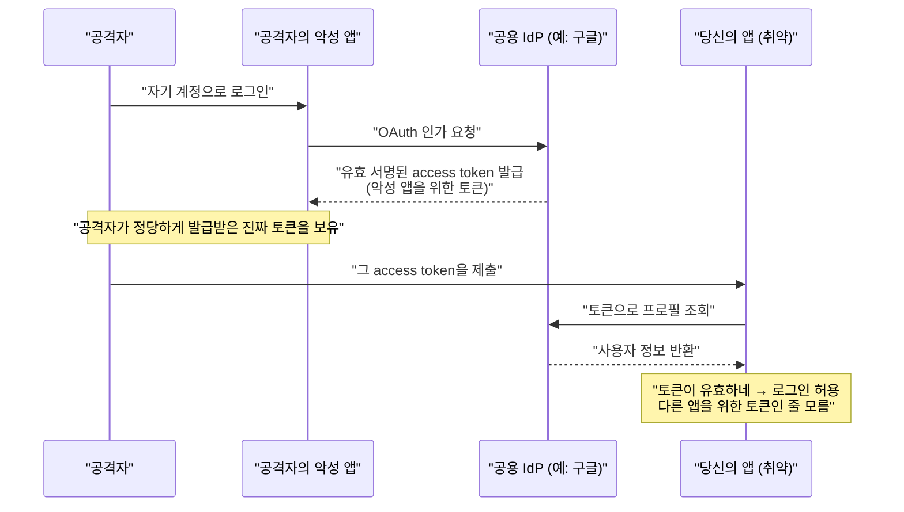

토큰은 위조된 게 아니라 진짜이므로 **서명 검증만으로는 이 공격을 막지 못합니다.** 문제는 그 토큰이 "당신의 앱을 대상으로 발급된 것이 아님"을 확인하지 않은 데 있습니다.

## 1.5 OIDC가 메운 공백

OpenID Connect는 OAuth 2.0을 대체하지 않고, 그 위에 **얇은 인증 계층(identity layer)을 표준으로 얹은 상위 집합(superset)**입니다. 핵심 기여는 둘입니다.

1. **ID Token 도입** — access token과 별개로 "누가 언제 어떻게 인증했는가"를 담은, 클라이언트가 직접 읽고 검증하도록 설계된 토큰.
2. **청중(aud) 검증의 표준화** — ID Token의 `aud`는 반드시 클라이언트 자신의 `client_id`를 포함해야 하고, 클라이언트는 이를 반드시 검증해야 함. 이 규칙이 §1.4의 혼동된 대리자 문제를 원천 차단합니다.

> **한 줄 결론**: 인증과 인가를 모두 지원하는 표준은 OIDC이고, OAuth 2.0은 인가만을 위한 것입니다. 로그인이 필요하면 OAuth 위에 OIDC를 얹어야 합니다.

## 1.6 표준 계보

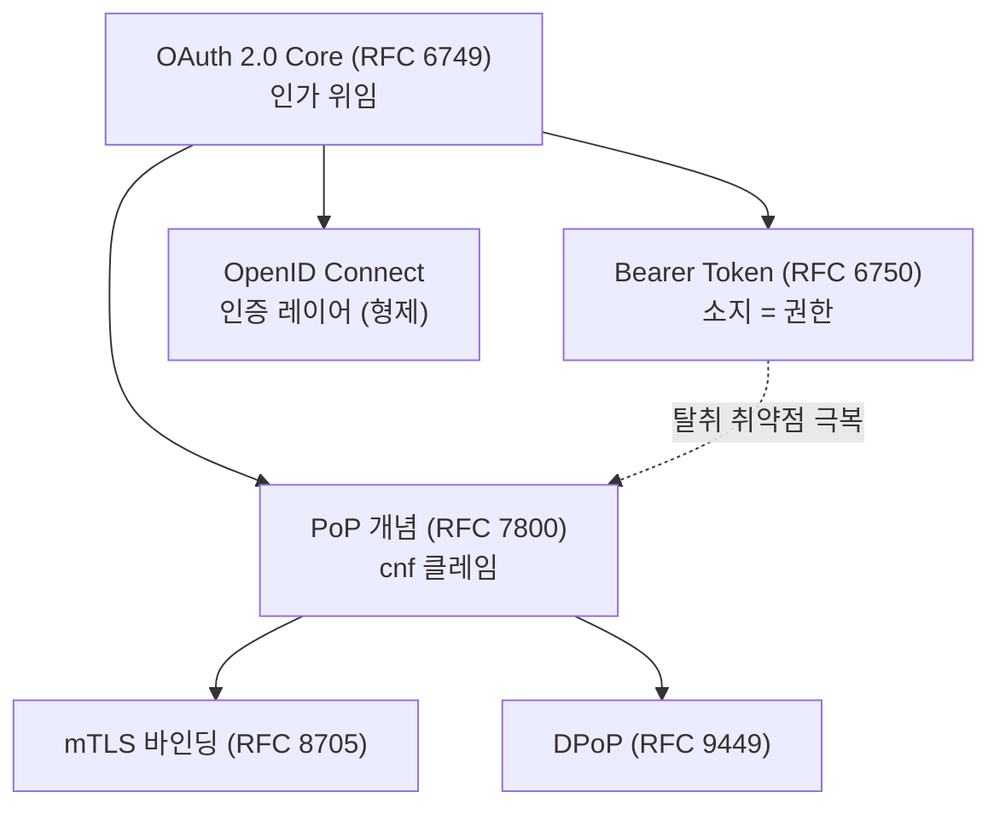

OIDC는 OAuth의 **하위 확장이 아니라 형제(병렬 확장)**입니다. sender-constrained token(DPoP/mTLS) 역시 OAuth의 별도 확장으로, OIDC 흐름과 **결합**해 쓸 수 있습니다(→ 7부, DPoP 문서).

---

# 2부. 핵심 구성요소 — OP·RP·토큰·클레임·디스커버리

## 2.1 핵심 주체: OP와 RP

OIDC는 OAuth의 역할 모델을 상속하며 인증 관점의 이름을 부여합니다.

| OAuth 2.0 역할 | OIDC에서의 이름 | 설명 |
| --- | --- | --- |
| Authorization Server (인가 서버) | **OpenID Provider (OP)** | 사용자를 인증하고 ID Token 포함 토큰 발급 (구글, Entra ID, Okta, Keycloak 등) |
| Client (클라이언트) | **Relying Party (RP)** | OP의 인증 결과에 "의존(rely)"하는 애플리케이션 (여러분의 앱) |
| Resource Owner (자원 소유자) | **End-User (최종 사용자)** | 인증 대상이 되는 사람 |
| Resource Server (자원 서버) | Resource Server | access token으로 보호되는 API. OIDC에서는 **UserInfo 엔드포인트**가 대표적 |

## 2.2 토큰의 형식: JWT · JWS · JWE · JWK

ID Token은 JWT라고 했습니다. 그런데 **JWT · JWS · JWE · JWK**는 실무에서 자주 혼용되지만 **층위가 다른 개념**입니다. ID Token의 서명 검증(4부)을 제대로 이해하려면 이 형식 계보를 먼저 세워야 합니다.

| 용어 | 정체 | 한마디 |
| --- | --- | --- |
| **JWT** | 클레임을 담는 **컨테이너/형식**(상위 개념) | "그릇" — 그 자체로는 서명·암호화를 안 하며 **반드시 JWS나 JWE로 실체화** |
| **JWS** | **서명** 구조 (3부분) | "봉인 스티커" — 위변조 방지·진위, 내용은 **공개** |
| **JWE** | **암호화** 구조 (5부분) | "금고" — 기밀성 |
| **JWK / JWKS** | 키를 JSON으로 표현한 규격 / 그 묶음 | "열쇠 / 열쇠 꾸러미" — 검증에 쓰는 공개키 |

> **흔한 오해**: "JWT = JWS"가 아닙니다. JWT라는 형식이 먼저 있고, 그것을 *서명만 하면* JWS, *암호화하면* JWE입니다. OIDC의 ID Token은 거의 항상 **JWS로 서명된 JWT**입니다.

### 직렬화: 점(`.`)으로 이어붙인 단일 문자열

JWT은 각 파트를 JSON으로 만든 뒤 **Base64URL로 인코딩하고 점(`.`)으로 이어붙인 하나의 문자열**로 전달됩니다. JWS는 3부분(점 2개)입니다.

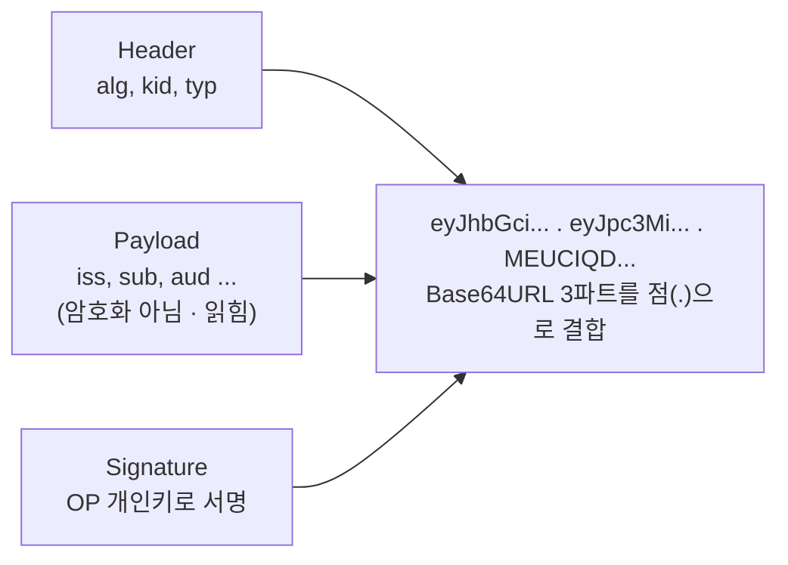

- **Header**: 서명 알고리즘(`alg`, 예: RS256), 키 식별자(`kid`).
- **Payload**: 클레임(iss, sub, aud 등).
- **Signature**: OP 개인키 서명. RP는 OP 공개키(JWK)로 위·변조 및 발급자를 검증.

### Payload는 "숨겨지지" 않는다 — 인코딩 ≠ 암호화

가장 중요한 점: **Base64URL은 인코딩일 뿐 암호화가 아닙니다.** ID Token의 Payload(클레임)는 누구나 디코딩해 읽을 수 있습니다. `eyJ...`로 보여 암호화된 듯하지만 착각입니다. 그래서 JWS 서명의 목적은 내용을 숨기는 것이 아니라 **"위변조 여부"와 "발급자 진위"를 증명**하는 것입니다. → **ID Token에 비밀번호 같은 기밀 정보를 담으면 안 되는 이유**이며, 내용을 정말 숨겨야 하면 JWE로 감싸야 합니다(OIDC에서는 드묾).

### 검증에 쓰는 키: JWK / JWKS

RP가 서명을 검증하려면 OP의 **공개키**가 필요합니다. 이 공개키를 JSON으로 표현한 것이 **JWK**, 여러 개를 배열로 묶은 것이 **JWKS**(키 롤오버용)입니다. OP는 이를 `jwks_uri`(→ 2.6)로 공개하고, RP는 토큰 Header의 `kid`로 맞는 키를 골라 검증합니다(상세 메커니즘은 [4부](#4부-id-token-서명-검증--신뢰의-기술적-근거)).

## 2.3 ID Token: OIDC의 심장

**ID Token**은 "최종 사용자의 인증 이벤트에 관한 클레임을 담은 보안 토큰", 즉 **OP가 발급한 서명된 디지털 신분증**입니다. 결정적 특성은 **클라이언트(RP)가 직접 읽고 검증하도록 설계**되었다는 점입니다(불투명한 access token과의 차이). 형식은 2.2에서 본 대로 **JWS로 서명된 JWT**입니다.

### 표준 클레임

`iss`, `sub`, `aud`, `exp`, `iat`는 **필수(REQUIRED)**입니다.

| 클레임 | 의미와 검증 포인트 |
| --- | --- |
| `iss` (발급자) | 토큰을 발급한 OP 식별자. OIDC는 `https://`로 시작하고 쿼리·프래그먼트 없는 URL이어야 하며, Discovery의 issuer와 **정확히 일치**해야 함 |
| `sub` (주체) | 발급자 내에서 사용자를 가리키는 **고유·불변** 식별자(최대 255 ASCII). **로그인 식별 기준은 이메일이 아니라 sub** |
| `aud` (청중) | 이 토큰의 의도된 수신자. **반드시 RP의 `client_id` 포함**. 없으면 거부 (혼동된 대리자 방어의 핵심) |
| `exp` (만료) | 이 시각 이후 거부. 클럭 스큐(clock skew) 몇 분만 허용 |
| `iat` (발급 시각) | 발급 시점. 오래된 토큰 거부·nonce 보관 기간 제한에 활용 |
| `auth_time` (인증 시각) | 사용자가 실제 인증한 시각. `max_age` 요청 시 필수. 재인증 정책에 사용 |
| `nonce` | 클라이언트 세션과 ID Token 결속 → 재전송 공격(replay) 방지. 요청의 nonce를 OP가 그대로 담아 반환, RP가 대조 |
| `azp` (인가된 당사자) | 토큰이 발급된 client_id. aud가 여러 값이거나 단일 값이 인가 당사자와 다를 때 필요 |
| `at_hash` | access_token 해시의 앞 절반(Base64URL). 프런트채널로 함께 온 access token의 치환 방지 |

```json
{
  "iss": "https://accounts.google.com",
  "sub": "24400320",
  "aud": "s6BhdRkqt3",
  "exp": 1311281970,
  "iat": 1311280970,
  "auth_time": 1311280969,
  "nonce": "n-0S6_WzA2Mj",
  "azp": "s6BhdRkqt3"
}
```

> **검증 원칙**: 서명 검증만으로 충분하지 않습니다. `iss` 일치, `aud`에 자신의 client_id 포함, `exp` 미만료, (요청 시) `nonce` 일치를 **모두** 확인해야 합니다. 상세 체크리스트는 [4부](#43-id-token-검증-전체-체크리스트)에서 다룹니다.

## 2.4 세 가지 토큰의 목적 차이 (가장 흔한 혼동)

| 구분 | ID Token | Access Token | Refresh Token |
| --- | --- | --- | --- |
| 소속 표준 | OIDC | OAuth 2.0 | OAuth 2.0 |
| 답하는 질문 | "사용자는 누구인가?" (인증) | "무엇에 접근 가능한가?" (인가) | "새 토큰 재발급 가능한가?" |
| 의도된 수신자 | **RP(클라이언트)** | **자원 서버(API)** | 인가 서버(OP) |
| 형식 | 항상 JWT(서명 필수) | 규정 없음(불투명 또는 JWT) | 보통 불투명 |
| 클라이언트가 내용을 읽나? | **예** | **아니오** | 아니오 |
| API에 실어 보내나? | **아니오** | **예**(`Authorization: Bearer`) | 아니오(토큰 엔드포인트에만) |

이 표에서 가장 자주 어긋나는 지점은 **의도된 수신자(`aud`)**입니다 — ID Token은 RP가, Access Token은 API가 읽도록 설계됐습니다. 이 혼동에서 비롯되는 대표 안티패턴(ID Token으로 API 접근, Access Token으로 로그인 구현)은 [7.4 흔한 안티패턴과 오해](#74-흔한-안티패턴과-오해)에서 종합해 다룹니다.

## 2.5 클레임(Claims)과 스코프(Scopes)

**클레임**은 사용자 정보 조각(이름·이메일·식별자), **스코프**는 그 묶음을 요청하는 약칭입니다. 스코프는 "문(gate)", 클레임은 "내용물(payload)"입니다.

| 스코프 | 반환되는 대표 클레임 |
| --- | --- |
| `openid` (**필수**) | 이 값이 있어야 OIDC 요청. 최소 `sub` 반환. **openid 없으면 OIDC가 아님** |
| `profile` | `name`, `given_name`, `family_name`, `picture`, `locale`, `updated_at` 등 |
| `email` | `email`, `email_verified` |
| `address` | `address`(구조화 JSON) |
| `phone` | `phone_number`, `phone_number_verified` |
| `offline_access` | 클레임이 아니라 **Refresh Token 발급**을 요청 |

**클레임 전달 위치**(Core §5.4): access token이 발급되면 클레임은 **UserInfo 엔드포인트**에서, 발급되지 않으면 **ID Token 안에** 담깁니다. 이 설계로 프런트채널 ID Token을 가볍게 유지합니다.

### UserInfo 엔드포인트

access token으로 접근하는 OAuth 보호 자원입니다.

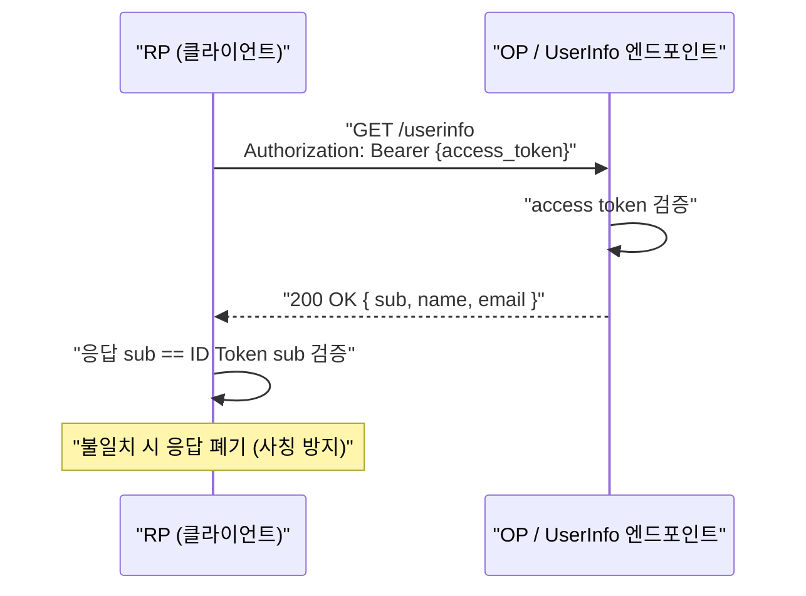

핵심: **UserInfo 응답의 `sub`는 ID Token의 `sub`와 정확히 일치**해야 합니다. 또한 클레임 제공은 OP·사용자 동의에 따라 거부될 수 있으므로, RP는 요청한 클레임이 항상 온다고 가정하면 안 됩니다.

## 2.6 디스커버리(Discovery)와 메타데이터

### /.well-known/openid-configuration

OP는 issuer에 `/.well-known/openid-configuration`을 붙인 경로에 JSON 설정 문서(OP의 "자기소개서")를 제공합니다.

| 필드 | 의미 |
| --- | --- |
| `issuer` | OP 정규 issuer URL. ID Token `iss`와 정확히 일치 |
| `authorization_endpoint` | 인가 요청 엔드포인트 |
| `token_endpoint` | 토큰 교환·발급 엔드포인트 |
| `jwks_uri` | OP 공개키(JWKS) 위치 |
| `response_types_supported` | 지원 response_type |
| `id_token_signing_alg_values_supported` | ID Token 서명 알고리즘(예: RS256) |

> **보안 주의**: 공격자가 피해 OP의 issuer는 그대로 두고 엔드포인트·키만 자기 것으로 바꾼 위조 Discovery로 사칭할 수 있습니다. RP는 **설정 요청 issuer URL == 메타데이터 `issuer` == ID Token `iss`**가 모두 일치함을 검증하고, 모든 통신을 TLS로 해야 합니다.

### JWKS 엔드포인트와 무중단 키 롤오버

`jwks_uri`는 JWKS(JSON Web Key Set) 형식의 OP 공개키 목록입니다. 진짜 가치는 **무중단 키 롤오버(rotation)**에 있습니다.

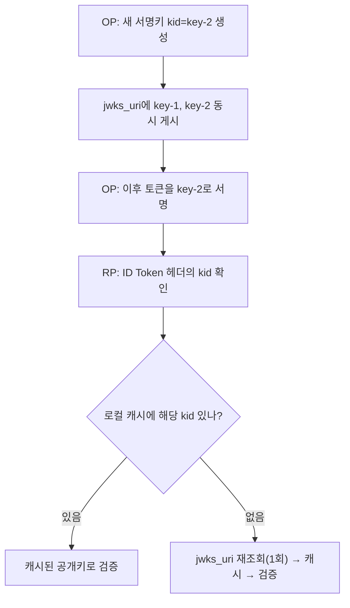

RP는 공개키를 **하드코딩하지 말고 항상 `jwks_uri`에서 동적으로** 가져와야 합니다(구글은 하루 1회 회전). Discovery 문서는 최소 일주일 캐싱이 권장됩니다.

### 동적 클라이언트 등록(DCR) 개요

수동 앱 등록 대신 `registration_endpoint`로 클라이언트 메타데이터(`redirect_uris` 등)를 POST하면 OP가 `client_id`(및 필요 시 `client_secret`)를 발급합니다. 다수 RP를 대규모 온보딩하는 페더레이션·SaaS 환경에서 유용하며, IETF의 RFC 7591/7592와 정렬됩니다.

---

# 3부. 인증 플로우 — Authorization Code · PKCE · Hybrid

> **2025년 기준 업계 합의(한 문장)**: 모든 클라이언트 유형은 **PKCE를 적용한 Authorization Code Flow**를 사용해야 하며, **Implicit Flow는 폐기(deprecated)**되었습니다. (RFC 9700, OAuth 2.1)

## 3.1 Authorization Code Flow (표준·정석)

핵심 설계 사상은 **토큰을 프런트채널(front-channel, 브라우저 리다이렉트)로 절대 흘려보내지 않는다**는 것입니다. 브라우저에는 단명하는 **인가 코드(authorization code)**만 전달하고, 값비싼 토큰은 클라이언트 백엔드가 토큰 엔드포인트를 직접 호출하는 **백채널(back-channel)**로만 받습니다.

### authorization request 주요 파라미터

| 파라미터 | 설명 |
| --- | --- |
| `response_type` | Authorization Code Flow에서는 반드시 `code` |
| `scope` | 반드시 `openid` 포함 (+ `profile`, `email`, `offline_access` 등) |
| `client_id` | OP에 등록된 클라이언트 식별자 |
| `redirect_uri` | 사전 등록 값과 **정확히(exact match)** 일치 |
| `state` | CSRF 방어용 불투명 랜덤 값 |
| `nonce` | 클라이언트 세션과 ID Token 결속(replay 방어) |
| `code_challenge` / `code_challenge_method` | PKCE (통상 `S256`) |

> `state`와 `nonce`는 역할이 다릅니다. `state`는 **전송 계층 CSRF 방어**(응답이 내 요청에 대한 것인지), `nonce`는 **ID Token 계층 replay 방어**(이 토큰이 내가 시작한 세션 것인지). 둘 다 있어야 완전합니다. 자세한 원리는 [5부](#52-방어-파라미터의-원리-핵심)에서.

### 시퀀스

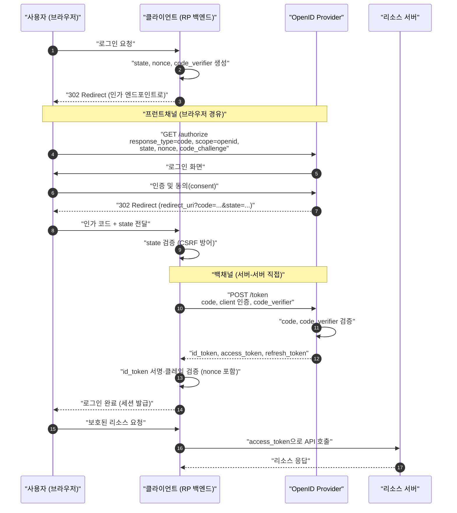

**왜 이 설계인가**: 브라우저는 신뢰할 수 없는 환경이므로, 지나는 값은 언제든 유출된다고 가정합니다. 그래서 브라우저에는 "그 자체로는 쓸모없고, 반드시 클라이언트 인증(또는 PKCE 증명)과 함께여야만 토큰이 되는" 단명 코드만 노출합니다.

## 3.2 PKCE (Proof Key for Code Exchange)

PKCE(RFC 7636, "픽시")는 Authorization Code Flow를 보강해 **인가 코드 탈취(interception)·주입(injection)**을 방어합니다. 중요: **PKCE는 클라이언트 인증이 아니며 client secret의 대체물도 아닙니다.** "이 토큰 교환 요청을 보낸 주체가, 애초에 인가 요청을 시작한 바로 그 주체인가"를 증명하는 별개의 방어 계층입니다.

### 동작 원리 (일회용 비밀)

1. 요청마다 안전한 난수 `code_verifier` 생성.
2. `code_challenge = BASE64URL(SHA-256(code_verifier))`, `code_challenge_method=S256`.
3. 인가 요청에 `code_challenge` 전송 → OP가 코드와 함께 저장.
4. 토큰 교환 시 원본 `code_verifier` 제출.
5. OP가 `SHA-256(verifier) == 저장된 challenge` 확인. 불일치 시 발급 거부.

### S256를 써야 하는 이유 (plain 금지)

`plain`(챌린지=검증자 원문)은 공격자가 응답만 관찰할 때만 방어합니다. 공격자가 요청까지 관찰하면(악성 앱의 로그 탈취 등) 무력합니다. `S256`은 단방향 해시라 챌린지를 봐도 검증자를 역산할 수 없어 이 위협까지 막습니다. **실무에서는 항상 `S256`.**

### 왜 이제 confidential client에도 권장되는가 (OAuth 2.1)

- **RFC 9700**: public client에 **요구(require)**, confidential client에 **권장(recommend)**.
- **OAuth 2.1**: 모든 Authorization Code Flow에 기본 요구.

client secret이 있어도, 인가 코드가 리다이렉트에서 탈취·주입되는 시나리오는 별개 위협입니다. PKCE는 "탈취된 코드"만으로는 교환이 불가능하게 만들어 이 공백을 메웁니다. **PKCE와 client secret은 경쟁이 아니라 보완 관계**입니다.

### code interception 방어 원리

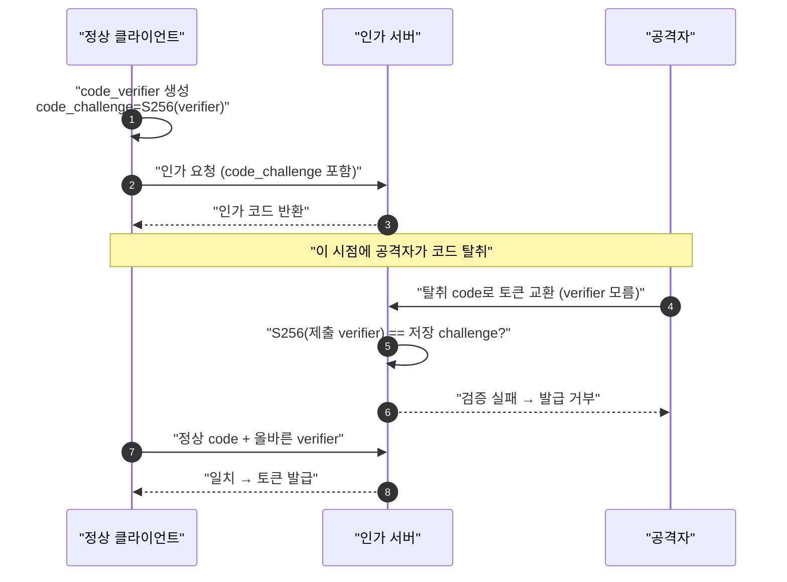

공격자는 리다이렉트에 노출된 `code_challenge`(해시)만 볼 뿐, `code_verifier`(원본)는 정상 클라이언트 메모리에만 있습니다. SHA-256은 역산 불가이므로 코드를 탈취해도 토큰으로 못 바꿉니다.

## 3.3 Implicit Flow (폐기됨, 신규 금지)

`response_type=token`/`id_token token`으로 **인가 엔드포인트에서 토큰을 곧바로 URL 프래그먼트(`#`)로 반환**하는 방식입니다. **RFC 9700(2025.01)에서 공식 폐기, OAuth 2.1에서 제거. 신규 채택 절대 금지.**

폐기 이유:
- **URL 프래그먼트에 access token 노출** → 브라우저 히스토리·리퍼러(Referer)·로그로 유출.
- **토큰 주입 공격** → 응답의 토큰을 다른 토큰으로 치환 주입.
- 브라우저의 프래그먼트 처리 변화로 보안 모델 자체가 흔들림.

대안: **SPA를 포함한 모든 클라이언트는 PKCE + Authorization Code Flow.** 오늘날 브라우저는 CORS로 백엔드 없이도 토큰 엔드포인트를 직접 호출할 수 있어 Implicit을 쓸 이유가 없습니다.

## 3.4 Hybrid Flow

`response_type=code id_token` 등으로 **프런트채널로 ID Token과 인가 코드를 동시에** 받고, 코드는 백채널로 교환합니다. 사용처:
- **코드 교환 전 신원을 먼저 알아야 할 때**(선(先) 렌더링·개인화).
- **믹스업 공격 완화** — FAPI는 프런트채널 ID Token의 `iss` 검증용으로 `code id_token`을 권장.

**주의**: Implicit이 폐기됐으므로 `response_type`에 절대 `token`을 포함하지 마세요(access token이 프런트채널로 샘). 기본 선택지는 여전히 Authorization Code + PKCE입니다.

## 3.5 response_mode: query vs fragment vs form_post

| response_mode | 전달 위치 | 서버 읽기 | 노출 위험 | 권장 상황 |
| --- | --- | --- | --- | --- |
| `query` | URL 쿼리(`?code=`) | 가능 | 히스토리·로그 | 무해한 인가 코드(`code`의 기본값) |
| `fragment` | URL 프래그먼트(`#`) | 불가 | 브라우저 노출 | 토큰 프런트채널 수신(Implicit/Hybrid 기본) |
| `form_post` | HTTP POST 본문 | 가능 | URL에 안 남음(가장 안전) | 프런트채널로 민감 값(ID Token)을 서버가 받을 때 |

`form_post`는 응답을 HTML 폼 자동 POST로 보내 URL 어디에도 남기지 않으므로, Hybrid처럼 프런트채널 ID Token 수신 시 권장됩니다.

### 플로우 선택 요약

| 플로우 | 상태 | 권장 사용처 |
| --- | --- | --- |
| **Authorization Code + PKCE** | **강력 권장(표준)** | 모든 클라이언트(웹 서버, SPA, 모바일) |
| Hybrid (`code id_token`) | 제한적 | 코드 교환 전 신원 필요, FAPI mix-up 방어 |
| Implicit (`token`) | **폐기·금지** | 신규 금지, 기존은 마이그레이션 대상 |

---

# 4부. ID Token 서명 검증 — 신뢰의 기술적 근거

ID Token은 서명된 JWT(JWS)입니다. RP가 이를 신뢰하려면 반드시 서명을 검증해야 하며, 검증을 건너뛰거나 잘못하면 OIDC 보안 전체가 무너집니다.

## 4.1 RS256(비대칭) vs HS256(대칭)

| 항목 | RS256 (비대칭) | HS256 (대칭) |
| --- | --- | --- |
| 서명 | 개인키 | 공유 비밀키 |
| 검증 | 공개키(`jwks_uri` 공개) | 동일 공유 비밀키 |
| OIDC 권장 | **기본값. 모든 OP 지원 필수** | 제한적 |

**왜 RS256가 기본인가**: OP 하나가 다수 RP에게 토큰을 발급합니다. HS256이면 모든 RP가 서명 비밀키를 공유해야 하는데, 이는 **어떤 RP든 OP를 사칭해 토큰을 위조**할 수 있다는 뜻입니다. RS256은 서명(개인키)과 검증(공개키)을 분리해 RP는 검증만 할 뿐 위조할 수 없습니다.

## 4.2 kid·JWKS·롤오버, 그리고 알고리즘 혼동 공격

- **`kid`**: 토큰 헤더의 `kid`와 JWKS 각 키의 `kid`를 매칭해 검증 키를 선택. 처음 보는 `kid`면 `jwks_uri`를 **1회** 재조회(무한 루프 방지).
- **알고리즘 화이트리스트 강제**:
  - **`alg: none` 거부** — 서명 없는 토큰은 누구나 위조 가능.
  - **RS256↔HS256 혼동 방어** — 공격자가 `alg`를 `HS256`으로 바꾸고 **공개키(누구나 앎)를 HMAC 비밀키로 악용**해 위조하는 고전 공격. 라이브러리가 헤더의 `alg`를 그대로 신뢰하면 당함. **기대 알고리즘(보통 RS256)만** 허용.

### at_hash / c_hash

`at_hash`(access token)·`c_hash`(code)는 ID Token을 access token·인가 코드와 결속해 프런트채널 **치환 공격**을 막습니다. 검증: 대상의 ASCII 옥텟을 **ID Token의 `alg`에 대응하는 해시**(RS256→SHA-256)로 해시 → **왼쪽 절반** → Base64URL → 클레임과 비교.

### 검증 단계 (flowchart)

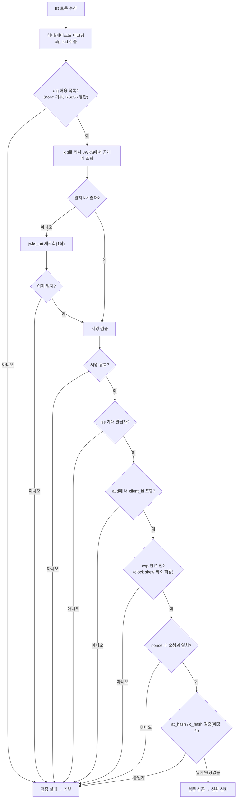

**왜 이 순서인가**: 서명 검증은 "진짜 OP가 발급했나", 클레임 검증(`iss`/`aud`/`exp`/`nonce`)은 "나를 위해, 지금, 내 세션에 발급됐나"를 확인합니다. 서명만 맞고 `aud`가 다른 토큰은 다른 클라이언트용 토큰 재사용 공격일 수 있으므로 서명만으로는 절대 불충분합니다.

## 4.3 ID Token 검증 전체 체크리스트

| # | 항목 | 확인 내용 | 누락 시 취약점 |
| --- | --- | --- | --- |
| 1 | **서명** | JWKS 공개키로 검증, **등록 알고리즘과 `alg` 일치** | 위변조 허용, 알고리즘 치환(`none`, HS/RS 혼동) |
| 2 | **iss** | 기대 발급자와 정확 일치(HTTPS, 완전 일치) | 미신뢰 IdP 토큰 수락, 믹스업 발판 |
| 3 | **aud** | 자신의 `client_id` 포함, 미신뢰 audience면 거부 | 다른 클라이언트용 토큰 오인 → 치환 |
| 4 | **exp** | 현재 < 만료. 클럭 스큐 ~60초 | 만료 토큰 무기한 재사용 |
| 5 | **iat / nbf** | 발급 시각 합리성, 유효 시작 도래 | 미래 발급·과거 재사용 토큰 수락 |
| 6 | **nonce** | 요청에 보냈다면 클레임과 일치 | **ID 토큰 replay·주입** (최다 누락) |
| 7 | **azp** | 자신이 직접 요청한 토큰이면 `azp == client_id` | 다중 audience 위임 토큰 오용 |

> **azp 뉘앙스**: `azp`는 확장 사용 시에만 등장하며, `azp == client_id` 검증은 **토큰을 자신이 직접 요청했다고 확신하는 경우**에만 의미가 있습니다. 자신이 요청하지 않은 토큰에는 부적절할 수 있습니다.

> **운영 주의**: 위 표준 검증은 **폐기(revocation)를 확인하지 않습니다.** 무효화 여부까지 보려면 인트로스펙션이나 세션 확인이 필요합니다. **실무 조언**: 서명·해시 검증을 직접 구현하지 말고 `jose` 등 검증된 라이브러리를 쓰되, **`aud`·nonce 검증이 실제로 켜져 있는지 설정을 반드시 확인**하세요(라이브러리 기본값에서 꺼져 있는 경우가 많음).

---

# 5부. 위협 모델과 방어 메커니즘

파라미터를 "넣었다/안 넣었다"의 체크리스트로 다루면 사고가 납니다. 각 파라미터가 **어느 신뢰 경계에서, 무엇을, 어떻게** 막는지를 이해해야 합니다.

## 5.1 위협 모델

| 공격 | 노리는 대상 | 요약 |
| --- | --- | --- |
| **CSRF** | 콜백의 요청-응답 무결성 | 공격자의 인가 응답을 피해자 세션에 주입 → 공격자 계정으로 로그인 |
| **Code Interception** | 전송 중 인가 코드 | public client에서 코드 탈취 후 토큰 교환 |
| **Code Injection/Replay** | 클라이언트 세션 | 공격자의 유효 코드를 피해자 세션에 주입. **confidential client에서도 성립** |
| **Token Substitution/ID Replay** | ID 토큰 신선도 | 정당 서명된 과거 ID 토큰 재제출. nonce 없으면 서명만으로 통과 |
| **Mix-Up** | 발급자(issuer) 신뢰 | 다중 IdP에서 사용자 선택을 공격자 IdP로 바꿔치기 |
| **Open Redirect** | 인가 응답 목적지 | 느슨한 redirect_uri 검증으로 코드·토큰을 공격자 URL로 |
| **Phishing** | 사용자 자격 증명 | 프로토콜로 완전 차단 불가. WebAuthn/Passkey 병행 |

## 5.2 방어 파라미터의 원리 (핵심)

각 파라미터는 **서로 다른 신뢰 경계**에서 검증되므로 대체 불가능합니다.

| 방어 | 검증 위치(신뢰 경계) | 검증 주체 | 막는 것 |
| --- | --- | --- | --- |
| `state` | 콜백 리다이렉트 | 클라이언트(RP) | CSRF |
| `nonce` | ID 토큰 페이로드(교환 후) | 클라이언트(RP) | ID 토큰 replay·주입 |
| PKCE | 토큰 엔드포인트 | 인가 서버(AS) | 코드 가로채기 |
| `redirect_uri` exact match | 인가 요청 시점 | 인가 서버(AS) | 오픈 리다이렉트 |
| `iss` | 인가 응답 수신 | 클라이언트(RP) | 믹스업 |

- **state → CSRF**: 랜덤 `state`를 세션 저장 + 요청 전송, 콜백에서 대조 후 즉시 폐기(one-time). 공격자는 피해자 세션의 `state`를 모름. *리뷰 포인트: 생성만 하고 대조하지 않는 코드가 흔한 실수.*
- **nonce → ID Token replay/injection**: 요청의 `nonce`를 OP가 ID Token 클레임에 반환 → RP가 대조. *리뷰 포인트: **생성-후-미검증이 최다 실수.** state와 nonce는 같은 랜덤 값을 재사용하지 말 것.*
- **PKCE → code interception**: (§3.2) 신뢰 근거를 프런트채널에서 토큰 교환 경계로 이동. *리뷰 포인트: `S256` 사용, 서버가 challenge 있으면 강제(안 그러면 **PKCE 다운그레이드 공격**). PKCE가 있어도 nonce는 여전히 필요 — 검증 대상·시점이 다름.*
- **redirect_uri exact matching → open redirect**: 정확한 문자열 매칭. 와일드카드·서브패스 금지(네이티브 localhost 예외).
- **iss → mix-up**: 다중 IdP면 **필수**. 인가 응답의 `iss`를 요청 보낸 발급자와 대조, 또는 IdP별 구별 redirect_uri. *AS URL만 저장하는 것은 불충분.*

### 대표 공격 시각화

**믹스업 공격** (다중 IdP):

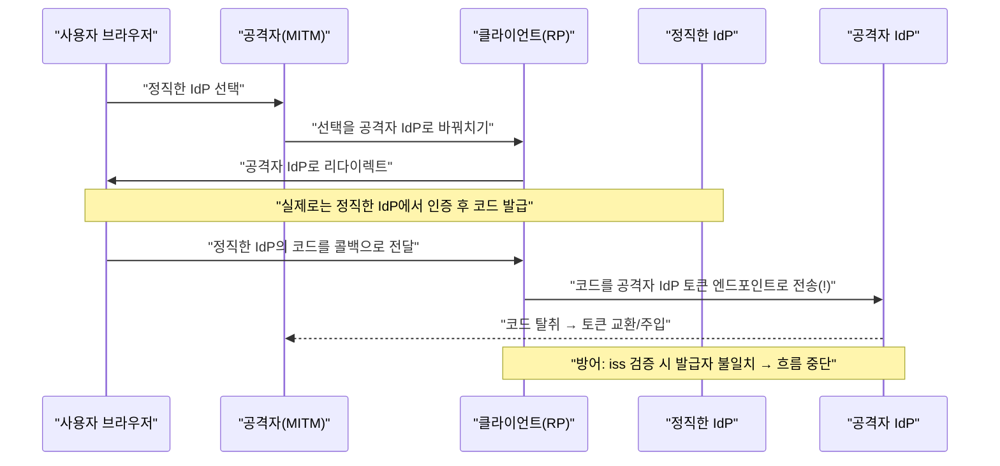

**인가 코드 주입**:

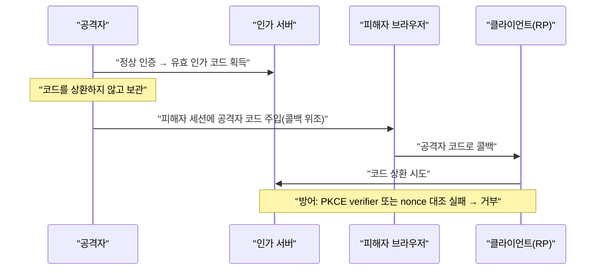

### [심화] 스펙별 챌린지/논스(Nonce)의 역할 비교

기본 방어 파라미터(`state`·`nonce`)를 넘어, 이름이 비슷한 세 값 — OIDC `nonce`, PKCE `code_challenge`, DPoP `nonce` — 의 차이를 정리합니다. "챌린지-응답"은 이 생태계가 발명한 게 아니라 오래된 범용 개념이며, 이 세 값은 **누가 값을 만드느냐**가 달라 성격이 갈립니다. 이 구분을 놓치면 "PKCE가 있으니 nonce는 불필요" 같은 오해가 생깁니다.

| 값 | 소속 | 생성 주체 | 진짜 "서버 챌린지"? | 필수 여부 |
| --- | --- | --- | --- | --- |
| OIDC `nonce` | OIDC | **클라이언트(RP)** 생성 → OP가 ID Token에 반향(echo) | ❌ (클라이언트 자가 생성) | Code Flow는 선택(권장), **Implicit/Hybrid는 필수** |
| PKCE `code_challenge` | OAuth/OIDC | **클라이언트** 생성(`SHA256(verifier)`) | ❌ (자가 커밋) | OAuth 2.1·BCP에서 사실상 필수 |
| DPoP `nonce`(`DPoP-Nonce`) | DPoP(RFC 9449) | **서버(AS/RS)** 생성 → 클라이언트가 proof에 포함 | ✅ (유일한 서버 챌린지) | 기본 선택 → **서버가 요구하면 필수** |

OIDC `nonce`와 PKCE `code_challenge`는 이름과 달리 **클라이언트가 만든 값**(자가 커밋/반향)이라, ID Token/인가 코드를 *내 세션에* 결속하는 용도입니다. 반면 **서버가 값을 던지는 진짜 챌린지-응답**은 이 생태계에서 DPoP의 서버 nonce가 대표적입니다(→ 별도 문서 [DPoP 아키텍처](dpop-pop-architecture.md) 5.4). 검증 대상·시점이 다르므로 PKCE가 있어도 `nonce`는 여전히 필요합니다.

---

# 6부. 세션 라이프사이클과 로그아웃

로그인 흐름의 무결성(5부)과 별개로, 인증 아키텍처는 세션의 종료(로그아웃)까지 다뤄야 합니다. OIDC 로그아웃은 **1개의 개시 스펙 + 3개의 통지 스펙**으로 나뉩니다.

## 6.1 로그아웃 스펙 — 1개 개시 + 3개 통지

| 스펙 | 역할 | 통신 | 트레이드오프 |
| --- | --- | --- | --- |
| **RP-Initiated Logout** | 로그아웃 **개시** | 브라우저를 OP `end_session_endpoint`로 | 시작점일 뿐, 전파는 아래 3개에 의존 |
| **Session Management** | OP 로그인 상태 **모니터링** | iframe 상태 폴링 | 브라우저 의존, 서드파티 쿠키 정책에 취약 |
| **Front-Channel Logout** | 로그아웃 **통지**(브라우저) | OP가 각 RP logout URI를 iframe 렌더 | 구현 단순하나 브라우저 열려 있어야 함, 신뢰성 낮음 |
| **Back-Channel Logout** | 로그아웃 **통지**(서버 간) | OP가 각 RP에 Logout Token 직접 전송 | 신뢰성 높고 브라우저 무관. RP가 도달 가능한 엔드포인트 노출 필요 |

- **RP-Initiated**: `id_token_hint`가 있으면 OP는 자신이 발급자인지 검증해야 함(MUST). 없으면 사용자에게 로그아웃 의사를 물어야 함.
- **Front vs Back**: Front는 단순하나 브라우저 닫힘·iframe 차단 시 유실. Back은 서버 간이라 **관리자 강제 종료까지 보장하는 유일한 방식**이나 RP가 엔드포인트 노출·세션 종료 로직·Logout Token 검증을 직접 구현해야 함.
- **SLO(단일 로그아웃)의 어려움**: 하나의 OP 세션에 여러 RP가 물려 있고 종료가 원자적이지 않음. 실무에서는 Front+Back **병행**으로 커버리지 극대화. `sid` 클레임은 세 스펙이 공유하는 세션 식별자(발급자 컨텍스트 내 유일, RP에게 불투명).

> **리뷰 관점**: "로그아웃이 로컬 세션만 지우고 IdP 세션은 그대로 두는가?" 로컬만 지우면 재로그인 시 IdP가 재인증 없이 즉시 코드를 발급해 "로그아웃되지 않은 것처럼" 느껴집니다.

---

# 7부. 실무 아키텍처와 안티패턴

가장 먼저 던질 질문: **"이 클라이언트가 비밀(secret)을 안전하게 보관할 수 있는가?"**

- **컨피덴셜 클라이언트(confidential)**: 시크릿을 안전 보관 가능(서버 환경).
- **퍼블릭 클라이언트(public)**: 불가(SPA·네이티브 앱 — 디컴파일·개발자 도구로 노출).

이 구분이 이후 모든 결정을 좌우합니다.

## 7.1 클라이언트 유형별 아키텍처

### 서버사이드 웹앱 (컨피덴셜)

인가 코드 그랜트 + 서버가 시크릿 관리. 토큰은 브라우저로 내려가지 않고 서버 세션에 보관, 브라우저는 세션 쿠키만. **XSS를 통한 토큰 탈취 벡터 자체가 없습니다.**

### SPA — 순수 SPA vs BFF

순수 SPA는 토큰을 브라우저 어딘가(localStorage/메모리)에 둬야 하고, 이는 **XSS 한 방에 통째 유출** 위험을 뜻합니다. 현대 SPA는 수백 개 npm 의존성으로 공급망 공격 표면이 넓습니다(2025.09 npm 공급망 공격이 실증). **IETF는 더 이상 브라우저에서 직접 OAuth를 처리하는 방식을 권장하지 않습니다.**

**BFF(Backend for Frontend)**: SPA 전용 백엔드가 컨피덴셜 클라이언트 역할을 맡아 (1) OAuth 처리, (2) 토큰을 **서버 세션에 격리**(브라우저 미노출), (3) API 요청 프록시 시 access token 주입.

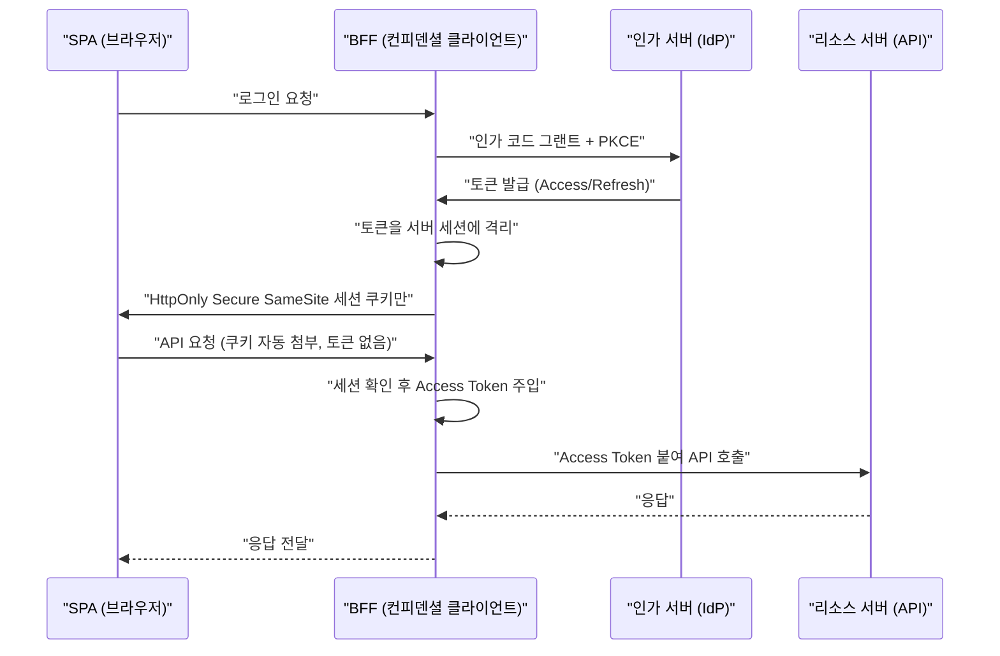

IETF "OAuth 2.0 for Browser-Based Apps"(draft-26)의 보안 강도순: **BFF > 토큰 중개 백엔드(TMB) > 순수 SPA**. 민감 애플리케이션에는 **BFF 강력 권장**. 공격자가 토큰을 빼내 오프라인 재사용·세션 초과 지속을 할 수 없다는 것이 핵심.

> 주의: 일부 튜토리얼의 "BFF가 JWT를 SPA로 내려주는" 변형은 BFF의 핵심 목표(토큰 격리)를 위배하므로 따르지 마세요.

### 네이티브/모바일 앱 (RFC 8252, AppAuth)

- **시스템 브라우저(외부 user-agent) 필수** — 임베디드 웹뷰 금지(앱이 자격 증명·쿠키·DOM에 접근 가능해 피싱 통로). iOS `ASWebAuthenticationSession`, Android Custom Tabs 사용.
- **PKCE 필수(MUST)** — 커스텀 URI 스킴 하이재킹으로 인한 코드 인터셉션 방어. Implicit은 NOT RECOMMENDED.

### 결정 요약

| 유형 | 클라이언트 종류 | 권장 그랜트 | 토큰 저장 | 핵심 방어 |
| --- | --- | --- | --- | --- |
| 서버사이드 웹앱 | 컨피덴셜 | 인가 코드 | 서버 세션 | 토큰이 브라우저에 없음 |
| SPA (권장) | BFF가 컨피덴셜 대행 | 인가 코드+PKCE | BFF 서버 세션 | HttpOnly 쿠키, 토큰 격리 |
| SPA (경량 타협/TMB) | 퍼블릭 | 인가 코드+PKCE | 브라우저(메모리) | 컨피덴셜로 획득하나 노출 |
| 네이티브/모바일 | 퍼블릭 | 인가 코드+PKCE(필수) | OS 보안 저장소 | 시스템 브라우저+PKCE |

## 7.2 토큰 저장 전략 — 트레이드오프가 첨예한 영역

핵심 긴장은 **XSS ↔ CSRF 트레이드오프**입니다. "정답 찾기"가 아니라 "무엇을 감수할지" 고르는 문제입니다.

| 저장 방식 | XSS 위험 | CSRF 위험 | 지속성 | 비고 |
| --- | --- | --- | --- | --- |
| localStorage/sessionStorage | 높음(모든 스크립트가 읽음) | 없음 | 있음 | 간단하나 OWASP 비권장 |
| 메모리 | 낮음 | 없음 | 없음 | 새로고침 소실, silent refresh 필요 |
| HttpOnly Secure SameSite 쿠키 | 낮음(값 읽기 불가) | 있음(SameSite+CSRF 토큰) | 있음 | 위험을 CSRF로 이동 |
| 메모리(Access)+HttpOnly 쿠키(Refresh) | 최저 | 최저 | 부분 | 2026 베스트 프랙티스 |
| BFF(서버 격리) | 해당 없음 | 쿠키 강화로 완화 | 서버 세션 | 인프라 추가 |

**미묘한 지점**: HttpOnly 쿠키도 XSS 결과로부터 완전 면역이 아닙니다. 공격자가 JS를 실행할 수 있으면 값을 못 읽어도 쿠키가 자동 첨부되는 요청을 서버로 날릴 수 있습니다(토큰 탈취는 못 해도 세션 내 악의적 행동은 가능).

**Refresh Token 주의**: 오래 살며 새 access token을 계속 찍어내므로 유출 피해가 질적으로 다릅니다. 브라우저 JS가 접근 가능한 곳에 두지 말 것(최소 HttpOnly 쿠키). 민감한 SPA면 **애초에 토큰을 브라우저에 두지 않는 BFF**가 가장 확실합니다. 세션 쿠키는 `Secure; HttpOnly; SameSite=strict` + `__Host-` 접두사 권장.

## 7.3 고위험 환경 아키텍처 — Sender-Constrained Token과 FAPI 2.0

앞의 클라이언트 유형 판단(7.1)과 저장 전략(7.2)이 기본이라면, 금융·결제·고위험 API에서는 위협 모델(5부)의 방어에 더해 **시스템 차원의 보안 프로파일**을 기준선으로 삼습니다.

### Sender-Constrained Token

5부까지의 방어는 로그인 흐름의 무결성을 다뤘습니다. 그러나 발급된 access token이 **베어러 토큰(bearer token)**이면 소지자는 누구든 정당 클라이언트와 구별되지 않습니다(SPA 유출·악성 확장·로그·TLS 종단 프록시). 고위험 환경에서는 이를 **Sender-Constrained Token** — 토큰을 클라이언트 키에 바인딩해 탈취만으로는 못 쓰게 만드는 방식 — 으로 차단합니다.

- **mTLS (RFC 8705)**: 전송 계층. TLS 클라이언트 인증서에 바인딩(`cnf.x5t#S256`). PKI 보유한 서버 간 클라이언트에 적합.
- **DPoP (RFC 9449)**: 애플리케이션 계층. 매 요청 서명된 단명 JWT로 소유 증명. PKI 불필요, **SPA/모바일 등 public client에 적합**.

> 상세 메커니즘(`cnf.jkt` 바인딩, `htm`/`htu`/`ath`/`jti`, nonce 핸드셰이크, 리소스 서버 검증 파이프라인)은 별도 문서 [`dpop-pop-architecture.md`](dpop-pop-architecture.md)를 참조하세요. 리뷰 시에는 "이 API가 베어러만 받는가, sender-constrained를 검증하는가"를 확인하면 됩니다.

### FAPI 2.0 (금융권 강화 프로파일)

OpenID Foundation의 **처방적 보안 프로파일**로, OAuth/OIDC의 위험한 선택지를 제거하고 안전한 기본값을 강제합니다.

1. **PAR 필수**: Pushed Authorization Requests — 인가 파라미터를 리다이렉트 **전에** 백채널 POST로 보내고 짧은 수명 `request_uri`를 사용. 민감 파라미터가 브라우저에 안 남음.
2. **베어러 토큰 제거**: 모든 access token을 **DPoP 또는 mTLS**로 바인딩. 리소스 서버는 마지막에 "제시자 == 발급 대상" sender-constraint 검증을 반드시 수행.
3. **강한 클라이언트 인증**: `mTLS` 또는 `private_key_jwt`.

> **리뷰 관점**: 금융·결제 도메인이면 "state+PKCE로 충분"이 아니라 **PAR 강제 여부, 베어러 토큰 잔존 여부, mTLS/private_key_jwt 사용 여부**를 기준선으로.

## 7.4 흔한 안티패턴과 오해

2.4에서 짚은 토큰 목적 혼동을 포함해, 실무에서 반복되는 안티패턴을 한곳에 정리합니다.

| 안티패턴 | 왜 문제인가 | 올바른 방식 |
| --- | --- | --- |
| **Access Token으로 로그인 구현** | §1.3 의사 인증 — 혼동된 대리자 공격에 취약하고, access token은 인증의 증거가 아님 | 로그인엔 검증된 ID Token의 `sub` 사용 |
| **ID Token을 API/자원 서버에 Bearer 전송** | `aud`가 RP이지 API가 아님, scope 부재로 세밀한 인가 불가, 타 클라이언트 토큰 재사용 가능 | API에는 **Access Token**만 |
| **Access Token 무검증 신뢰** | 위조·재사용 토큰 통과 | 서명·iss·aud·exp·scope 검증 |
| **JWT/opaque 이분법** | 폐기 vs 성능 트레이드오프 무시 | 요구사항 기반 선택, 팬텀/스플릿 고려 |
| **무분별한 scope 확장** | 과권한, 탈취 시 피해 확대 | 최소 권한 원칙 |

- **ID Token은 클라이언트용, Access Token은 API용.** API가 ID Token을 받으면 `aud`를 무시하는 것이고, audience 미검증 시 탈취한 어떤 ID Token으로도 접근 가능. ID Token엔 scope도 없어 세밀한 인가 불가.
- **opaque vs JWT**: 폐기 제어력 vs 성능. JWT는 로컬 검증으로 빠르나 즉시 폐기 불가. opaque는 인트로스펙션으로 즉시 폐기 가능하나 매 검증 네트워크 호출. 실무 조합: **Access=JWT, Refresh=opaque**(refresh는 즉시 폐기 가능해야 함). **팬텀 토큰(Phantom Token)** 패턴(클라이언트엔 opaque, 게이트웨이가 JWT로 변환)도 유용.

## 7.5 세션 vs 토큰 아키텍처

| 관점 | 서버 세션 + OIDC | 순수 토큰(JWT) |
| --- | --- | --- |
| 폐기 | 즉시 가능 | 어려움(만료까지 유효) |
| 확장성 | 세션 스토어 의존 | 무상태, 수평 확장 용이 |
| 지연 | 세션 조회 필요 | 로컬 검증, 빠름 |
| 마이크로서비스 전파 | 불리 | 유리 |
| 대표 적용처 | 서버사이드 웹앱, BFF | API 게이트웨이 뒤 다중 서비스 |

JWT 유지하며 폐기가 필요할 때: **짧은 만료 + refresh**(가장 널리 쓰임), **거부 목록(denylist, jti)**, **서명 키 로테이션**(광범위 긴급 폐기).

## 7.6 운영·확장

- **멀티테넌시/SSO**: 테넌트별 `iss`/`aud` 격리, audience 검증 엄격화(한 테넌트 토큰이 타 테넌트 자원에 닿지 않게). SSO는 세션 하나가 여러 서비스 관문이라 탈취 파급도 큼.
- **IdP 벤더**: Keycloak(오픈소스·자체 호스팅, 운영 책임), Auth0/Okta(SaaS, 빠른 도입·과금·종속), Cognito(AWS 통합·종속). 축은 **자체 호스팅 vs 관리형**, **비용**, **벤더 종속**, **인프라 정합성**.
- **마이그레이션**: 빅뱅 지양. 표준(OIDC/OAuth)을 경유하도록 설계하면 벤더 교체 비용이 크게 줄어듦. 표준 준수가 최고의 마이그레이션 보험.

---

# 종합 정리 — 코드 리뷰 체크포인트

인증 아키텍처 리뷰는 세 가지 질문으로 압축됩니다: **이 클라이언트는 시크릿을 지킬 수 있는가**(컨피덴셜/퍼블릭), **토큰이 새면 무슨 일이 벌어지는가**(저장·폐기), **이 토큰은 원래 누가 읽으라고 만든 것인가**(ID/Access 구분).

- **개념**: 인증(ID Token)과 인가(Access Token)를 혼동하지 않는가. access token으로 로그인을 구현하지 않는가.
- **state**: 생성만 하지 말고 콜백에서 세션값과 대조 후 폐기하는가.
- **nonce**: ID Token의 `nonce` 클레임을 실제로 대조하는가(**생성-후-미검증이 최다 실수**).
- **PKCE**: `S256`을 쓰는가, 서버가 PKCE를 강제하는가(다운그레이드 방지).
- **redirect_uri**: 정확한 문자열 매칭인가(와일드카드·서브패스 금지).
- **iss**: 다중 IdP라면 응답 발급자를 검증하는가(URL만 저장은 불충분).
- **ID Token 검증**: 서명(alg 고정)/iss/aud/exp/iat·nbf/nonce/azp 7항목 전부. `aud`·nonce 검증이 라이브러리 설정에서 실제로 켜져 있는가.
- **아키텍처**: SPA면 BFF를 검토했는가. 네이티브면 시스템 브라우저+PKCE인가. 토큰 저장 트레이드오프를 인지하는가.
- **로그아웃**: 로컬 세션만 지우지 않는가. SSO면 통지 메커니즘을 갖췄는가.
- **토큰 보호**: 고위험이면 베어러를 넘어 DPoP/mTLS로 sender-constrain 했는가(→ [DPoP 문서](dpop-pop-architecture.md)).

완벽한 단일 정답은 없습니다. **트레이드오프를 명확히 인지하고 심층 방어(defense in depth)를 겹겹이 쌓는 것**이 실무의 정도입니다.

---

# 참고 자료

**핵심 스펙**
- [OpenID Connect Core 1.0](https://openid.net/specs/openid-connect-core-1_0.html)
- [OpenID Connect Discovery 1.0](https://openid.net/specs/openid-connect-discovery-1_0.html)
- [OpenID Connect Dynamic Client Registration 1.0](https://openid.net/specs/openid-connect-registration-1_0.html)
- [RFC 6749 — OAuth 2.0 Authorization Framework](https://datatracker.ietf.org/doc/html/rfc6749)
- [RFC 6750 — OAuth 2.0 Bearer Token Usage](https://datatracker.ietf.org/doc/html/rfc6750)

**보안 · BCP**
- [RFC 9700 — OAuth 2.0 Security Best Current Practice](https://www.rfc-editor.org/info/rfc9700/)
- [RFC 7636 — Proof Key for Code Exchange (PKCE)](https://www.rfc-editor.org/info/rfc7636/)
- [OAuth 2.1 (overview)](https://oauth.net/2.1/)
- [FAPI 2.0 Security Profile](https://openid.net/specs/fapi-security-profile-2_0-final.html)

**토큰 · 키**
- [RFC 7519 — JWT](https://datatracker.ietf.org/doc/html/rfc7519) · [RFC 7515 — JWS](https://www.rfc-editor.org/rfc/rfc7515) · [RFC 7517 — JWK/JWKS](https://www.rfc-editor.org/rfc/rfc7517)
- [RFC 9449 — DPoP](https://datatracker.ietf.org/doc/html/rfc9449) · [RFC 8705 — mTLS](https://www.rfc-editor.org/info/rfc8705/)

**로그아웃**
- [RP-Initiated Logout](https://openid.net/specs/openid-connect-rpinitiated-1_0.html) · [Front-Channel](https://openid.net/specs/openid-connect-frontchannel-1_0.html) · [Back-Channel](https://openid.net/specs/openid-connect-backchannel-1_0.html)

**실무 아키텍처**
- [RFC 8252 — OAuth 2.0 for Native Apps](https://www.rfc-editor.org/rfc/rfc8252.html)
- [OAuth 2.0 for Browser-Based Apps (IETF draft)](https://datatracker.ietf.org/doc/html/draft-ietf-oauth-browser-based-apps)
- [ID Tokens vs Access Tokens (oauth.net)](https://oauth.net/id-tokens-vs-access-tokens/)
- [The Backend for Frontend Pattern (Auth0)](https://auth0.com/blog/the-backend-for-frontend-pattern-bff/)
- [How Should You Serve Your Access Tokens: JWTs, Phantom, or Split? (Curity)](https://curity.io/blog/how-should-you-serve-your-access-tokens-jwts-phantom-or-split/)

---

*관련 문서: [DPoP / PoP 아키텍처](dpop-pop-architecture.md) — 토큰 탈취를 근본적으로 무력화하는 sender-constrained token의 상세 메커니즘.*
