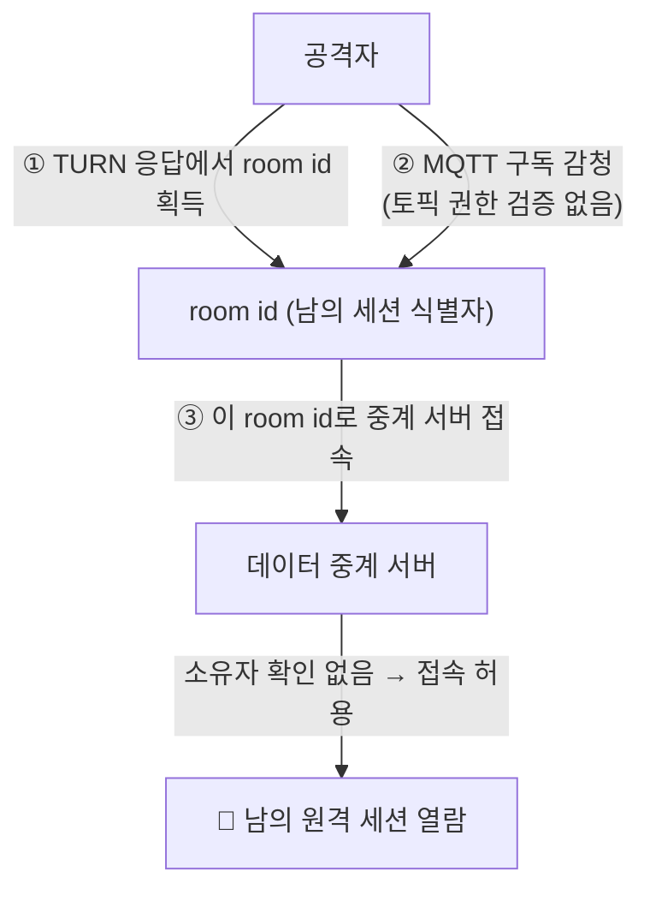
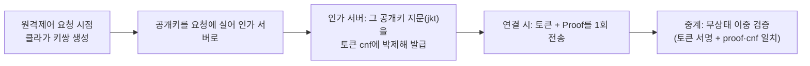
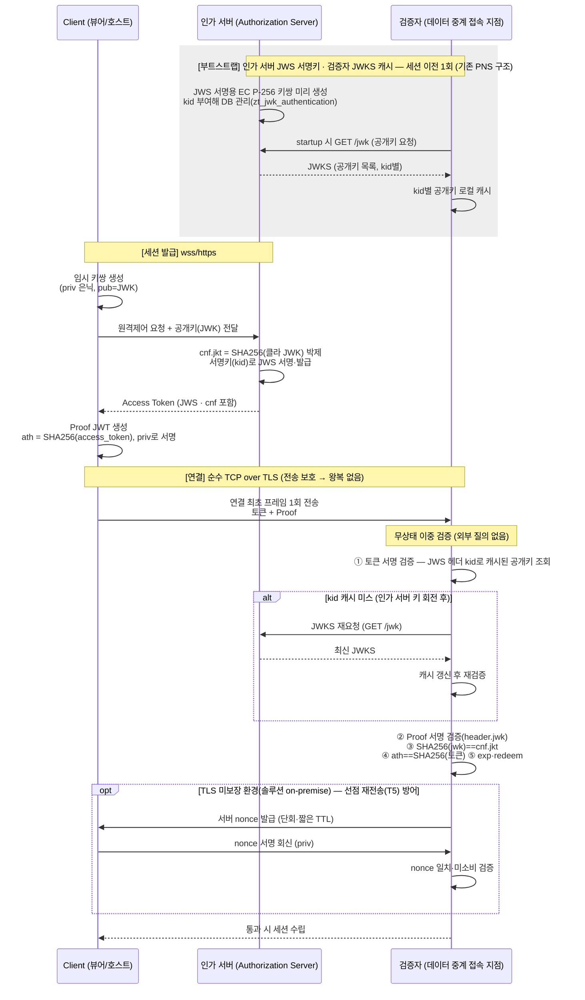

# PoP(cnf 키 바인딩) 기반 실시간 릴레이 인증 아키텍처

> 비(非)HTTP 실시간 채널(MQTT·WebSocket·TCP)에서 **무상태 JWS 검증**을 유지하면서, **PoP 소유 증명(cnf 키 바인딩, RFC 7800)**으로 토큰 탈취·리플레이를 무력화하는 설계 가이드

> ⚠️ **이 문서는 "DPoP"가 아니라 "PoP"다 — 혼동 금지.** 여기서 DPoP로부터 **차용하는 것은 `cnf` 키 바인딩(RFC 7800) 아이디어 하나뿐**이며, 다음 두 가지 이유로 **DPoP 그 자체는 아니다.**
> - **HTTP 메서드·API 정보(`htm`/`htu`)가 없다.** DPoP의 정체성은 proof를 특정 HTTP 요청(메서드+URI)에 묶는 것인데, 이 아키텍처의 자격 증명 대상은 **순수 TCP 접속 구간**이라 HTTP 메서드·API URI 개념 자체가 존재하지 않는다. `DPoP-Nonce` 왕복도 쓰지 않는다.
> - **커맨드(요청)별 인가 제약이 없다.** 이 proof는 **연결 시점에 "이 토큰의 `cnf` 키를 지금 쥐고 있음"(소유)만 증명**하고, `ath`로 토큰에 결착될 뿐이다. DPoP처럼 요청 단위로 인가를 거는 기능은 없다. **어떤 커맨드/토픽을 할 수 있는가(권한)는 proof가 아니라 토큰의 `authority` 클레임 몫**이다(없으면 커맨드 단위 제약도 없음).

## 목적

1. **최종 채택 아키텍처는 "cnf 키 바인딩 소유 증명(PoP)"(§6)이다.** 인가 서버가 서명한 JWS를 검증자가 무상태로 검증하는 단방향 비대칭키 구조에서, 토큰 탈취·리플레이를 무력화하기 위해 **세션을 클라이언트의 개인키 소유에 결착**한다. (단말 정보 바인딩(§5)은 고려했으나 암호학적 소유 증명이 아니어서 **미채택**했다 — §7.)
2. **데이터 중계가 순수 TCP(헤더 없음)인 환경**에서, 클라이언트의 개인키 소유를 증명하는 **PoP 핸드셰이크**를 **왕복 없는 무상태 이중 검증**으로 설계한다. 토큰·Proof는 **연결 최초 프레임에 1회** 실어 보낸다.
3. **전송 구간 TLS는 이미 적용 완료된 전제 조건**이다. 이 무왕복 PoP 설계는 TLS가 전송 가로채기를 닫아 준다는 전제 위에서 성립한다(§3·§4). 다만 **솔루션(on-premise) 배포는 고객사 환경에 따라 TLS가 보장되지 않을 수 있어**, 그 경우 **서버 nonce challenge-response(1왕복)를 옵션으로** 켠다(§6 `opt`·§9).
4. **DPoP에서 차용하는 것은 `cnf` 키 바인딩 아이디어(RFC 7800)뿐**이며(위 ⚠️ 박스), 바인딩(cnf)을 **"토큰 발급 시점"에 이미 확정**해 두어 중계가 키 협상·challenge-response 왕복 없이 무상태 이중 검증만 하면 되도록 만드는 것이 핵심이다.

> **선행 지식:** 이 문서는 JWT·JWS·JWE·JWK·Base64Url 등 **토큰 생태계 표준 기술을 이미 안다고 전제**한다. 이 개념들이 낯설다면 먼저 별도 문서 [JWT · JWS · JWE · JWK 토큰 생태계 표준 개념](jwt-jws-jwe-jwk-concepts.md)을 읽고 오라. (본 문서는 TCP 전용 PoP 클라이언트의 증명 아키텍처에만 집중한다.)

## ToC

**Part I. 현재 아키텍처**

1. 현행 아키텍처 및 설계 배경
2. TLS 인증서 vs JWK
3. 문제점 분석

**Part II. 채택 아키텍처 — cnf 키 바인딩 소유 증명(PoP)**

4. 리플레이 공격 모델
5. 미채택안 — 단말 고유 정보 바인딩 (고려·기각)
6. **확정 아키텍처 — cnf 키 바인딩 소유 증명(PoP · 왕복 없는 이중 검증)**
7. 소유 증명(PoP) 채택 근거

**Part III. 설계 검토 및 결론**

8. 키 롤링 + 배포 전략
9. 개선 과제 (Action Items)
10. 결론 요약

---

# Part I · 현재 아키텍처

**역할 정의 (OAuth 2.0 관점):** 이 문서의 서버 역할은 OAuth 2.0 표준 역할에 매핑됩니다. 핵심은 **토큰을 발급하는 곳은 하나(인가 서버), 그 토큰을 검증하고 자원을 내주는 곳은 여럿(리소스 서버)**이라는 것입니다.

- **인가 서버 (Authorization Server)** = 개인키 보유 = 토큰 **서명·발급** + `cnf` 지문 주입 (통상 백엔드/웹앱 서버가 겸함, 사용자가 로그인하는 곳. `iss` 클레임이 가리키는 주체)
- **리소스 서버 (Resource Server) = 검증자 (Verifier)** = 공개키만 보유 = 토큰 서명·소유 증명을 **검증**하고 보호 자원을 제공. 이 아키텍처에는 **두 개의 리소스 서버**가 있습니다.
    - **① 시그널링 서버** — 제공 자원: *세션 제어*. 프로토콜: `wss://` (WebSocket)
    - **② 데이터 중계 서버** — 제공 자원: *실시간 스트림*. 프로토콜: 순수 `tcp://`

### 리소스 서버 간 검증 의무 동일성

> 🔴 **가장 중요한 원칙:** 시그널링이든 중계든, **클라이언트가 보호 자원(세션 제어·스트림)에 접근하려는 모든 관문은 토큰 서명과 소유 증명(PoP)을 검증해야 하는 리소스 서버**입니다. WSS냐 순수 TCP냐는 **자격 증명을 어디에 싣느냐(헤더 vs 최초 프레임)의 차이일 뿐, "검증하느냐 마느냐"의 차이가 아닙니다.** 이 사고의 근본 원인(§3)은 바로 **중계 서버가 이 검증 의무를 이행하지 않고 room id만으로 접속을 허용**한 것이었습니다.

| 구분         | ① 시그널링 서버 (검증자)              | ② 데이터 중계 서버 (검증자)                 |
|------------|---------------------------------|-------------------------------------|
| 제공 자원      | 세션 수립·제어                        | 실시간 화면·제어 스트림                       |
| 프로토콜       | `wss://` (WebSocket)            | 순수 `tcp://` (헤더 없음)                 |
| 자격 증명 위치   | HTTP upgrade 헤더                 | 연결 최초 프레임(바이트 스트림)                  |
| **토큰 서명 검증** | ✅ **의무**                       | ✅ **의무** (기존에 누락 → 사고 원인)          |
| **소유 증명(PoP) 검증** | ✅ **의무**                    | ✅ **의무** (확정 아키텍처의 핵심, §6)          |
| 전송 보안 (현행) | 🟢 `wss://`로 이미 암호화             | 🟢 `tcp://` → **TLS 적용 완료**(SaaS). 솔루션은 환경에 따라 nonce 옵션 보강(§6·§9) |

> 💡 **핵심 원칙(정정):** "인증은 시그널링, 데이터는 중계"라는 **역할 분리는 틀린 프레이밍**입니다. 올바른 프레이밍은 **"두 서버 모두 검증자이고, 각자 다른 자원을 다른 프로토콜로 제공한다"**입니다. 따라서 "인증 강화(PoP·서명 검증)"는 **두 서버 모두에 적용해야 할 공통 의무**이고, "전송 암호화(TLS)"는 그 위에 **직교로 병행**되는 별개 축입니다(§3 직교성).

> ⚠️ **현실적 제약 및 고려사항:** 검증 *의무*는 두 서버가 동일하게 지지만, **완전한 PoP 검증을 어디까지 구현할 수 있는가는 서버 확장성에 달려 있습니다.** 시그널링이 **상용 메시징 브로커**라면(§1) 커스텀 검증 로직 삽입이 어려워 토큰 인증 플러그인 수준에 그칠 수 있고, 반대로 **직접 개발하는 순수 TCP 중계 게이트웨이**는 풀 PoP 이중 검증까지 자유롭게 구현할 수 있습니다. 즉 원칙은 통일하되, 브로커 제약이 있는 지점은 토픽 authz(§9)·강제 종료 채널 등으로 보완합니다.

## 1. 현행 아키텍처 및 설계 배경

### 무상태(Stateless) 검증 구조의 필요성

인가 서버가 발급 주체가 된 것은 우연이 아니라 다음 제약에서 온 **실무적 타협**입니다.

1. **검증자에 저장소가 없음** - 사용자·에이전트 관계를 조회할 DB가 없어 상태 없는(stateless) 검증만 가능. 권한 정보를 토큰 Payload에 실으면 DB 없이 검증됨.
2. **상용 메시징 브로커** - 검증자가 상용 브로커라면 JWT 발급 로직을 커스텀 삽입하기 어렵고 운영 복잡도가 급증함.
3. **패치 주기 분리** - 웹(인가 서버) 패치는 자유롭지만 브로커는 인프라라 자주 못 바꿈. 인증 로직을 인가 서버에 두면 인가 서버만 패치하면 됨.

### 클라이언트 주도 토큰 전달 방식의 목적

이 구조의 진짜 설계 의도는 "편의"가 아니라 **대규모 트래픽에서의 검증 성능**입니다. 

실시간 세션은 수많은 클라이언트가 동시에 검증자에 붙습니다. 이때 검증을 위해 아래 두 경로를 택했다면 모두 병목·의존을 만듭니다.

| 택하지 않은 방식                                                              | 채택하지 않은 이유                                                                                                       |
|-----------------------------------------------------------------------|---------------------------------------------------------------------------------------------------------------------|
| 검증자 ↔ 인가 서버 **이종 서버 간 검증(S2S)**<br>(검증자가 접속마다 인가 서버에 "이 토큰 유효?" 질의)   | 접속 1건마다 서버 간 왕복(RTT)이 붙어 **지연이 트래픽에 비례해 폭증**. 인가 서버가 검증 트래픽의 단일 병목·단일 장애점이 된다. 대규모 동시 접속에서 사실상 불가.                  |
| 클라이언트가 **검증 API를 인가 서버에 직접 호출**<br>(붙기 전에 물어보고 붙기)                     | 검증 주체를 인가 서버로 되돌리는 것이라 **JWS를 쓰는 의미 자체가 사라진다.** 매번 왕복 + 의존 → stateless 이점 소멸. "빠르게, 서버 간 통신 없이" 검증하려는 목적과 정면 충돌.  |

> 💡 **그래서 선택한 것:** 클라이언트가 **위조 불가능한 "출입증"(JWS)**을 직접 들고 다니고, 검증자는 **손에 든 공개키만으로 그 자리에서(로컬) 검증**한다.
> - **무상태(Stateless) 검증** - 검증자는 DB도, 인가 서버 질의도 필요 없이 토큰 서명만 검증한다. (단, §6 소유 증명 도입 시 **토큰 단일사용(redeem)** 목적의 공유 상태만 예외로 둔다 - "서명·cnf·ath 검증은 무상태 + redeem만 공유 스토어".)
> - **초고속·수평 확장** - 검증이 CPU 로컬 연산이라 지연이 트래픽과 무관. 검증자 인스턴스를 늘려도 공유 저장소가 필요 없다.
> - **서버 간 통신 0회** - 공개키(JWKS)는 시작 시/주기적으로 한 번만 받아 캐싱하면, 이후 접속마다의 인가 서버 통신이 없다.

즉 "인가 서버 발급 → 클라이언트 소지 → 검증자 로컬 검증"은 **이종 서버 간 실시간 검증을 없애기 위한** 의도적 설계입니다. 검증을 인가 서버로 되돌리는 어떤 방식(S2S·클라이언트의 검증 호출)도 이 이점을 무너뜨립니다.

### 구현 예시 (의사코드)

인가 서버가 EC P-256 키쌍을 생성·보관하고, 역할별로 JWT를 발급하며, 실시간 연결에 자격 증명을 주입하는 흐름은 언어·프레임워크 무관하게 다음과 같습니다.

```text
// ① 인가 서버: EC P-256 키쌍 생성 (kid, 발급시각 부여)
keyPair = generateKeyPair("EC", "P-256"); keyPair.kid = newKid()

// ② 역할별 JWT 발급 (권한을 클레임에 실음)
authority = { sub: subscribeTopics, pub: publishTopics }
token = sign({ id: "svc::WebServer", authority, exp }, keyPair.private)

// ③ 실시간 연결(메시징/WebSocket)에 자격 증명 주입
connectOptions.username = connId
connectOptions.password = token
```

## 2. TLS 인증서 vs JWK - 다른 계층, 다른 목적

| 구분        | TLS 인증서       | JWK (EC P-256)     |
|-----------|---------------|--------------------|
| 계층        | 전송 계층 (연결 보호) | 애플리케이션 계층 (메시지 진위) |
| 목적        | "도로(연결)"를 암호화 | "택배(JWT)"의 진위를 증명  |
| 주인        | 검증자(시그널링) 서버  | 인가 서버 (직접 생성)      |
| 대표 알고리즘   | RSA (X.509)   | ECDSA (P-256 곡선)   |
| 인가 서버 보유  | 검증자 공개 인증서만   | 개인키 + 공개키 전체       |

둘은 대체 관계가 아니라 **상호 보완**입니다. TLS가 뚫려 트래픽이 노출돼도 JWS 서명 덕분에 위조 토큰은 검증에서 걸립니다.

## 3. 문제점 분석

| 문제                             | 설명                                                                                              | 위험도   |
|--------------------------------|-------------------------------------------------------------------------------------------------|-------|
| **인증/인가 부재 (Broken Access Control)** | **세션 ID(room id)만으로 세션 접속을 허용** → 소유자·권한 검증이 없어 남의 세션 ID를 획득한 누구나 그 세션에 접속·열람 가능. **이것이 근본 원인**(아래 상술) | 🔴 치명(근본) |
| 데이터 중계 구간 평문(`tcp://`) — **TLS 적용으로 해소** | (과거) 평문 TCP라 세션 ID·토큰이 스니핑 가능했으나, **현재 TCP 구간 TLS 적용 완료로 이 경로는 닫혔다**(SaaS). 애초에 근본 원인이 아닌 "세션 ID를 얻는 여러 경로 중 하나"였다 | ✅ 해소(SaaS) |
| 키 롤링 미구현                       | 단일 키만 사용. 교체 시 발급된 모든 토큰이 일시 무효화                                                                | 🟠 높음 |
| 만료(exp) 없음                     | 서버/에이전트/클라이언트 토큰에 exp 미설정 → 탈취 시 무기한 유효                                                        | 🟡 중간 |
| 인가 서버 단일 장애점                   | 인가 서버 다운 시 신규 JWT 발급 불가 (기존 연결은 유지)                                                            | 🟡 중간 |
| 표준 클레임 미검증                     | `aud`(토큰 사용 대상)·`jti`(재사용 방지 식별자) 미검증 - OAuth2 리소스 서버 표준 이탈                                     | 🟡 중간 |

시그널링 구간은 **이미 `wss://`로 보호**되고, 데이터 중계 구간도 **TLS 적용이 완료**됐습니다(SaaS). 그러나 아래에서 보듯 **진짜 위험은 전송 암호화 여부가 아니라, 세션 ID만 있으면 소유자 확인 없이 세션에 붙을 수 있다는 인가 설계 자체**에 있습니다 — 그래서 TLS 완료만으로는 사고가 해결되지 않습니다. "만료 없음"·"바인딩 없음"은 **리플레이 공격** 표면으로 Part II에서 다룹니다.

### 실제 사고 원인 규명 - 근본 원인은 스니핑이 아니라 인증/인가 부재

> 🔴 **가장 중요한 정정:** 이 사고를 "TCP 평문 때문에 세션 ID가 스니핑됐다"로만 진단하면 **절반만 맞고, 근본 원인을 놓친다.** 진짜 원인은 **세션 ID(room id)만 있으면 소유자·권한 확인 없이 남의 세션에 붙을 수 있다는 인가 설계(Broken Access Control)**다. 스니핑은 그 세션 ID를 얻는 **여러 경로 중 하나**일 뿐이다.

**실제 공격 체인** — 스니핑 없이도 성립했다.

1. **TURN 서버 응답에서 room id 획득** — 세션 협상 과정에서 받은 응답 데이터에 room id가 담겨 있어, 이를 통해 다른 사람이 원격 제어 중인 room id를 얻을 수 있었다.
2. **MQTT(PNS) 구독 감청** — 구독 중인 MQTT 서버에서 **다른 사람이 구독 중인 토픽 데이터를 그대로 감청**할 수 있었다(토픽 구독에 대한 권한 검증 부재).
3. **획득한 room id로 중계 서버 접속 → 남의 세션 열람** — 그 room id로 중계 서버에 붙으면, **소유자 확인 없이** 다른 사람이 원격 제어 중인 화면을 그대로 볼 수 있었다.



핵심은 **room id가 사실상 "소지하면 곧 접근 권한"인 Bearer capability로 동작**했다는 점입니다. room id는 애초에 협상·구독 과정에서 여러 주체에게 노출되는 식별자인데, 중계 서버가 "이 room id의 **정당한 소유자인가**"를 검증하지 않으니, room id를 어떤 경로로든 얻은 사람은 모두 남의 세션에 붙을 수 있었습니다.

> ⚠️ **그래서 TLS(전송 암호화)만으로는 근본 해결이 안 된다.** TLS는 ①번 경로(평문 스니핑)를 막지만, room id는 **TURN 응답·MQTT 감청 등 암호화된 경로에서도 새어 나갑니다.** 전송을 암호화해도 "room id만 있으면 붙을 수 있다"는 인가 구멍은 그대로입니다. **필요조건이지 충분조건이 아닙니다.**

**계층별로 막는 것이 다릅니다.** 스니핑은 여전히 실재하는 위험 지점이므로 아래 표는 유효합니다. 다만 이것이 문제의 전부가 아님을 유의하세요.

| 계층          | 수단                  | 막는 것                                        | 못 막는 것                                  |
|-------------|---------------------|---------------------------------------------|-----------------------------------------|
| 전송 계층 (TCP) | **TLS / SSL / WSS** | 도청(스니핑) - 평문 구간에서의 세션 ID·토큰 노출 차단           | **다른 경로(TURN/MQTT)로 얻은 식별자의 재사용**       |
| 애플리케이션 계층   | JWS (서명)            | 위·변조                                        | **소지자 신원 확인 - "누가 쥐었는지"는 안 봄(Bearer)**  |
| 애플리케이션 계층   | **PoP (소유 증명)** | **획득한 식별자·토큰의 무단 사용 - 개인키 없으면 접속 불가**       | (전송 도청 자체는 TLS 몫)                        |

> 🔴 **근본 해결책은 인가 모델을 Bearer → 소유 증명(PoP)으로 바꾸는 것입니다.** 세션을 **클라이언트의 키 소유에 결착**하면, 공격자가 room id를 어떤 경로로 얻더라도 **개인키가 없어 접속이 거부**됩니다(§6 소유 증명). 여기에 **MQTT 토픽 구독 권한 검증**(발급 토큰의 `authority` 클레임으로 자기 토픽만 구독 허용)을 더하면 감청 경로(②)도 닫힙니다.

### 전송 암호화(TLS)와 앱 인가(PoP)의 직교성 및 병행 필요성

**TLS와 PoP는 대체 관계가 아니라 직교(orthogonal) 관계입니다.** 서로 다른 보안 속성을 지키므로 하나가 다른 하나를 포섭하지 못하고, **어느 하나만 적용하면 각기 다른 실재 구멍이 남습니다.**

| 적용한 것 | 지켜지는 속성 | **남는 구멍 (실재 위협)** |
|-----------|--------------|--------------------------|
| **TLS만** (전송 암호화) | 전송 기밀성·무결성 | 🔴 **인가 구멍** - room id를 TURN 응답·MQTT 감청 등 **암호화된 정상 경로로 얻어** 재사용 → 소유자 확인 없이 남의 세션 접속 |
| **앱(PoP·인가)만** (TLS 없음) | 접속 주체의 소유권·권한 | 🔴 **기밀성·무결성 구멍** - ① 접속은 막아도 **평문 스트림을 수동 도청**해 원격 화면 그대로 열람 ② **PoP는 스트림 본문을 서명하지 않으므로** 핸드셰이크 통과 후 평문 구간을 능동 MITM이 **변조·주입** 가능 |
| **둘 다 (병행)** | 소유권 + 전송 기밀성·무결성 | ✅ **근본 해결** - 획득한 식별자는 개인키 없이 무용, 스트림은 도청·변조로부터 보호 |

- **TLS = "무엇이 흐르는가"를 보호**(스트림 기밀성·무결성). PoP로도 이건 못 막는다 — PoP는 **연결 핸드셰이크만 인증하지 스트림 본문은 서명하지 않기** 때문.
- **PoP·인가 = "누가 붙는가"를 보호**(접속 소유권·권한). TLS로도 이건 못 막는다 — room id는 도청이 아니라 **정상 응답·구독 데이터**로 새기 때문.

> ⚠️ **오해 주의(양방향):** "PoP만 하면 접속을 막으니 TLS는 나중에"는 **틀린 추론**입니다 — 접속을 막아도 평문 스트림 도청으로 **원격 화면이 그대로 노출**되고 스트림 무결성 보장도 없습니다. 반대로 "TLS만 하면 안전"도 틀립니다(표 1행) — room id가 정상 경로로 새면 인가 구멍이 그대로입니다. **둘은 각자 다른 구멍을 막으므로 생략 불가·병행 필수입니다.**

**현행 정리:** TLS는 스트림 기밀성·무결성을 보장하는 **필요조건이며, 이미 적용 완료된 전제**다(SaaS). 남은 핵심 작업은 근본 원인(인가 부재)을 없애는 **소유 증명(PoP) + 토픽 권한 검증**이다. 즉 이 문서의 나머지는 **"TLS 충족 위에 PoP를 얹는다"**는 전제로 전개된다. (솔루션 배포에서 TLS가 보장되지 않을 수 있는 경우의 보강은 §6 `opt`·§9 참조.)

---

# Part II · 채택 아키텍처 — cnf 키 바인딩 소유 증명(PoP)

## 4. 리플레이 공격 모델

공격자가 정상 토큰(JWS)을 탈취하면, 서명이 유효하므로 **그대로 재전송(replay)**해 정당한 사용자로 위장할 수 있습니다. 순수 JWS는 "누가 소지했는가"를 검증하지 않고 "서명이 유효한가"만 보기 때문입니다(Bearer 토큰의 한계).

**TLS 적용 후, 현실적인 탈취 시나리오는 "네트워크 스니핑"이 아니다.** 전송 구간 TLS가 이미 도청을 차단했으므로(§3), 남는 탈취 경로는 다음 둘이다.

| 시나리오 | 설명 | 방어 |
|---|---|---|
| **① 엔드포인트(단말/메모리) 탈취** | 감염 단말·악성 확장·로그 유출·XSS 등으로 **종단에서 토큰이 새는 경우**. TLS는 전송만 보호하므로 종단 탈취는 못 막는다 | §6 소유 증명 — 토큰을 훔쳐도 **개인키가 없어** Proof를 못 만든다 |
| **② 솔루션 환경 TLS 붕괴(MITM)** | 고객사 인프라에서 TLS 미적용·인증서 미검증(`trust-all`)이면 중간자가 (토큰+Proof)를 **가로채 선점 재전송(T5)** | §6 `opt` — 서버 nonce challenge-response로 봉쇄(솔루션 필수) |

> ⚠️ **①(개인키 없는 재사용)은 SaaS·솔루션 공통으로 §6 기본 검증이 막는다.** ②(선점 재전송)는 **TLS가 뚫릴 수 있는 솔루션 배포에서만** 문제이며, `opt` nonce로 방어한다. SaaS는 TLS가 ②를 이미 닫으므로 nonce가 불필요하다.

> 💡 **전제 (§3에서 이어짐):** 아래 방어는 **전송 구간 TLS가 이미 적용 완료됐다**는 전제 위에서 성립한다(SaaS). TLS가 "도청에 의한 탈취"를 이미 차단하므로, 남는 위협은 "종단 탈취 후 재사용(리플레이)"이고 이를 아래 소유 증명(§6)으로 무력화한다. (TLS가 보장되지 않는 솔루션 배포는 §6 `opt`의 nonce로 선점 재전송까지 방어.)

> 🔴 **핵심 방어 원리:** 토큰을 **특정 소지 증거에 묶어(bind)**, 탈취되어도 다른 주체가 못 쓰게 만든다. **확정 아키텍처(§6)는 클라이언트의 개인키 소유에 묶는다.** (단말 속성에 묶는 방식은 암호학적 증명이 아니어서 기각 — §5·§7.)

### TLS로 못 막는 능동 공격 — 무작위 대입(Brute Force)·중간자(MITM) 방어

TLS 전송 암호화는 **수동적 도청(스니핑)**을 막지만, 아래 **능동적 공격**은 막지 못한다. 확정 아키텍처의 **PoP(소유 증명)**가 이 두 위협을 원천 봉쇄한다.

| 공격 벡터 | 공격 방식 · TLS의 한계 | PoP(cnf 키 바인딩) 방어 |
|---|---|---|
| **무작위 대입<br>(Brute Force)** | 유효한 `room id`·세션 토큰 형식을 알아내려 무작위 문자열을 서버에 지속 대입. TLS 입장에선 "정상 암호화된 요청"이라 그대로 통과시킴 | 토큰·ID를 우연히 맞혀도, 그 토큰에 결착(`ath`)된 **클라이언트 개인키 서명 Proof**가 없으면 검증 게이트(내부 ②~④)를 못 넘는다. **훔치거나 찍어 맞혀도 무용지물.** |
| **중간자<br>(MITM)** | 솔루션 환경 등에서 클라가 사설·만료 인증서를 무시(`trust-all`)하도록 유도한 뒤, 프록시가 평문 토큰·Proof를 가로채 정당한 척 접속(선점 재전송) | 가로챈 값으로 접속을 시도해도, **서버 nonce(§6 `opt`)**가 실시간 발급하는 난수를 **개인키로 서명하지 못해**(개인키 부재) 즉시 차단. SaaS는 TLS가, 솔루션은 nonce가 이 벡터를 닫는다. |

## 5. 미채택안 — 단말 고유 정보 바인딩 (고려·기각)

> ⛔ **결론부터: 이 방안은 채택하지 않았다.** 최종 아키텍처는 §6(소유 증명)이며, 단말 바인딩은 검토 과정에서 **암호학적 소유 증명이 아니라는 한계**로 기각됐다. 저비용 표면 축소가 필요할 때 보조 수단(§9 P2)으로만 병용 여지가 있다.

**개념:** JWT Payload에 클라이언트 고유 정보(IP · MAC · Device ID)를 `bnd` 클레임으로 박고, 검증자가 접속 요청의 실제 값과 **교차 대조**한다(`request.sourceIp != token.bnd.ip → reject` 식). 클레임 추가 + 비교 로직뿐이라 구현은 쉽고 stateless 검증도 유지된다.

**기각 사유:**
- **암호학적 증명이 아니다.** 클레임 값은 결국 "공격자가 헤더/필드에 넣을 수 있는 값"이라, 단말 정보까지 함께 탈취·위조하면 그대로 뚫린다. "누가 쥐었는가"를 개인키로 증명하는 §6과 근본적으로 다르다.
- **오탐(정상 차단) 위험.** IP는 NAT·모바일·프록시 환경에서 정상 변동해 정당 사용자를 막는다. MAC은 스푸핑 가능·수집도 어렵다.

→ 이 한계를 메우는 것이 **채택안 §6(개인키 소유 증명)**이다.

## 6. 확정 아키텍처 — cnf 키 바인딩 소유 증명 (PoP · 왕복 없는 이중 검증)

> ✅ **이 절이 최종 채택 아키텍처다.** 아래 시퀀스·단계별 가이드·R&R이 실제 구현 기준이다.

### 개념 - 직관적 비유에서 암호학적 구현으로

먼저 비유로 개념의 골격을 잡는다. **일반 JWS는 평범한 호텔 카드키**다. 인가 서버가 발급하고, 문(검증자)은 "카드가 진짜인가"만 확인한다. 카드를 주우면 누구나 문을 열 수 있으며, 이것이 현재 구조의 약점(리플레이)이다. 반면 **cnf 키 바인딩(PoP)은 지문 인식 카드키**에 해당한다. 카드(토큰)에 **소유자의 지문(공개키 지문)**이 새겨져 있고, 문을 열 때 **실제 손가락(개인키)**을 대야 열린다. 따라서 카드를 훔쳐도 소용이 없다. 훔친 쪽에는 개인키가 없고, 개인키는 기기 밖으로 나가지 않으며, 애초에 카드에도 담기지 않기 때문이다.

이를 기술적으로 구현한 것이 **암호학적 키 바인딩(Cryptographic Key-Binding)**이다.

- **Ephemeral Key Pair**: 클라이언트가 세션 단위로 EC P-256 **임시 키쌍**을 생성한다. 개인키는 프로세스 메모리(또는 보안 저장소)에만 존재하고 네트워크로 반출되지 않는다. — 비유의 "손가락(개인키)"에 해당한다.
- **JWK Thumbprint (RFC 7638)**: 공개키 JWK의 정규(canonical) 필드를 정렬·직렬화해 SHA-256 해시한 값(`jkt`). 공개키의 고정 지문이며, 인가 서버는 이 `jkt`를 Access Token의 `cnf`(confirmation) 클레임에 박제한다. — 카드에 새긴 "지문"에 해당한다.
- **Cryptographic Key-Binding**: 이로써 토큰은 특정 키쌍에 **암호학적으로 결착**된다. Bearer(소지자) 모델에서 **Sender-Constrained(발신자 구속)** 모델로 전환되어, 토큰 탈취만으로는 사용이 불가능해진다.
- 검증자는 연결 시 **Proof JWT 서명 검증 + `jkt` 크로스 매칭 + `ath` 결착**을 순수 CPU 연산으로 수행하여 무상태 검증 원칙(§1)을 유지하며, 복제 재전송 방어용 **토큰 단일사용(`jti` redeem) 공유 스토어**만 둔다(§6 ⑤·복제 리플레이).

**역할 매핑:** 발급은 **인가 서버(Authorization Server)**가, 소유 증명 검증은 **자원에 접근하려는 클라이언트를 받는 모든 리소스 서버(검증자)** — 즉 시그널링 서버와 데이터 중계 서버 **양쪽 모두** — 가 담당합니다(§Part I 역할 정의). 순수 TCP 환경인 데이터 중계 서버 역시 리소스 서버로서 검증 의무를 지니며, 본 아키텍처는 그동안 비어 있던 이 지점의 소유 증명(PoP) 검증 누락을 해결하는 데 집중합니다.

### 이 설계의 핵심 장점 — 왕복(핸드셰이크) 없는 무상태 이중 검증

이 방식이 challenge-response(서버가 nonce를 내려 서명받는 왕복)와 결정적으로 다른 점은 **바인딩이 "연결 시점"이 아니라 "토큰 발급 시점"에 이미 확정**된다는 것입니다.



- **키 협상 왕복 없음** — 중계가 클라와 키를 주고받거나 nonce를 발급하는 왕복이 필요 없다. 신뢰(cnf)는 인가 서버가 토큰에 **미리 구워** 두었고, 중계는 그것을 **검증만** 한다.
- **무상태** — 중계는 인가 서버 공개키(JWKS, 시작 시 캐시)만 있으면 되고, 접속마다의 외부 질의·nonce 상태가 없다. §1의 "무상태·서버간 통신 0회" 원칙과 정확히 일치한다.
- **1-RTT** — 클라는 토큰과 Proof를 **연결과 함께 한 번에** 보내고, 중계는 즉시 판정한다. (challenge-response는 nonce 발급→서명→검증으로 1왕복이 더 든다.)

> **트레이드오프(Trade-off):** 왕복이 없는 대신 서버가 신선도용 nonce를 통제하지 않으므로, **전송 구간이 뚫린 상태(TLS 미적용/인증서 미검증)에서 (토큰+Proof)를 가로채 정당 클라보다 먼저 제출하는 선점 재전송(T5 레이스)** 여지가 남는다. 이는 **이미 적용된 TLS+인증서 검증이 전송 가로채기를 닫아** 해소하며(SaaS·단말 감염은 범위 밖), TLS가 보장되지 않는 솔루션 배포는 §6 `opt`의 **서버 nonce**를 얹는다. 즉 "왕복 없음"은 **TLS를 전제로 성립하는 장점**이다(§3 직교성과 일관).

### TCP 릴레이 PoP 소유 증명 시퀀스



> 🔑 **이 시퀀스엔 키쌍이 2종 등장한다 — 헷갈리면 안 된다.**
> - **키쌍 A — 인가 서버 서명키(기존 PNS 실재 구조).** 인가 서버가 JWS 서명용 EC P-256 키쌍을 **미리 생성해 DB(`zt_jwk_authentication`, `id`=kid)에서 관리**하고, 토큰을 그 개인키로 서명하며 헤더에 `kid`를 싣는다. 검증자는 **startup 시 `GET /jwk`(JWKS)로 공개키를 받아 `kid`별로 캐시**하고, 토큰의 `kid`로 서명을 검증한다(①단계). 인가 서버가 키를 회전해 **검증자 캐시에 없는 `kid`가 들어오면 `/jwk`를 재요청**해 캐시를 갱신한다. → "토큰이 진짜 인가 서버 발급인가"를 담당.
> - **키쌍 B — 클라이언트 임시키(본 문서의 신규 소유 증명).** 클라가 세션마다 만든 임시 키쌍으로, 공개키는 요청 시 인가 서버에 전달돼 `cnf.jkt`로 토큰에 박제되고, 개인키는 Proof 서명에 쓰인다(②③단계). **JWKS와 무관** — 검증자 캐시에 없는 게 정상이며, 재요청 대상이 아니라 `cnf.jkt` 대조로만 검증한다.
>
> 즉 검증자는 **키쌍 A 공개키(JWKS 캐시)로 "발급 진위"를, 키쌍 B(Proof·cnf)로 "소유 진위"를** 각각 무상태로 대조한다. `kid` 미스 재요청은 오직 **키쌍 A**에만 해당한다.

#### 배포 형태별 분기 — SaaS 무왕복 vs 솔루션 nonce (위 다이어그램 `opt` 블록)

기본 시퀀스의 "왕복 없음"은 **전송 구간 TLS를 전제**로 성립한다(§트레이드오프). 배포 형태에 따라 이 전제가 갈리며, 위 다이어그램의 **`opt` 블록(서버 nonce 왕복)을 켤지**가 결정된다. 별도 시퀀스가 아니라, **기본 ①~⑤ 뒤에 nonce 왕복만 조건부로 얹는** 구조다.

| 배포 형태 | 전송 구간 TLS | `opt` nonce 블록 | 소유 증명 |
|---|---|---|---|
| **SaaS** | ✅ 확실히 적용 (인프라 통제) | 생략 | **왕복 없음**(토큰+Proof 1회) |
| **솔루션(on-premise)** | ⚠️ 고객사 환경에 따라 미적용 가능 | **활성** | ①~⑤ + **nonce 1왕복 필수** |

- TLS가 보장되지 않으면 (토큰+Proof)를 가로채 정당 클라보다 먼저 제출하는 **선점 재전송(T5 레이스)** 여지가 남는다. 검증자가 ①~⑤ 통과 뒤 **단회·짧은 TTL nonce를 발급**하고 클라가 개인키로 서명해 되돌리면, 그 nonce가 해당 연결에만 유효하므로 캡처본 재제출이 nonce 불일치로 거부된다. **검증 항목 ①~⑤는 그대로고 nonce 1왕복만 얹힌다** — 그래서 별도 시퀀스로 뺄 필요 없이 `opt` 로 표현된다.
- SaaS는 TLS가 이 역할을 이미 하므로 `opt`를 끄고, 솔루션은 켠다 — **배포 프로파일 플래그로 분기**(§9 P3, §"복제 리플레이"의 선택적 서버 nonce와 동일 처방).
- TLS가 중계에서 종단되는 환경이면 nonce 대신 **TLS 채널 바인딩(RFC 5705 exporter)**을 Proof에 서명해 왕복 0으로 같은 방어를 얻을 수 있다(§9 P3).

> 📌 **먼저 짚을 것 — 이 시퀀스에는 SHA-256 해싱이 두 번 등장한다.** 해싱은 *아무 길이의 입력을 넣으면 항상 같은 길이의 짧은 지문이 나오는 일방향 변환*이다. 같은 입력이면 항상 같은 지문이 나오고(→ 나중에 대조 가능), 한 글자만 달라도 지문이 완전히 달라지며(→ 위·변조 감지), 지문에서 원본은 되돌릴 수 없다(→ 일방향).
> - **`jkt` (③단계)** = `SHA-256(공개키 JWK)` — "이 토큰은 어느 공개키에 묶였는가"를 가리키는 고정 크기 지문. 인가 서버가 토큰에 박는다.
> - **`ath` (④단계)** = `SHA-256(access_token 문자열 전체)` — "이 Proof는 어느 토큰 전용인가"를 가리키는 지문. 클라이언트가 Proof에 담는다.
>
> 즉 시퀀스가 하는 일은 **"공개키의 지문을 토큰에 미리 박아두고(cnf.jkt), 연결 시 그 키의 진짜 주인이 서명한 Proof를 함께 제시하면, 검증자가 지문 두 개를 대조해 통과시키는 것"**이다.

### 통신·검증 흐름 개요 — 네트워크 흐름 ↔ 내부 검증(①~⑤)

> 📖 **읽는 법:** 이 아키텍처에는 두 축의 순서가 있다 — **참가자 간 네트워크 통신 흐름**(부트스트랩→발급→연결)과, 그 마지막에 검증자가 **외부 통신 없이 로컬 CPU로만** 수행하는 **무상태 검증 로직 ①~⑤**다. 아래는 다이어그램을 이 두 축으로 풀어 쓴 것이다. (구현 세부·의사코드·실제 값 예시는 이어지는 "각 단계 구현 상세"에서 다룬다.)

**[부트스트랩] 인가 서버 공개키 캐싱 (키쌍 A · 세션 이전 1회)**
- 검증자(데이터 중계 서버)는 **구동(startup) 시** 인가 서버로 `GET /jwk`를 호출해 JWS 서명 검증용 공개키(JWKS)를 받아 로컬 메모리에 **`kid`별로 캐싱**한다. 세션 연결 이전에 1회만 수행한다.

**[세션 발급] 클라이언트 임시키 생성 및 토큰 획득 (키쌍 B · wss/https)**
- 클라이언트(뷰어/호스트)는 세션 시작 시 기기 내부에서 **EC P-256 임시 키쌍**을 생성한다. 개인키는 기기 밖으로 절대 반출하지 않는다.
- 클라이언트는 **원격제어 요청 + 방금 만든 공개키(JWK)**를 인가 서버로 전송한다.
- 인가 서버는 공개키 지문(`cnf.jkt` = SHA-256)을 연산해 토큰 Payload에 박제하고, **자신의 서명키(키쌍 A)로 서명한 Access Token**을 반환한다.

**[연결] 순수 TCP(TLS) 접속 + 최초 프레임 전송 (무왕복)**
- 클라이언트는 발급받은 **토큰 전체를 해싱(`ath`)하고 개인키로 서명해 Proof JWT**를 만든다.
- 데이터 중계 서버와 TCP(TLS) 연결 직후, **최초 프레임(HELLO)에 `Access Token` + `Proof JWT`를 한 번에** 실어 보낸다(왕복 없음).

**[내부 로직] 검증자의 무상태 이중 검증 (외부 통신 0회)**
프레임 수신 즉시, 외부 질의 없이 로컬 CPU 연산만으로 아래 **①~⑤**를 수행한다.
- **(0 전제)** 평문 TCP 소켓이면 프레임을 파싱하기 전에 즉시 연결 종료(fail-closed).
- **① 토큰 서명 검증** — JWS 헤더 `kid`로 로컬 캐시 공개키(키쌍 A)를 찾아 발급자 서명 검증.
- **② Proof 서명 검증** — Proof 헤더의 클라 공개키로 Proof 서명 검증 (요청자가 키 소유자인가).
- **③ 크로스 매칭(`jkt`)** — Proof의 공개키 지문 == 토큰의 `cnf.jkt` (토큰의 주인이 맞는가).
- **④ 토큰 결착(`ath`)** — 수신 토큰 문자열 전체 해시 == Proof의 `ath` (이 Proof가 이 토큰 전용인가).
- **⑤ 유효·단일사용** — `exp` 확인 + 공유 스토어에서 `jti` 원자 소비(redeem)로 복제 재전송 차단.

**[예외·옵션]**
- **(예외) `kid` 캐시 미스 — 인가 서버 키 회전 시:** ①에서 `kid`가 로컬 캐시에 없으면, 검증자가 `GET /jwk`를 **재요청**해 최신 공개키로 캐시를 갱신한 뒤 ①을 재시도한다(§8 쿨다운).
- **(옵션) 서버 nonce — 솔루션 배포 필수:** TLS가 보장되지 않는 on-premise에서는 MITM·선점 재전송(T5) 방어를 위해 다이어그램의 `opt`를 켠다. 검증자가 ①~⑤ 통과 뒤 **짧은 수명 nonce를 발급**하고, 클라가 **개인키로 서명해 회신**해야 한다. SaaS(TLS 확실)는 이 옵션을 끄고 무왕복을 유지한다.
- **(완료) 세션 수립:** 위 모든 검증(솔루션은 nonce 포함)을 통과한 클라에게만 세션을 허용하고 실시간 스트림을 개시한다.

### 각 단계 구현 상세

> 아래는 위 흐름의 각 단계를 **의사코드·실제 값 예시**와 함께 파고드는 구현 레퍼런스다. 번호(1~6)는 [세션 발급]→[연결]→[내부 로직] 순의 상세 소절이며, 위 개요의 페이즈에 대응한다.

#### 1단계 · 클라이언트 임시 키쌍 생성 (개인키 은닉)

클라이언트(뷰어·호스트)가 세션 시작 시 EC P-256 키쌍을 만든다. **개인키(priv)는 기기 메모리 밖으로 절대 나가지 않는다.** 공개키(pub)만 JWK 형태로 다음 단계에 실린다.

```text
// Client - 런타임 키쌍 생성 (pseudo)
keyPair    = generateKeyPair("EC", "P-256")
privateKey = keyPair.private   // 메모리에만 보관, 반출 금지
publicJwk  = keyPair.public.toJWK()   // { kty:"EC", crv:"P-256", x, y }
```

> **클라이언트 유형별 개인키 보관 (반드시 고려)** — 이 설계의 안전성은 "개인키가 기기 밖으로 안 나간다"에 전적으로 달려 있으므로, 클라 유형마다 보관 방식·비용을 달리 설계해야 한다.

| 클라 유형 | 개인키 저장 | 확보 방법 | 비용·주의 |
|---|---|---|---|
| **에이전트(디바이스)** | OS 키스토어(비추출) | 기기 등록 시 만든 키쌍 재사용 가능 | ~0 (이미 있으면) |
| **네이티브 앱 뷰어** | Android Keystore / iOS Keychain | 앱 최초 실행 시 키쌍 생성·공개키 등록 | 낮음 |
| **웹 뷰어(브라우저)** | WebCrypto **non-extractable** `CryptoKey`(P-256) | 로그인/세션 요청 시 생성·공개키 등록 | **중** — 시크릿 모드·다중 탭·새로고침·재발급 시 키 수명 관리 설계 필요 |

> ⚠️ **웹 뷰어가 가장 까다롭다.** non-extractable 키는 JS로 값을 못 읽어 XSS 유출은 막지만, **탭/세션마다 키가 갈리고 새로고침 시 소실**될 수 있다. 세션 단위 키 재사용·재발급 정책을 명시해야 하며, 로그·전송·디스크 평문 저장은 금지한다.

#### 2단계 · 인가 서버에 원격제어 요청 + 공개키(JWK) 전달

```http
POST /api/remote/session HTTP/1.1     // 인가 서버 (wss/https)
Authorization: Bearer <사용자 로그인 세션/토큰>
Content-Type: application/json

{ "sessionId": "session-1234", "dpop_jwk": { "kty":"EC", "crv":"P-256", "x":"f83OJ...", "y":"x_FEz..." } }
```

#### 3단계 · 인가 서버의 지문 연산(SHA-256) + `cnf.jkt` 박제 발급

인가 서버는 받은 공개키 JWK로 **RFC 7638 Thumbprint(`jkt`)**를 계산해 Access Token의 `cnf` 클레임에 넣고 서명·발급한다. 지문 연산은 **필수 필드만(`crv`·`kty`·`x`·`y`) 사전순 정렬 + 공백 없는 JSON으로 직렬화한 뒤 SHA-256 → Base64Url** 순서다(정규화 규칙은 §"인가 서버 담당" R&R 참조).

```text
// jkt 지문 연산 (입력 → 출력)
입력  = 공개키 JWK를 정규화한 문자열
        {"crv":"P-256","kty":"EC","x":"f83OJ3D2xF1Bg8vub9tLe1gHMzV76e8Tus9uPHvRVEU","y":"x_FEzRu9m36HLN_tue659LNpXW6pCyStikYjKIWI5a0"}
        └ 필드 사전순(crv→kty→x→y), 공백 0, 필수 필드만
출력  = BASE64URL(SHA-256(위 문자열)) = "0ZcOCORZNYy-DWpqq30jZyJGHTN0d2HglBV3uiguA4I"  // ← 항상 43자 고정
```

이 지문(`jkt`)을 `cnf` 클레임에 넣어 발급한다. **공개키 원본이 아니라 지문만 넣는 이유**는 (1) 원본 공개키는 어차피 ④단계 Proof 헤더(`jwk`)에 실려 오므로 중복이고, (2) 지문은 43자 고정이라 매 연결 반복 전송되는 토큰을 비대화하지 않으며, (3) 대조는 "지문 == 지문" 고정 길이 비교로 끝나기 때문이다.

```json
// Access Token(JWS) Payload - 인가 서버가 발급
{
  "sub": "agent-8842",
  "exp": 1751414700,             // 짧은 만료(§9 P1)
  "jti": "a1b2c3d4-...",         // 단일사용(redeem) 식별자 — ⑤b에서 소비
  "cnf": {
    "jkt": "0ZcOCORZNYy-DWpqq30jZyJGHTN0d2HglBV3uiguA4I"  // = SHA-256 thumbprint(공개키 JWK)
  }
}
```

#### 4단계 · 클라이언트 Proof JWT 생성 + 개인키 서명

클라이언트는 연결 시 Proof JWT를 만들어 **1단계의 개인키로 서명**한다. **DPoP의 `htm`/`htu`(HTTP 요청 바인딩)는 쓰지 않는다** — 연결 대상 엔드포인트가 사실상 하나라 무의미하기 때문이다. 대신 Proof를 **바로 이 Access Token에 결착**시킨다(`ath` = 토큰 해시). 이로써 Proof는 다른 토큰에 재사용될 수 없고, "이 토큰의 cnf 키를 지금 쥐고 있음"만 증명한다.

```text
// 소유 증명 Proof JWT — 토큰 결착형 (htm/htu·서버 nonce 없음)
Header  = { "typ":"pop+jwt", "alg":"ES256", "jwk":{ 공개키 그대로 } }
Payload = { "ath": BASE64URL(SHA-256(access_token)), "iat": 1751414400 }  // ath = 이 토큰에 결착
Signature = ECDSA(Base64Url(Header)+"."+Base64Url(Payload), privateKey)   // ← 개인키 서명
```

> ⚠️ **`ath`가 해싱하는 대상이 정확히 무엇인가 — compact JWS 문자열 통째로.** JWT(=Access Token)는 실제로는 세 조각을 점(`.`)으로 이어붙인 **한 줄짜리 문자열**(compact 직렬화)이다. `ath`는 이 문자열을 **받은 그대로**(디코딩·공백 변경 없이, 서명 조각 포함) 통째로 SHA-256에 넣은 값이다.
> ```text
> access_token = "eyJhbGci…J9" + "." + "eyJzdW… J9" + "." + "MEUCIQ…"
>                 └ base64url(헤더) ┘   └ base64url(페이로드) ┘  └ base64url(서명) ┘
> ath = BASE64URL( SHA-256( 위 문자열 전체 ) )
> ```
> - 헤더만/페이로드만 따로 해싱하는 것이 **아니다** — 점 2개까지 붙은 전체가 입력.
> - base64url을 디코딩해 원래 JSON으로 되돌린 뒤 해싱하는 것이 **아니다** — 받은 인코딩 상태 그대로.
> - 검증자도 ⑥단계 ④에서 **자기가 받은 `access_token` 문자열을 똑같이 그대로** 해싱해 `ath`와 대조하므로, 양쪽이 손대지 않은 동일 문자열을 써야 지문이 일치한다.
> - `ath`는 "**a**ccess **t**oken **h**ash"의 약자다.

> **신선도·리플레이는 어떻게?** Proof 자체의 `iat` 창·`jti` 캐시에 의존하지 않는다. Proof가 **토큰에 결착(`ath`)**돼 있고, **토큰이 짧은 `exp` + 단일사용(redeem)**이므로, (토큰+Proof) 쌍을 복제해 재전송해도 **토큰이 이미 소비되어 거부**된다(§"복제 리플레이"). 즉 리플레이 방어의 축이 "Proof 신선도"가 아니라 **"토큰 단일사용"**으로 옮겨간다.

#### 5단계 · 데이터 중계 서버로 연결 최초 프레임 1회 전송 (왕복 없음)

데이터 중계는 순수 TCP라 `Authorization`/`DPoP` **HTTP 헤더를 쓸 수 없다.** 연결 직후 **릴레이 프로토콜이 정한 최초 프레임**(길이 접두 바이너리 또는 JSON 등)에 토큰과 Proof를 **한 번에** 담아 보낸다. 중계가 nonce를 먼저 내려주는 **왕복(challenge-response)이 없다.**

```text
// 순수 TCP 데이터 중계: 연결 직후 최초 1회 보내는 HELLO 프레임 (왕복 없음)
// 프레이밍은 릴레이 프로토콜 규격을 따른다(예: [4바이트 길이][JSON] 반복)

HELLO {
  "ver": 1,
  "access_token": "eyJ...(인가 서버 발급 Access Token, cnf 포함)...",   // ← "무엇을 할 수 있나"(권한)
  "pop_proof":    "eyJ0eXAiOiJwb3Arand0...(Proof JWT, ath+개인키 서명)..." // ← "내가 그 cnf 키의 주인"(소유)
}
// 검증 전에는 어떤 스트림 데이터도 흘려보내지 않는다(연결 게이트).
```

> 시그널링이 WebSocket(`wss://`)인 경우엔 최초 upgrade가 HTTP라서 같은 두 값을 헤더로 실을 수도 있다. 그러나 **이 사고의 취약 지점은 데이터 중계(순수 TCP)**이므로, 위 프레임 검증이 핵심이다.

**두 값의 역할 분담:** `access_token`은 인가 서버가 보증한 **권한**(누구·무엇), `pop_proof`는 클라이언트가 증명하는 **소유**(진짜 주인). 둘이 짝(cnf)이 맞아야 통과한다.

#### 6단계 · 검증자의 무상태 이중 검증 (+ 단일사용)

```text
// 검증자 - 순수 CPU 연산 (외부 질의 없음). redeem만 공유 스토어.
0) 전송 계층 게이트: isTlsEstablished(conn) == true                       // ★ 앱 계층 검증 이전, 소켓이 TLS로 수립됐나
                     // 평문 TCP 커넥션이면 HELLO 프레임을 읽기도 전에 즉시 Drop (아래 상세)
1) 발급자 보증 검증: verify(access_token.sig, jwksCache.get(header.kid))   // 헤더 kid로 캐시된 공개키 조회 후 서명 검증
                     // kid 캐시 미스(인가 서버 키 회전)면 GET /jwk 재요청 → 캐시 갱신 후 1회 재검증
2) 소유 권한 검증:  verify(pop_proof.sig, pop_proof.header.jwk)           // 요청자가 그 개인키를 쥐고 있나
3) 크로스 매칭:    SHA256(pop_proof.header.jwk) == access_token.cnf.jkt  // 토큰의 주인 == 지금 서명한 자
4) 토큰 결착:      pop_proof.ath == SHA256(access_token)                 // 이 Proof가 이 토큰 전용인가
5) 유효·단일사용:  access_token.exp 유효 ∧ redeem(access_token.jti)      // 만료 전 ∧ 처음 쓰는 토큰인가(원자 소비)
// 하나라도 실패 = 연결 거부(fail-closed). 통과 후에야 스트림 개시.
```

> ✅ **왜 이렇게인가:** ①은 "위조 안 된 정상 토큰인가", ②는 "요청자가 키 주인이 맞나", ③은 "①의 토큰과 ②의 주인이 **동일인인가**", ④는 "이 Proof가 **이 토큰 전용**인가", ⑤는 "**처음 쓰는** 토큰인가"를 잇는다. **탈취범은 ②(개인키)가 없어 반드시 걸리고**, 복제 재전송은 ⑤(단일사용)에서 걸린다. ①~④는 순수 CPU 무상태 연산이고, ⑤(redeem)만 공유 스토어를 쓴다.

### 실제 값으로 따라가는 end-to-end 예시

위 1~6단계를 가짜지만 형태가 실제와 같은 값으로 한 번에 이어 본다. 값은 예시이며 실제 base64url·서명은 훨씬 길다.

**① 클라이언트가 인가 서버로 보내는 실제 요청** — 방금 만든 공개키를 `dpop_jwk`로 함께 싣는다.

```http
POST /api/remote/session HTTP/1.1
Host: auth.example.com
Authorization: Bearer <사용자 로그인 세션/토큰>
Content-Type: application/json

{
  "sessionId": "session-1234",
  "dpop_jwk": {
    "kty": "EC", "crv": "P-256",
    "x": "f83OJ3D2xF1Bg8vub9tLe1gHMzV76e8Tus9uPHvRVEU",
    "y": "x_FEzRu9m36HLN_tue659LNpXW6pCyStikYjKIWI5a0"
  }
}
```

**② 인가 서버 응답 — `cnf.jkt`를 박은 Access Token(JWT).** 실제로는 아래처럼 점 2개로 이어진 한 줄 문자열로 내려온다.

```text
// 내려오는 실물 (compact JWS, 한 줄)
eyJhbGciOiJFUzI1NiIsImtpZCI6ImsxIn0.eyJzdWIiOiJhZ2VudC04ODQyIiwiZXhwIjoxNzUxNDE0NzAwLCJqdGkiOiJhMWIyYzNkNCIsImNuZiI6eyJqa3QiOiIwWmNPQ09SWk5ZeS1EV3BxcTMwalp5SkdIVE4wZDJIZ2xCVjN1aWd1QTRJIn19.MEUCIQDx7...(서명)

// 점 기준으로 풀어(디코딩)본 가운데 Payload
{ "sub":"agent-8842", "exp":1751414700, "jti":"a1b2c3d4",
  "cnf":{ "jkt":"0ZcOCORZNYy-DWpqq30jZyJGHTN0d2HglBV3uiguA4I" } }  // ← ①공개키의 SHA-256 지문
```

**③ 클라이언트가 Proof JWT 생성** — ②에서 받은 **토큰 문자열 전체**를 해싱해 `ath`를 만들고, 개인키로 서명한다.

```text
access_token = "eyJhbGci…J9.eyJzdW…J9.MEUCIQDx7…"   // ②에서 받은 그 한 줄 전체
ath          = BASE64URL(SHA-256(access_token)) = "fUHr9K2p...Qe1"

// 완성된 Proof JWT (디코딩해 본 모습)
Header  = { "typ":"pop+jwt", "alg":"ES256",
            "jwk":{ "kty":"EC","crv":"P-256","x":"f83OJ3D2…","y":"x_FEzRu9…" } }  // 공개키 원본
Payload = { "ath":"fUHr9K2p...Qe1", "iat":1751414400 }
// → 이 헤더·페이로드를 개인키로 ECDSA 서명한 것이 pop_proof
```

**④ 중계 서버로 최초 프레임 1회 전송** — 두 값을 함께 보낸다(왕복 없음).

```json
HELLO {
  "ver": 1,
  "access_token": "eyJhbGci…J9.eyJzdW…J9.MEUCIQDx7…",   // ②
  "pop_proof":    "eyJ0eXAiOiJwb3Arand0…"                // ③
}
```

**⑤ 중계 서버 대조** — 받은 값만으로 지문 두 개를 맞춰본다.

```text
SHA256(pop_proof.header.jwk) == access_token.cnf.jkt   // ③ 크로스 매칭: 키 주인 == 토큰 주인
   "0ZcOCORZ…A4I"          ==   "0ZcOCORZ…A4I"         →  ✅
pop_proof.ath == BASE64URL(SHA256(받은 access_token))   // ④ 토큰 결착: 이 Proof가 이 토큰 전용인가
   "fUHr9K2p…Qe1"        ==   "fUHr9K2p…Qe1"           →  ✅
+ 서명 검증(①②) · exp 유효 · redeem(jti) 최초 소비(⑤)   →  모두 통과 시 세션 수립
```

> 💡 **핵심 재확인:** 검증자는 인가 서버에 한 번도 되묻지 않는다. **받은 두 문자열(토큰·Proof)만으로 해시를 다시 계산해 대조**한다(무상태). 공격자가 토큰을 훔쳐도 ③의 `jwk`에 넣을 **개인키가 없어** Proof를 새로 못 만들고, 프레임을 통째로 복제해도 `jti`가 이미 소비돼 ⑤에서 막힌다.

#### 0단계 · 전송 계층 게이트 — "SSL 소켓"만 수락하고 평문 TCP는 즉시 Drop

애플리케이션 계층(HELLO 프레임의 토큰)을 검증하기 **이전에**, 데이터 중계 서버의 소켓/게이트웨이 레이어가 **커넥션 자체가 TLS로 수립됐는지**를 먼저 확인해야 합니다. 이것이 §3·§9에서 말하는 "클라가 정말 `ssl://`로 붙었는가"를 **서버 단에서 강제**하는 지점입니다.

- **평문 TCP 리스너를 아예 열지 않는다.** 중계 서버는 TLS 종단 리스너(`ssl://`/`tls://`)만 바인딩하고, 기존 평문 `tcp://` 포트는 폐기한다. → 평문 클라이언트는 TLS 핸드셰이크 단계에서 실패해 **애초에 앱 데이터(HELLO)를 보낼 기회조차 없다.**
- **핸드셰이크 완료 커넥션만 수락한다.** 소켓 수락 시 `SSLSocket`(또는 스택별 TLS 세션 객체)인지, 핸드셰이크가 정상 완료됐는지를 확인하고, **아니면 HELLO 프레임을 읽기 전에 즉시 연결 종료(Drop)**한다. 평문 바이트를 파싱하려 시도하지 않는다(fail-closed).
- **다운그레이드/평문 폴백 금지.** "TLS 실패 시 평문으로 재시도" 같은 폴백 경로가 있으면 이 게이트가 무력화되므로 제거한다.

> 💡 **왜 앱 계층 검증만으로는 부족한가:** ①~⑤(토큰·PoP 검증)는 "누가 붙는가"를 막지만, **평문 커넥션을 허용하면 그 위를 흐르는 스트림이 그대로 도청·변조**된다(§3 직교성 — PoP는 스트림 본문을 서명하지 않음). 전송 계층 게이트(0단계)는 이 구멍을 소켓 레벨에서 닫아, 앱 계층 검증이 **TLS로 보호된 커넥션 위에서만** 일어나도록 보장한다. 0단계 없이 ①~⑤만 하면 "인증은 됐지만 평문으로 흐르는" 반쪽짜리가 된다.

### 복제 재전송(Replay) 방어 기제

> ⚠️ **정당한 의문:** 5단계의 최초 프레임(`access_token`+`pop_proof`)을 **그대로 복사해 재전송**하면 글자까지 동일하다. 그럼 리플레이와 뭐가 다른가?

핵심: 공격자는 **"복제"만 되고 "새 Proof 생성"은 안 된다**(개인키가 없으므로). 그리고 Proof가 **토큰에 결착(`ath`)**돼 있어 다른 토큰에 못 붙인다. 그래서 남는 공격은 "(토큰+Proof) 쌍을 통째로 재전송"뿐인데, **이건 nonce가 아니라 "토큰 단일사용(redeem)"이 막는다.**

| 복제 시나리오                     | 막는 장치                                            | 누가 |
|------------------------------|--------------------------------------------------|-----|
| (토큰+Proof) 쌍 즉시/지연 재전송      | **redeem** — 토큰 `jti` 원자 compare-and-delete → 두 번째 소비 거부 | **검증자** |
| Proof를 다른 토큰에 갖다 붙임         | `ath` 결착 — `ath != SHA256(그 토큰)` → 거부           | **검증자** |
| 만료 노린 지연 재전송               | 토큰 `exp`(짧게) 경과 → 거부                            | **검증자** |

> 🔴 **왜 nonce 캐시가 아니라 redeem인가:** 이 설계는 왕복(핸드셰이크)이 없으므로 서버 nonce가 없고, Proof에 `jti` 캐시를 두지도 않는다. 대신 **"토큰 자체를 한 번만 쓰게(single-use)"** 만들어 복제 재전송을 막는다. redeem은 **공유 스토어(Redis 등)의 원자적 compare-and-delete**로 다중 인스턴스에서도 "클러스터 전체 1회"를 보장한다(TOCTOU·노드 우회 차단, fail-closed).

> 💡 **§1 "무상태"와의 관계(정정):** 검증의 ①~④(서명·cnf·ath 대조)는 **순수 CPU 무상태**다. **redeem(⑤)만 공유 스토어**를 쓰는데, 이는 "복제 방지 캐시"가 아니라 **단일사용·즉시폐기라는 별도 기능**의 비용이다. (DPoP식 `jti` 캐시가 요청량에 비례해 커지는 것과 달리, redeem은 토큰 단위 소비라 수명이 짧다.)

> ✅ **솔루션(on-premise) 필수 강화 - 서버 nonce:** TLS가 보장되지 않는 솔루션 배포에서는 **선점 재전송(T5 레이스)**을 구조적으로 막기 위해, 최초 프레임을 **1왕복 challenge-response**로 바꿔 검증자가 발급한 nonce를 Proof에 포함시킨다(연결·시각을 서버가 봉인). §6 다이어그램의 `opt` 블록이 바로 이것이다. SaaS(TLS 확실)는 `opt`를 끄고 왕복 없음을 유지한다. (이 서버 nonce가 이 생태계에서 유일한 진짜 "서버 챌린지"다.)

### 역할별 담당 R&R

각 파트가 당장 착수할 작업 스펙이다. 언어 무관 pseudo-code로 로직 흐름만 제시한다.

#### 🟧 인가 서버 담당

- **클라이언트 JWK 수신 API 설계** - 세션 개설 요청 바디에 `dpop_jwk`(공개키) 필드 수용. 필수값·형식(kty/crv/x/y) 검증, 잘못된 곡선·필드 거절.
- **RFC 7638 Thumbprint 연산** - 공개키 JWK의 **필수 필드만**(`{crv,kty,x,y}`) **사전순 정렬 + 공백 없는 JSON**으로 직렬화 후 SHA-256 → Base64Url. (라이브러리 있으면 재구현 금지: 예를 들어 Nimbus JOSE의 `ECKey.computeThumbprint()` 등.)
- **JWT `cnf` 클레임 주입** - 발급 시 `claims.cnf = { jkt: <thumbprint> }`. 기존 발급 로직에 `exp`(짧게)와 함께 추가.

```text
// 인가 서버 pseudo
jwk = request.body.dpop_jwk
validateEcP256(jwk)                        // 형식·곡선 검증
jkt = base64url(sha256(canonicalJson(jwk, ["crv","kty","x","y"])))
token = sign({ sub, exp: now+300, cnf: { jkt } }, issuerPrivateKey)
return token
```

#### 🟦 검증자(시그널링·데이터 중계 **공통**) 담당

> 아래는 **두 리소스 서버(시그널링·중계)가 공통으로 지는 검증 의무**다(Part I 역할 정의). 자격 증명을 어디서 뽑느냐(WSS upgrade 헤더 vs 순수 TCP 최초 프레임)만 다를 뿐, ①~⑤ 검증은 동일하다. 특히 **그동안 검증이 비어 있던 데이터 중계 서버**가 이 게이트를 반드시 갖춰야 한다.

- **전송 계층 게이트 (0단계, 순수 TCP 필수)** - 앱 계층 파싱 이전에 **TLS로 수립된 커넥션(SSL 소켓)만 수락**하고, 평문 TCP는 HELLO를 읽기 전에 즉시 Drop. 중계 서버는 TLS 종단 리스너만 바인딩하고 평문 포트·평문 폴백을 폐기한다(§6 0단계).
- **핸드셰이크 프레임 파싱 (순수 TCP)** - 데이터 중계는 HTTP 헤더가 없으므로, 연결 직후 최초 HELLO 프레임에서 `access_token`·`dpop_proof`를 추출하는 커넥션 게이트. 둘 중 하나라도 없으면 스트림을 열기 전에 즉시 거절. (시그널링이 WebSocket이면 upgrade 헤더에서 추출 병행)
- **JWKS 부트스트랩 + kid 회전 대응 (키쌍 A, 기존 PNS 구조)** - startup 시 인가 서버 `GET /jwk`(JWKS)로 서명 공개키를 받아 **`kid`별 로컬 캐시**한다. 토큰의 JWS 헤더 `kid`로 캐시된 공개키를 조회해 ①을 검증하며, **캐시에 없는 `kid`(인가 서버 키 회전 후)면 `/jwk`를 재요청**해 캐시를 갱신한 뒤 1회 재검증한다. 이 재요청은 키 회전 시점의 드문 이벤트라 §1 "접속마다 통신 0회" 원칙과 상충하지 않는다. (클라이언트 임시키=키쌍 B는 JWKS와 무관 — `cnf.jkt` 대조로만 검증하며 재요청 대상이 아니다.)
- **CPU 무상태 이중 검증 + 크로스 체크** - 외부 서버 질의 없이 로컬 연산으로 6단계의 ①~④(토큰 서명·proof 서명·cnf 매칭·ath 결착) 수행. `jkt` 매칭이 핵심. **room id만으로는 절대 통과시키지 않는다(소유 증명 필수).**
- **단일사용 redeem (⑤)** - 복제 재전송 방어는 **토큰 `jti`를 공유 스토어에서 원자 compare-and-delete**로 소비. 두 번째 접속 거부. `jti` 캐시(요청량 비례)가 아니라 토큰 단위 소비라 수명이 짧다. **이것이 이 설계의 유일한 공유 상태.**
- **서버 nonce challenge-response (배포 프로파일 분기)** - **SaaS(TLS 확실)는 기본 왕복 없음**, **솔루션(on-premise, 고객사 환경상 TLS 미보장 가능)은 이 challenge-response를 켠다**(§6 다이어그램의 `opt` 블록). ①~⑤ 검증 뒤 검증자 발급 nonce를 클라가 서명해 되돌려 선점 재전송(T5)을 차단. TLS가 중계에서 종단되면 nonce 대신 채널 바인딩(§9 P3)으로 왕복 0 대체 가능.

> ⚠️ **시그널링이 상용 브로커면:** ①~⑤ 전부를 브로커에 심기 어려울 수 있다(§1·Part I 현실 제약). 그런 경우 브로커가 지원하는 **토큰 인증(①·⑤ 일부)**을 최대한 활성화하고, 못 채우는 소유 증명·토픽 authz는 **커스텀 게이트웨이/사이드카** 또는 §9의 토픽 authz·강제 종료 채널로 보완한다.

```text
// 검증자 pseudo - 연결 최초 프레임 게이트 (왕복 없음)
if (!isTlsEstablished(conn))  drop()      // 0) ★ 평문 TCP면 프레임 읽기 전 즉시 Drop (SSL 소켓만 수락)
frame = readHelloFrame(conn)              // 순수 TCP: HTTP 헤더가 아니라 프레임
at  = frame.access_token
prf = frame.pop_proof
if (!at || !prf) reject()
pubKey = jwksCache.get(at.header.kid) ?: refetchJwks().get(at.header.kid) // 헤더 kid로 캐시 조회, 미스면 GET /jwk 재요청
if (!verify(at, pubKey))                        reject("bad token")     // ① 발급자 서명 (kid 매칭 공개키로)
if (!verify(prf, prf.header.jwk))               reject("bad proof")     // ② 개인키 소유
if (sha256thumb(prf.header.jwk) != at.cnf.jkt)  reject("key mismatch")  // ③ 소유==토큰주인
if (prf.ath != base64url(sha256(at)))           reject("token mismatch")// ④ 이 토큰 전용 Proof
if (now() > at.exp)                             reject("expired")       // ⑤a 만료
if (!redeemAtomic(at.jti))                      reject("replay/used")   // ⑤b 단일사용(원자 소비)
accept()                                  // 통과 후에야 스트림 개시
```

#### 🟩 클라이언트 (뷰어 · 호스트/에이전트 · 프론트) 담당

- **런타임 EC P-256 키쌍 생성 + 안전 보관** - 세션 시작 시 키쌍 생성. 개인키는 **메모리/보안 저장소**에만(브라우저는 `CryptoKey extractable:false`, 네이티브는 Keychain/Keystore). 로그·전송·디스크 평문 저장 금지.
- **연결 시 Proof JWT 서명 (토큰 결착형)** - `htm`/`htu`·서버 nonce 없이, **이 토큰에 결착**하는 `ath`(=토큰 SHA-256 해시)와 `iat`만 담아 개인키로 서명. 발급받은 토큰 1건에 대해 만들며, 토큰이 단일사용이라 재전송은 검증자 redeem에서 걸린다.
- **파트별 스택** - 프론트/뷰어(JS): WebCrypto `subtle.generateKey/sign`. 호스트·에이전트(네이티브): 플랫폼 crypto + OS 보안 저장소.

```text
// Client pseudo - 연결 시 (왕복 없음)
proof = sign(
  { typ:"pop+jwt", alg:"ES256", jwk: publicJwk },              // header
  { ath: base64url(sha256(accessToken)), iat: now() },         // payload — 이 토큰에 결착
  privateKey                                                    // 은닉된 개인키
)
sendHelloFrame(conn, { access_token: accessToken, pop_proof: proof })  // 최초 프레임 1회
```

### 평가 요약

| 항목     | 평가                                                                               |
|--------|----------------------------------------------------------------------------------|
| 구현 난이도 | 🟡 중간~높음 - 3개 파트(인가 서버·검증자·클라이언트) 동시 작업 필요                                     |
| 강점     | 토큰만 탈취해도 **개인키 없으면 무용지물**. IP 변동 무관(오탐 없음). cnf 키 바인딩 표준(RFC 7638/7800) 차용. ①~④ 검증은 CPU 로컬 연산이라 무상태 유지 |
| 약점     | 3개 파트 동시 개발 부담. 복제 재전송 방어용 **토큰 단일사용(redeem)** 공유 스토어 필요(짧은 TTL) |
| 적합 상황  | 원격제어 릴레이처럼 탈취·리플레이가 실제 위협이고 클라이언트를 커스텀 제어 가능한 경우(에이전트·런처·뷰어) — **본 아키텍처의 기본 채택안** |

## 7. 소유 증명(PoP) 채택 근거

한 줄 요약: **단말 바인딩은 "공격자가 값을 위조하면 뚫리는" 비암호학적 방어**이고, **소유 증명은 "개인키가 없으면 원천적으로 못 쓰는" 암호학적 방어**다. 그래서 §6을 단일 확정 아키텍처로 채택한다.

| 기준 | 단말 바인딩(§5, 기각) | **소유 증명(§6, 확정)** |
|---|---|---|
| 탈취 내성 | 단말 정보 함께 위조되면 뚫림 | 개인키 없으면 재사용 불가 🟢 |
| 오탐(정상 차단) | NAT·모바일 IP 변동 시 발생 | 거의 없음 |
| 검증 상태 | stateless | ①~④ stateless + 토큰 단일사용(redeem) 공유 스토어만 |
| 표준 | 커스텀 | cnf 키 바인딩 RFC 7638/7800 차용 (DPoP htm/htu·요청 인가는 미채용) |

> 💡 단말 바인딩은 **저비용 표면 축소 보조 수단으로만** 병용 여지가 있다(§9 P2). 주 방어는 소유 증명이며, 이 문서 나머지는 전부 소유 증명 기준으로 서술한다.

---

# Part III · 설계 검토 및 결론

## 8. 키 롤링 + 배포 전략

키 롤링(§3 문제)은 JWKS로 신·구 키를 함께 노출하고, 검증자가 토큰 Header의 `kid`로 맞는 키를 고르게 하면 무중단으로 가능합니다. 갱신 전파 방식은 두 가지입니다.

| 방식             | 장점                     | 단점                |
|----------------|------------------------|-------------------|
| JWKS 폴링 (1~5분) | 단순·신뢰성 높음·디버깅 쉬움       | 전파 지연, 폴링 트래픽     |
| pub/sub 이벤트    | 실시간·효율적(다수 검증자에 유리)    | 복잡도·이벤트 유실/순서 리스크 |

> 💡 **권장:** Phase 1은 **JWKS 폴링 + 로컬 캐시**로 시작(과잉설계 회피). 키 교체가 빈번해지거나 자동 롤링(예: 정기 롤링)을 도입하면 **pub/sub으로 마이그레이션**. 아키텍처에 이벤트 버스 예약 공간만 남겨둔다.
>
> **캐시 TTL 가이드(검증 서버):** 로컬 JWKS 캐시 TTL은 **5~15분** 권장. 짧을수록 회전 전파는 빠르나 폴링 트래픽이 늘고, 길수록 그 반대다. **단, TTL 만료를 기다리지 않고 `kid` 캐시 미스 시 즉시 `/jwk`를 재요청(§6 ①)**하므로, 신규 키는 TTL과 무관하게 첫 사용 시점에 즉시 반영된다 — TTL은 "폐기된 키를 캐시에서 비우는 상한"의 의미가 크다. `kid` 미스 재요청에는 **짧은 쿨다운(예: 최소 재요청 간격)**을 두어 미스 폭주 시 인가 서버로의 요청 스톰을 막는다.

## 9. 개선 과제 (Action Items)

구현 담당별 착수 과제다. **전제(P0, 이미 충족)와 남은 작업(P1~)을 구분**한다.

### [전제 · 이미 충족] 전송 구간 TLS

> ✅ **TLS는 완료된 전제다 — 신규 과제가 아니다.** 데이터 중계 구간(`tcp://` → `ssl://`)과 시그널링(`wss://`) 모두 **TLS 적용이 완료**돼 전송 스니핑·도청 위협은 이미 차단됐다(기밀성 확보, SaaS). 아래 P1~은 **TLS로 막을 수 없는 잔여 위협 — Bearer 토큰의 리플레이(§4)** 를 없애는 작업이다.

| 항목 | 상태 |
|------|------|
| 데이터 중계 `ssl://`(TLS) 적용 + 평문 `tcp://` 폐기 | ✅ 완료 (SaaS) |
| 중계 소켓 게이트 — SSL 소켓만 수락·평문 즉시 Drop(§6 0단계) | ✅ 적용 (전제 강제 수단) |
| 시그널링 `wss://` | ✅ 유지 |

> ⚠️ **솔루션(on-premise) 예외:** 고객사 인프라에 따라 TLS가 미적용·인증서 미검증(`trust-all`)일 수 있다. 이 경우 P1의 소유 증명 시퀀스에서 **`opt` nonce challenge-response를 필수 활성화**(아래 P1-b·§6)해 선점 재전송(T5)을 봉쇄한다. 배포 시 클라 접속 스킴(`ssl://`)·인증서 검증을 소스로 교차 확인한다.

### [P1 · 근본 처방] 소유 증명(PoP) + 인가 강화

> 💡 **여기가 남은 핵심이다.** room id가 "소지 = 접근"인 Bearer capability로 동작한 근본 원인을, **세션을 개인키 소유에 결착**하고 **토픽 권한을 검증**해 제거한다.

| 우선순위 | 과제 | 세부 |
|---|---|---|
| 🔴 P1-a · 근본해결 | **소유 증명(PoP) 도입** — 세션을 키 소유에 결착 | 클라이언트 임시 비대칭키 + `cnf` 지문 박제(§6). **room id를 어떤 경로로 얻어도 개인키 없이는 중계 접속 거부.** 순수 TCP이므로 헤더가 아니라 **연결 최초 프레임**에 토큰·Proof를 담아 무상태 이중 검증(§6). Bearer 인가 모델 근본 제거. |
| 🔴 P1-b · 배포 분기 | **SaaS 무왕복 / 솔루션 nonce** 프로파일 플래그 | SaaS(TLS 확실)=`opt` 끔(왕복 없음). 솔루션(TLS 미보장 가능)=`opt` 켬(서버 nonce challenge-response 1왕복, §6). 동일 ①~⑤ 검증에 nonce 왕복만 조건부. |
| 🔴 P1-c · 근본해결 | **MQTT 토픽 구독 권한 검증** | 토큰 `authority`(sub/pub 토픽) 클레임을 브로커/검증자가 강제해 **자기 토픽만 구독 허용**. 남의 토픽 감청 경로(§3 ②) 차단. |
| 🟡 P1-d · 병행 | 모든 발급 토큰 **짧은 만료(`exp`) + 단일사용(`jti` redeem) 강제** | 예외 없이 `exp` 부여로 유효 창 축소. 복제 재전송은 `jti` 원자 redeem(§6 ⑤·복제 리플레이)으로 차단. |
| 🟡 P1-e · 거버넌스 | **`aud`·`role` 강제 + 강제 종료 채널** | `aud`로 사용자 AT와 접속 토큰 혼용 차단, `role`(`viewer`\|`agent`)로 뷰어 티켓의 에이전트측 권한 취득 차단. 장수명 세션용 `force_disconnect`(백엔드→중계 즉시 종료) 채널 확보. |

### [P2~ · 보강]

| 우선순위 | 과제 | 세부 |
|---|---|---|
| 🟡 P2 · 보강 | 키 롤링(JWKS 복수 키) + (선택) 단말 바인딩 | JWKS 신·구 키 병존 무중단 회전(§8). 저비용 표면 축소가 필요하면 §5 단말 바인딩을 **보조로만** 병용(주 방어는 PoP). |
| 🟢 P3 · 완전 방어 | **TLS 채널 바인딩으로 T5를 무왕복·무상태 봉쇄** | Proof에 **TLS exporter(RFC 5705) 값**을 추가 서명 → 캡처한 Proof가 다른 TLS 연결에서 무효(선점 재전송·MITM 봉쇄). 솔루션의 nonce 왕복을 **왕복 0으로** 대체. 전제: TLS가 중계에서 종단 + 스택이 exporter 노출. |

> ⚠️ **착수 순서 요약:** TLS(P0)는 **이미 충족된 전제**다. 남은 작업은 **P1(PoP + 배포 프로파일 분기 + 토픽 authz + exp/redeem + aud/role)** 이며, 이것이 근본 원인(인가 부재)을 제거하는 핵심 처방이다. 이후 키 롤링·(선택) 단말 바인딩(P2)을 거쳐, 최종적으로 **채널 바인딩(P3)**으로 솔루션 환경의 T5까지 무왕복으로 봉쇄한다.

## 10. 결론 요약

1. **인가 서버 발급 / 검증자 로컬 검증 구조는 바꾸지 않는다 OAuth2/OIDC 정석이다.** 
   - 비대칭 JWS + JWKS + `kid`는 이종 서버 간 실시간 검증을 없애고 대규모 트래픽을 무상태·초고속으로 처리하는 표준 설계다. 
   - 보강 대상은 구조가 아니라 **인가 설계**다.
2. **전송 보안(TLS)은 이미 확보됐다 남은 문제는 Bearer 토큰의 리플레이다.** 
3. TCP 중계 구간 TLS 적용 완료로 스니핑·도청은 차단됐다. 
   - 그러나 TLS는 "전송"만 보호하므로, **엔드포인트에서 탈취된 토큰의 재사용(§4)**은 못 막는다. 이 잔여 위협을 없애는 것이 소유 증명이다.
4. **근본 원인은 인증/인가 부재(Broken Access Control)다.** 
   - room id가 "소지 = 접근"인 Bearer capability로 동작해, TURN 응답·MQTT 감청 등으로 얻은 누구나 소유자 확인 없이 남의 세션에 붙을 수 있었다. TLS 완료만으로는 이 구멍이 닫히지 않는다.
5. **단일 확정 아키텍처는 cnf 키 바인딩 소유 증명(PoP)이다(§6).** 
   - 세션을 클라이언트 키 소유에 결착하면 room id를 얻어도 개인키 없이는 접속이 거부된다. 
   - 순수 TCP이므로 HTTP 헤더가 아니라 **연결 최초 프레임**에 토큰·Proof를 담아 무상태 이중 검증한다. (단말 바인딩은 암호학적 증명이 아니어서 기각 — §5·§7.)
6. **배포 프로파일로 시퀀스가 갈린다.** 
   - SaaS는 TLS가 확실하므로 **왕복 없음(Zero-RTT)** 기본
   - 솔루션(on-premise)은 TLS 미보장 위험에 대비해 **서버 `nonce challenge-response`(1왕복)를 필수 활성화**해 선점 재전송(T5)을 봉쇄한다(§6 `opt`·§9).
7. **인가·리플레이 보강**
   - MQTT 토픽 authz(감청 경로 차단), 모든 토큰 `exp` + 단일사용(`jti` redeem), `aud`·`role` 강제, JWKS 키 롤링(§8), (최종) 채널 바인딩(§9 P3).

---

*비(非)HTTP 실시간 릴레이 PoP 인증 아키텍처 명세 · 범용판*

- 구조(인가 서버 발급 / 검증자 무상태 검증)는 OAuth2 정석이며 유지한다.
- **TLS는 적용 완료된 전제** — 스니핑은 이미 차단됐고, 남은 문제는 **Bearer 토큰 리플레이**다.
- **단일 확정 방어는 소유 증명(PoP)** — 순수 TCP이므로 토큰·Proof는 **연결 최초 프레임**에 싣고 무상태 이중 검증한다. **SaaS는 무왕복, 솔루션은 nonce 1왕복**으로 분기한다. 토픽 authz·exp·redeem·키 롤링으로 보강.

## Reference

- [RFC 7638 — JSON Web Key (JWK) Thumbprint](https://datatracker.ietf.org/doc/html/rfc7638) 
  - 본 아키텍처가 차용한 `jkt` 지문 표준
- [RFC 9449 — OAuth 2.0 Demonstrating Proof of Possession (DPoP)](https://datatracker.ietf.org/doc/html/rfc9449) 
  - `cnf` 키 바인딩 아이디어의 출처 (본 문서는 htm/htu·요청 인가는 미채용)
- [RFC 7517 — JSON Web Key (JWK)](https://datatracker.ietf.org/doc/html/rfc7517)
- [IBM Docs — Demonstrating Proof of Possession](https://www.ibm.com/docs/ko/security-verify?topic=connect-demonstrating-proof-possession)
