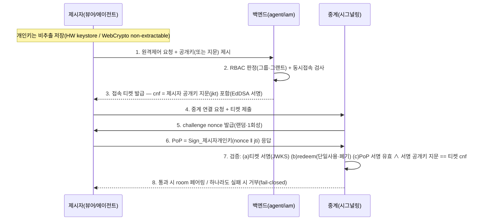

# C-01 접속 티켓 — 제시자 바인딩 설계 (B안: cnf + PoP)

> **상태: 설계 제안 — 미확정.** 중계(시그널링) 담당팀 확인용. `docs/contracts/session-authz.md` v0.1(접속 티켓 기본 계약)을 **바인딩 층까지 확장**한 제안이다.
> 목적: 원격제어 접속 티켓이 "탈취·재생"에 견디도록 **제시자 소유증명(PoP)** 을 얹는 설계를 정리하고, **중계 서버(레거시 재사용/신규 신설 미정)가 이를 지원 가능한지**를 묻는다.
> 파생: `#273521` 논점 6 · 검토 근거 = `docs/design/research/auth-session-architecture-review.md`.

---

## 1. 배경 — 왜 서명검증만으론 부족한가

접속 티켓은 뷰어(사용자)가 원격제어를 요청하면 백엔드가 RBAC 판정 후 발급하는 **단기 서명 토큰**이다(EdDSA, iam JWKS). 중계는 뷰어·에이전트가 각각 낸 티켓을 검증해 같은 방(room)에 페어링한다.

기존 계약(session-authz v0.1)의 검증은 **JWKS 오프라인 서명검증**이다 — 빠르고 중계가 백엔드를 호출하지 않아도 되지만, **bearer 토큰의 근본 한계**를 갖는다:

> **서명은 "이 티켓이 진짜 백엔드가 발급한 것"만 증명하고, "이걸 낸 자가 정당한 소유자"는 증명하지 못한다.** (도장 찍힌 입장권을 주워도 도장은 여전히 진짜)

**레거시도 동일 문제를 갖는다** — 레거시 MQTT 연결 인증(`MqttAuthHelper.generateToken` = ECDSA 서명 JWT + 토픽 ACL)도 bearer JWT라, 토큰을 탈취하면 그대로 재제출해 통과한다. 즉 이 취약점은 신규 설계만의 문제가 아니라 **레거시가 이미 안고 있는 구조적 문제**다.

## 2. 위협모델 — 방어 목표

| # | 위협 | 서명검증만(A) | +짧은 exp | +단일사용/redeem(B0) | +바인딩(B) |
|:--|:--|:--:|:--:|:--:|:--:|
| T1 | 위조 티켓(서명 없이 제작) | ✅ | ✅ | ✅ | ✅ |
| T2 | 탈취 후 나중 재생(만료 뒤) | ❌ | ✅ | ✅ | ✅ |
| T3 | 탈취 후 재사용(2회+) | ❌ | ❌ | ✅ | ✅ |
| T4 | 발급 후 권한 변경 즉시 반영(폐기) | ❌ | ❌ | ✅ | ✅ |
| **T5** | **탈취/MITM 후 만료 전 첫 제출 가로채기** | ❌ | ❌ | ❌ | **✅** |

- **T5 시나리오(원격제어에서 특히 위험)**: ① 뷰어 PC가 감염돼 티켓이 디스크/메모리에서 유출 ② 뷰어↔백엔드 구간 MITM으로 티켓 탈취 — 두 경우 모두 공격자가 60초 내 진짜 뷰어보다 먼저 중계에 제출하면 서명·redeem을 다 통과한다. 원격제어는 피해가 크므로(타인 기기 제어) T5까지 막는 **B안**을 목표로 한다.

> **경계**: "감염된 PC에서 개인키가 실시간으로 오용되는 것"은 티켓 설계의 범위 밖이다(→ 세션 탈취 탐지·기기 상태 검증 상위 층). 티켓 바인딩의 천장 = "키를 훔쳐 다른 곳에서 재생"의 차단. 비추출 키를 쓰면 공격자는 감염된 그 기기에서 실시간으로만 움직일 수 있어 난이도·탐지성이 크게 오른다.

## 3. B안 설계 — 제시자 키 바인딩(cnf) + 연결 시 소유증명(PoP)

핵심: 티켓을 **"가진 자"가 아니라 "개인키를 가진 자"만** 쓸 수 있게 한다. 표준 = sender-constrained token(RFC 8705 mTLS-bound / RFC 9449 DPoP)의 `cnf`(confirmation) 클레임 패턴을 **중계 handshake용 nonce-challenge PoP** 로 구현(프로토콜 무관·이식적).

### 3.1 시퀀스

### 3.2 티켓 클레임 (session-authz v0.1 확장)

| 클레임 | 의미 | 상태 |
|:--|:--|:--|
| `jti` | 티켓 고유 ID(단일사용 키) | v0.1 |
| `aud` | `"signaling"`(사용자 AT와 혼용 차단) | v0.1 |
| `sid` `room` | 세션·방 식별 | v0.1 |
| `role` | `viewer` \| `agent`(방향성 — 뷰어 티켓으로 에이전트측 권한 취득 차단) | 논점7 신설 |
| `exp` | 만료(60초·연결 수립 창) | v0.1 |
| **`cnf`** | **제시자 공개키 지문(`jkt` = JWK SHA-256 thumbprint)** | **B안 신설(핵심)** |

### 3.3 PoP handshake (중계가 구현해야 할 부분)

1. 연결 수립 단계에서 중계가 **랜덤 nonce**(재생 방지·짧은 수명) 발급.
2. 제시자가 자기 개인키로 `(nonce ‖ jti)`(또는 표준 PoP 페이로드)를 서명해 응답.
3. 중계 검증: ① PoP 서명이 유효한가 ② PoP에 쓴 공개키의 지문이 **티켓 `cnf`와 일치**하는가. 불일치·실패 = 연결 거부.

> 알고리즘: 에이전트·모바일이 이미 쓰는 **ES256(P-256)** 재사용 권장(모바일 2FA §7.2 서명 스택 재사용). 티켓 자체 서명은 iam의 EdDSA 유지 — 둘은 별개 층.

## 4. 제시자별 키 확보

| 제시자 | 키 저장 | 확보 방법 | 비용 |
|:--|:--|:--|:--|
| **에이전트(디바이스)** | OS 키스토어(비추출) | **논점 5의 기기 등록 키쌍 재사용** | ~0 (이미 있음) |
| **앱 뷰어** | 안드 Keystore / iOS Keychain | 앱 최초 실행 시 키쌍 생성·공개키 등록 | 낮음 |
| **웹 뷰어** | 브라우저 WebCrypto **non-extractable** P-256 | 로그인/티켓 요청 시 키쌍 생성·공개키 등록 | 중(브라우저·시크릿모드·다중탭 세션 관리 설계 필요) |

## 5. 3층 방어 요약

| 층 | 수단 | 막는 위협 | 상태·의존 |
|:--|:--|:--|:--|
| 1 서명검증 | JWKS 오프라인(EdDSA) | T1 | iam 키 로테이션(논점2)에 의존 |
| 2 단일사용·폐기 | redeem(공유 스토어 jti 원자 소비) | T3·T4 | **중계↔백엔드 redeem 왕복 필요**(A-02 세션시작 통지에 겸용 가능) |
| 3 바인딩 | cnf + PoP handshake | **T5**(탈취·MITM) | **중계가 nonce-challenge PoP 지원해야 성립** |

- redeem은 바인딩을 얹어도 여전히 필요하다(단일사용·즉시폐기는 PoP로 안 됨). redeem = 공유 스토어(Redis) `jti` **원자 compare-and-delete + 동기 응답**(TOCTOU·다중노드 재생 차단·fail-closed).

## 6. ★ 중계(시그널링) 담당팀 확인 요청 — 실현성 질문

> B안의 성패는 **중계가 아래를 할 수 있느냐**에 달려 있다. 레거시 재사용/신규 신설 모두 이 질문에 답이 필요하다.

**Q1. (바인딩 핵심) 연결 handshake에 challenge-response(PoP)를 얹을 수 있나?**
- 연결 수립 시 중계가 nonce를 발급하고, 제시자의 서명 응답을 받아 검증하는 왕복을 프로토콜에 추가할 수 있는가?
- **레거시 재사용 시**: 현재 연결 프로토콜이 무엇인가(MQTT CONNECT? WebSocket? 커스텀 TCP?)? 그 handshake에 nonce·PoP 필드를 실을 여지가 있는가, 아니면 프로토콜 변경이 필요한가?

**Q2. 티켓 검증 로직을 중계가 수행 가능한가?**
- ① JWKS 오프라인 서명검증(iam `/.well-known/jwks.json` fetch·캐시) ② PoP 서명검증 + `cnf` 지문 대조 — 이 암호 연산을 중계에서 수행할 수 있는가(라이브러리·성능)?

**Q3. redeem(단일사용·폐기) 왕복이 가능한가?**
- 중계가 연결 수립 시 백엔드에 `jti`를 redeem(소비 확인)하는 동기 호출을 넣을 수 있는가? (A-02 세션시작 통지와 겸용 가능)
- 불가하면 대안 = 중계가 자체 공유 스토어로 `jti` 단일사용 보장. 그 인프라가 있는가?

**Q4. 강제 종료(disconnect) 제어 채널이 있는가?**
- 티켓 exp(60초)는 "연결 수립"용이고, 세션은 그 뒤 장시간 유지된다. 세션 도중 백엔드가 "이 세션 즉시 끊어"를 중계에 명령하는 채널이 필요하다(레거시 `force_disconnect` 선례). 백엔드→중계 명령 계약이 가능한가?

**Q5. role 방향성·room 격리를 중계가 집행하나?**
- 뷰어 티켓(`role=viewer`)과 에이전트 티켓(`role=agent`)을 구분해, 뷰어가 에이전트측 채널 권한을 못 갖게 격리하는가? 판정은 백엔드 1곳(중계는 scope 집행만·재판정 금지).

## 7. 레거시 vs 신규 경로

| | 레거시 중계 재사용 | 신규 중계 신설 |
|:--|:--|:--|
| Q1 PoP handshake | **블로커** — 기존 프로토콜에 challenge-response 추가 가능성이 관건. 불가하면 B안 후퇴(A+redeem만) 또는 최소 handshake 확장 | 처음부터 설계에 포함 → 깔끔 |
| Q2 검증 | 레거시 검증 로직 확장 필요 | 신규 구현 |
| Q3 redeem | 레거시↔백엔드 호출 경로 유무 | 설계 포함 |
| 권장 | 확장 가능하면 재사용, 아니면 B안 제약 명시 | B안 완전 구현 |

> **레거시가 B안을 못 받으면** 그 경로는 T5(탈취·MITM 재생)에 노출된 채 남는다 — 이는 "레거시가 이미 안고 있는 위험"의 명시이지 신규 설계의 후퇴가 아니다. 레거시 재사용 여부 결정 시 이 위험 수용을 함께 판단해야 한다.

## 8. 미결·의존

1. 중계 소유·레거시/신규 결정(위 §6·§7의 전제).
2. 웹 뷰어 키쌍 관리 상세(브라우저 세션·재발급).
3. redeem을 A-02 통지에 겸용할지, 별도 동기 호출로 분리할지(session-authz v0.1 미결 Q3).
4. iam 서명키에 티켓·AT가 함께 실리므로 **`aud` 강제가 선행조건**(auth review INV-1) — 티켓 도입 전 각 검증 주체 `aud` 명시 강제.
5. 동시접속 한도(B-03) 검사 시점(발급 시 vs 세션시작 통지 시).

## 결정 이력

| 날짜 | 내용 |
|:--|:--|
| 2026-07-03 | 설계 제안 작성 — session-authz v0.1에 제시자 바인딩(cnf+PoP) 층 추가(B안). 오석진 "원격제어=B안" 결정 파생. 중계팀 실현성 질문 §6 5건. 레거시도 동일 취약(bearer JWT)임을 명시. 미확정 — 중계 담당·레거시/신규 결정 후 session-authz 정본에 반영. |
