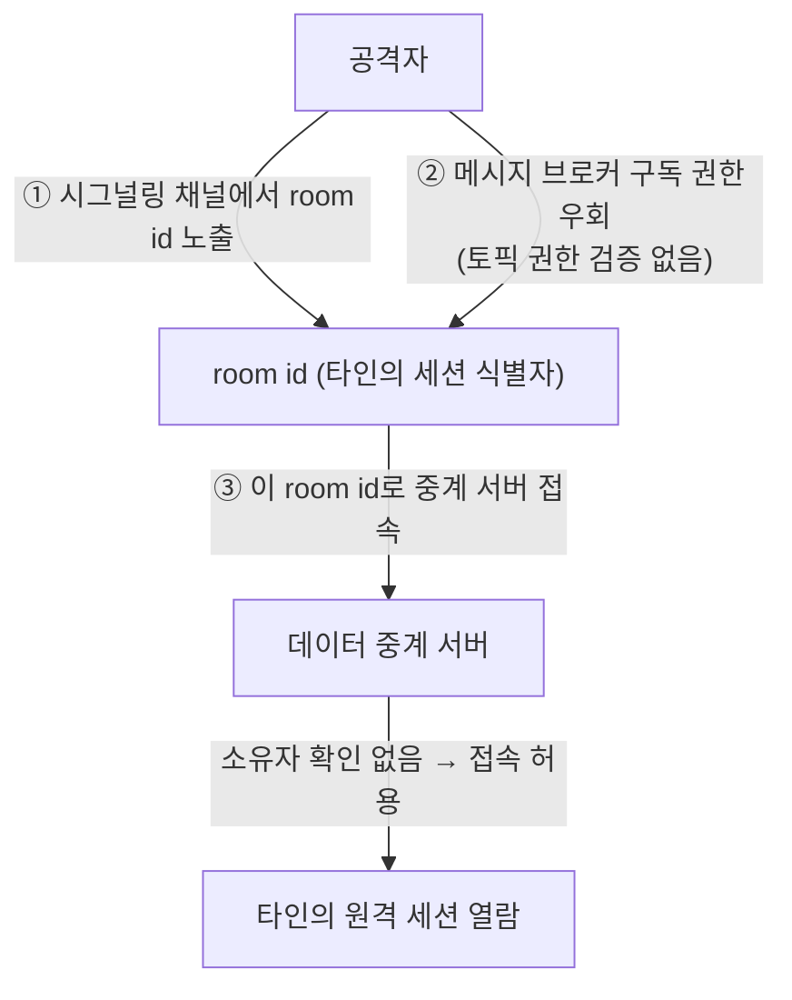
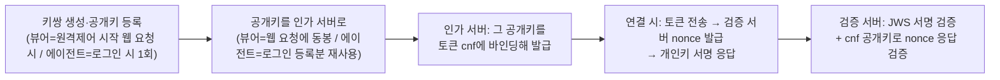
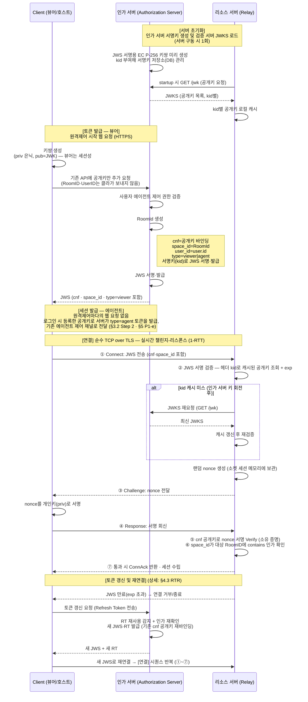
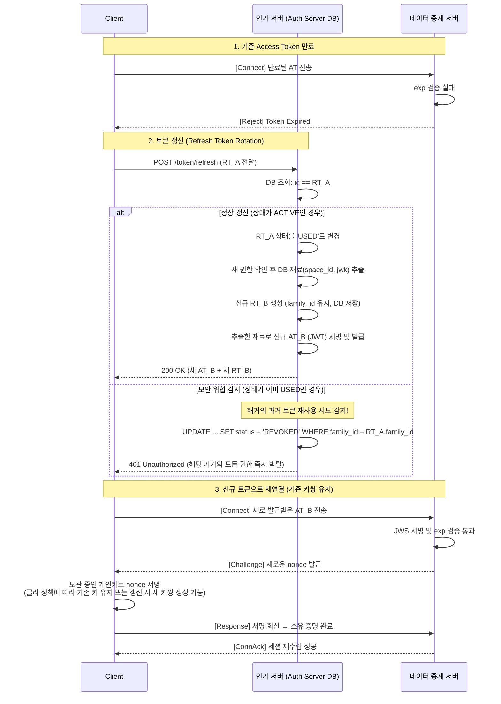

# 발신자 구속 토큰(Sender-Constrained) 기반 실시간 릴레이 인증 아키텍처

이 문서는 비(非)HTTP 실시간 채널(MQTT·WebSocket·순수 TCP)의 인가 모델을 소지자(Bearer) 토큰에서 발신자 구속 토큰(Sender-Constrained Token)으로 전환하는 아키텍처 명세입니다. 토큰을 소지하기만 하면 통과하던 구조를, 그 토큰에 묶인 개인키를 실제로 보유한 발신자만 통과하도록 격상합니다. 구현 수단은 cnf 키 바인딩(RFC 7800)과 실시간 챌린지-리스폰스 소유 증명(PoP)이며, 무상태 JWS 검증 위에 얹어 연결당 단일 왕복(1-RTT)으로 토큰 탈취와 리플레이를 무력화합니다.

> **문서의 성격:** 이 문서는 백엔드·인프라 관점에서 반드시 지켜야 할 **인증 게이트웨이의 보안 프로토콜·경계(Boundary) 표준 규격**을 정의합니다. 암호학적 검증 로직과 보안 경계는 단단히 고정하되, 기기 내부의 키 저장 방식·라이프사이클 처리·플랫폼별 인터페이스 등 구체적 구현체는 규격으로 강제하지 않습니다. 이 규격을 바탕으로 각 파트(서버·웹·앱·인프라) 담당자들이 모여 세부 구현 스펙을 유연하게 조율해 나가는 것을 전제로 합니다.

## 용어 정리

이 문서는 인증 토큰을 세 가지 관점으로 구분해 사용합니다. 혼동을 피하기 위해 먼저 정의합니다.

| 용어 | 층위 | 정의 |
|------|------|------|
| **Access Token** | 역할(Role) | 인가 서버가 발급하는 자격 증명의 '역할'. "이 토큰의 소유자는 Relay에 접속할 자격이 있다"를 나타내는 논리적 개념입니다. |
| **JWT** (JSON Web Token) | 포맷(Format) | Access Token을 구현하는 '데이터 포맷'. Header·Payload·Signature 세 부분으로 구성된 클레임 컨테이너이며, `cnf`·`space_id`·`exp` 등의 클레임이 담깁니다. |
| **JWS** (JSON Web Signature) | 상태(State) | 서명이 완료되어 검증 가능한 상태의 JWT. **검증 서버가 실제로 다루는 주요 검증 대상**이며, `eyJ...` 형태의 compact 직렬화 문자열로 전달됩니다. |
| **JWK** (JSON Web Key) | 키 표현 | 공개키·개인키를 표현하는 표준 포맷(`{kty,crv,x,y}`). 인가 서버 서명키와 클라이언트 키쌍이 모두 이 형태로 오갑니다. |

정리하면, 인가 서버는 **Access Token(역할)을 JWT(포맷)로 표현하고 서명하여 JWS(검증 가능 상태)로 발급**하며, 검증 서버는 이 JWS의 서명과 클레임을 검증합니다. 이후 본문은 이 용어들을 문맥에 맞게 구분해 사용합니다.

## 목차

- **1. 배경 및 문제 정의** — 현행 아키텍처의 한계, TLS와 PoP의 직교성, 공격 모델
- **2. 목표 아키텍처** — 발신자 구속으로의 패러다임 전환, cnf 키 바인딩 소유 증명(PoP)
- **3. 검증 시퀀스 및 구현 명세** — Step 0~5 흐름, 시퀀스 다이어그램, 역할별 Task List
- **4. 운영 및 배포 전략** — 무상태 유지, 리플레이 방어, 토큰 생애주기(RTR), 키 롤링, 하드닝, 장애 모드, 성능 방법론
- **5. 결론 및 Action Items** — P0~P3 과제, 부록(설계 결정·미채택안)

---

# 1. 배경 및 문제 정의

## 1.1 서버 역할과 무상태 검증 구조

이 아키텍처의 서버는 OAuth 2.0 표준 역할에 매핑됩니다. **토큰을 발급하는 곳은 하나(인가 서버), 그 토큰을 검증하고 자원을 내주는 곳은 여럿(리소스 서버)**입니다.

- **인가 서버 (Authorization Server)** — 개인키를 보유하며 Access Token을 서명·발급하고 `cnf` 공개키를 주입합니다. 통상 사용자가 로그인하는 백엔드/웹앱 서버가 겸하며 `iss` 클레임이 가리키는 주체입니다.
- **리소스 서버 (Resource Server)** — 공개키만 보유하며 JWS 서명과 소유 증명을 검증하고 보호 자원을 제공합니다. 이 아키텍처에는 두 개가 있습니다.
  - **① 세션 제어 서버** — 세션 제어를 제공하며 프로토콜은 `wss://`(WebSocket)입니다.
  - **② 데이터 중계(Relay) 서버** — 실시간 스트림을 제공하며 프로토콜은 순수 `tcp://`입니다. 본 문서가 검증 게이트를 신설하는 대상입니다.

두 리소스 서버는 자격 증명을 어디서 받느냐(WSS upgrade 헤더 vs 순수 TCP 최초 프레임)만 다를 뿐 검증 의무는 동일합니다.

검증 서버가 인가 서버에 의존하지 않고 **로컬에서 무상태(Stateless)로 검증**하는 것은 대규모 실시간 트래픽을 감당하기 위한 핵심 설계입니다. 다음 두 제약이 이 구조를 요구합니다.

1. **저장소·상태 부재** — 검증 서버에 사용자·에이전트 관계를 조회할 DB가 없습니다. 권한 정보를 토큰 Payload에 실으면 DB 없이 검증됩니다.
2. **검증 병목 회피** — 접속마다 인가 서버에 질의하는 서버 간 검증(S2S)이나 클라이언트의 사전 검증 호출은 접속 1건마다 왕복(RTT)을 만들어 인가 서버를 단일 병목·단일 장애점으로 만듭니다.

따라서 클라이언트가 위조 불가능한 출입증(JWS)을 직접 소지하고, 검증 서버가 시작 시 캐싱한 공개키(JWKS)만으로 그 자리에서 로컬 검증합니다. 검증이 CPU 로컬 연산이라 지연이 트래픽과 무관하고, 인스턴스를 늘려도 공유 저장소가 필요 없으며, 접속마다의 인가 서버 통신이 0회입니다.

## 1.2 현행 아키텍처의 한계 — 데이터 중계 서버의 검증 부재

과거 아키텍처에서 JWS 서명 검증은 세션 제어 서버에만 존재했고, **데이터 중계(TCP) 서버에는 서명 검증 자체가 없었습니다.** 중계 서버는 세션 식별자(RoomID)만으로 접속을 허용했으므로, RoomID는 사실상 "소지하면 곧 접근 권한"인 Bearer capability로 동작했습니다. RoomID는 세션 협상·구독 과정에서 여러 주체에게 노출되는 식별자인데, 중계 서버가 그 정당한 소유자를 검증하지 않았기 때문에 어떤 경로로든 RoomID를 얻은 사람은 누구나 타인의 세션에 접속할 수 있었습니다. 이것이 사고의 근본 원인인 **인가 결함(Broken Access Control)**입니다.

실제 공격 체인은 네트워크 스니핑 없이도 성립했습니다.

1. **시그널링 채널의 세션 메타데이터 노출** — 세션 협상 과정에서 오가는 응답 데이터에 RoomID가 포함되어, 진행 중인 세션의 RoomID를 확보할 수 있었습니다.
2. **메시지 브로커의 구독 권한 우회** — 브로커에 토픽 구독 권한 검증이 없어, 다른 사용자가 구독 중인 토픽 데이터를 그대로 열람할 수 있었습니다.
3. **획득한 RoomID로 중계 서버 접속** — 그 RoomID로 중계 서버에 접속하면 소유자 확인 없이 타인의 원격 제어 화면을 열람할 수 있었습니다.



RoomID 유출 경로(시그널링 채널·브로커 구독)는 모두 암호화된 정상 경로이므로, 전송 암호화만으로는 닫히지 않습니다. 문제의 핵심은 전송 노출이 아니라 **소유자 확인 없이 식별자만으로 접속을 허용한 인가 설계**에 있습니다. 이 결함은 이후 두 축으로 해소합니다 — 접속 주체를 개인키 소유에 결착하는 소유 증명(§2)과, 브로커 계층의 토픽 구독 권한 검증(§5 P1)입니다.

이 밖에 다음 한계가 함께 존재합니다.

| 문제 | 설명 | 위험도 |
|------|------|--------|
| 키 롤링 미구현 | 단일 키만 사용. 교체 시 발급된 모든 토큰이 일시 무효화 | 높음 |
| 만료(exp) 없음 | 토큰에 exp 미설정 → 탈취 시 무기한 유효 | 중간 |
| 인가 서버 단일 장애점 | 인가 서버 다운 시 신규 발급 불가 (기존 연결은 유지) | 중간 |
| 표준 클레임 미검증 | `aud`·`space_id` 미검증 → OAuth2 리소스 서버 표준 이탈 | 중간 |

## 1.3 보안 모델 — TLS와 PoP의 직교성

전송 구간 TLS는 이미 적용 완료된 전제입니다. 그러나 TLS만으로 위 인가 결함이 닫히지 않는 이유는, **전송 암호화와 소유 증명이 서로 다른 계층에서 다른 속성을 보호하는 직교(orthogonal) 관계**이기 때문입니다. 이 관계를 여기서 한 번 정의하고, 이후 본문은 이 정의를 전제로 전개합니다.

먼저 두 계층의 키는 이름은 모두 '키'이지만 역할이 다릅니다.

| 구분 | TLS 인증서 | JWK (EC P-256) |
|------|-----------|----------------|
| 계층 | 전송 계층 (연결 보호) | 애플리케이션 계층 (메시지 진위) |
| 목적 | "도로(연결)"를 암호화 | "택배(Access Token)"의 진위를 증명 |
| 주인 | 리소스 서버(세션 제어/중계) | 인가 서버 (직접 생성) |
| 대표 알고리즘 | RSA (X.509) | ECDSA (P-256 곡선) |

이 계층 분리에서 두 축의 보호 범위가 갈립니다.

- **TLS는 "무엇이 흐르는가"를 보호합니다**(스트림 기밀성·무결성). 소유 증명(PoP)은 연결 핸드셰이크만 인증하고 스트림 본문은 서명하지 않으므로, 이 속성을 대신하지 못합니다.
- **PoP·인가는 "어떤 주체가 접속하는가"를 보호합니다**(접속 소유권·권한). RoomID는 도청이 아니라 정상 응답·구독 데이터로 유출되므로, TLS는 이 속성을 대신하지 못합니다.

| 적용한 것 | 지켜지는 속성 | 잔여 취약점 |
|-----------|--------------|-----------|
| TLS만 (전송 암호화) | 전송 기밀성·무결성 | 인가 결함 — 정상 경로로 얻은 RoomID 재사용으로 소유자 확인 없이 접속 |
| PoP·인가만 (TLS 없음) | 접속 주체의 소유권·권한 | 기밀성·무결성 취약점 — 평문 스트림 도청으로 화면 열람, 능동 MITM이 평문 구간 변조·주입 |
| 둘 다 (병행) | 소유권 + 전송 기밀성·무결성 | 근본 해결 — 획득한 식별자는 개인키 없이 무용, 스트림은 도청·변조로부터 보호 |

두 축은 서로를 포섭하지 않으므로 병행이 필수입니다. TLS는 이미 충족된 전제이고, 남은 작업은 인가 축을 세우는 소유 증명입니다.

## 1.4 공격 모델 — 리플레이와 중간자(MITM)

TLS 적용 후 현실적인 토큰 탈취 경로는 네트워크 스니핑이 아니라 다음 둘입니다. 두 경우 모두 §2의 챌린지-리스폰스 하나로 방어됩니다.

| 공격 | 방식 · TLS의 한계 | 소유 증명(PoP)의 방어 |
|------|-------------------|----------------------|
| **엔드포인트 탈취 후 리플레이** | 감염 단말·악성 확장·로그 유출·XSS 등으로 종단에서 토큰이 유출되는 경우. TLS는 전송만 보호하므로 종단 탈취는 막지 못함 | 토큰을 탈취해도 **개인키가 없어** 검증 서버가 던진 nonce에 서명하지 못함 |
| **무작위 대입 (Brute Force)** | 유효한 RoomID·토큰 형식을 알아내려 무작위 문자열을 지속 대입. TLS 입장에선 정상 암호화된 요청이라 통과시킴 | 값을 우연히 맞혀도 nonce에 개인키로 서명하지 못하면(cnf 공개키 검증 실패) 거부 |
| **중간자·선점 재전송 (MITM)** | `trust-all` 등으로 TLS 보호가 상실된 환경에서 프록시가 이전 연결의 토큰·응답을 가로채 재전송 | 검증 서버가 **연결마다 새 nonce를 발급**하므로 과거 연결에서 캡처한 응답은 새 nonce와 불일치해 거부 |

순수 JWS는 "누가 소지했는가"가 아니라 "서명이 유효한가"만 검증하는 Bearer 토큰이므로, 탈취된 토큰의 재전송을 스스로 막지 못합니다. 해결의 방향은 토큰을 클라이언트의 개인키 소유에 묶고(bind), 연결 시점에 그 소유를 실시간으로 증명하게 하는 것입니다 — 이것이 §2에서 제시하는 목표 아키텍처입니다.

---

# 2. 목표 아키텍처 — 발신자 구속 및 소유 증명(PoP)

## 2.1 패러다임 전환 — Bearer에서 Sender-Constrained로

인가 기준을 "무엇을 소지했는가"에서 "정당한 키의 소유자인가"로 옮깁니다. 인가 서버는 클라이언트의 공개키를 토큰의 `cnf` 클레임에 결착하여 발급하고, 검증 서버는 연결 시점에 일회성 난수(nonce)를 던져 클라이언트가 개인키로 실시간 서명하게 하는 챌린지-리스폰스를 수행합니다. 그 결과 클라이언트는 증명 토큰을 미리 만들 필요가 없고, 서버는 상태 공유나 저장소 없이 완전한 무상태로 탈취·리플레이를 차단합니다.

이 아키텍처는 두 원칙 위에 섭니다.

- **증명과 권한의 분리** — 챌린지-리스폰스는 '해당 키를 소유함'(발신자 구속)만 증명합니다. 접근 가능한 자원은 토큰의 `space_id`(대상 RoomID)·`type`(주체 유형) 클레임이 결정하며, 검증 서버는 소유 증명 후 `space_id`가 접속 대상 RoomID에 포함(contains)되는지를 별도로 강제합니다(§3).
- **HTTP 컨텍스트 부재 대응** — 순수 TCP 기반이므로 증명을 특정 HTTP 요청(메서드·URI)에 묶지 않습니다. 연결의 신선도(freshness)는 검증 서버가 연결마다 발급하는 nonce를 소켓 세션 로컬 상태에서 처리해 보장합니다.

## 2.2 핵심 개념 — cnf 키 바인딩 소유 증명

먼저 비유로 골격을 잡습니다. **일반 JWS는 평범한 호텔 카드키**입니다. 문(검증 서버)은 카드가 유효한지만 확인하므로, 카드를 습득하면 누구나 문을 열 수 있습니다. 이것이 현재 구조의 약점(리플레이)입니다. **cnf 키 바인딩(PoP)은 지문 인식 카드키**입니다. 카드에 소유자의 공개키가 새겨져 있고, 문을 열 때 문이 즉석에서 낸 문제(nonce)에 실제 손가락(개인키)으로 서명해야 열립니다. 개인키는 기기 밖으로 나가지 않으므로 카드를 탈취해도 소용이 없습니다.

이를 구현한 것이 암호학적 키 바인딩과 실시간 챌린지-리스폰스이며, 네 요소로 구성됩니다.

- **클라이언트 키쌍(Client Key Pair)** — 클라이언트가 EC P-256 키쌍을 생성하고, **개인키는 어떤 경우에도 기기 밖으로 반출하지 않습니다**(비유의 "손가락"). 이것이 이 아키텍처가 강제하는 **유일한 불변식**입니다. 키를 영구 저장해 재사용할지 원격제어마다 새로 생성할지 같은 **수명(lifecycle)은 클라이언트 재량**입니다 — 뷰어는 원격제어 시작 웹 요청 경로가 있어 둘 다 자유롭게 선택할 수 있고, 에이전트는 공개키를 매 원격제어마다 다시 보낼 웹 요청 경로가 없어 로그인(기기 등록) 시 등록한 키쌍을 재사용하는 형태가 됩니다. 즉 "임시(ephemeral)"라는 단정은 정확하지 않으며, 중요한 것은 수명이 아니라 개인키 비반출입니다(상세 §3 [Step 1]).
- **cnf 공개키 바인딩(RFC 7800)** — 인가 서버가 클라이언트의 공개키(JWK)를 Access Token의 `cnf`(confirmation) 클레임에 바인딩합니다. (비유의 "소유자 정보")
- **실시간 챌린지-리스폰스** — 검증 서버가 연결 시 랜덤 nonce를 발급하고, 클라이언트가 개인키로 서명해 되돌리면 `cnf` 공개키로 검증합니다. "지금, 이 연결에서, 이 키의 정당한 소유자가 접속했음"이 증명됩니다.
- **무상태 검증** — JWS 서명 검증과 챌린지 응답 서명 검증을 순수 CPU 연산으로 수행합니다. nonce는 해당 연결의 소켓 세션 메모리에만 머물러 공유 스토어가 필요 없습니다.

이 방식의 골격은 **바인딩(cnf 공개키)은 토큰 발급 시점에 확정**되고, **그 키의 소유는 연결 시점에 실시간 챌린지-리스폰스로 증명**된다는 것입니다.



발급은 인가 서버가, 소유 증명 검증은 세션 제어 서버와 데이터 중계 서버 양쪽 모두가 담당합니다. 특히 데이터 중계 서버에는 검증 게이트를 최초로 세우되, 단순 Bearer 서명 검증에 멈추지 않고 곧바로 발신자 구속(cnf 키 바인딩 + 챌린지-리스폰스 PoP)으로 격상합니다.

## 2.3 두 개의 키쌍 구분

이 아키텍처에는 역할이 전혀 다른 두 개의 키쌍이 등장합니다. 검증 서버는 **키쌍 A로 "발급 진위"를, 키쌍 B로 "소유 진위"를** 각각 무상태로 대조합니다.

| 구분 | **키쌍 A — 인가 서버 서명키** | **키쌍 B — 클라이언트 키쌍** |
|------|------------------------------|-------------------------------|
| 소유자 | 인가 서버 | 클라이언트(뷰어·에이전트) |
| 생성·수명 | 사전 생성, 서명키 저장소(DB)에서 관리(`id`=kid) | **클라이언트 재량**(불변식은 개인키 비반출 하나) — 뷰어: 매번 생성·영구 저장 모두 가능 / 에이전트: 웹 요청 경로가 없어 로그인 등록분 재사용 |
| 용도 | Access Token(JWS) 서명·발급 | nonce 챌린지 응답 서명 |
| 공개키 전달 | JWKS(`GET /jwk`)로 검증 서버가 캐싱 | **뷰어**: 원격제어 시작 웹 요청에 동봉 → `cnf`에 바인딩 / **에이전트**: 로그인 시 등록해 둔 공개키를 서버가 `cnf`에 바인딩 |
| 검증 서버의 사용 | 헤더 `kid`로 캐시 조회 → JWS 서명 검증 | 토큰의 `cnf` 공개키로 nonce 응답 검증 |
| JWKS 관계 | JWKS의 본체 | **JWKS와 무관** (캐시에 없는 게 정상) |
| 증명하는 것 | "유효한 인가 서버가 발급한 토큰인가" | "이 연결에 키의 정당한 소유자가 접속했는가" |

`kid` 캐시 미스에 따른 JWKS 재요청은 오직 키쌍 A에만 해당합니다. 키쌍 B는 토큰 내부의 `cnf` 공개키로만 검증하므로 외부 질의가 없습니다. 키쌍 B가 에이전트처럼 장수명이어도 소유 증명의 안전성은 약화되지 않습니다 — 신선도(freshness)는 키 교체가 아니라 **연결마다 새로 발급되는 nonce**가 보장하므로, 같은 키쌍이라도 과거 연결의 서명은 재사용할 수 없습니다(§4.1).

---

# 3. 검증 시퀀스 및 구현 명세

이 절이 실제 구현 기준입니다. 전체 시퀀스는 서버 구동 시 1회 수행하는 [서버 초기화], 토큰을 받는 [세션 발급], 실시간 소유 증명이 일어나는 [연결], 그리고 만료 시 끊김 없는 통신을 위한 [토큰 갱신(RTR)]으로 순환합니다.

## 3.1 전체 시퀀스



이 시퀀스가 대조하는 것은 결국 **두 개의 서명**입니다. 검증 서버는 외부에 되묻지 않고 받은 토큰과 응답만으로 로컬 검증합니다.

- **JWS 서명(키쌍 A)** — 인가 서버 공개키(JWKS 캐시)로 "이 토큰이 유효한 인가 서버가 발급한 것인가"를 검증합니다.
- **nonce 응답 서명(키쌍 B)** — 토큰의 `cnf` 공개키로 "방금 던진 nonce에 그 개인키 소유자이 서명했는가"를 검증합니다.

마지막 [토큰 갱신(RTR)] 구간은 라이프사이클이 [연결]에서 끝나지 않고 순환함을 보여주는 하이레벨 흐름입니다. 갱신 시 발생하는 **재사용 감지(Reuse Detection)와 권한 회수(Revocation)** 등 RTR의 구체적 방어 메커니즘은 §4.3에서 상세히 다룹니다.

## 3.2 단계별 구현 — 설명·의사코드·실제 값

아래는 각 단계를 설명·의사코드·실제 값 예시와 함께 순서대로 따라간 것입니다. 값은 형태가 실제와 같은 예시이며, base64url·서명은 실제로 훨씬 깁니다.

### [서버 초기화·Startup] 검증 서버의 JWKS 캐싱 (키쌍 A · 세션 이전 1회)

검증 서버는 구동(startup) 시 인가 서버로 `GET /jwk`를 호출해 JWS 검증용 공개키(JWKS)를 받아 로컬 메모리에 `kid`별로 캐싱합니다. 이후 접속마다의 인가 서버 통신은 없습니다.

### [Step 1] 클라이언트 키쌍 준비 (개인키 비반출이 유일 불변식 · 수명은 클라 재량)

클라이언트가 EC P-256 키쌍을 생성하고, 공개키만 JWK 형태로 서버에 등록됩니다. **이 아키텍처가 강제하는 유일한 불변식은 "개인키를 기기 밖으로 반출하지 않는다"이며, 키를 영구 저장해 재사용할지 매번 새로 만들지 같은 수명은 클라이언트 재량입니다.** 다만 공개키를 서버에 전달하는 경로가 유형별로 달라, 실무적 수명도 그에 따라 갈립니다.

- **뷰어**는 원격제어 시작 웹 요청 경로가 있으므로, 요청마다 키쌍을 새로 만들든 만들어 둔 키를 재사용하든 자유롭게 선택할 수 있습니다.
- **에이전트**는 원격제어마다 공개키를 다시 보낼 웹 요청 경로가 없으므로, 로그인(기기 등록) 시점에 공개키를 한 번 등록하고 그 키쌍을 재사용합니다(사실상 장수명). 원격제어 세션이 열릴 때 서버는 이미 등록된 이 공개키로 에이전트용 토큰을 발급합니다([Step 2]).

<details>
<summary><b>클라이언트 키쌍 생성 (pseudo)</b></summary>

```text
// Client - 런타임 키쌍 생성 (pseudo)
keyPair    = generateKeyPair("EC", "P-256")
privateKey = keyPair.private   // 메모리에만 보관, 반출 금지
publicJwk  = keyPair.public.toJWK()   // { kty:"EC", crv:"P-256", x, y }
```

</details>

이 설계의 안전성은 개인키가 기기 밖으로 나가지 않는다는 데 달려 있으므로, 클라이언트 유형마다 보관 방식을 달리 설계합니다.

| 클라이언트 유형 | 개인키 저장 | 키 수명 · 공개키 등록 시점 | 비용·주의 |
|---|---|---|---|
| **에이전트(디바이스)** | OS 키스토어(비추출) | 로그인(기기 등록) 시 1회 등록·재사용 — 원격제어마다 재전송할 웹 요청 경로가 없어 사실상 장수명 | ~0 (이미 있으면) |
| **네이티브 앱 뷰어** | Android Keystore / iOS Keychain | 클라 재량(앱 정책) — 통상 앱 최초 실행 시 생성·공개키 등록 | 낮음 |
| **웹 뷰어(브라우저)** | WebCrypto **non-extractable** `CryptoKey`(P-256) | 클라 재량 — 원격제어 시작 요청마다 생성하거나 세션 유지 모두 가능. 탭·새로고침 시 키 수명 관리 | 중 |

> 지켜야 할 대원칙은 하나입니다 — **개인키를 프로세스·기기 밖으로 반출하지 않는다.** 이 경계만 지키면 됩니다. 구체적인 저장 방식(메모리·IndexedDB·OS 보안 영역 등)과, 브라우저 새로고침처럼 키가 소실되는 상황에서의 재발급·재인증 UX는 각 클라이언트(Web·iOS·Android) 플랫폼 전문가가 환경에 맞춰 최적의 형태로 설계합니다. 예컨대 웹 뷰어는 non-extractable `CryptoKey`로 XSS 유출을 막되 탭·새로고침 시 키 수명 관리를 어떻게 할지 플랫폼 재량으로 정하면 됩니다.

> **에이전트의 장수명 키가 보안을 약화시키지 않습니다.** 소유 증명의 신선도는 키 수명이 아니라 연결마다 새로 발급되는 nonce가 보장하므로(§4.1), 같은 키쌍이라도 과거 연결에서 캡처한 서명은 새 연결의 nonce와 불일치해 거부됩니다. 키 수명은 '얼마나 자주 새 키로 교체해 노출 표면을 줄이느냐'의 문제일 뿐, 리플레이 방어의 근거가 아닙니다.

### [Step 2] 토큰 요청 — 뷰어의 웹 요청 vs 에이전트의 등록 기반 발급

토큰을 얻는 경로는 클라이언트 유형에 따라 갈립니다. 공통점은 **`room_id`·`user_id`를 클라이언트 입력으로 받지 않는다**는 것이고, 차이는 대상(target)이 어떻게 서버에 전달되느냐입니다.

- **뷰어 (웹 요청 경로 있음)** — 별도의 새 요청을 추가하지 않습니다. **이미 존재하는 원격제어 시작 API가 제어 대상 agent id를 이미 보내고 있으므로**, 클라이언트가 추가로 실어야 하는 값은 **방금 만든 공개키(JWK) 하나뿐**입니다. 서버도 새 엔드포인트를 만들지 않고 그 기존 API를 그대로 활용해 발급합니다. 즉 대상은 "세션에 저장해 둔 값"이 아니라 기존 요청이 원래부터 담고 있던 agent id로 서버가 인지합니다.
- **에이전트 (웹 요청 경로 없음)** — 원격제어마다 서버를 호출하는 웹 요청이 없습니다. 대신 **로그인(기기 등록) 시 등록해 둔 공개키**가 서버에 이미 있고, 서버는 로그인 컨텍스트로 **에이전트의 신원(=대상)**을 이미 알고 있습니다. 따라서 원격제어 세션이 열릴 때 서버가 그 공개키로 에이전트용 토큰을 발급해 기존 에이전트 제어 채널로 전달합니다(에이전트는 대상 식별자도, 공개키도 이 시점에 새로 보내지 않습니다).

> **"기존 요청에 필드를 새로 추가해야 하나?"** — 뷰어의 변경은 기존 원격제어 시작 요청에 **공개키 필드 하나를 얹는 것**이 전부입니다. 대상 agent id는 그 API가 이미 전달하고 있으니 신규 입력이 아니고, 서버 측도 기존 API·기존 권한 검증을 재사용합니다. 아래 예시는 개념 설명을 위해 요청 형태를 단독으로 보인 것이며, 실제로는 프로젝트의 기존 원격제어 시작 엔드포인트에 `pub_key`가 추가된 모습입니다.

> **`room_id`·`user_id`는 클라이언트 입력으로 받지 않습니다 (IDOR 방지).** JWS 페이로드는 중계 서버가 읽을 '출력값'이지 클라이언트가 통제하는 '입력값'이 아닙니다. 만약 클라이언트가 `room_id`를 직접 지정하도록 두면, 공격자가 타인의 `room_id`를 넣어 유효한 토큰을 발급받는 IDOR 취약점이 생깁니다. 따라서 `user_id`는 인가 서버가 **로그인 세션 컨텍스트에서 직접 추출**하고, `room_id`(→`space_id`)는 인가 서버가 **권한 검증을 거쳐 직접 결정·생성**합니다([Step 3]). 기존 요청이 담고 있는 대상 agent id조차 서버가 제어 권한을 검증한 뒤에만 room 매핑에 사용합니다.

<details>
<summary><b>인가 서버 JWT 요청 — 뷰어 경로 (기존 원격제어 시작 API에 pub_key만 추가)</b></summary>

```http
POST /api/remote/relay-token HTTP/1.1        // ← 기존 원격제어 시작 API를 재사용. 에이전트는 이 웹 요청 자체가 없음.
Host: auth.example.com
Authorization: Bearer <사용자 로그인 세션/토큰>   // ← user_id는 여기서 서버가 추출 (Body로 받지 않음)
Content-Type: application/json

{
  // room_id·user_id는 보내지 않는다 (IDOR 방지 — 서버가 세션·권한으로 결정)
  "target_device_id": "dev-3f9c1a…",  // 기존 API가 이미 보내던 값 (신규 입력 아님) — 서버가 대상을 인지
  "pub_key": {                          // ★ 이번에 새로 추가되는 유일한 값 — 뷰어 공개키(cnf에 바인딩)
    "kty": "EC", "crv": "P-256",
    "x": "f83OJ3D2xF1Bg8vub9tLe1gHMzV76e8Tus9uPHvRVEU",
    "y": "x_FEzRu9m36HLN_tue659LNpXW6pCyStikYjKIWI5a0"
  }
}
```

</details>

### [Step 3] 인가 서버의 발급 (`cnf` 공개키 바인딩 + `space_id` 인가 클레임)

인가 서버는 받은 공개키를 **RFC 7800 표준에 맞게 최상위 `cnf.jwk`에 직접 바인딩**합니다. 이때 `user_id`는 **로그인 세션에서 추출한 값**을, `space_id`(RoomID)는 **권한 검증을 거쳐 서버가 결정·생성한 값**을 싣습니다(클라이언트 입력을 그대로 신뢰하지 않습니다). 주체 유형을 `type`으로 실은 뒤 `kid: "2"` 서명키(키쌍 A)로 서명해 발급합니다.

<details>
<summary><b>발급 JWT — Header·Payload (RFC 7800 표준형)</b></summary>

```jsonc
// JWT — RFC 7800 표준형 (커스텀 래퍼 없이 최상위 cnf 직접 배치)
// Header
{ "alg": "ES256", "typ": "JWT", "kid": "2" }
// Payload
{
  "space_id": "c8f1a9d2-4b7e-4f3a-9c2e-8a6f5d7b1e34",  // 서버가 결정·생성한 RoomID(guid) — ⑥ 인가에서 contains 검사
  "user_id":  "7a2d5c91-…",                             // 서버가 로그인 세션에서 추출한 사용자 식별자
  "type":     "viewer",                                  // 접속 주체 유형(viewer·agent)
  "exp":      1719300000,                                // 짧은 만료(§5 P1)
  "cnf": {                                               // RFC 7800 표준 — 최상위 배치, 커스텀 래퍼 금지
    "jwk": { "kty":"EC","crv":"P-256","x":"f83OJ…","y":"x_FEz…" }  // 클라 공개키 (⑤ nonce 서명 Verify)
  }
}
```

</details>

실제로는 위 JWT가 서명되어 점 두 개로 이어진 compact JWS 한 줄 문자열로 내려옵니다.

<details>
<summary><b>내려오는 실물 (compact JWS)</b></summary>

```text
// 내려오는 실물 (compact JWS, 한 줄) — Header {alg:ES256, typ:JWT, kid:"2"}
eyJhbGciOiJFUzI1NiIsImtpZCI6IjIifQ.eyJzcGFjZV9pZCI6Ii...(cnf.jwk·space_id 포함).MEUCIQDx7...(서명)
```

</details>

> **cnf는 RFC 7800 표준 구조를 강제합니다.** 공개키는 커스텀 래퍼 없이 최상위 `"cnf": { "jwk": … }`에 직접 배치합니다 — 표준 JOSE 라이브러리가 그대로 파싱·검증할 수 있어 상호운용성이 보장됩니다. 토큰 크기가 부담이면 공개키 원본 대신 RFC 7638 지문 `"cnf": { "jkt": … }`만 싣고 클라이언트가 챌린지 응답 시 공개키를 재제시하는 변형도 가능합니다(이 경우 `SHA256(제시된 공개키)==cnf.jkt` 대조 후 서명 Verify).

#### 발급 분기 — 방 개설(호스트) vs 방 참여(뷰어)

`room_id`를 서버가 결정한다는 원칙은 동일하지만, 발급 시점의 비즈니스 로직은 접속 주체에 따라 갈립니다. 어느 경우든 클라이언트는 `room_id`를 지정하지 못하며, `type` 클레임으로 주체가 구분됩니다.

| 주체 | 공개키·대상 전달 경로 | 인가 서버의 `room_id` 결정 | 발급 `type` |
|------|-----------|---------------------------|-------------|
| **호스트/에이전트 (방 개설)** | 원격제어마다의 웹 요청 없음 — **로그인 시 등록한 공개키** 재사용, 대상=자신은 로그인 컨텍스트로 서버가 인지 | **새 RoomID(UUID)를 신규 생성**하고 저장소에 기록 | `agent` |
| **뷰어 (방 참여)** | **기존 원격제어 시작 API**에 공개키만 추가(대상 agent id는 그 API가 이미 전달) | 대상 agent id에 대한 **제어 권한을 검증**한 뒤 매핑된 기존 RoomID 조회 | `viewer` |

> **중계 서버의 연결·검증 시퀀스([Step 4]~[Step 5])는 호스트·뷰어가 100% 동일합니다.** 분기는 오직 인가 서버의 발급 비즈니스 로직에만 존재하며, 그 결과물인 JWS(cnf·space_id·type)를 검증하는 방식은 두 주체가 완전히 같습니다. 즉 호스트 에이전트가 방을 최초 개설하려 접속하는 순간에도 동일한 PoP 챌린지-리스폰스를 거칩니다 — 다만 그 시점의 `space_id`는 서버가 방금 생성한 새 RoomID입니다. 다만 **토큰을 수령하는 경로**는 다릅니다 — 뷰어는 웹 요청의 응답으로 받고, 에이전트는 로그인 등록 기반으로 서버가 발급한 토큰을 기존 제어 채널로 전달받습니다(§5 P1-e).

### [Step 4] 데이터 중계 서버로 Connect 프레임 전송 (JWS만)

데이터 중계는 순수 TCP라 `Authorization` HTTP 헤더를 쓸 수 없습니다. 연결 직후 릴레이 프로토콜의 Connect 프레임에 발급받은 JWS만 담아 보냅니다. 소유 증명은 다음 단계의 nonce 챌린지-리스폰스로 이뤄지므로, 클라이언트가 미리 만드는 증명 토큰은 없습니다.

<details>
<summary><b>Connect 프레임 (JSON)</b></summary>

```json
// 순수 TCP 데이터 중계: 연결 직후 Connect 프레임
// 프레이밍은 릴레이 프로토콜 규격을 따른다(예: [4바이트 길이][JSON] 반복)
Connect {
  "ver": 1,
  "jwt": "eyJhbGci…J9.eyJzcGFj…J9.MEUCIQDx7…"   // [Step 3] 발급 JWS (cnf·space_id 포함)
}
// ConnAck가 반환되기 전에는 어떤 스트림 데이터도 흘려보내지 않는다(연결 게이트).
```

</details>

### [Step 5] 검증 서버의 챌린지-리스폰스 소유 증명 (①~⑦ · ConnAck 반환 전)

연결 구간에서 검증 서버는 외부 질의·공유 스토어 없이 로컬 CPU 연산만으로 아래 ①~⑦을 수행하고, 모두 성공한 경우에만 ConnAck를 반환합니다.

<details>
<summary><b>검증 서버 챌린지-리스폰스 검증 로직 ①~⑦ (pseudo)</b></summary>

```text
// 검증 서버(Relay) - 순수 CPU 연산 (외부 질의·공유 스토어 없음). nonce는 소켓 세션 로컬. ConnAck는 마지막에.
① 전송 계층 게이트: isTlsEstablished(conn) == true                        // 평문 TCP면 프레임을 읽기 전 즉시 Drop (아래 상세)
② JWS 서명 검증:    parseHeader(jws) or reject                           // 형식 불량이면 Verify 전 즉시 reject (CPU 보호, §4.5 ①)
                   verify(jws.sig, jwksCache.get(jws.header.kid))         // 헤더 kid("2")로 캐시 공개키(키쌍 A) 조회 후 검증
                   ∧ now() < jws.exp                                     // exp 만료 전 (NTP 동기화 전제 + 소량 leeway, §4.5 ③)
                   // kid 캐시 미스(인가 서버 키 회전)면 GET /jwk 재요청 → 캐시 갱신 후 1회 재검증
③ Challenge:       nonce = secureRandom(); conn.session.nonce = nonce     // ConnAck 전, CSPRNG로 nonce 발급(§4.5 ④) → 소켓 세션에 보관
                   send(conn, nonce); armTimeout(conn, 3~5s)             // 응답 대기 초단기 타임아웃 — 미응답 시 TCP RST(§4.5 ②)
④ Response:        sig = recv(conn)                                       // 클라가 개인키로 Sign한 값 수신 (타임아웃 내)
⑤ 소유 증명 Verify: verify(sig, over=conn.session.nonce, key=jws.cnf.jwk)  // 최상위 cnf.jwk 공개키(키쌍 B)로, 방금 그 nonce 서명인지 Verify
⑥ 인가(space_id):  targetRoomId.contains(jws.space_id)                    // space_id(guid)가 대상 RoomID에 포함(prefix 케이스)
⑦ ConnAck:         sendConnAck(conn)                                      // 모두 성공 시에만 ConnAck 반환 → 스트림 개시
// 하나라도 실패 = ConnAck 없이 연결 거부(fail-closed).
```

</details>

위 로직을 [Step 3]에서 만든 실제 값으로 따라가면 다음과 같습니다.

<details>
<summary><b>실제 값으로 따라가는 ③~⑥</b></summary>

```text
// ③ Challenge — 이 연결 전용 nonce 발급 (소켓 세션 메모리에 보관)
nonce = "kA9f2c...Zx7"          // 다른 연결엔 다른 nonce
send(client, nonce)

// ④ Response — 클라가 [Step 1] 개인키로 nonce에 서명
sig = ECDSA_Sign("kA9f2c...Zx7", privateKey)
send(relay, sig)

// ⑤ 소유 증명 — 토큰의 cnf.jwk 공개키로 nonce 서명 Verify
Verify(sig, over="kA9f2c...Zx7", key=jws.cnf.jwk)   → 통과 (개인키 소유자만 이 nonce에 서명 가능)

// ⑥ 인가 — space_id가 대상 RoomID에 포함되는가
targetRoomId.contains("c8f1a9d2-…")                 → 통과
// + ② JWS 서명·exp 유효 · nonce 일치           →  모두 통과 시 ConnAck 반환·세션 수립
```

</details>

이 시퀀스가 하는 일은 공개키를 토큰에 미리 바인딩해두고(cnf), 연결 시 그 키의 정당한 소유자만이 즉석 nonce에 서명할 수 있음을 실시간으로 확인해 통과시키는 것입니다. 탈취자는 ⑤(개인키)가 없어 걸리고, 캡처 후 재전송은 nonce가 연결마다 갱신되므로 역시 ⑤에서 걸립니다. (무상태 원리와 리플레이 방어의 상세는 §4.1.)

> **(예외) `kid` 캐시 미스 — 인가 서버 키 회전 시:** ②에서 `kid`가 로컬 캐시에 없으면 검증 서버가 `GET /jwk`를 재요청해 최신 공개키로 캐시를 갱신한 뒤 재검증합니다(§4 쿨다운). 이는 키쌍 A에만 해당합니다.

### 전송 계층 게이트 — SSL 소켓만 수락 (검증 ①단계 상세)

애플리케이션 계층(Connect 프레임의 JWS) 검증 이전에, 소켓 레이어가 커넥션이 TLS로 수립됐는지를 먼저 확인합니다. 앱 계층 검증(②~⑥)은 "어떤 주체가 접속하는가"를 막지만 평문 커넥션 위의 스트림 도청·변조는 막지 못하므로(§1.3), 이 게이트가 앱 계층 검증을 TLS로 보호된 커넥션 위에서만 일어나도록 보장합니다.

- **평문 TCP 리스너를 열지 않습니다.** TLS 종단 리스너(`ssl://`·`tls://`)만 바인딩하고 기존 평문 `tcp://` 포트는 폐기합니다. 평문 클라이언트는 TLS 핸드셰이크에서 실패해 앱 데이터를 보낼 기회조차 없습니다.
- **핸드셰이크 완료 커넥션만 수락합니다.** `SSLSocket` 여부와 핸드셰이크 완료를 확인하고, 아니면 Connect 프레임을 읽기 전에 즉시 연결 종료(Drop)합니다.
- **다운그레이드·평문 폴백을 금지합니다.** "TLS 실패 시 평문 재시도" 경로가 있으면 게이트가 무력화되므로 제거합니다.
- **로드밸런서 TLS 종단 지점을 확정합니다.** LB(NLB/ALB)가 TLS를 종단하고 중계 서버로 평문 TCP를 전달하면 `isTlsEstablished`가 정상 트래픽을 전량 Drop합니다. End-to-End TLS(passthrough)면 소켓 TLS 여부로 판별하고, LB 종단이면 LB→중계 구간을 신뢰 경계로 두고 **PROXY protocol 등으로 원 커넥션의 TLS 여부를 전달받아** 판별합니다(§4.5 ⑤).

> **참고 — 종단 간 프로세스 연결을 보장하는 챌린지-리스폰스**
> 챌린지-리스폰스는 독립적인 두 종단(Client·Server)의 프로세스 흐름을 하나의 컨텍스트로 안전하게 연결하는 기술입니다. 서명이 유효하면 서버는 클라이언트가 올바른 개인키를 소유함을 확인함과 동시에, 이 요청이 방금 서버가 발급한 챌린지와 연결된 현재 시점의 유효한 프로세스임을 확신할 수 있습니다.
>
> ```mermaid
> sequenceDiagram
>     autonumber
>     participant C as Client
>     participant S as Server
>
>     C ->> S: Request Connection (연결 요청)
>     S ->> S: Create Nonce
>     S ->> C: Challenge (Nonce 전달)
>     C ->> C: Sign Nonce with Private Key
>     C ->> S: Response (nonce 서명값 전송)
>     S ->> S: Verify Signature with Public Key
>     S ->> C: OK (통신 승인)
> ```

## 3.3 역할별 개발 Task List

각 파트가 착수할 작업 명세입니다. 언어 무관 의사코드로 로직 흐름을 제시합니다.

> **용어 고정:** 이 소유 증명은 비대칭키 서명/검증(Sign/Verify)입니다. 클라이언트가 개인키로 nonce에 서명(Sign)하고 검증 서버가 공개키로 검증(Verify)합니다. 암호화/복호화가 아니며, nonce는 감출 대상이 아니라 "이 서명을 만들 수 있는 자는 개인키 소유자뿐"임을 증명하는 챌린지입니다.

### 인가 서버 (Authorization Server · BE) 담당

- [ ] **Relay 접속 인증용 발급 API 제공** — 로그인 세션 위에서 호출되는 발급 엔드포인트를 제공한다. 요청 주체(`user_id`)는 세션에서 식별하며, 클라이언트가 전달하는 식별자 입력을 신뢰하지 않는다.
- [ ] **주체별 발급 경로 구분** — **뷰어**는 **기존 원격제어 시작 API를 재사용**하되 응답으로 `type=viewer` 토큰을 함께 내려준다(신규 엔드포인트 불필요, 요청에 추가되는 값은 공개키뿐이고 대상 agent id는 기존 API가 이미 전달). **에이전트**는 원격제어마다의 웹 요청이 없으므로, 로그인 시 등록해 둔 공개키로 `type=agent` 토큰을 발급해 기존 에이전트 제어 채널로 전달한다(§5 P1-e). 두 경로 모두 `room_id`·`user_id`를 클라 입력으로 받지 않는다.
- [ ] **입력 통제 (IDOR 방지)** — 클라이언트로부터 `room_id`·`user_id`를 입력으로 받지 않는다. `user_id`는 로그인 세션에서 추출하고, `room_id`(→`space_id`)는 대상 agent id(뷰어=요청값 / 에이전트=로그인 컨텍스트로 서버가 인지)에 대한 권한 검증 후 서버가 결정·생성한다.
- [ ] **발급 입력 검증** — 클라가 보낸 `pub_key`(JWK)의 형식·곡선(EC P-256, `kty`/`crv`/`x`/`y`)을 검증하고 잘못된 값은 거절한다.
- [ ] **JWT 발급 (RFC 7800 표준형)** — 협의된 `kid: "2"`(키쌍 A) 서명키로 서명하고, 공개키는 최상위 `cnf.jwk`에 직접 배치한다.

<details>
<summary><b>인가 서버 발급 (pseudo)</b></summary>

```text
// 인가 서버 pseudo — 뷰어 경로 (원격제어 시작 웹 요청)
{ targetDeviceId, pubJwk } = request.body     // 뷰어 입력: 대상 agent id + 공개키만
validateEcP256(pubJwk)                         // 공개키 형식·곡선 검증
userId  = session.currentUserId                // ★ user_id는 로그인 세션에서 추출 (클라 입력 아님)
authorize(userId, targetDeviceId)              // ★ 이 유저가 대상을 제어할 권한이 있는지 검증
roomId  = resolveOrCreateRoom(targetDeviceId)  // ★ room_id는 서버가 결정·생성 (참여=매핑 조회, 개설=신규 UUID)
token = sign(
  header  = { alg:"ES256", typ:"JWT", kid:"2" },
  payload = { space_id: roomId, user_id: userId, type: "viewer", exp: now+300,
              cnf: { jwk: pubJwk } },           // RFC 7800 표준 — 최상위 cnf.jwk
  issuerPrivateKey_kid2
)
return token

// 에이전트 경로 (웹 요청 없음): 세션 개시 시 서버가 로그인 등록분으로 발급
agentPubJwk = registeredKeys.get(agentId)      // ★ 로그인 시 등록해 둔 공개키 재사용 (요청 body 아님)
roomId      = createRoom(agentId)              // ★ 대상=자신, 서버가 신규 RoomID 생성
token = sign(payload = { space_id: roomId, user_id: agentUserId, type: "agent",
                         exp: now+300, cnf: { jwk: agentPubJwk } }, issuerPrivateKey_kid2)
pushViaControlChannel(agentId, token)          // ★ 기존 에이전트 제어 채널로 전달
```

</details>

### 리소스 서버 (Relay · 세션 제어 서버 공통) 담당

두 리소스 서버가 공통으로 지는 검증 의무이며, 그동안 검증이 비어 있던 데이터 중계 서버가 반드시 갖춰야 합니다.

- [ ] **전송 계층 게이트 (검증 ①단계, 순수 TCP 필수)** — TLS로 수립된 커넥션만 수락하고 평문 TCP는 프레임을 읽기 전 즉시 Drop. TLS 종단 리스너만 바인딩하고 평문 포트·평문 폴백을 폐기한다.
- [ ] **JWKS 초기 로드 + kid 회전 대응 (키쌍 A)** — startup 시 `GET /jwk`로 서명 공개키를 `kid`별 캐시. 캐시에 없는 `kid`면 재요청해 갱신 후 1회 재검증.
- [ ] **검증 시퀀스 (ConnAck 반환 전 1-RTT)** — 아래를 순서대로 수행하고 모두 성공한 경우에만 ConnAck 반환.
  - [ ] ① Connect 수신 — JWS 수신, `kid`로 조회한 공개키로 서명·`exp` 검증.
  - [ ] ② Challenge — `nonce` 생성·전달, 소켓 세션 메모리에만 보관.
  - [ ] ③ Response 검증 — 회신값을 `cnf.jwk` 공개키로 Verify, 방금 그 연결의 nonce 서명인지 대조.
  - [ ] ④ 인가 검증 — `space_id`(guid)가 대상 RoomID에 포함(contains)되는지 확인.
  - [ ] ⑤ 세션 수립 — 모두 성공 시 ConnAck 반환. 하나라도 실패하면 거부(fail-closed).
- [ ] **완전 무상태 유지** — 전 과정을 로컬 CPU + 소켓 세션 메모리로 처리. nonce는 검증 후 폐기(redeem·jti 캐시 불필요).

<details>
<summary><b>검증 서버 1-RTT 검증 (pseudo)</b></summary>

```text
// 검증 서버(Relay) pseudo - ConnAck 반환 전 1-RTT (서명/검증, 공유 스토어 없음)
if (!isTlsEstablished(conn))  drop()                      // 0) 평문 TCP면 즉시 Drop
jwt = recvConnect(conn)                                   // ① Connect에서 JWS 수신
pubKey = jwksCache.get(jwt.header.kid) ?: refetchJwks().get(jwt.header.kid)  // kid="2" 조회, 미스면 재요청
if (!verifySignature(jwt, pubKey))  reject("bad token")   // ① JWS 서명 검증
if (now() > jwt.exp)                reject("expired")      // ① exp 만료
nonce = secureRandom(); conn.nonce = nonce                // ② ConnAck 전 Challenge 발급 (소켓 세션 로컬)
send(conn, nonce)
sig = recv(conn)                                          // ③ 클라가 priv_key로 Sign한 값 수신
if (!verifySignature(sig, conn.nonce, jwt.cnf.jwk))       // ③ 최상위 cnf.jwk 공개키로 nonce 서명 Verify
                                    reject("bad proof")
if (!targetRoomId.contains(jwt.space_id))                 // ④ 인가: space_id(guid)가 RoomID에 포함
                                    reject("forbidden")
sendConnAck(conn)                                         // ⑤ 모두 성공 시에만 ConnAck 반환
```

</details>

> 세션 제어 서버가 상용 브로커라면 위 시퀀스 전부를 심기 어려울 수 있습니다. 그런 경우 브로커가 지원하는 토큰 인증을 최대한 활성화하고, 채우지 못하는 소유 증명·인가는 커스텀 게이트웨이·사이드카 또는 §5의 토픽 인가·강제 종료 채널로 보완합니다.

### 클라이언트 (Viewer · Agent 공통) 담당

- [ ] **키쌍 준비 (개인키 비반출이 유일한 불변식)** — EC P-256 키쌍 생성. **대원칙은 개인키의 외부 반출 금지 하나뿐**이며(로그·전송·디스크 평문 저장은 반출이므로 금지), 저장 방식(브라우저 `CryptoKey extractable:false`, 네이티브 Keychain·Keystore 등)과 **키 수명(매번 생성 vs 영구 저장·재사용)은 플랫폼 재량**입니다. **뷰어**는 웹 요청 경로가 있어 둘 다 자유롭게 택하고, **에이전트**는 원격제어마다 공개키를 보낼 웹 요청 경로가 없어 로그인 시 등록한 키를 재사용합니다.
- [ ] **공개키 등록·토큰 수령** — **뷰어**: 기존 원격제어 시작 요청에 공개키(JWK) **한 필드만 추가**해 보내고 응답으로 Access Token 수령(대상 agent id는 기존 요청이 이미 전달, `room_id`·`user_id`는 보내지 않음, 새 API 불필요). **에이전트**: 로그인 시 공개키를 1회 등록하고, 세션 개시 시 서버가 발급한 토큰을 기존 제어 채널로 수령(원격제어마다의 토큰 요청 웹콜 없음).
- [ ] **Relay 챌린지 응답(Sign)** — 받은 `nonce`를 `priv_key`로 서명해 회신. 매 연결마다 새 nonce에 서명하므로 과거 응답을 재사용할 수 없다(에이전트의 장수명 키도 동일 — 신선도는 nonce가 보장).

<details>
<summary><b>클라이언트 흐름 (pseudo)</b></summary>

```text
// Client pseudo — 뷰어 경로 (에이전트는 로그인 시 pubKey 등록 후 토큰을 제어 채널로 수령, 아래 requestJwt 웹콜 없음)
keyPair = generateKeyPair("EC", "P-256")              // ① 키쌍 생성 (매번 생성/재사용은 클라 재량, priv 비반출)
jwt     = startRemoteControl(authServer, {            // ② 기존 API 재사용 (로그인 세션 위)
            targetDeviceId,                            //    대상 agent id: 기존 API가 이미 보내던 값
            pubKey: keyPair.public })                  //    pubKey: 이번에 추가되는 유일한 필드 (room_id·user_id는 안 보냄)
sendConnect(relay, jwt)                               //    Relay에 Connect(JWS)
nonce = recv(relay)                                   //    Relay Challenge 수신
sig   = sign(nonce, keyPair.private)                  // ③ priv_key로 nonce 서명(Sign)
send(relay, sig)                                      //    Response 회신 → 통과 시 ConnAck

// 에이전트: keyPair는 로그인 시 1회 생성·pubKey 등록 후 재사용. 위 ②(requestJwt) 대신
//           서버가 발급한 토큰을 제어 채널로 수령하고, 이후 sendConnect~sig 흐름은 동일.
```

</details>

스택별로 Viewer(JS)는 WebCrypto `subtle.generateKey`/`sign`, Agent(네이티브)는 플랫폼 crypto + OS 보안 저장소를 사용합니다. 키를 매번 새로 만들지 재사용할지는 클라이언트 재량이며(불변식은 개인키 비반출), 에이전트는 웹 요청 경로가 없어 로그인 시 등록한 키를 재사용합니다(§3 [Step 1]).

---

# 4. 운영 및 배포 전략

## 4.1 무상태 유지와 리플레이 방어 기제

리플레이 방어의 축은 **연결마다 새로 발급되는 nonce**입니다. 복제 유형별로 보면, (토큰+과거 nonce 응답)을 통째로 재전송하면 이번 연결의 nonce와 달라 서명 대조에 실패하고, 토큰만 탈취해 새로 접속하면 개인키가 없어 새 nonce에 서명하지 못하며, 만료를 노린 지연 재전송은 짧은 `exp` 경과로 걸립니다.

공유 스토어(redeem)가 필요 없는 이유는 신선도를 서버가 통제하는 실시간 nonce가 보장하기 때문입니다. nonce는 연결이 살아 있는 짧은 순간 동안 소켓 세션 메모리에만 존재하고 검증이 끝나면 사라지므로, 서버 간 공유·영속 저장·다중 인스턴스 동기화가 없습니다. 각 연결이 자기 챌린지를 자기 안에서 소비하므로, DPoP식 `jti` 캐시가 요청량에 비례해 커지거나 redeem이 공유 스토어를 요구하던 부담이 사라집니다.

## 4.2 인프라에 독립적인 표준 검증 스펙

서버 nonce 챌린지-리스폰스는 인프라의 전송 암호화(TLS) 환경에 의존하지 않으며, 어떤 배포 환경에서도 애플리케이션 계층에서 독립적으로 동작하는 표준 검증 스펙입니다. 켜고 끄는 조건부 옵션이 아니라 항상 적용됩니다.

핵심은 신선도를 서버가 통제하는 실시간 nonce가 보장한다는 점입니다. TLS가 보장되지 않는 환경에서 중간자가 (토큰+응답)을 가로채더라도, 그것은 가로챈 그 연결의 nonce에만 유효하므로 다른 연결로 재사용할 수 없습니다. 즉 전송 계층의 보증 여부와 무관하게 애플리케이션 계층에서 선점 재전송을 봉쇄하므로, 모든 환경이 동일한 검증 시퀀스를 사용합니다. (TLS가 중계에서 종단되는 환경이면 nonce 대신 TLS 채널 바인딩(RFC 5705 exporter)을 응답에 서명해 왕복 0으로 같은 방어를 얻을 수 있습니다 — §5 P3.)

## 4.3 토큰 생애주기 및 Refresh Token Rotation (RTR)

발신자 구속(PoP) 아키텍처는 네트워크 탈취를 방어하지만, 무상태(Stateless) 검증의 특성상 인가 서버에서 권한을 회수(Revocation)하더라도 중계 서버가 이를 즉시 알 수 없습니다. 이를 보완하기 위해 Access Token(AT)의 수명(`exp`)을 짧게 유지하고, 긴 수명의 Refresh Token(RT)을 통한 주기적 갱신(Rotation)을 강제합니다.

### 4.3.1 발급 재료(Context) 정규화 테이블 설계

인가 서버는 무거운 AT 문자열 원본을 DB에 저장하지 않습니다. 대신 새 AT를 발급할 때 필요한 '권한 문맥(Grant Context)'과 토큰 체이닝 정보를 관리합니다. 

| 컬럼명 | 타입 | 설명 (용도) |
| :--- | :--- | :--- |
| `id` (PK) | UUID | **Refresh Token 값 (Opaque).** 클라이언트가 갱신 요청 시 제시하는 교환권. |
| `family_id` | UUID | **토큰 그룹 식별자.** 최초 접속 시 생성되며, 재사용 감지 시 일괄 폐기 기준이 됨. |
| `user_id` | String | 토큰 소유자 식별자 (권한 재조회용) |
| `space_id` | String | 대상 RoomID (새 AT의 `space_id` 클레임에 삽입) |
| `bound_jwk` | JSON | 클라이언트의 공개키 (새 AT의 `cnf` 클레임에 재바인딩) |
| `status` | Enum | `ACTIVE`(사용 가능), `USED`(교환됨), `REVOKED`(폐기됨) |
| `replaced_by` | UUID | 이 토큰으로 갱신하여 새로 발급된 자식 RT의 ID |
| `expires_at` | Timestamp | RT 만료 일시 |

### 4.3.2 토큰 갱신(Refresh) 및 재사용 감지 시퀀스

클라이언트가 만료된 AT로 중계 서버에 접근하면 연결이 거부되며, 인가 서버를 통해 새로운 토큰 셋(AT + RT)을 발급받아야 합니다. 이 과정에서 **이미 사용된 RT가 다시 들어오면 세션 전체를 일괄 무효화(Invalidate)하는 재사용 감지(Reuse Detection)** 메커니즘이 작동합니다.



## 4.4 키 롤링 전략

키 롤링은 JWKS로 신·구 키를 함께 노출하고, 검증 서버가 토큰 Header의 `kid`로 맞는 키를 고르게 하면 무중단으로 가능합니다. 갱신 전파 방식은 두 가지입니다.

| 방식 | 장점 | 단점 |
|------|------|------|
| JWKS 폴링 (1~5분) | 단순·신뢰성 높음·디버깅 쉬움 | 전파 지연, 폴링 트래픽 |
| pub/sub 이벤트 | 실시간·효율적(다수 검증 서버에 유리) | 복잡도·이벤트 유실/순서 리스크 |

권장 전략은 Phase 1을 **JWKS 폴링 + 로컬 캐시**로 시작(과잉설계 회피)하고, 키 교체가 빈번해지거나 자동 롤링을 도입하면 pub/sub으로 마이그레이션하는 것입니다.

검증 서버의 로컬 JWKS 캐시 TTL은 5~15분을 권장합니다. 다만 TTL 만료를 기다리지 않고 `kid` 캐시 미스 시 즉시 `/jwk`를 재요청하므로(§3 ②), 신규 키는 TTL과 무관하게 첫 사용 시점에 즉시 반영됩니다 — TTL은 "폐기된 키를 캐시에서 비우는 상한"의 의미가 큽니다. `kid` 미스 재요청에는 짧은 쿨다운(최소 재요청 간격)을 두어 미스 폭주 시 요청 스톰을 막습니다.

## 4.5 보안 및 안정성 고려사항 (실전 하드닝)

아래 항목들은 아키텍처의 골격을 바꾸지 않지만, 라이브 환경에 배포될 때 장애나 우회 경로를 만들 수 있는 구현·인프라 단계의 방어 기제입니다. 검증 로직을 구현하기 전에 반드시 함께 설계합니다.

| 위협 · 리스크 | 시나리오 | 방어 기제 |
|---|---|---|
| **① 비대칭 키 연산 CPU 고갈 (DoS)** | 유효/무효 JWS를 담은 Connect 프레임을 수만 커넥션으로 무한 전송 → ECDSA 서명 검증 연산으로 CPU 포화 | JWS 서명 검증(Verify) **전단에 IP·커넥션 기반 Rate Limiting**을 두고, **JWT 헤더 파싱 단계에서 형식이 틀리면 서명 연산 전 즉시 Drop**(fail-fast)한다. 값비싼 비대칭 연산은 형식·레이트 관문을 통과한 요청에만 수행한다. |
| **② 챌린지 응답 지연 (Slowloris 변종)** | nonce를 받은 뒤 서명 응답을 보내지 않고 커넥션만 열어둠 → 소켓 FD·세션 메모리 고갈 | 챌린지-리스폰스 핸드셰이크에 **초단기 타임아웃(3~5초)**을 엄격히 적용하고, 시간 내 올바른 서명 응답이 없으면 **소켓을 즉시 강제 종료(TCP RST)**한다. nonce 보관 메모리도 함께 회수한다. |
| **③ 클럭 스큐 / NTP 미동기화** | 중계 서버 시계가 인가 서버보다 느리면(예: 2분) 만료된 토큰이 해당 서버에서 유효로 판단됨 | 인가 서버와 모든 리소스 서버 간 **엄격한 NTP 시간 동기화를 필수 전제**로 한다. `exp` 검증에는 소량의 clock skew 허용(leeway, 예: ±30초)만 두어 오차를 흡수하되 과도하게 늘리지 않는다. |
| **④ 난수 예측 가능성 (PRNG)** | nonce 생성에 언어 기본 `Math.random()` 등을 쓰면 다음 nonce를 예측해 사전 서명(pre-sign) 가능 → PoP 붕괴 | nonce는 **반드시 암호학적으로 안전한 난수 생성기(CSPRNG)**로 생성한다(Java `SecureRandom`, Node.js `crypto.randomBytes`, Go `crypto/rand` 등). 의사코드의 `secureRandom()`은 CSPRNG를 전제한다. |
| **⑤ LB의 TLS 종단 지점 불일치** | LB(NLB/ALB)에서 TLS를 종단하고 중계 서버로 평문 TCP를 전달하면, `isTlsEstablished`(§3 전송 계층 게이트)가 정상 트래픽을 전량 Drop | 인프라에서 **TLS가 어디서 종단되는지 명확히** 한다. 중계 서버까지 **End-to-End TLS(TCP passthrough)**면 소켓 TLS 여부로 판별하고, **LB에서 종단**하면 LB→중계 구간을 신뢰 경계로 두고 **PROXY protocol 등으로 원 커넥션의 TLS 여부를 전달받아** 게이트를 판별한다. 판별 근거 없이 평문을 무조건 허용해서는 안 된다. |

## 4.6 장애 모드(Failure Mode)

무상태 검증 구조는 대부분의 장애를 국소화하지만, 각 구성요소에 장애가 발생했을 때의 동작을 사전에 정의해 두어야 운영 중 혼란이 없습니다.

| 장애 상황 | 시스템 동작 | 대응 |
|---|---|---|
| **인가 서버 다운** | 신규 토큰 발급만 불가. **이미 발급된 토큰의 검증·연결은 정상 동작**(검증 서버가 JWKS를 캐시하고 있으므로) | 발급 경로만 이중화하면 됨. 기존 세션·재연결은 영향 없음 |
| **JWKS 조회 실패 (초기 로드·갱신)** | 캐시가 있으면 정상 검증 지속. 캐시가 없는 콜드 스타트면 검증 불가 | 마지막 성공 JWKS를 로컬에 영속화해 콜드 스타트 시 폴백. `kid` 미스 재요청은 쿨다운(§4.4)으로 스톰 방지 |
| **키 롤링 중 `kid` 캐시 미스** | 신규 `kid` 토큰이 캐시에 없으면 1회 `GET /jwk` 재요청 후 재검증. 실패 시 해당 연결만 거부 | 신·구 키 JWKS 병존(§4.4)으로 롤오버 창을 확보. 재요청 쿨다운으로 폭주 차단 |
| **클럭 드리프트** | 검증 서버 시계가 느리면 만료 토큰을 유효로 오판 가능 | NTP 동기화(§4.5 ③) 필수. `exp` leeway로 소량 오차만 흡수 |
| **검증 서버(Relay)만 생존, 인가 서버·JWKS 모두 불가** | 캐시된 공개키로 **기존 토큰 검증·소유 증명은 계속 동작**. 신규 발급만 중단 | 무상태 설계 덕에 검증 가용성은 인가 서버 가용성과 분리됨 — 이 구조의 핵심 이점 |
| **권한 회수 직후 (토큰 아직 유효)** | 무상태 특성상 검증 서버는 즉시 인지 못 함 | 짧은 `exp` + RTR 갱신 차단(§4.3)으로 유효 창 최소화. 즉시성이 필요하면 강제 종료 채널(§5 P1-e) 병행 |

이 표의 핵심은 **검증 가용성이 인가 서버 가용성에 종속되지 않는다**는 점입니다. 인가 서버·JWKS가 모두 응답 불가(Down) 상태여도 검증 서버는 캐시된 공개키만으로 기존 토큰을 계속 검증하므로, 장애 반경이 "신규 발급 중단"으로 국한됩니다.

## 4.7 성능·용량 측정 항목 (방법론)

이 아키텍처는 검증을 로컬 CPU 연산으로 처리하므로, 용량 산정의 지배 변수는 **연결당 비대칭 서명 연산 횟수와 지연**입니다. 아래는 배포 전 반드시 측정해야 할 항목과 방법론입니다.

> **주의:** 아래 수치는 CPU 세대·암호 라이브러리(OpenSSL·BoringSSL·JCA 등)·인스턴스 타입에 따라 크게 달라지므로, **임의의 절대값을 명세에 못 박지 않습니다.** 각 항목을 목표 환경에서 벤치마크해 채웁니다.

| 측정 항목 | 정의 · 측정 방법 | 용량 산정에서의 의미 |
|---|---|---|
| **연결당 비대칭 연산 횟수** | 1연결 = ECDSA Verify 2회(② JWS 서명 + ⑤ nonce 응답) + nonce 1회 생성. 코드 경로로 확정 | 접속 폭주 시 CPU 부하의 기준 단위 |
| **ECDSA P-256 Verify 단가** | 대상 하드웨어에서 `openssl speed ecdsap256` 또는 라이브러리 마이크로벤치로 초당 Verify 횟수 측정 | 코어당 최대 신규 접속 처리율 = (Verify TPS ÷ 연결당 Verify 횟수) |
| **신규 접속 처리율(handshake TPS)** | 부하 생성기로 Connect→Challenge→Response→ConnAck 완주 기준 초당 완료 수 측정 (기존 연결 스트림과 분리) | 오토스케일·인스턴스 수 산정의 핵심 지표 |
| **연결당 메모리** | 소켓 버퍼 + 세션 상태(nonce·타이머·토큰 파싱본) 상주 크기 측정 | 동시 연결 상한 = 가용 메모리 ÷ 연결당 메모리 |
| **1-RTT 핸드셰이크 지연** | 클라 관점 Connect~ConnAck 왕복 시간(P50·P99). nonce 왕복이 더하는 순증분을 무왕복 대비로 분리 측정 | 사용자 체감 접속 지연, SLA 근거 |
| **JWKS 캐시 적중률·`kid` 미스율** | 캐시 히트/미스 카운터. 키 롤링 구간의 미스 스파이크 관측 | 재요청 쿨다운(§4.4) 파라미터 튜닝 근거 |

측정 순서는 ① 단가(Verify TPS) → ② 연결당 자원(CPU·메모리) → ③ 목표 동시 접속·신규 접속률로부터 인스턴스 수 역산 → ④ DoS 방어(§4.5 ①) Rate Limit 임계값을 정상 피크의 배수로 설정, 순을 권장합니다.

---

# 5. 결론 및 Action Items

## 5.1 요약

- 인가 서버 발급 / 검증 서버 로컬 검증 구조는 OAuth2/OIDC 정석이므로 유지합니다. 비대칭 JWS + JWKS + `kid`는 서버 간 실시간 검증을 없애고 대규모 트래픽을 무상태·초고속으로 처리합니다.
- 보강 대상은 구조가 아니라 인가 설계입니다. 인가 기준을 소지자(Bearer)에서 발신자 구속(Sender-Constrained)으로 옮기고, 검증이 비어 있던 데이터 중계 서버에 검증 게이트를 최초로 세웁니다.
- 전송 보안(TLS)은 이미 확보된 전제이며, 남은 위협은 Bearer 토큰의 리플레이입니다. 단일 확정 방어는 cnf 키 바인딩 + 실시간 챌린지-리스폰스 소유 증명(PoP)입니다. 연결 최초 프레임에 토큰만 싣고 nonce 1왕복으로 소유를 실시간 증명하며, nonce가 소켓 세션 로컬이라 완전 무상태입니다.

## 5.2 Action Items (P0~P3)

전제(P0, 이미 충족)와 남은 작업(P1~)을 구분합니다.

| 우선순위 | 과제 | 핵심 |
|---|---|---|
| **P0 · 전제(충족)** | 전송 구간 TLS | 데이터 중계(`ssl://`)·세션 제어 서버(`wss://`) TLS 적용 완료. 중계 소켓 게이트(§3 전송 계층 게이트)로 평문 즉시 Drop. TLS가 보장되지 않는 환경이라도 P1의 nonce 신선도가 선점 재전송을 봉쇄. |
| **P1-a · 근본** | 중계 서버 JWS 검증 신설 + 발신자 구속 전환 | 검증 게이트를 세우고 클라 키쌍 + `cnf` 바인딩으로 PoP 격상. 순수 TCP이므로 연결 최초 프레임에 토큰을 담아 무상태 검증. RoomID를 어떤 경로로 얻어도 개인키 없이는 접속 거부. |
| **P1-b · 기본 스펙** | 실시간 챌린지-리스폰스 (모든 배포 공통) | 연결마다 nonce 발급·개인키 서명 회신의 1왕복. nonce 신선도가 리플레이·선점 재전송·MITM을 봉쇄. nonce는 소켓 세션 로컬(공유 스토어 없음). |
| **P1-c · 근본** | 메시지 브로커 토픽 구독 권한 검증 (브로커 계층) | 토큰의 `user_id`·`space_id`로 자기 토픽만 구독 허용. 내부 사용자의 무단 열람은 TLS/WSS로 막지 못하므로 이 검증이 열람 경로를 닫는다. 유출된 토큰도 개인키가 없어 접속이 거부된다. |
| **P1-d · 병행** | 짧은 만료(`exp`) + `space_id` 인가 강제 | 예외 없이 `exp` 부여로 유효 창 축소. 검증 서버가 소유 증명 후 `space_id` contains로 인가 강제(§3 ⑥). |
| **P1-e · 거버넌스** | `aud`·`type` 강제 (+ 세션 종료 방향성) | `aud`로 사용자 AT와 접속 토큰 혼용 차단, `type`(`viewer`\|`agent`)로 권한 취득 차단. 세션 강제 종료는 RTR(§4.3) 도입으로 짧은 `exp` + 갱신 차단만으로 상당 부분 대체되므로 우선순위가 낮습니다. 필요 시 백엔드가 중계 서버를 직접 제어하기보다, 이미 구축된 에이전트 제어 세션 채널을 통해 에이전트가 스스로 TCP 소켓을 끊도록(Drop) 유도하는 방식 등을 도메인 전문가들과 함께 검토합니다. |
| **P2 · 보강** | 키 롤링(JWKS 복수 키) + (선택) 단말 바인딩 | JWKS 신·구 키 병존 무중단 회전(§4). 저비용 표면 축소가 필요하면 단말 바인딩(부록 B)을 보조로만 병용. |
| **P3 · 최적화** | TLS 채널 바인딩으로 nonce 왕복 대체 | nonce 서명 대신 TLS exporter(RFC 5705) 값을 서명 → 1왕복을 왕복 0으로. 전제: TLS가 중계에서 종단 + 스택이 exporter 노출. |

착수 순서는 P0(전제) → **P1(근본 처방)** → P2(보강) → P3(최적화)입니다.

---

## 부록 A · 설계 결정 (ADR)

- **최종 채택은 cnf 키 바인딩 소유 증명(PoP)입니다.** 인가 서버가 서명한 JWS를 검증 서버가 무상태로 검증하는 단방향 비대칭키 구조에서, Bearer 모델을 벗어나 세션을 개인키 소유에 결착합니다. (단말 정보 바인딩은 부록 B 사유로 미채택.)
- **PoP 핸드셰이크는 실시간 챌린지-리스폰스(서버 nonce 1왕복)로 설계합니다.** 클라이언트는 연결 최초 프레임에 Access Token(JWS)만 싣고, 검증 서버가 1차 검증 후 발급한 nonce에 개인키로 서명해 되돌립니다. 미리 만드는 증명 토큰(Proof JWT)은 없습니다.
- **전송 구간 TLS는 이미 적용 완료된 전제입니다.** TLS와 챌린지-리스폰스는 직교하므로 양쪽 모두 상시 적용하며, nonce 챌린지는 인프라 환경과 무관하게 애플리케이션 계층에서 독립적으로 동작하는 기본 스펙입니다.
- **`cnf` 키 바인딩은 RFC 7800·RFC 7638 표준을 따릅니다.** 바인딩은 토큰 발급 시점에 확정되고 소유는 연결 시점에 증명됩니다. 검증 서버는 인가 서버 공개키(JWKS)만 있으면 되며 연결마다의 외부 질의가 없습니다.

## 부록 B · 미채택안 — 단말 고유 정보 바인딩 (기각)

리플레이 방어의 대안으로 단말 고유 정보 바인딩을 검토했으나 기각했습니다. **개념:** JWT Payload에 클라이언트 고유 정보(IP·MAC·Device ID)를 `bnd` 클레임으로 담고, 검증 서버가 접속 요청의 실제 값과 교차 대조하는 방식입니다(`request.sourceIp != token.bnd.ip → reject`). 구현이 쉽고 무상태 검증도 유지됩니다.

기각 사유는 두 가지입니다.

- **암호학적 증명이 아닙니다.** 클레임 값은 공격자가 헤더·필드에 넣을 수 있는 값이라, 단말 정보까지 함께 탈취·위조하면 그대로 우회 가능합니다. "누가 보유했는가"를 개인키로 증명하는 PoP와 근본적으로 다릅니다.
- **오탐(정상 차단) 위험이 있습니다.** IP는 NAT·모바일·프록시 환경에서 정상 변동해 정당 사용자를 막습니다. MAC은 스푸핑이 가능하고 수집도 어렵습니다.

| 기준 | 단말 바인딩(기각) | 소유 증명(채택) |
|---|---|---|
| 탈취 내성 | 단말 정보 함께 위조되면 우회됨 | 개인키 없으면 재사용 불가 |
| 오탐 | NAT·모바일 IP 변동 시 발생 | 거의 없음 |
| 검증 상태 | stateless | 완전 stateless (nonce는 소켓 세션 로컬) |
| 표준 | 커스텀 | cnf 키 바인딩 RFC 7800/7638 + 챌린지-리스폰스 |

단말 바인딩은 저비용 표면 축소 보조 수단으로만 병용 여지가 있습니다(§5 P2). 주 방어는 소유 증명입니다.

## Reference

- [RFC 7800 — Proof-of-Possession Key Semantics for JWTs](https://datatracker.ietf.org/doc/html/rfc7800)
  - 본 아키텍처의 `cnf` 키 바인딩 표준 (토큰에 소유자 공개키를 결착)
- [RFC 7638 — JSON Web Key (JWK) Thumbprint](https://datatracker.ietf.org/doc/html/rfc7638)
  - `cnf`에 공개키 원본 대신 지문(`jkt`)만 싣는 변형(§3 [Step 3])에 사용
- [RFC 7517 — JSON Web Key (JWK)](https://datatracker.ietf.org/doc/html/rfc7517)
- [RFC 5705 — Keying Material Exporters for TLS](https://datatracker.ietf.org/doc/html/rfc5705)
  - nonce 왕복을 왕복 0으로 대체하는 TLS 채널 바인딩(§5 P3)에 사용
