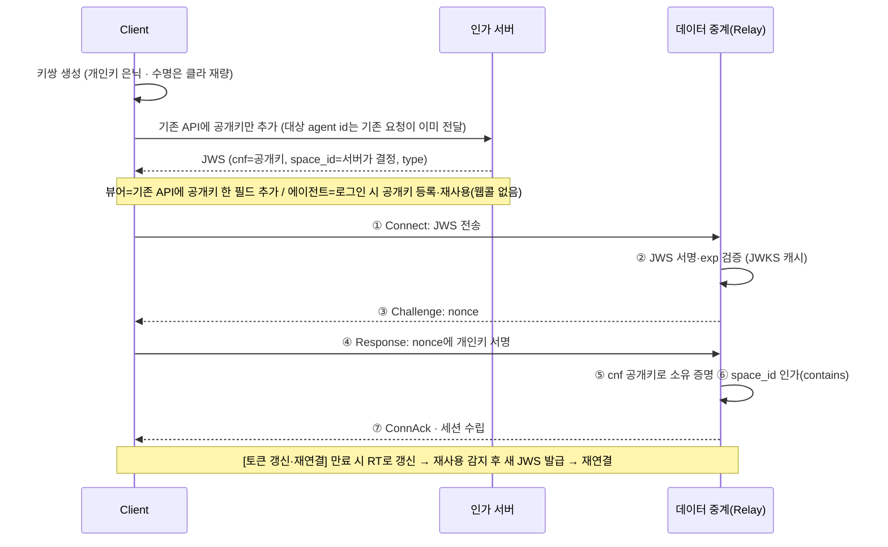

# 발신자 구속(Sender-Constrained) 기반 실시간 릴레이 인증 아키텍처 — Executive Summary

> 이 문서는 설계 리뷰·의사결정 회의용 **요약본**입니다. 구현 상세·의사코드·예외 처리·부록(ADR·미채택안)은 상세 명세 [sender-constrained-relay-architecture.md](sender-constrained-relay-architecture.md)를 참조하십시오.

## 1. 한 문단 요약

비(非)HTTP 실시간 채널(MQTT·WebSocket·순수 TCP)의 인가 모델을 **소지자(Bearer)에서 발신자 구속(Sender-Constrained)으로 전환**합니다. 토큰을 소지하기만 하면 통과하던 구조를, 그 토큰에 묶인 **개인키를 실제로 보유한 발신자만** 통과하도록 격상합니다. 구현 수단은 **cnf 키 바인딩(RFC 7800) + 실시간 챌린지-리스폰스 소유 증명(PoP)**이며, 무상태 JWS 검증 위에 얹어 **연결당 1왕복(1-RTT)**으로 토큰 탈취·리플레이를 무력화합니다.

## 2. 해결하는 문제

- **근본 원인 — 데이터 중계 서버의 검증 부재:** JWS 서명 검증이 세션 제어 서버에만 있고 데이터 중계(TCP) 서버에는 없어, 세션 식별자(RoomID)만으로 접속이 허용됐습니다. RoomID가 "소지 = 접근"인 Bearer capability로 동작해, 시그널링 채널·브로커 구독 등 정상 경로로 RoomID를 얻은 누구나 타인의 세션에 접속할 수 있었습니다(인가 결함, Broken Access Control).
- **TLS로는 해소되지 않는다:** RoomID는 도청이 아니라 **암호화된 정상 경로로 유출되므로**, 전송 암호화(TLS)만으로는 인가 결함이 해소되지 않습니다. TLS(무엇이 흐르는가)와 PoP(어떤 주체가 접속하는가)는 **직교 관계**로, 둘 다 필요합니다.

## 3. 핵심 설계

발급 시점에 클라이언트 공개키를 토큰 `cnf` 클레임에 바인딩하고, 연결 시점에 검증 서버가 던진 nonce에 개인키로 서명하게 해 **그 키의 정당한 소유자임을 실시간 증명**합니다. 토큰을 탈취해도 개인키가 없어 nonce에 서명하지 못하므로 접속이 거부됩니다.

라이프사이클은 [연결]에서 끝나지 않고, 토큰 만료 시 Refresh Token으로 새 JWS를 발급받아 재연결하는 **[토큰 갱신(RTR)]**으로 순환합니다.

**두 개의 키쌍을 구분**하는 것이 이해의 핵심입니다.

| 키쌍 | 소유자 | 용도 | 증명하는 것 |
|------|--------|------|-------------|
| **A — 인가 서버 서명키** | 인가 서버 | JWS 서명·발급 (JWKS로 공개) | "유효한 인가 서버가 발급한 토큰인가" |
| **B — 클라이언트 키쌍** | 클라이언트 | nonce 챌린지 응답 서명 (`cnf`에 바인딩) | "이 연결에 키의 정당한 소유자가 접속했는가" |

> 키쌍 B에서 이 아키텍처가 강제하는 **유일한 불변식은 "개인키 은닉"**이며, 영구 저장·재사용할지 매번 새로 만들지와 같은 수명은 **클라이언트 재량**입니다. 뷰어는 웹 요청 경로가 있어 둘 다 택할 수 있고, 에이전트는 원격제어마다 공개키를 다시 보낼 웹콜이 없어 로그인 시 등록한 키를 재사용합니다. 어느 쪽이든 신선도는 연결마다의 nonce가 보장하므로 소유 증명은 약화되지 않습니다.

## 4. 설계 원칙

- **완전 무상태:** 검증 서버는 시작 시 캐시한 공개키(JWKS)만으로 로컬 검증. 접속마다의 외부 질의·공유 스토어 0회. nonce는 연결의 소켓 세션 메모리에만 잠시 존재.
- **입력 통제(IDOR 방지):** `room_id`·`user_id`는 클라이언트 입력으로 받지 않습니다. `user_id`는 로그인 세션에서 추출하고, `room_id`는 권한 검증 후 서버가 결정·생성해 JWS에 삽입합니다. 대상(target)은 **뷰어가 원격제어 시작 웹 요청에 담아 보내는 제어 대상 agent id**로 서버가 인지하며(에이전트는 로그인 컨텍스트로 자기 자신이 대상), 클라이언트가 `room_id`를 직접 지정하지 못합니다.
- **검증 게이트 통일:** 호스트(방 개설)·뷰어(방 참여)는 발급 비즈니스 로직·토큰 수령 경로만 다를 뿐(뷰어=웹 요청 응답 / 에이전트=제어 채널 전달), 중계 서버의 연결·검증 시퀀스는 100% 동일합니다.
- **인프라 독립:** 챌린지-리스폰스는 전송 암호화 환경에 의존하지 않는 표준 스펙으로 항상 적용됩니다.

## 5. Action Items

- **P0 (전제, 충족):** 전송 구간 TLS 적용 완료 + 평문 소켓 Drop 게이트.
- **P1 (근본 처방):**
  - 데이터 중계 서버에 **JWS 검증 게이트 신설 + 발신자 구속(PoP) 전환**
  - **실시간 챌린지-리스폰스**(모든 배포 공통)
  - **메시지 브로커 토픽 구독 권한 검증**
  - 짧은 `exp` + `space_id` contains 인가 강제
  - `aud`·`type` 강제
  - **토큰 생애주기(RTR)** - 짧은 `exp` + Refresh Token 순환·재사용 감지로 권한 회수 반영
- **P2 (보강):** 키 롤링(JWKS 신·구 키 병존), (선택) 단말 바인딩 보조.
- **P3 (최적화):** TLS 채널 바인딩(RFC 5705)으로 nonce 왕복을 왕복 0으로.

## 6. 운영 유의 (요점)

- **장애 국소화:** 인가 서버·JWKS가 응답 불가(Down) 상태여도 검증 서버는 캐시로 기존 토큰 검증을 지속 — 신규 발급만 중단됩니다.
- **실전 하드닝:** 비대칭 연산 DoS(Rate Limit + fail-fast), 챌린지 타임아웃(3~5초 후 TCP RST), NTP 동기화, CSPRNG nonce, LB TLS 종단 판별(PROXY protocol).
- **성능 산정:** 지배 변수는 연결당 ECDSA Verify 2회. 목표 환경에서 Verify 단가·핸드셰이크 TPS·연결당 메모리를 벤치마크해 인스턴스 수를 역산합니다.

---

*상세 구현 명세·의사코드·API 예시·ADR·미채택안·성능 방법론은 [sender-constrained-relay-architecture.md](sender-constrained-relay-architecture.md) 참조.*
