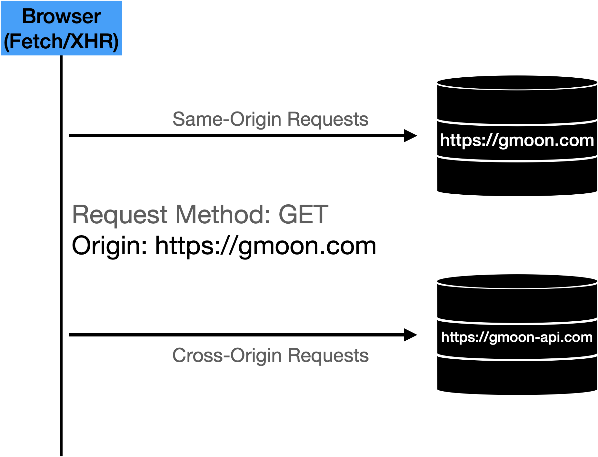
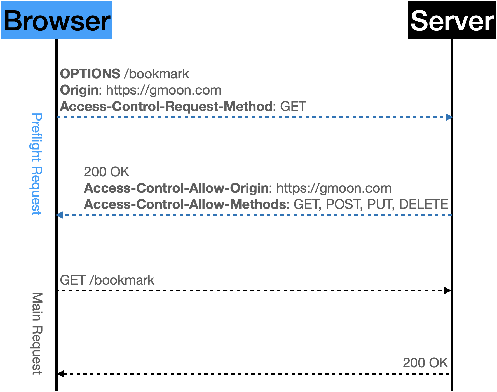
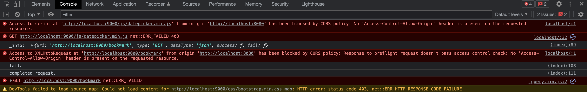
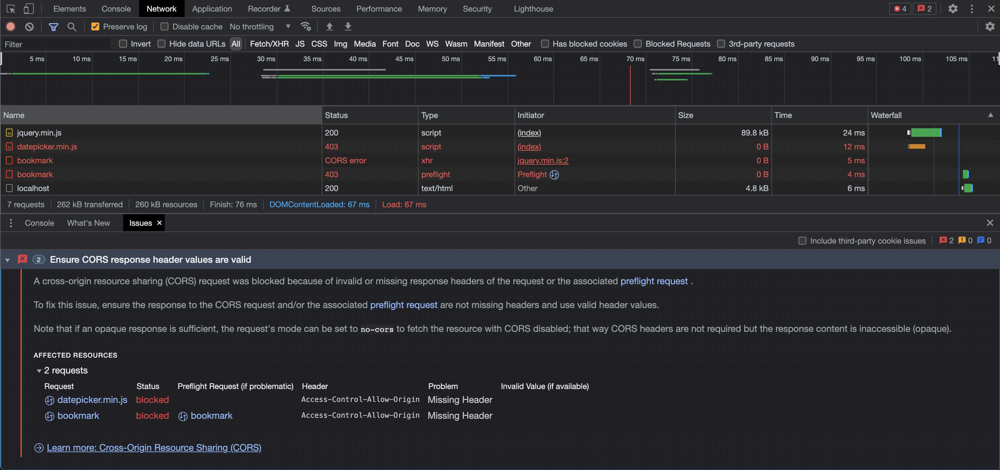
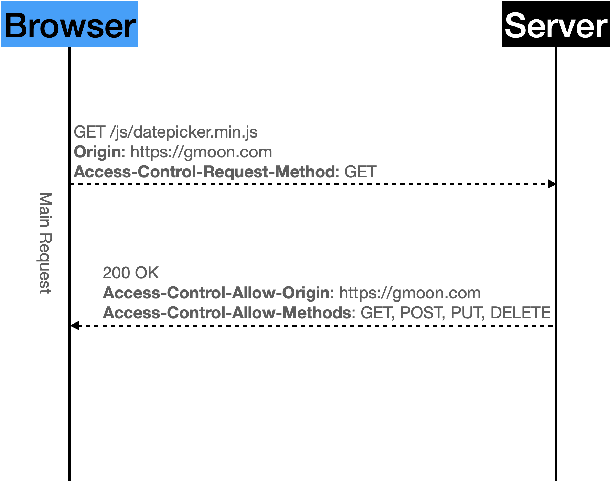
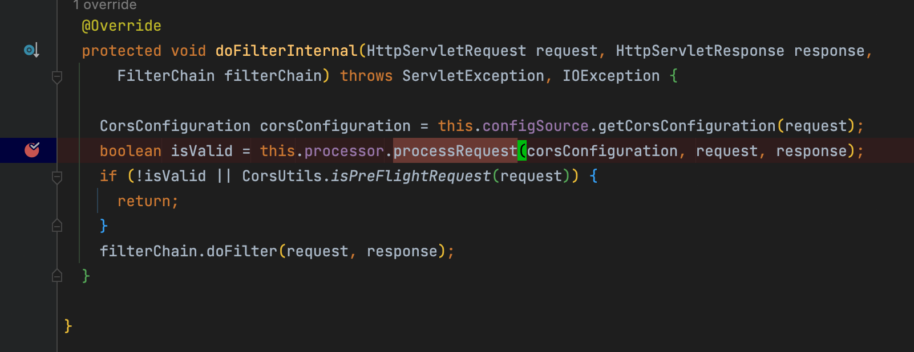
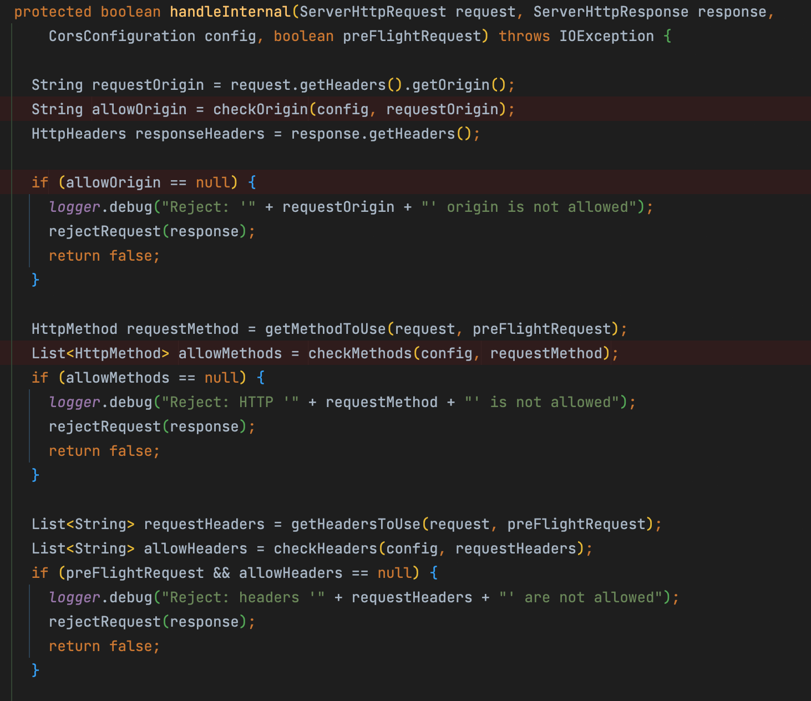
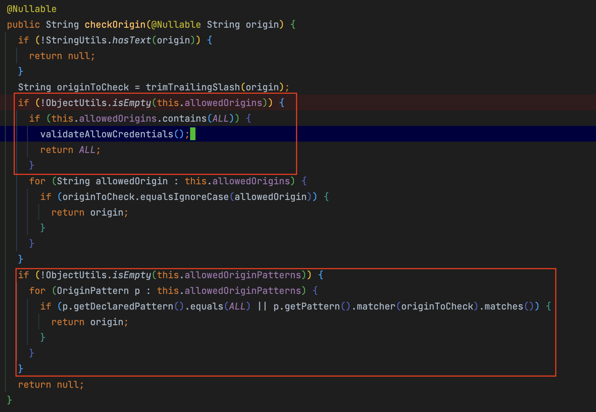
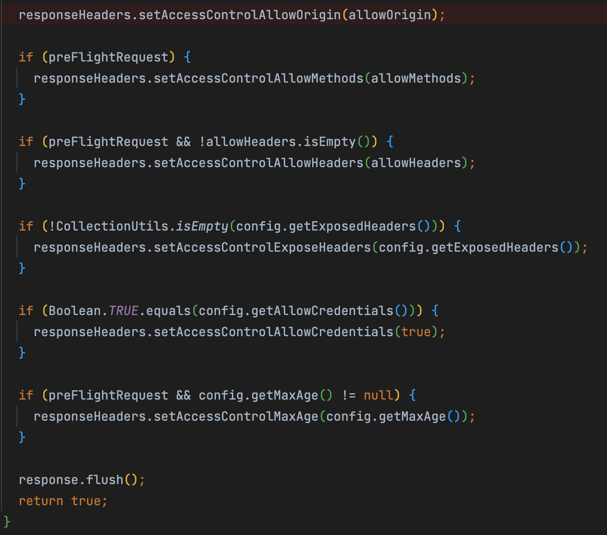

# Spring Security CORS

CORS 정책과 Spring Security 를 활용하여 런타임시 CORS 설정을 적용하는 방법에 대해 다룬다.

## Environment

- Spring boot 2.6.3
- Java 8
- MySql

## 학습 목표

- CORS
  - Origin
  - SOP(Same Origin Policy)
- CORS HTTP Request
  - Non-Credential request
    - Preflight request
    - Simple request
  - Credential request
- Custom CORS Filter

## CORS, Cross Origin Resource Sharing

**`교차 출처 리소스 공유(Cross Origin Resource Sharing)`** 는 HTTP 헤더 기반의 메커니즘으로써, HTTP 헤더를 사용하여 **다른 출처(Origin)의 자원에 접근할 수 있는 권한을 부여하도록 브라우저에 알려주는 체제다.**

> 최신 브라우저는 [`XMLHttpRequest`](https://developer.mozilla.org/ko/docs/Web/API/XMLHttpRequest) 또는 [`Fetch API`](https://developer.mozilla.org/ko/docs/Web/API/Fetch_API) 와 같은 API에서 CORS를 사용하여 CORS HTTP 요청을 판단한다.

## [Origin](https://developer.mozilla.org/en-US/docs/Glossary/Origin)

출처(`Origin`)란 서버들이 다른 서버들을 찾기 위한 가장 기본적인 단위로써,
**`Web URL`** 에서 **`schema`**, **`host`**, **`port`** 세 가지 구성 요소를 모두 포함한 개념이다.

- schema (protocol)
- hostname or domain
- port

```text
https://gmoon.com:443
-----   --------- ---
 ^       ^         ^
 |       |         ㄴ port
 |       ㄴ--- host
 ㄴ----- schema(protocol)
```

## 그렇다면 왜 CORS 정책이 필요할까?

브라우저에서 출처가 다른 리소스에 대한 허용 정책(CORS)이 왜 필요한걸까.

근래 웹 생태계는 높은 트래픽을 분산 처리하기 위해, 목적에 따라 서버를 분리하고 도메인을 구성하므로 출처가 서버로 부터 데이터 요청을 하는 일이 너무나도 당연하다.

하지만 예전엔 웹 서버 환경은 단일 서버 구조를 가지고 있었으며, 그렇기에 출처가 다른 요청은 서버를 공격하려는 공격자로 인식했다.

대부분의 브라우저에선 보안상 이유로 **`동일한 출처(Origin)`** 일 경우에만 자원을 사용할 수 있도록, 출처가 다른 자원에 대한 요청에 대해 제약하고 있다.

## SOP, Same Origin Policy

이를 같은 출처 자원 요청만 허용하는 브라우저 정책이라 하여, **`SOP(Same Origin Policy)`** 라 한다.

기본적으로 브라우저 정책은 [**`SOP(Same Origin Policy)`**](https://en.wikipedia.org/wiki/Same-origin_policy) 다.

다음 `https://gmoon.com` URI 를 통해, 같은 출처(Origin) 인지 판별해보자.

```text
https://gmoon.com

[O] https://gmoon.com/search
[O] https://gmoon.com/search?q=keywor

## SOP 위반, CORS 요청
[X] https://gmoon.com:4244             포트 다름     
[X] http://gmoon.com                   스키마 다름
[X] https://api.gmoon.com/bookmark     도메인 다름

## 기본 포트는 생략 가능하지만, 
## 브라우저 구현에 따라 다름
[?] https://gmoon.com:443
```

> 출처 비교시 포트를 무시하는 브라우저는 Internet Explorer 밖에 없다.

## 브라우저 리소스 정책

기본적으로 브라우저는 요청 헤더에 `Origin` 필드에 요청을 보내는 출처를 포함해준다.

자신의 출처와 요청한 출처가 다를 때 브라우저는 `추가 HTTP 헤더`를 사용하여 CORS 를 판단한다.



- SOP: 같은 출처에 대한 요청
- CORS: 다른 출처에 대한 요청

## CORS HTTP Request

CORS HTTP 요청은 다음과 같다.

- Non-Credential request
    - [Preflight request](#preflight-request)
    - [Simple request](#simple-request)
- [Credential request](#credential-request)

### [Preflight request](https://developer.mozilla.org/ko/docs/Glossary/Preflight_request)

브라우저는 실제 요청(main request)을 보내기전에 출처가 다른 리소스를 안전하게 사용할 수 있는지 판단하기 위해 예비 요청(preflight request)을 한다.

여기서 Preflight 는 비행기가 이륙하기 전 상태를 의미한다. 이를 빗대어 Preflight 는 본 요청을 보내기전, `OPTIONS` 메소드를 사용하여 서버로부터 미리 요청을 보낸다.

> `OPTIONS`는 서버에서 추가 정보를 판별하는데 사용하는 HTTP/1.1 메서드다.



1. [OPTIONS 요청 메서드](https://developer.mozilla.org/ko/docs/Web/HTTP/Methods/OPTIONS) 를 통해 사용하여 예비 요청한다.
2. 서버는 요청 헤더의 `Origin` 을 통해 도메인의 정보를 구분하고, 서버에 설정된 CORS HTTP 요청과 관련된 `Access-Control-Allow-*` 헤더 정보를 응답한다.
    - 서버는 CORS 를 위반하더라도 정상적으로 클라이언트의 요청에 응답한다.
        - `Access-Control-Allow-Origin`: 서버에서 허용하는 Origin
        - `Access-Control-Allow-Methods`: 서버에서 허용하는 HTTP Method
    - 서버는 이 예비 요청에 대한 응답으로 현재 자신이 어떤 것들을 허용하고, 어떤 것들을 금지하고 있는지에 대한 정보를 응답 헤더에 담아서 브라우저에게 다시 보내주게 된다.
    - Spring Security CorsFilter 에선 허용하지 않는 Origin 에 대해 403 FORBIDDEN 상태를 반환한다.
3. 브라우저는 서버측에서 응답한 `Access-Control-Allow-*` 헤더를 통해 자신이 보낸 요청 유효한 요청인지 아닌지를 판단한다.
4. 브라우저는 유효한 요청일 경우에 Main Request 요청한다.

> 주의: 모든 브라우저가 Preflighted request 후 리다이렉트를 지원하지 않는다.

만약 CORS 를 위반한 요청이라면 브라우저는 해당 요청에 대해 block 처리하고 에러를 발생한다.



```text
Access to script at 'http://localhost:9000/js/datepicker.min.js' from origin 'http://localhost:8080' has been blocked by CORS policy: No 'Access-Control-Allow-Origin' header is present on the requested resource.

Access to XMLHttpRequest at 'http://localhost:9000/bookmark' from origin 'http://localhost:8080' has been blocked by CORS policy: Response to preflight request doesn't pass access control check: No 'Access-Control-Allow-Origin' header is present on the requested resource.
```



> 서버는 `Access-Control-Allow-Origin: *` 응답 헤더 값으로 모든 요청(*) 으로 설정해놨다면, 브라우저는 해당 서버의 자원을 마음껏 사용할 수 있다.

매번 브라우저가 본 요청을 보내기전에 preflight 요청을 보낸다면 웹 서버 측면에선 부담이 된다.

따라서 서버의 `Access-Control-Max-Age` 응답 헤더 설정을 통해, 브라우저는 preflight 요청에 대한 결과를 일정 기간 동안 캐싱할 수 있다.

브라우저는 설정된 시간 동안은 preflight 요청을 생략하고 바로 본 요청을 보낸다.

### [Simple Request](https://developer.mozilla.org/ko/docs/Web/HTTP/CORS#%EB%8B%A8%EC%88%9C_%EC%9A%94%EC%B2%ADsimple_requests)

모든 HTTP 요청 마다 [CORS preflight Request](https://developer.mozilla.org/ko/docs/Glossary/Preflight_request) 을 보내는건 무의미하다.

단순 요청(Simple Request)는 CORS Preflight Request 를 사용하지 않고, *단 한번의 요청과 응답으로 통신이 이뤄진다.*



브라우저가 CORS 정책 위반 여부를 판단하는 시나리오는 Preflight 요청과 마찬가지로 동일하다.

단 차이점은 preflight 요청의 존재 여부다. 단순 요청에 대한 조건은 까다롭다. 아래 조건이 모두 충족할 경우에만 단순 요청으로 판단한다.

- HTTP Method
    - GET
    - HEAD
    - POST
- HTTP Header
    - [Content-Type](https://developer.mozilla.org/ko/docs/Web/HTTP/Headers/Content-Type) 는 다음 값들만 허용한다.
        - `application/x-www-form-urlencoded`
        - `multipart/form-data`
        - `text/plain`
    - [사용자 에이전트(브라우저)](https://developer.mozilla.org/ko/docs/Glossary/User_agent) 가 자동으로 설정한 헤더
        - [Accept](https://developer.mozilla.org/ko/docs/Web/HTTP/Headers/Accept)
        - [Accept-Language](https://developer.mozilla.org/ko/docs/Web/HTTP/Headers/Accept-Language)
        - [Content-Language](https://developer.mozilla.org/ko/docs/Web/HTTP/Headers/Content-Language)
        - [Connection](https://developer.mozilla.org/ko/docs/Web/HTTP/Headers/Connection)
        - [User-Agent](https://developer.mozilla.org/en-US/docs/Web/HTTP/Headers/User-Agent)
        - 그외 Fetch 명세에서 정의한 헤더들
            - [`forbidden header name 헤더`](https://fetch.spec.whatwg.org/#forbidden-header-name)
            - [`CORS-sfelisted request-header로 정의한 헤더`](https://fetch.spec.whatwg.org/#cors-safelisted-request-header)

### [Credential request](https://developer.mozilla.org/ko/docs/Web/HTTP/CORS#%EC%9D%B8%EC%A6%9D%EC%A0%95%EB%B3%B4%EB%A5%BC_%ED%8F%AC%ED%95%A8%ED%95%9C_%EC%9A%94%EC%B2%AD)

CORS는 기본적으로 보안상의 이유로 `HTTP Cookie` 와 `HTTP Authentication` 헤더 정보를 요청할 수 없도록 제약한다. 

때론 Cookie 정보나 Authentication 헤더를 통한 서버 인증이 필요한 경우가 있다. **`Credential 요청`** 은 HTTP Cookie와 HTTP Authentication 정보를 인식할 수 있게 해주는 요청이다.

> 그렇기에 `Preflight Request`와 `Simple Request`은 Non-Credential request 라 한다.

추가적으로 Fetch API 나 XMLHttpRequest 에서도 요청에 Cookie 나 Authentication 헤더를 포함하도록 별도로 설정해줘야 한다.

서버 측면에선 `Access-Control-Allow-Credentials` 옵션을 활성화하고, 더 이상 `Access-Control-Allow-Origin` 는 와일드 카드(**`*`**)를 사용할 수 없다. 반드시 명시적인 URL을 지정해줘야 한다.

- Access-Control-Allow-Credentials: true
- Access-Control-Allow-Origin: https://gmoon.com

만약 Credentials 옵션을 활성화하고, 허용 Origin 을 와일드 카드로 설정해놨다면 서버에선 와일드 카드를 사용할 수 없다는 에러가 발생한다.

``` text
java.lang.IllegalArgumentException: When allowCredentials is true, allowedOrigins cannot contain the special value "*" since that cannot be set on the "Access-Control-Allow-Origin" response header. To allow credentials to a set of origins, list them explicitly or consider using "allowedOriginPatterns" instead.
	at org.springframework.web.cors.CorsConfiguration.validateAllowCredentials(CorsConfiguration.java:473) ~[spring-web-5.3.15.jar:5.3.15]
	at org.springframework.web.cors.CorsConfiguration.checkOrigin(CorsConfiguration.java:577) ~[spring-web-5.3.15.jar:5.3.15]
```

## Security CorsFilter

1. CorsFilter#doFilterInternal
2. CorsProcessor#processRequest
3. DefaultCorsProcessor#handleInternal
   - CorsConfiguration#checkOrigin
     - Credential 요청에 대한 Access-Control-Allow-Origin 설정 검증
   - Allowed-Origin 검증
   - Allowed-Method 검증
   - Allowed-Header 검증

### CorsFilter#doFilterInternal



### DefaultCorsProcessor#handleInternal

CORS 관련 추가 헤더 값을 검증한다. 

- Access-Control-Allow-Origin
- Access-Control-Allow-Methods
- Access-Control-Allow-Headers



### CorsConfiguration#checkOrigin

요청 `Orign` 헤더 값과 CorsConfiguration의 allowedOrigin 값을 비교한다.

```java
public class CorsConfig {
	@Bean
	public CorsConfiguration corsConfiguration() {
		CorsConfiguration config = new CorsConfiguration();
		
		// ...
		config.setAllowedOriginPatterns(Collections.singletonList(CorsConfiguration.ALL));
		return config;
	}
}
```



> 주의: 허용 Origin에 대해 패턴 설정으로 와일드 카드로 설정했다면, Credential 요청에 대한 검증은 제외된다.

### DefaultCorsProcessor#handleInternal

검증 이후 응답 헤더 `Access-Control-Allow-*` 를 담아준다.



## Project Modules

- resource-client
    - [참고 SecurityConfig](#resource-client)
- resource-server: API 모듈
    - [참고 SecurityConfig](#resource-server)

## SecurityFilterChain

### Resource Client

1. WebAsyncManagerIntegrationFilter
2. SecurityContextPersistenceFilter
3. HeaderWriterFilter
4. CsrfFilter
5. LogoutFilter
6. **OAuthenticationFilter**
    - Resource Server JWT 발급 받기 위한 로그인 인증 필터
7. UsernamePasswordAuthenticationFilter
8. DefaultLoginPageGeneratingFilter
9. DefaultLogoutPageGeneratingFilter
10. RequestCacheAwareFilter
11. SecurityContextHolderAwareRequestFilter
12. AnonymousAuthenticationFilter
13. SessionManagementFilter
14. ExceptionTranslationFilter
15. FilterSecurityInterceptor

```java

@Slf4j
@Configuration
@EnableWebSecurity
public class SecurityConfig extends WebSecurityConfigurerAdapter {
	@Override
	protected void configure(HttpSecurity http) throws Exception {
		http
			.exceptionHandling(this::exceptionHandling)
			.headers(this::headers)
			.authorizeRequests(this::authorizeRequests)

			// JWT provider or authentication filter config.
			.authenticationProvider(authenticationProvider())
			.addFilter(new OAuthenticationFilter(authenticationManager(), authenticationFailureHandler()))
			.formLogin();
	}

	// ...

	@Bean
	public AuthenticationProvider authenticationProvider() {
		return new OAuthenticationProvider();
	}

	private AuthenticationFailureHandler authenticationFailureHandler() {
		RedirectStrategy redirectStrategy = new DefaultRedirectStrategy();
		return (request, response, exception) -> {
			log.error("authentication failure.", exception);
			redirectStrategy.sendRedirect(request, response, "/login");
		};
	}
}
```

### Resource Server

1. WebAsyncManagerIntegrationFilter
2. SecurityContextPersistenceFilter
3. HeaderWriterFilter
4. **CorsFilter**
    - CORS 런타임 설정을 위한 커스텀 필터, CustomCorsFilter 참고
5. LogoutFilter
6. JwtAuthenticationFilter
7. JwtVerifyFilter
8. RequestCacheAwareFilter
9. SecurityContextHolderAwareRequestFilter
10. AnonymousAuthenticationFilter
11. SessionManagementFilter
12. ExceptionTranslationFilter
13. FilterSecurityInterceptor

```java

@EnableWebSecurity(debug = true)
@RequiredArgsConstructor
public class SecurityConfig extends WebSecurityConfigurerAdapter {
	private final CorsConfigurationSource corsConfigurationSource;
	private final MappingJackson2HttpMessageConverter converter;
	private final JwtUtils jwtUtils;

	// ignore authorization requests from static resource(js, css ...).
	@Override
	public void configure(WebSecurity web) throws Exception {
		web.ignoring().requestMatchers(PathRequest.toStaticResources().atCommonLocations());
	}

	@Override
	protected void configure(HttpSecurity http) throws Exception {
		http
			.headers(this::headers)
			// CORS config. ref: com.gmoon.resourceserver.config.CorsConfig.java          
			.cors(this::customCorsConfiguration)
			.csrf(AbstractHttpConfigurer::disable)
			.httpBasic(AbstractHttpConfigurer::disable)
			.formLogin(AbstractHttpConfigurer::disable)
			.authorizeRequests(this::authorizeRequests)
			.sessionManagement(this::httpStateless)
			.addFilter(new JwtAuthenticationFilter(authenticationManager(), jwtUtils))
			.addFilter(new JwtVerifyFilter(jwtExceptionHandler(), jwtUtils));
	}

	// ...

	private void customCorsConfiguration(CorsConfigurer<HttpSecurity> config) {
		config.configurationSource(corsConfigurationSource);
	}
}
```

## Reference

- [Mozilla - Origin](https://developer.mozilla.org/en-US/docs/Glossary/Origin)
    - [RFC 2616 - http URL](https://datatracker.ietf.org/doc/html/rfc2616#section-3.2.2)
    - [Wiki - Domain name](https://en.wikipedia.org/wiki/Domain_name)
- [Mozilla - HTTP OPTIONS Method](https://developer.mozilla.org/ko/docs/Web/HTTP/Methods/OPTIONS)
- [Mozilla - HTTP Allow Header](https://developer.mozilla.org/ko/docs/Web/HTTP/Headers/Allow)
- [Mozilla - SOP](https://developer.mozilla.org/ko/docs/Web/Security/Same-origin_policy)
    - [Wiki - Same-origin policy](https://en.wikipedia.org/wiki/Same-origin_policy)
- [Mozilla - CORS](https://developer.mozilla.org/ko/docs/Web/HTTP/CORS)
    - [Wiki - Cross-origin Resource sharing](https://en.wikipedia.org/wiki/Cross-origin_resource_sharing)
    - [Mozilla - XMLHttpRequest](https://developer.mozilla.org/ko/docs/Web/API/XMLHttpRequest)
    - [Mozilla - HTML Attributes crossorigin](https://developer.mozilla.org/ko/docs/Web/HTML/Attributes/crossorigin)
    - [Mozilla - Simple_requests](https://developer.mozilla.org/ko/docs/Web/HTTP/CORS#%EC%A0%91%EA%B7%BC_%EC%A0%9C%EC%96%B4_%EC%8B%9C%EB%82%98%EB%A6%AC%EC%98%A4_%EC%98%88%EC%A0%9C)
- [fetch.spec.whatwg.org](https://fetch.spec.whatwg.org/)
