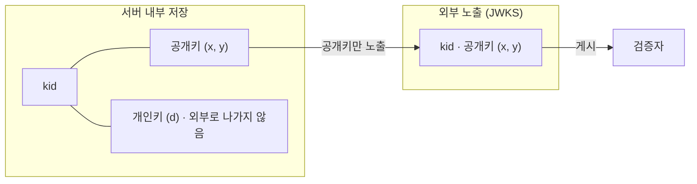
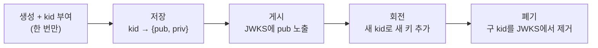
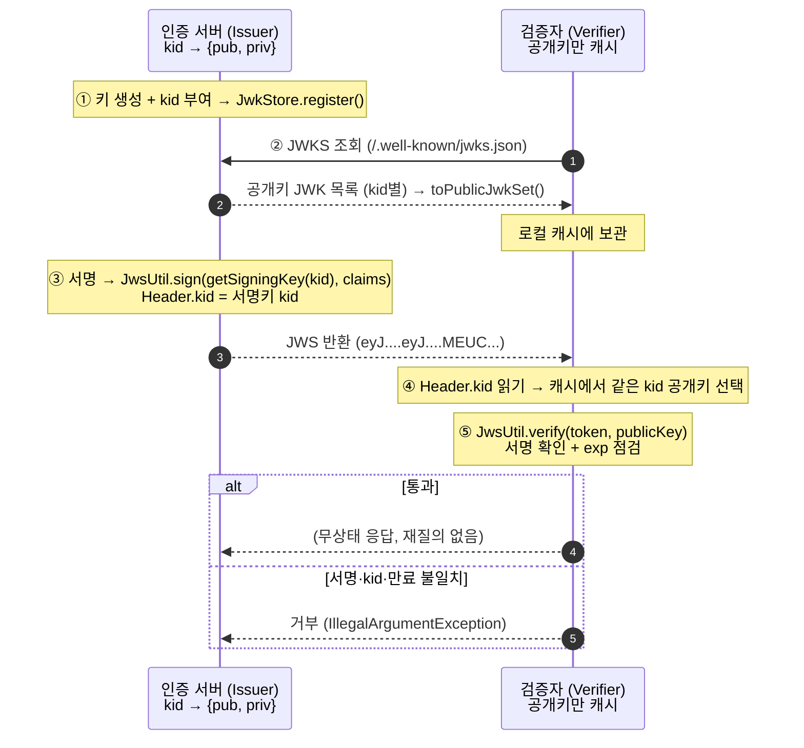

# JOSE 키·동작 스펙 - JWK, JWKS, kid 생명주기와 서명·검증

이 문서는 `spring-security-jose`의 키 표현(JWK), 키 묶음(JWKS), `kid` 생명주기, 서명·검증 동작을 규격과 코드로 정리합니다. 헤더와 클레임은 [토큰 형식 스펙](token-format-spec.md)에서, 개념적인 배경은 [개념 문서](../../docs/auth-architecture/jwt-jws-jwe-jwk-concepts.md)에서 다룹니다.

## 1. JWK 필드 규격 (EC 기준)

키를 표준 JSON으로 표현한 것이 JWK입니다. 이 모듈은 EC(P-256) 키를 사용합니다.

```json
{
  "kty": "EC",
  "kid": "issuer-2026-07-a",
  "crv": "P-256",
  "alg": "ES256",
  "use": "sig",
  "x": "f83OJ3D2xF1Bg8vub9tLe1gHMzV76e8Tus9uPHvRVEU",
  "y": "x_FEzRu9m36HLN_tue659LNpXW6pCyStikYjKIWI5a0",
  "d": "  (개인키 - 서버만 보유, 공개 JWK에는 절대 미포함)  "
}
```

| 필드 | 의미 | 공개 JWK | 개인 JWK |
| --- | --- | :---: | :---: |
| `kty` | Key Type (`EC`) | 포함 | 포함 |
| `kid` | Key ID - 키 식별자(이름표) | 포함 | 포함 |
| `crv` | 곡선 (`P-256`) | 포함 | 포함 |
| `alg` | 알고리즘 (`ES256`) | 포함 | 포함 |
| `use` | 용도 (`sig`=서명 / `enc`=암호화) | 포함 | 포함 |
| `x`, `y` | 공개키 좌표 (곡선 위의 점) | 포함 | 포함 |
| `d` | 개인키 값 | 제외(금지) | 포함(서버만) |

공개 JWK와 개인 JWK를 가르는 것은 `d` 하나뿐입니다. 

`d`가 있으면 서명까지 할 수 있는 개인 JWK이고, 없으면 검증만 가능한 공개 JWK입니다. 그래서 검증자에게 키를 내보낼 때는 반드시 `d`를 떼어냅니다.

## 2. 서버의 키 저장 - `kid → {pub, priv}` 한 덩어리

서버(인증 서버)는 공개키와 개인키를 `kid` 하나에 묶어 보관하고, 외부에는 그중 공개키만 노출합니다.



키의 상태는 값 객체 [`JsonWebKey`](../src/main/java/com/gmoon/springsecurityjose/jose/jwk/JsonWebKey.java)가 `kid`와 개인·공개 키를 JWK JSON 문자열로 들고 있습니다. 문자열이라 DB에 그대로 영속하기 좋고, 나중에 `@Embeddable`로 올리기도 쉽습니다. 서명이나 검증이 필요한 순간에만 `toSigningKey()`·`toVerificationKey()`로 `ECKey`로 되돌립니다. [`JwkStore`](../src/main/java/com/gmoon/springsecurityjose/jose/jwk/JwkStore.java)는 이 값 객체를 `kid`로 매핑해 캐싱하므로 결국 `kid → {pub, priv}` 구조가 되며, 동등성은 `kid`만으로 판정합니다. 서명에는 개인키를 포함한 전체를, 검증과 배포에는 공개키만 꺼내 씁니다. 개인키 JSON을 저장할 때의 암호화는 애플리케이션이 아니라 인프라 계층의 몫으로 둡니다.

| 목적 | 메서드 | 반환 |
| --- | --- | --- |
| 서명 | `JwkStore.getSigningKey(kid)` | 개인키 포함 `ECKey` |
| 검증 | `JwkStore.getVerificationKey(kid)` | 공개키만 (`toPublicJWK()`) |
| 배포 | `JwkStore.toPublicJwkSet()` | 공개키 묶음 JWKS(JSON) |

## 3. JWKS - 공개키 묶음과 무중단 회전(rotation)

공개키 JWK 여러 개를 배열로 묶은 것이 JWKS입니다. 회전하는 동안 신·구 키를 함께 노출해 무중단 교체를 가능하게 합니다.

```json
{
  "keys": [
    { "kty":"EC", "crv":"P-256", "kid":"issuer-2026-07-a", "x":"f83OJ...", "y":"x_FEz..." },
    { "kty":"EC", "crv":"P-256", "kid":"issuer-2026-08-b", "x":"9Tk2...", "y":"pQ7Lk..." }
  ]
}
```

## 4. `kid` 생명주기 - "같은 kid = 같은 키" 원칙

`kid`가 검증의 다리 역할을 하려면 하나의 `kid`는 항상 하나의 키를 가리켜야 합니다.



키 생성은 한 번뿐입니다. 매 호출마다 새 무작위 키가 나오므로, 한 번 만들어 저장해 두고 이후에는 `kid`로 조회해 재사용합니다. 새 `kid`를 부여하는 경우는 회전할 때뿐입니다. 새 키에 새 `kid`를 붙이고, 구 키는 전환이 끝날 때까지 JWKS에 함께 남겨 둡니다.

주의할 점이 하나 있습니다. 같은 `kid`로 `generate`를 반복해서는 안 됩니다. `kid`는 생성 시드가 아니라 라벨일 뿐이라, 같은 `kid`를 넘겨도 매번 `d`·`x`·`y`가 전부 다른 키쌍이 나옵니다. 그렇게 같은 `kid`에 서로 다른 키가 공존하면 검증자는 어느 키로 검증해야 할지 알 수 없고, 결국 검증이 깨집니다. 이 성질은 [`JwsUtilTest`](../src/test/java/com/gmoon/springsecurityjose/jose/jws/JwsUtilTest.java)의 `sameKidProducesDifferentKeyPair`가 확인합니다.

## 5. 서명·검증 동작 시퀀스



## 6. 코드 매핑 요약

| 스펙 동작 | 코드 |
| --- | --- |
| 키 생성 + `kid` 부여(내부 UUID) | `JsonWebKey.generate()` (내부 `JwsUtil.generateEcKey`) |
| 키 저장 `kid → {pub, priv}` | `JwkStore.register(jsonWebKey)` |
| 서명 (개인키) | `JwsUtil.sign(JwkStore.getSigningKey(kid), claims)` |
| `kid`로 공개키 조회 | `SignedJWT.parse(token).getHeader().getKeyID()` → `JwkStore.getVerificationKey(kid)` |
| 검증 (공개키 + `exp`) | `JwsUtil.verify(token, publicKey)` |
| JWKS 배포 (공개키만) | `JwkStore.toPublicJwkSet()` |

## 7. 검증 실패 케이스

| 상황 | 결과 |
| --- | --- |
| 서명 위·변조 / 키 불일치 | `IllegalArgumentException` - `JWS signature verification failed` |
| 만료(`exp` 경과) | `IllegalArgumentException` - `JWS expired` |
| 직렬화 형식 오류 | `IllegalArgumentException` - `Failed to parse JWS` |
| 등록되지 않은 `kid` 조회 | `IllegalArgumentException` - `No key registered for kid=...` |

## Reference

- [RFC 7517 - JWK](https://datatracker.ietf.org/doc/html/rfc7517) · `kid` [§4.5](https://datatracker.ietf.org/doc/html/rfc7517#section-4.5)
- [RFC 7518 - JWA](https://datatracker.ietf.org/doc/html/rfc7518) · EC·ES256
- [RFC 7515 - JWS](https://datatracker.ietf.org/doc/html/rfc7515) · `kid` 헤더 [§4.1.4](https://datatracker.ietf.org/doc/html/rfc7515#section-4.1.4)
