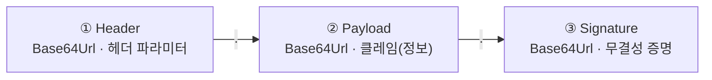

# JOSE 토큰 형식 스펙 — 헤더 파라미터와 클레임

이 문서는 `spring-security-jose`가 발급하는 JWS(서명된 JWT)의 직렬화 구조와 헤더 파라미터, 클레임을 JSON 규격 수준에서 정리합니다. 개념과 발전 과정은 [개념 문서](../../docs/auth-architecture/jwt-jws-jwe-jwk-concepts.md)에서, 키와 동작은 [키·동작 스펙](key-and-operation-spec.md)에서 다룹니다.

먼저 용어를 정리해 둡니다. 헤더에 들어가는 항목은 "헤더 파라미터(Header Parameter)"이고, Payload에 들어가는 항목이 "클레임(Claim)"입니다. `kid`는 클레임이 아니라 헤더 파라미터라는 점을 기억해 두면 이후 설명이 헷갈리지 않습니다.

## 1. 직렬화 구조 — 점으로 이은 3부분

JWS는 세 파트를 각각 Base64Url로 인코딩해 마침표(`.`)로 이은 단일 문자열입니다.



```text
eyJhbGciOiJFUzI1NiIsInR5cCI6IkpXVCIsImtpZCI6Imlzc3Vlci0yMDI2LTA3LWEifQ
.eyJpc3MiOiJodHRwczovL2lzc3Vlci5leGFtcGxlLmNvbSIsInN1YiI6InN2Yzo6V2ViU2VydmVyIiwiZXhwIjoxNzUxNDE0NzAwfQ
.MEUCIQDx7k2...
```

- ① Header — 서명 알고리즘과 검증 키 지목 (§2)
- ② Payload — 클레임 집합. 암호화되지 않아 누구나 디코딩해 읽을 수 있음 (§3)
- ③ Signature — `개인키(d)`로 `①.②`에 서명한 값. 한 글자라도 바뀌면 검증 실패

여기서 짚어둘 것이 있습니다. Base64Url은 인코딩일 뿐 암호화가 아닙니다. 그래서 민감정보를 Payload에 담아서는 안 되고, 내용 자체를 감춰야 한다면 암호화하는 JWE를 써야 합니다.

## 2. 헤더 파라미터 (JOSE Header)

서명 알고리즘과 "어떤 키로 검증하라"는 지목을 담습니다.

```json
{
  "alg": "ES256",
  "typ": "JWT",
  "kid": "issuer-2026-07-a"
}
```

| 파라미터 | 의미 | 이 모듈 값 | 필수 여부 |
| --- | --- | --- | --- |
| `alg` | 서명 알고리즘 (Algorithm) | `ES256` (ECDSA P-256 + SHA-256) | 필수 |
| `typ` | 토큰 유형 (Type) | `JWT` | 권장 |
| `kid` | 검증 키 지목 (Key ID). JWKS에서 같은 `kid`의 공개키를 골라 검증 | 서명키의 `kid` | 다중 키 환경에서 필수 |
| `cty` | 중첩 토큰 등 콘텐츠 유형 (Content Type) | 미사용 | — |
| `crit` | 반드시 처리해야 하는 확장 파라미터 목록 | 미사용 | — |

헤더의 `kid`는 하나의 다리를 놓습니다. 헤더의 `kid`에서 JWKS 안 같은 `kid`의 공개키로, 다시 그 공개키로 서명을 검증하는 흐름입니다. `kid`를 헤더에 실어 보내는 쪽은 서명자이고, 그것을 읽어 검증 키를 고르는 쪽은 검증자입니다.

코드로는 [`JwsUtil.sign()`](../src/main/java/com/gmoon/springsecurityjose/jose/jws/JwsUtil.java)이 이 헤더를 만듭니다.

```java
JWSHeader header = new JWSHeader.Builder(JWSAlgorithm.ES256) // alg
    .type(JOSEObjectType.JWT)                                // typ
    .keyID(signingKey.getKeyID())                            // kid
    .build();
```

## 3. 클레임 (Payload)

클레임은 세 부류로 나뉩니다. 표준이 예약한 등록된 클레임(Registered), 이름 충돌을 피하려 관리하는 공개 클레임(Public), 당사자끼리 합의한 비공개 클레임(Private)입니다.

```json
{
  "iss": "https://issuer.example.com",
  "sub": "svc::WebServer",
  "aud": "relay.example.com",
  "iat": 1751414400,
  "nbf": 1751414400,
  "exp": 1751414700,
  "jti": "d9f8c2a1-6b7e-4c3a-9e21-0f5a1b2c3d4e",
  "authority": { "sub": ["topic/..."], "pub": ["topic/..."] }
}
```

### 3.1 등록된 클레임 (RFC 7519 §4.1)

| 클레임 | 이름 | 의미 | 타입 |
| --- | --- | --- | --- |
| `iss` | Issuer | 발급자 | StringOrURI |
| `sub` | Subject | 주체(사용자·서비스 식별) | StringOrURI |
| `aud` | Audience | 수신 대상. 검증자는 자신이 `aud`에 포함되는지 확인 | StringOrURI 또는 배열 |
| `exp` | Expiration | 만료 시각. 이후엔 거부 | NumericDate |
| `nbf` | Not Before | 이 시각 이전엔 무효 | NumericDate |
| `iat` | Issued At | 발급 시각 | NumericDate |
| `jti` | JWT ID | 토큰의 고유 식별자 (§3.2) | String |

### 3.2 `jti` — JWT ID (언제·왜 쓰나)

`jti`는 각 토큰에 부여하는 고유 식별자로, 보통 UUID나 랜덤 문자열을 씁니다. 같은 발급자가 낸 토큰들 사이에서 하나를 콕 집어 가리킬 수 있게 해 줍니다.

| 용도 | 설명 |
| --- | --- |
| 재생 공격(replay) 방지 | 검증자가 사용된 `jti`를 기록해 같은 토큰의 재사용을 거부한다. 일회성 토큰, DPoP proof JWT의 핵심 |
| 개별 토큰 폐기(블랙리스트) | 특정 `jti`를 무효 목록에 올려 취소한다. 무상태 JWT의 "개별 취소 불가" 약점을 보완 |
| 추적·상관관계 | 로그에서 특정 토큰을 추적하고 중복 발급을 감지 |
| 멱등성 보장 | 동일 `jti` 요청의 중복 처리를 차단 |

다만 여기엔 상태 트레이드오프가 따릅니다. `jti`가 재생 방지나 폐기로 의미를 가지려면 검증자가 "사용된 `jti` 저장소"라는 상태를 들고 있어야 합니다. 이는 JWS의 무상태 이점과 상충하므로, 보통은 `exp`까지만 보관하는 단기 캐시(TTL을 만료까지 남은 시간으로 잡는 방식)로 운영해 비용을 줄입니다.

이 아이디어는 자연스럽게 DPoP로 이어집니다. 소유 증명(DPoP) proof JWT는 매 요청마다 새 `jti`와 함께 `htm`(HTTP 메서드)·`htu`(URL)·`iat`를 담고, 서버가 그 `jti`를 단기간 기억해 탈취와 재전송을 무력화합니다. [DPoP 기반 실시간 릴레이 인증 아키텍처](../../docs/auth-architecture/sender-constrained-relay-architecture.md)의 replay 방어가 바로 이 방식입니다.

### 3.3 공개·비공개(커스텀) 클레임

공개 클레임은 이름 충돌을 피하기 위해 IANA에 등록하거나 충돌 방지용 네임스페이스(URI)를 붙여 쓰는 클레임입니다. 비공개 클레임은 발급자와 검증자가 합의한 애플리케이션 전용 클레임으로, 위 예시의 `authority`(pub/sub 권한)가 여기에 해당합니다.

### 3.4 타입 규칙

| 타입 | 규칙 |
| --- | --- |
| NumericDate | 1970-01-01 UTC부터의 초(second) 정수. 밀리초가 아니다 (`exp`·`nbf`·`iat`) |
| StringOrURI | 임의 문자열. `:`를 포함하면 URI로 해석 (`iss`·`sub`·`aud`) |

코드로는 [`JwtClaimsSet.Builder`](../src/main/java/com/gmoon/springsecurityjose/jose/jws/JwsUtil.java)가 이 클레임을 조립합니다.

```java
JWTClaimsSet claims = new JWTClaimsSet.Builder()
    .issuer("https://issuer.example.com")                 // iss
    .subject("svc::WebServer")                            // sub
    .audience("relay.example.com")                        // aud
    .issueTime(Date.from(now))                            // iat (NumericDate)
    .expirationTime(Date.from(now.plusSeconds(300)))      // exp
    .jwtID(UUID.randomUUID().toString())                  // jti
    .claim("authority", authority)                        // 비공개 클레임
    .build();
```

검증할 때 `spring-security-jose`는 서명을 확인한 뒤 `exp`(만료)를 점검합니다. `aud` 확인이나 `nbf`, `jti` 재생 방지 같은 정책 검증은 애플리케이션 계층에서 덧붙입니다.

## Reference

- [RFC 7519 — JWT](https://datatracker.ietf.org/doc/html/rfc7519) · 등록된 클레임 [§4.1](https://datatracker.ietf.org/doc/html/rfc7519#section-4.1) · `jti` [§4.1.7](https://datatracker.ietf.org/doc/html/rfc7519#section-4.1.7)
- [RFC 7515 — JWS](https://datatracker.ietf.org/doc/html/rfc7515) · 헤더 파라미터 [§4.1](https://datatracker.ietf.org/doc/html/rfc7515#section-4.1)
- [RFC 9449 — DPoP](https://datatracker.ietf.org/doc/html/rfc9449) · proof JWT의 `jti`
