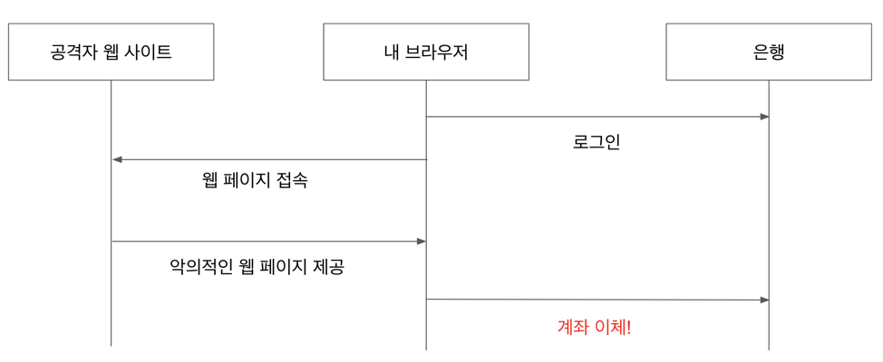
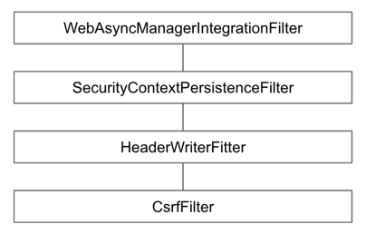

# CsrfFilter
## CSRF(Cross-Site Request Forgery) 어택 방지 필터, 4번째 필터 

CSRF 어택 방지 필터
- 인증된 유저의 계정을 사용해 악의적인 변경 요청을 만들어 보내는 기법.
- https://www.owasp.org/index.php/Cross-Site_Request_Forgery_(CSRF)
- https://namu.wiki/w/CSRF
- CORS를 사용할 때 특히 주의 해야 함. 
  - CSRF 와 다른 개념, 기본적으로 클라이언트 요청은 같은 도메인에서만 기본적으로 리소스를 공유하고 있기 때문에 해당 타 도메인은 차단됨
  - 타 도메인에서 보내오는 요청을 허용하기 때문에...
  - https://en.wikipedia.org/wiki/Cross-origin_resource_sharing



의도한 사용자만 리소스를 변경할 수 있도록 허용하는 필터

- CSRF 토큰을 사용하여 방지.



form에서 csrf token 값을 

```java
class CsrfFilter {
  protected void doFilterInternal(HttpServletRequest request, HttpServletResponse response, FilterChain filterChain) throws ServletException, IOException {
      // 생략...
    
      // [1] 요청을 보낼 때, crsf token 생성
      request.setAttribute(CsrfToken.class.getName(), csrfToken);
      request.setAttribute(csrfToken.getParameterName(), csrfToken);

      filterChain.doFilter(request, response);
      
      // 생략...
    
      // [2] 토큰이 일치하는지 검증
      tring actualToken = request.getHeader(csrfToken.getHeaderName());
      if (actualToken == null) {
        actualToken = request.getParameter(csrfToken.getParameterName());
      }
  
      if (!csrfToken.getToken().equals(actualToken)) {
        this.logger.debug(LogMessage.of(() -> {
          return "Invalid CSRF token found for " + UrlUtils.buildFullRequestUrl(request);
        }));
        AccessDeniedException exception = !missingToken ? new InvalidCsrfTokenException(csrfToken, actualToken) : new MissingCsrfTokenException(actualToken);
        this.accessDeniedHandler.handle(request, response, (AccessDeniedException)exception);
      } else {
        filterChain.doFilter(request, response);
      }
  }
}
```

리소스를 변경할 때, csrf token 을 가지고 요청을 보내야한다.

가령 로그인 로직도 마찬가지다.
웹 기반, 폼 인증 기반, 즉 웹 브라우저 기반의 애플리케이션에서 리소스 변경을 요청하는 곳이라면 csrf를 적용해야한다. 

## TODO

RestFul API CSRF
