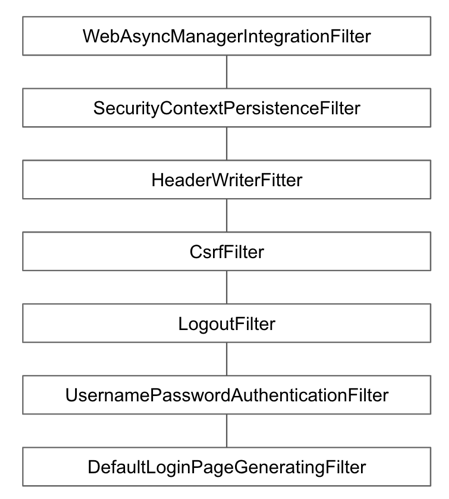

# DefaultLoginPageGeneratingFilter

기본 로그인 폼 페이지를 생성해주는 필터

- GET /login 요청을 처리하는 필터.

## 로그인 폼 커스터마이징
## 1. username, password 파라미터명 재정의

```java
http.formLogin()
  .usernameParameter("my-username")
  .passwordParameter("my-password");
;
```



## 2. 로그인 / 로그아웃 폼 커스터마이징 페이지 자체 대체

로그인 form 을 새로이 지정하고 싶다면 다음과 같이 `loginPage`를 지정해주면 된다.

```java
http.formLogin()
    .loginPage("/login"); // get 요청 처리
```

loginPage를 지정하는 순간, 다음 두 필터가 제외가 된다.

- DefaultLoginPageGeneratingFilter
- LogoutFilter

GET 요청은 `.loginPage("/login")` 가 처리하고 로그인 POST 요청은 이전에 살펴본 `UsernamePasswordAuthenticationFilter` 에서 처리하게 된다.

