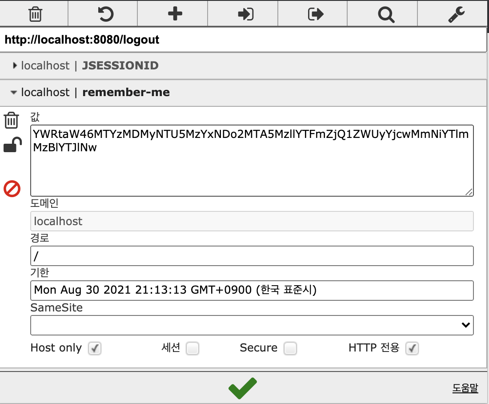
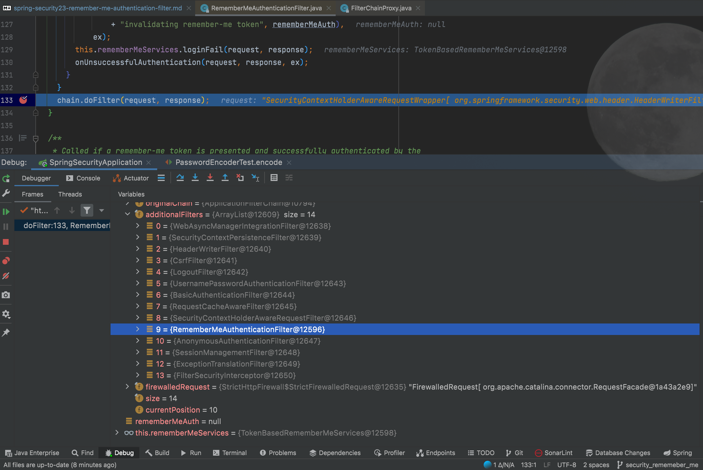
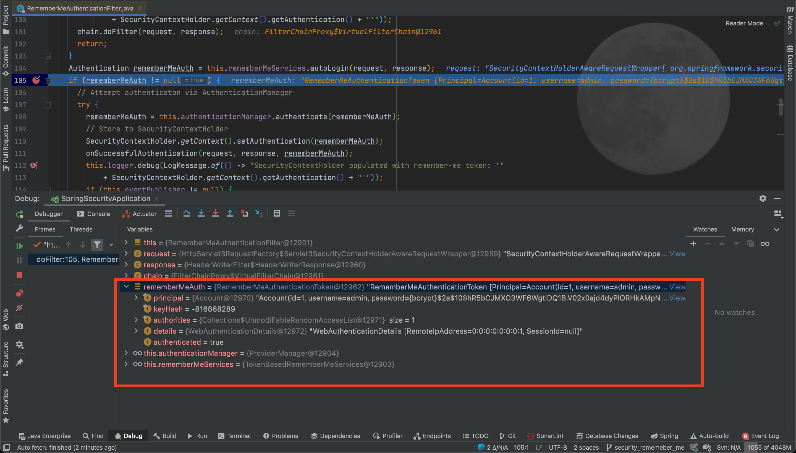

# RememberMeAuthenticationFilter

토큰 기반 인증 필터 세션이 사라지거나 만료가 되더라도 쿠키 또는 DB를 사용하여 저장된 토큰 기반으로 인증을 지원하는 필터

추가적인 필터로써 `rememberMe` 기능을 지원한다.

`rememberMe` 기능의 예시를 들어보자면, 웹 사이트에 로그인 기억하기 체크 박스 기능이 있고 이를 통해 직접적으로 로그인을 하여 인증을
받지 않고 인증을 할 수 있는 기능이다.

즉 세션이 종료 및 만료가 되어도 사용자 인증 처리를 할 수 있는데, 브라우저나 세션의 생명 주기가 보다 긴 쿠키 또는 DB에 저장된 토큰
기반으로 인증을 지원한다.

### RememberMe 설정

``` text
http.rememberMe()
//  .alwaysRemember(false) // 로그인 폼에서 파라미터 설정이 없더라도 기본적으로 설정한다는 의미 
//  .useSecureCookie(true) // https 에서만 접근 가능 https 적용 후 true 권장
    .userDetailsService(accountService)
    .key("remember-me-sample"); // parameter 
                                // default 'remember-me'
```

### Test RememberMe

참고로 크롬 `EditThisCookie` 플러그인을 사용하면 현재 웹 사이트에서 사용하고 있는 쿠키 정보를 볼 수 있다.
> https://chrome.google.com/webstore/detail/editthiscookie/fngmhnnpilhplaeedifhccceomclgfbg?hl=en



1. JSessionId 쿠키 제거
    - JSessionId 는 Session id 를 담고 있는 쿠키이다.
    - 요청과 관련된 Session 정보를 얻어, 시큐리티는 세션의 정보로 인증 처리를 한다.
2. rememberMe 기능을 활성화 한다.
3. `remember-me` 쿠키 생성 확인
    - username: 사용자 정보
    - 기한: 쿠기 유효 날짜
4. JSessionId 쿠키를 제거된 상태에서 로그인이 유지가 되는지 확인한다.



RememberMeAuthenticationFilter는 AnonymousAuthenticationFilter 전에 위치된다.

```java
public class RememberMeAuthenticationFilter extends GenericFilterBean implements ApplicationEventPublisherAware {
  // ...

  private void doFilter(HttpServletRequest request, HttpServletResponse response, FilterChain chain)
          throws IOException, ServletException {

    // 1. 시큐리티 컨텍스트에 인증된 사용자가 있는지 판단. 있다면 pass
    if (SecurityContextHolder.getContext().getAuthentication() != null) {
      this.logger.debug(LogMessage
              .of(() -> "SecurityContextHolder not populated with remember-me token, as it already contained: '"
                      + SecurityContextHolder.getContext().getAuthentication() + "'"));
      chain.doFilter(request, response);
      return;
    }

    // ...
    // 2. rememberMeAuth 정보가 있는지 확인.
    Authentication rememberMeAuth = this.rememberMeServices.autoLogin(request, response);
    if (rememberMeAuth != null) {
      try {
        // 3. rememberMeAuth 정보를 기반으로 AuthenticationManager 를 통해 사용자 인증 
        rememberMeAuth = this.authenticationManager.authenticate(rememberMeAuth);
        // 4. 시큐리티 컨텍스트에 인증된 사용자 set
        SecurityContextHolder.getContext().setAuthentication(rememberMeAuth);
        
        // ...
      } catch (AuthenticationException e) {
        // ...
      }

      // ...
    }
  }
}
```


