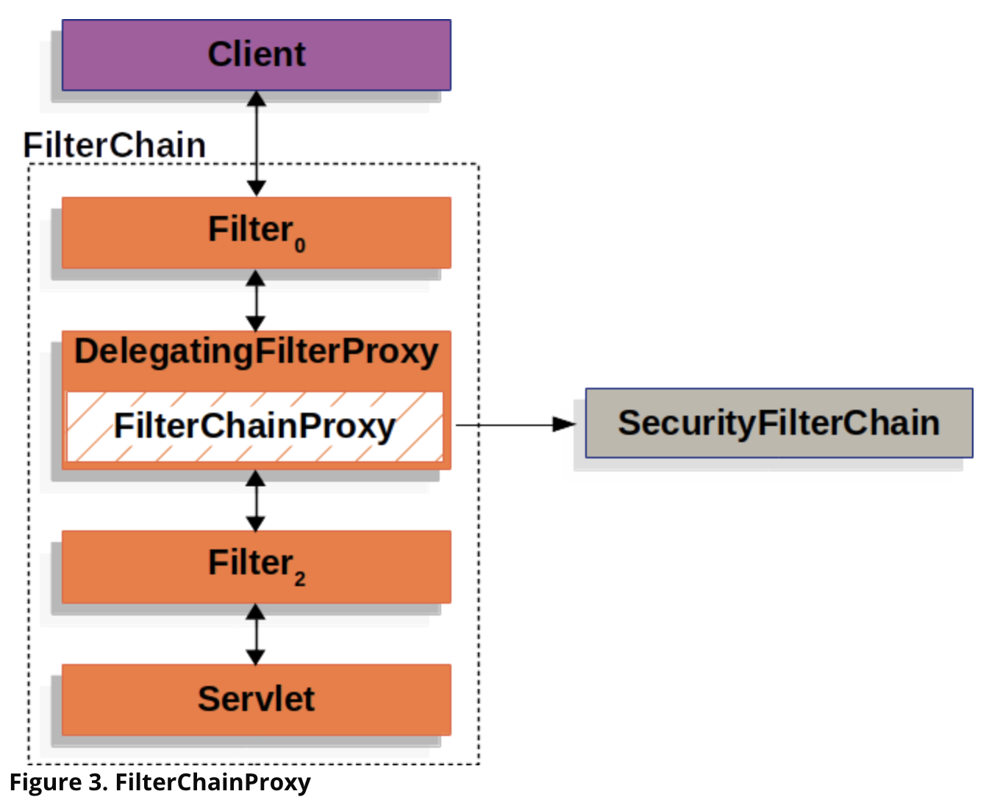
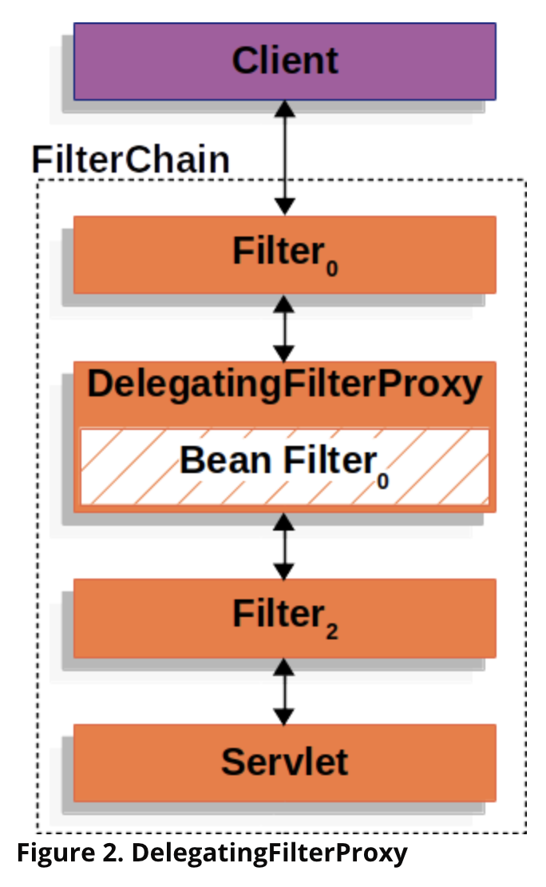

# Spring Security

# Filter와 FilterChainProxy

스프링 시큐리티가 제공하는 필터들

1. WebAsyncManagerIntegrationFilter
2. SecurityContextPersistenceFilter
3. HeaderWriterFilter
4. CsrfFilter
5. LogoutFilter
6. UsernamePasswordAuthenticationFilter
7. DefaultLoginPageGeneratingFilter
8. DefaultLogoutPageGeneratingFilter
9. BasicAuthenticationFilter
10. RequestCacheAwareFilter
11. SecurityContextHolderAwareRequestFilter
12. AnonymousAuthenticationFilter
13. SessionManagementFilter
14. ExceptionTranslationFilter
15. FilterSecurityInterceptor

이 모든 필터는 FilterChainProxy가 호출한다.



`FilterChainProxy.class`

1. doFilterInternal 메서드 안에서 gerFilters 를 사용하여 chain의 목록을 가져온다.
2. 순차적으로 filter를 실행한다.

[Spring security - servlet filter chain proxy](https://docs.spring.io/spring-security/site/docs/current/reference/html5/#servlet-filterchainproxy)

```java
public class FilterChainProxy extends GenericFilterBean {

  public void doFilter(ServletRequest request, ServletResponse response, FilterChain chain)
          throws IOException, ServletException {
    boolean clearContext = request.getAttribute(FILTER_APPLIED) == null;
    if (!clearContext) {
      doFilterInternal(request, response, chain);
      return;
    }
    try {
      request.setAttribute(FILTER_APPLIED, Boolean.TRUE);
      doFilterInternal(request, response, chain);
    } catch (RequestRejectedException ex) {
      this.requestRejectedHandler.handle((HttpServletRequest) request, (HttpServletResponse) response, ex);
    } finally {
      SecurityContextHolder.clearContext();
      request.removeAttribute(FILTER_APPLIED);
    }
  }

  private List<Filter> getFilters(HttpServletRequest request) {
    int count = 0;
    for (SecurityFilterChain chain : this.filterChains) {
      if (logger.isTraceEnabled()) {
        logger.trace(LogMessage.format("Trying to match request against %s (%d/%d)", chain, ++count,
                this.filterChains.size()));
      }
      if (chain.matches(request)) {
        return chain.getFilters();
      }
    }
    return null;
  }
}
```

아래 configure를 하나의 SecurityFilterChain이라 보면 된다.

```java
@Slf4j
@Configuration
@EnableWebSecurity
public class SecurityConfig extends WebSecurityConfigurerAdapter {

  @Override
  protected void configure(HttpSecurity http) throws Exception {
    http.authorizeRequests() 
            .anyRequest().authenticated();
    http.formLogin();
    http.httpBasic();
  }
}
```

antMatcher에 따라 @Order에 따라서 FilterChain이 순차적으로 필터를 실행한다.

---

# DelegatingFilterProxy와 FilterChainProxy

Servlet 컨테이너는 Servlet 스펙을 지원한다. Servlet 스펙엔 필터가 존재한다.

스프링 시큐리티엔 서블릿 필터의 구현체 중에 하나가, DelegatingFilterProxy가 있다.

DelegatingFilterProxy
- 일반적인 서블릿 필터
- 서블릿 필터 처리를 스프링에 들어있는 빈으로 위임하고 싶을 때 사용하는 서블릿 필터
- 타겟 빈 이름을 설정한다.
- 스프링 부트 없이 스프링 시큐리티 설정할 때는 AbstractSecurityWebApplicationInitializer를 사용해서 등록
- 스프링 부트를 사용할 때는 자동으로 등록 된다. (SecurityFilterAutoConfiguration)

자기가 처리하지 않고 누군가에게 위임을 한다. 필터로써 역할을 하는게 아니라 위임한다. 특정 빈에게 Spring IO Context에 포함된 빈에게 자기가 할 일을 위임한다.

FilterChainProxy
- 보통 "springSecurityFilterChain"이라는 빈으로 등록된다.

> SecurityFilterAutoConfiguration # DEFAULT_FILTER_NAME

빈의 이름으로 위임을 한다.




[Spring security - DelegatingFilterProxy](https://docs.spring.io/spring-security/site/docs/current/reference/html5/#servlet-delegatingfilterproxy)
