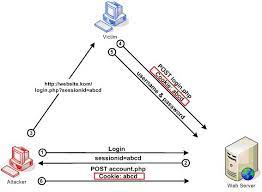

# SessionManagementFilter

세션 관리 필터

세션 변조 방지 전략 설정: sessionFixation

- [세션 변조](https://www.owasp.org/index.php/Session_fixation)
- none
- newSession
- migrateSession (서블릿 3.0- 컨테이너 사용시 기본값)
- changeSessionId (서브릿 3.1+ 컨테이너 사용시 기본값)
- https://docs.spring.io/spring-security/site/docs/5.1.5.RELEASE/reference/htmlsingle/#nsa-session-management-attributes

### 1. Session Fixation Attack

`Session Fixation` 공격이란, Session ID 관리가 취약한 웹 어플리케이션를 대상으로 공격자가 유효한 사용자 세션을 가로채어, 가로챈 세션을 통해 사용자 인증을 우회하는 보안 공격을 의미한다. 이 공격으로 인해 다른 사용자 정보를 탈취하여 악용될 수 있다.

우선 공격자가 `Session Fixation` 공격을 통해 웹 어플리케이션을 공격하는 시나리오를 살펴보자.



1. 공격자는 로그인을 한다.
2. 웹 어플리케이션에 로그인할 수 있는 유효한 Session ID를 발급받는다.
3. 공격자는 공격자가 발급받은 Session ID가 포함된 웹 사이트 링크를 피해자에게 보낸다. 피해자는 공격자로부터 전송된 링크를 통해 웹 사이트에 접근한다.
4. 웹 서버는 Session 이미 존재한다고 판단하고, 공격자의 Session ID를 유지한다. (fixation)
5. 피해자는 웹 서버를 통해 로그인한다.
6. 공격자는 Session ID를 알고 있기 때문에, 피해자의 계정에 접근할 수 있다.

### 1.1. Session Fixation Attack 해결 방안

다음 공격에 대한 해결 방법으로는 로그인 인증 성공하면 항상 새로운 Session ID를 발급하도록 설정하면 된다. 공격자는 새로 발급된 세션 ID로 인해 피해자의 계정 정보를 볼 수 없게 된다.

Spring Security의 세션 변조 방지 전략은 서블릿 컨테이너 버전마다 다르다.

- migrateSession (서블릿 3.0- 컨테이너 사용시 기본값)
  - 인증이 됐을때 새로운 세션을 생성, 기존에 등록이 되어 있던 session 정보를 그대로 복사하는 방식
- changeSessionId (서브릿 3.1+ 컨테이너 사용시 기본값)
   - Session ID를 변경하는 방식 (기존 Session 정보를 복사하는 행위를 하지 않는다는 차이점이 있다.)


> 참고 [Apache Tomcat Versions](http://tomcat.apache.org/whichversion.html)

### 2. Security Config

- sessionFixation
  - changeSessionId
  - migrateSession
  - newSession: 매번 새로운 세션 생성
  - none: session fixation 설정하지 않는다.

```text
http.sessionManagement()
        .sessionFixation()
            .changeSessionId(); 
            // ^-- fixation 전략 설정
```

### 2.1. 유효하지 않은 세션을 리다이렉트 시킬 URL 설정

- invalidSessionUrl

발생하는 시점은 로그아웃할 때 기존에 유지하던 Session을 invalid을 한다.
이때, 유효하지 않는 세션이 접근할 때 리다이렉트 시킬 URL 설정을 한다. 

```text
http.sessionManagement()
        .sessionFixation()
            .changeSessionId();
        .invalidSessionUrl("/login"); 
        // ^-- 유효하지 않는 세션에 대한 리다이렉트 URL 설정
```

### 2.2. 동시성 제어

동시성 제어: maximumSessions

기본적으로 여러 브라우저에서 로그인이 가능하다. 예를들어 크롬에서 로그인을 하고, 익스에서 로그인이 된다. 이처럼 여러 브라우저에서 동시에 로그인이 가능하다. 

만약 세션을 하나만 유지하고 싶거나 유지할 세션의 수를 제한하고 싶다면 다음과 같이 동시성 제어 설정을 추가해주면 된다.

```text
http.sessionManagement()
        .sessionFixation()
            .changeSessionId();
        .invalidSessionUrl("/login")
        .maximumSessions(1); 
        // ^-- 관리할 Session 갯수 설정
```

다음과 같이 `maximumSessions`를 1로 설정했다면, 이전과 같은 시나리오에선 크롬에서 먼저 로그인을 하고 익스에서 로그인을 시도할 때, 이전에 로그인이 되었던 크롬의 Session은 만료된다.

### 2.2.1. 추가 로그인을 막을지 여부 설정

앞서 설명한것 처럼 추가 로그인을 하면 이전에 로그인 되었던 Session은 만료되어 이전에 로그인한 계정은 로그아웃 된다.

이는 Spring Security의 `maxSessionsPreventsLogin` 설정의 기본 값이 `false` 이기 때문이다.

- maxSessionsPreventsLogin
  - 추가 로그인을 막을지 여부 설정 (기본값, false)

만약 이전 세션을 유지하고 추가 로그인을 막고 싶을 경우엔 다음 설정을 참고하자.

```text
http.sessionManagement()
        .sessionFixation()
            .changeSessionId();
        .invalidSessionUrl("/login")
        .maximumSessions(1)
            .maxSessionsPreventsLogin(true); 
            // ^-- 추가 로그인을 막을지 여부 설정 (기본값 false)
```

- https://docs.spring.io/spring-security/site/docs/5.1.5.RELEASE/reference/htmlsingle/#nsa-concurrency-control

### 3. 세션 생성 전략

- sessionCreationPolicy
  - IF_REQUIRED (default)
    - 필요하면 생성한다.
  - NEVER
    - Security에 의해 Session을 생성하지 않고 기존 Session이 있다면 사용한다. 
  - STATELESS
    - 아예 Session을 생성하지 않고, 사용하지 않겠다.
    - stateless 환경에 적합
    - form 기반 인증 환경에 적절하지 않는다.
      - Security 기본 session에 인증 정보를 담고 있는 전략으로 인해 매번 로그인을 시도하는 상황이 발생한다.
      - RequestCacheAwareFilter 에서 세션을 사용하기 때문에 특정 URL 캐싱을 찾지 못해 root(/) 페이지로 이동하는 현상이 발생된다.
  - ALWAYS
    - 항상 Session 생성

```text
http.sessionManagement()
            .sessionCreationPolicy(SessionCreationPolicy.IF_REQUIRED);
            ^-- 세션 생성 전략 설정
```

> 세션 클러스트는 Spring Session 프로젝트를 참고

## 참고

- https://docs.spring.io/spring-security/site/docs/5.1.5.RELEASE/reference/htmlsingle/#session-mgmt
