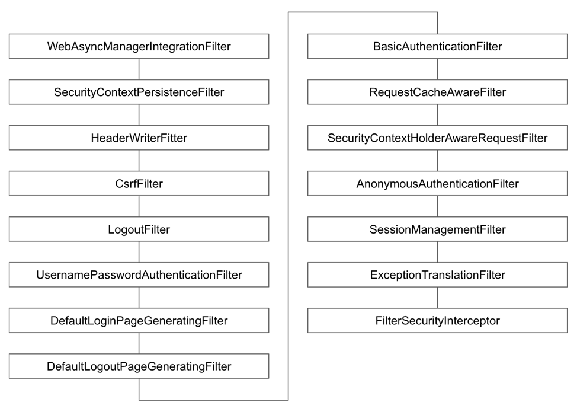

# FilterSecurityInterceptor

인가 처리 필터

> https://docs.spring.io/spring-security/site/docs/5.1.5.RELEASE/reference/htmlsingle/#filter-security-interceptor

HTTP 리소스 시큐리티 처리를 담당하는 필터. AccessDecisionManager를 사용하여 인가를 처리한다.



## HTTP 리로스 시큐리티 설정

``` text
http.authorizeRequests()
    .mvcMatchers("/", "/info", "/account/**", "/signup").permitAll()
    .mvcMatchers("/admin").hasAuthority("ROLE_ADMIN")
    .mvcMatchers("/user").hasRole("USER")
    .anyRequest().authenticated()
    .expressionHandler(expressionHandler());
```

위의 설정을 기반으로 AccessDecisionManager 가 해당 리로스 요청에 대한 접근 권한이 있는지 판단한다.

기본적으로 `ant pattern`으로 fallback 된다.

- permitAll : 모두에게 허용
- hasRole: 세부적인 권한 설정
  - hasAuthority의 하위 개념, prefix `ROLE_`를 생략한 개념
- hasAuthority: 좀 더 generate한 설정, `ROLE_*` 사용.
- anyRequest()
  - anonymous: 인증되지 않는 사용자에게만 접근 허용
    - 인증된 사용자가 리소스 접근시 에러 발생
  - authenticated: 인증된 사용자만 접근 허용
  - rememberMe: 기능으로 인증된 사용자에게만 접근 허용
  - fullyAuthenticated: rememberMe로 인증된 사용자에게 다시 한번 로그인 요청을 한다.
    - 가령 아마존에서 주문 히스토리를 보거나 주문을 하는 중요한 URL에 대해서 다시 사용자 인증 요청을 한다.


