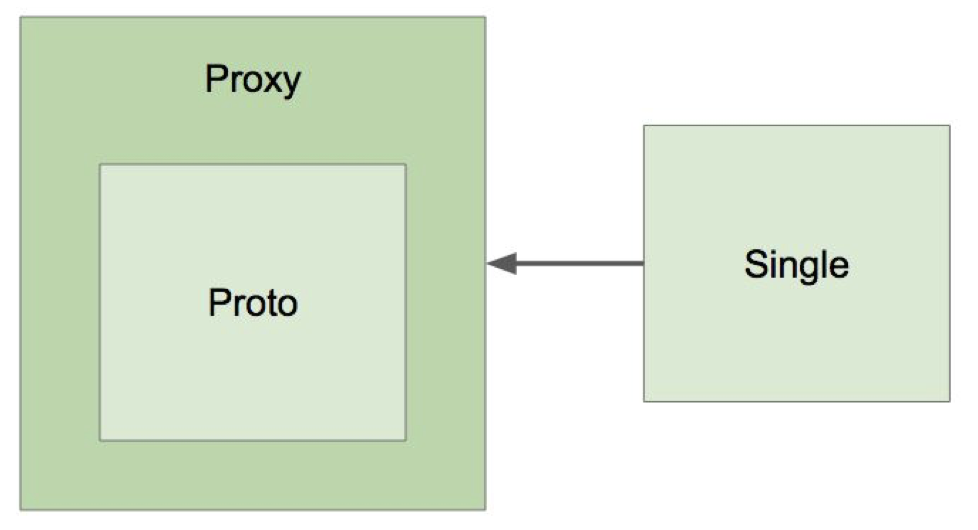

## IoC 컨테이너 5부: 빈의 스코프

### 스코프

- 싱글톤
- 프로토타입 
  - Request 
  - Session 
  - WebSocket 
  - ...

### 프로토타입 빈이 싱글톤 빈을 참조하면?

- 아무 문제 없음.

### 싱글톤 빈이 프로토타입 빈을 참조하면?

- 프로토타입 빈이 업데이트가 안되네?

```java
@Component
public class ScopeAppTestRunner implements ApplicationRunner {

  @Autowired
  ApplicationContext applicationContext;

  @Override
  public void run(ApplicationArguments args) throws Exception {
    System.out.println("proto");
    System.out.println(applicationContext.getBean(Proto.class));
    System.out.println(applicationContext.getBean(Proto.class));
    System.out.println(applicationContext.getBean(Proto.class));

    System.out.println("single");
    System.out.println(applicationContext.getBean(Single.class));
    System.out.println(applicationContext.getBean(Single.class));
    System.out.println(applicationContext.getBean(Single.class));

    System.out.println("proto by single");
    System.out.println(applicationContext.getBean(Single.class).getProto());
    System.out.println(applicationContext.getBean(Single.class).getProto());
    System.out.println(applicationContext.getBean(Single.class).getProto());
  }
}
```
```text
proto
com.gmoon.springframework.scope.Proto@3cc749ce
com.gmoon.springframework.scope.Proto@38fc2ab2
com.gmoon.springframework.scope.Proto@7e89e0f3
single
com.gmoon.springframework.scope.Single@54bb5c68
com.gmoon.springframework.scope.Single@54bb5c68
com.gmoon.springframework.scope.Single@54bb5c68
proto by single
com.gmoon.springframework.scope.Proto@52b4f608
com.gmoon.springframework.scope.Proto@52b4f608
com.gmoon.springframework.scope.Proto@52b4f608
```

- 업데이트 하려면 
  - scoped-proxy 
  - Object-Provider 
  - Provider (표준)

프록시 (https://en.wikipedia.org/wiki/Proxy_pattern)



싱글톤에서 프로토 타입의 빈을 직접 참조하지말고 프록시를 거쳐서 사용해야한다.
왜냐하면 애플리케이션이 구동이 될때 싱글톤 빈이 생성이 됨으로 프로토 타입이더라도 직접 참조하면 인스턴스가 변경이 안된다.

프록시는 기본적으로 런타임 시점에 인스턴스를 생성해줌으로 프로토 타입에 변경된 빈을 주입받을 수 있게 된다.

### scoped-proxy, proxyMode = ScopedProxyMode.TARGET_CLASS

```java
@Component
@Scope(value = "prototype", proxyMode = ScopedProxyMode.TARGET_CLASS)
public class Proto {
}
```

### Object-Provider

```java
@Component
public class Single {

  @Autowired
  ObjectProvider<Proto> proto;

  public Proto getProto() {
    return proto.getIfAvailable();
  }
}
```

### 싱글톤 객체 사용시 주의할 점

- 프로퍼티가 공유.
  - Thread Safe 한지 늘 조심하고 조심하자.
- ApplicationContext 초기 구동시 인스턴스 생성.
