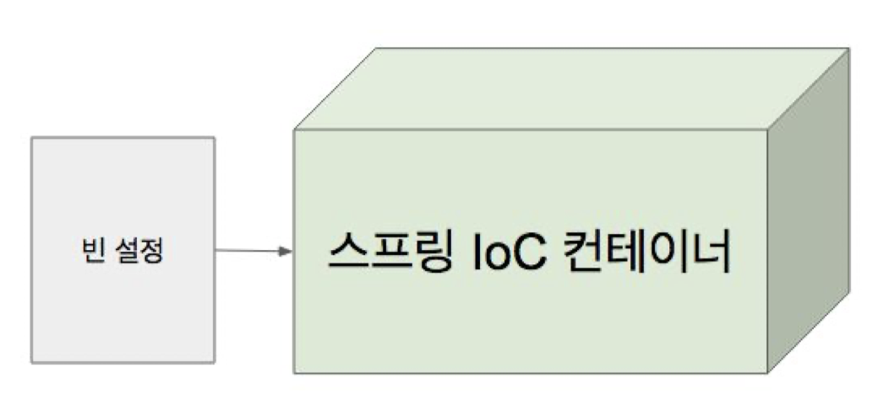

# IoC 컨테이너

## 1. 스프링 IoC 컨테이너와 빈

Inversion of Control: 의존 관계 주입(Dependency Injection)이라고도 하며, 어떤 객체가 사용하는 의존 객체를
직접 만들어 사용하는게 아니라,아니라 주입 받아 사용하는 방법을 말 함.

### 1.1. 스프링 IoC 컨테이너

- BeanFactory
    - Spring IoC Container 가장 최상위의 인터페이스, 핵심!!..
- 애플리케이션 컴포넌트의 중앙 저장소.
- 빈 설정 소스로 부터 빈 정의를 읽어들이고, 빈을 구성하고 제공한다.

### 1.2. 빈

- 스프링 IoC 컨테이너가 관리 하는 객체.
- 장점
    - 의존성 관리
    - 스코프
        - 싱글톤: 하나
        - 프로포토타입: 매번 다른 객체
        - 라이프사이클 인터페이스

### 1.3. [ApplicationContext](https://docs.spring.io/spring-framework/docs/5.0.8.RELEASE/javadoc-api/org/springframework/context/ApplicationContext.html)

- [BeanFactory](https://docs.spring.io/spring-framework/docs/5.0.8.RELEASE/javadoc-api/org/springframework/beans/factory/BeanFactory.html)
- 메시지 소스 처리 기능 (i18n)
- 이벤트 발행 기능
- 리소스 로딩 기능
- ...

## 2. IoC 컨테이너 2부:

## ApplicationContext와 다양한 빈 설정 방법

### 2.1. 스프링 IoC 컨테이너의 역할



- 빈 인스턴스 생성
- 의존 관계 설정
- 빈 제공

### 2.2. AppcliationContext

- ClassPathXmlApplicationContext (XML)
- AnnotationConfigApplicationContext (Java)

### 2.3. 빈 설정

- 빈 명세서
- 빈에 대한 정의를 담고 있다.
    - 이름
    - 클래스
    - 스코프
    - 생성자 아규먼트 (constructor)
    - 프로퍼트 (setter)
    - ..
- 빈 주입
    - @Autowired
    - @Inject

### 2.4. 컴포넌트 스캔

- 설정 방법
    - XML 설정에서는 context:component-scan
        - Spring 2.0 부터 애노테이션 설정
    - 자바 설정에서 @ComponentScan
- 특정 패키지 이하의 모든 클래스 중에 @Component 애노테이션을 사용한 클래스를 빈으로 자동으로 등록 해 줌.

---

## 3. IoC 컨테이너 4부: @Component와 컴포넌트 스캔

컨포넌트 스캔 주요 기능

- 스캔 위치 설정
- 필터: 어떤 애노테이션을 스캔 할지 또는 하지 않을지

### 3.1. @Component를 선언되어 있는 애노테이션들이 등록된다.

- @Component
  - @Repository
  - @Service
  - @Controller
  - @Configuration

### 3.2. 동작 원리

- @ComponentScan은 스캔할 패키지와 애노테이션에 대한 정보
- 실제
  스캐닝은 [ConfigurationClassPostProcessor](https://docs.spring.io/spring-framework/docs/current/javadoc-api/org/springframework/context/annotation/ConfigurationClassPostProcessor.html)라는 [BeanFactoryPostProcessor](https://docs.spring.io/spring-framework/docs/current/javadoc-api/org/springframework/beans/factory/config/BeanFactoryPostProcessor.html)에
  의해 처리 됨.

### 3.3. Functional을 사용한 빈 등록

애플리케이션 구동되는 초기 시점에 모든 빈을 등록시키기 때문에, 등록된 빈이 많으면 구동시간이 늘어진다.
구동 시간에 예민하다면, Functional 방법을 고려할 수 있다. 
Spring5 부터 사용할 수 있고, 리플렉션이나 프록시 기법은 성능에 영향을 주지만 Functional 를 구동 시간의 성능상에 이점이 조금이나마 있다.

```java
public static void main(String[]args){
  new SpringApplicationBuilder()
        .sources(Demospring51Application.class)
        .initializers((ApplicationContextInitializer<GenericApplicationContext>) applicationContext
          -> {
              applicationContext.registerBean(MyBean.class);
        })
        .run(args);
}
```

---

### IoC 컨테이너 3부: @Autowire

필요한 의존 객체의 “타입"에 해당하는 빈을 찾아 주입한다.

@Autowired 
- required: 기본값은 true (따라서 못 찾으면 애플리케이션 구동 실패)

Construct 주입일 경우 반드시 


### 빈 주입 사용할 수 있는 위치

- 생성자 (스프링 4.3 부터는 생략 가능)
- 세터
- 필드

```java
import com.gmoon.springframework.inject.PooRepository;
import org.springframework.beans.factory.annotation.Autowired;
import org.springframework.stereotype.Repository;
import org.springframework.stereotype.Service;

@Service
public class PooService {

  // 3. field 주입 방식: @Autowired
  @Autowired
  private PooRepository pooRepository;

  // 1. 생성자 주입 방식: @Autowired 생략 가능
  public PooService(PooRepository pooRepository) {
    this.pooRepository = pooRepository;
  }

  // 2. Setter 주입 방식: @Autowired 필수
  @Autowired
  public void setPooRepository(PooRepository pooRepository) {
    this.pooRepository = pooRepository;
  }
}
```

만약 PooRepository가 빈으로 등록되지 않는다면, Spring IoC 컨테이너에 의해 PooService 빈이 등록되는 시점에 PooRepository의 빈 타입을 찾을 수 없다는 에러를 발생한다.

```text
Parameter 0 of constructor in com.gmoon.springframework.inject.PooService required a bean of type 'com.gmoon.springframework.inject.PooRepository' that could not be found.
```

간혹 조건에 의해 생성되는 빈들도 존재할 수 있다. 이와 마찬가지로 PooRepository의 빈 생성이 어떠한 조건에 따라 결정된다면, @Autowired 애노테이션의 required 속성을 false로 주거나, 다음과 같이 `org.springframework.lang.Nullable` 애노테이션을 사용하여 해결할 수 있다.

- @Autowired(required=false)
- @Nullable

```java
import com.gmoon.springframework.inject.PooRepository;
import org.springframework.lang.Nullable;
import org.springframework.stereotype.Service;

@Service
public class PooService {

  private PooRepository pooRepository;

  public PooService(@Nullable PooRepository pooRepository) {
    this.pooRepository = pooRepository;
  }
}
```

### 경우의 수

- 해당 타입의 빈이 없는 경우
- 해당 타입의 빈이 한 개인 경우
- 해당 타입의 빈이 여러 개인 경우
  - 빈 이름으로 시도,
    - 같은 이름의 빈 찾으면 해당 빈 사용
    - 같은 이름 못 찾으면 실패

### 같은 타입의 빈이 여러개 일 때

```java
@Repository
public class MyRepository implements PooRepository { }

@Repository
public class MoonRepository implements PooRepository { }
```

- @Primary
- @Qualifier (빈 이름으로 주입)
- 해당 타입의 빈 모두 주입 받기

#### @Primary

PooRepository 인터페이스를 구현한 여러 구현체들 중에 최종적으로 빈으로 등록할 구현체에 @Primary 애노테이션을 선언해준다.

```java
@Service
public class PooService {

  public PooRepository pooRepository;

  public PooService(PooRepository pooRepository) {
    System.out.println("PooRepository primary type is " + pooRepository);
  }
}

@Primary
@Repository
public class MyRepository implements PooRepository {
}
```
```text
PooRepository primary type is com.gmoon.springframework.inject.MyRepository@22ba1904
```

#### @Qualifier

@Qualifier 는 빈 id로 빈을 주입 받는 방식이다.

빈 id는 애노테이션으로 명시할 수도 있지만 기본적으로 클래스 명의 스몰 케이스로 정의된다.

```java
@Service
public class PooService {
  
  private PooRepository pooRepository;
  
  public PooService(PooRepository pooRepository,
                    @Qualifier(value = "moonRepository") PooRepository pooRepository2,
                    PooRepository moonRepository) {
    System.out.println("PooRepository primary type is " + pooRepository);
    System.out.println("PooRepository @Qualifier type is " + pooRepository2);
    System.out.println("PooRepository bean id type is " + moonRepository);
  }
}

@Primary
@Repository
public class MyRepository implements PooRepository {
}
```
```text
PooRepository primary type is com.gmoon.springframework.inject.MyRepository@7040ff81
PooRepository @Qualifier type is com.gmoon.springframework.inject.MoonRepository@75eab670
PooRepository bean id type is com.gmoon.springframework.inject.MyRepository@7040ff81
```

빈을 주입할 때, IoC 컨테이너는 Type을 먼저보고 빈의 이름을 찾게된다. @Primary 애노테이션으로 MyRepository 로 선언되어 MyRepository를 찾게 된다.
bean id 를

#### 해당 타입의 빈 모두 주입 받기

모든 빈을 주입 받고 싶다면 다음과 같이 받을 수도 있다.

```java
@Service
public class PooService {

  private PooRepository pooRepository;

  public PooService(PooRepository pooRepository,
                    @Qualifier(value = "moonRepository") PooRepository pooRepository2,
                    PooRepository moonRepository,
                    List<PooRepository> pooRepositorys) {
    System.out.println("PooRepository primary type is " + pooRepository);
    System.out.println("PooRepository @Qualifier type is " + pooRepository2);
    System.out.println("PooRepository bean id type is " + moonRepository);
    pooRepositorys.forEach(System.out::println);
    this.pooRepository = pooRepositorys.stream().findFirst()
            .orElse(null);
  }
}
```
```text
PooRepository primary type is com.gmoon.springframework.inject.MyRepository@7040ff81
PooRepository @Qualifier type is com.gmoon.springframework.inject.MoonRepository@75eab670
PooRepository bean id type is com.gmoon.springframework.inject.MyRepository@7040ff81
com.gmoon.springframework.inject.MoonRepository@75eab670
com.gmoon.springframework.inject.MyRepository@7040ff81
```

### 동작 원리

- 첫시간에 잠깐 언급했던 빈 라이프사이클 기억하세요?
- [BeanPostProcessor](https://docs.spring.io/spring-framework/docs/current/javadoc-api/org/springframework/beans/factory/config/BeanPostProcessor.html) 
  - 새로 만든 빈 인스턴스를 수정할 수 있는 라이프 사이클 인터페이스
- [AutowiredAnnotationBeanPostProcessor](https://docs.spring.io/spring-framework/docs/current/javadoc-api/org/springframework/beans/factory/annotation/AutowiredAnnotationBeanPostProcessor.html) extends BeanPostProcessor 
  - 스프링이 제공하는 @Autowired와 @Value 애노테이션 그리고 JSR-330의 @Inject 애노테이션을 지원하는 애노테이션 처리기.
  - Initialization before, after callback

BeanFactory 가 자기안에 등록되어 있는 빈의 beanPostProcessor를 찾는다. 빈에 등록된 다른 일반적인 빈들에게 beanPostProcessor를 적용을 시킨다.
