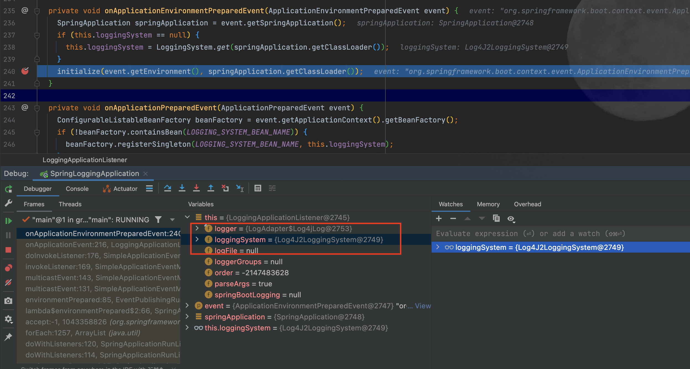
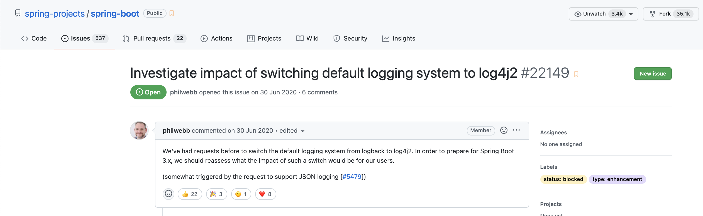

# Spring Boot Logging

- Spring Boot 1.6.1
- Maven
- JDK 8

## Console DEBUG enabled

`Spring boot` 기본적으로 로그 레벨은 `INFO`다. 

아래 설정으로 Application 실행 시 디버그 모드를 활성화할 수 있다.

```text
# jar 실행시 옵션으로 디버그 모드 활성화
java -jar spring-logging.jar --debug
```

```properties
# debug 모드 활성화, default false 
debug=true
```

## logging.level

```properties
logging.level.root=debug
logging.level.org.springframework.web=debug
logging.level.com.gmoon.springlogging=debug
```

## logging.group

```text
# log grouping
logging.group.gmoon=com.gmoon,com.gmoon.springlogging
logging.level.gmoon=debug
```

## 1. Customization

가능하면 커스텀 로깅 파일 이름은  `*-spring.xml` 을 권장한다.


### [1.1. Logback](http://logback.qos.ch/manual/configuration.html)

`Spring boot` 는 다양한 Logging framework 중에 기본적으로 `Logback`을 지원한다.

```text
- spring-boot-start-web
    - spring-boot-start
        - spring-boot-starter-logging
            - ch.qos.logback
```


Logback 설정 방법은 비교적 간단하다.

- dependency
- application.properties
- logback-spring.xml

### 1.1.1. Dependency

```xml
<dependency>
    <groupId>org.springframework.boot</groupId>
    <artifactId>spring-boot-starter-web</artifactId>
</dependency>
```

### 1.1.2. logback-spring.xml

```xml
<?xml version="1.0" encoding="UTF-8"?>
<configuration scan="true" scanPeriod="5 seconds">
    <!--<include resource="org/springframework/boot/logging/logback/defaults.xml" />-->
    <!--<include resource="org/springframework/boot/logging/logback/console-appender.xml" />-->
    <property name="CONSOLE_LOG_PATTERN" value="%clr(%d{HH:mm:ss.SSS}){faint} %clr(%5p) %clr([%thread]){magenta} %clr(%-35.40logger{39}){cyan} %clr(:){red} %m%n%wEx"/>

    <statusListener class="ch.qos.logback.core.status.OnConsoleStatusListener"/>

    <appender name="CONSOLE" class="ch.qos.logback.core.ConsoleAppender">
        <!-- encoders are assigned the type
             ch.qos.logback.classic.encoder.PatternLayoutEncoder by default -->
        <encoder>
            <pattern>${CONSOLE_LOG_PATTERN}</pattern>
        </encoder>
    </appender>

    <!-- in the absence of the class attribute, assume
   ch.qos.logback.core.hook.DefaultShutdownHook -->
    <shutdownHook class="ch.qos.logback.core.hook.DelayingShutdownHook"/>

    <logger name="com.gmoon.springlogging" level="INFO" />

    <root level="error">
        <appender-ref ref="CONSOLE"/>
    </root>
</configuration>
```

### 1.1.3. Custom logback file path

기본적으로 `Spring boot`는 커스텀된 logging 파일 이름에 대해 **`*-spring.xml`** 으로 인식한다.

- logback-spring.xml
- log4j2-spring.xml

예를 들어 규약을 지키지 않고,  <br/>
파일명을 `custom-logback.xm`로 지었다면 다음 프로퍼티 `logging.config`로 설정하자.

```properties
# application.properties
logging.config=classpath:custom-logback.xml
```

## [1.2. Apache Log4j2](https://logging.apache.org/log4j/2.x/)

**`Log4j2`** 는 성능적으로 보면 Logback 보다 더 효율적인 로깅 프레임워크다.


> [참고 - logging.apache.org](https://logging.apache.org/log4j/log4j-2.12.1/performance.html)

## 1.2.1. Dependency

우선 Logback 을 예외 시켜고 `spring-boot-starter-log4j2` 추가해 주자.

```xml
<dependency>
    <groupId>org.springframework.boot</groupId>
    <artifactId>spring-boot-starter-web</artifactId>
    <exclusions>
        <exclusion>
            <groupId>org.springframework.boot</groupId>
            <artifactId>spring-boot-starter-logging</artifactId>
        </exclusion>
    </exclusions>
</dependency>
<dependency>
    <groupId>org.springframework.boot</groupId>
    <artifactId>spring-boot-starter-log4j2</artifactId>
</dependency>
```

### 1.2.2. Switching log4j2

정상적으로 Log4j2 로 변경됐는지 확인해보자. 

```java
package org.springframework.boot.context.logging;

public class LoggingApplicationListener implements GenericApplicationListener {

  private void onApplicationEnvironmentPreparedEvent(ApplicationEnvironmentPreparedEvent event) {
    SpringApplication springApplication = event.getSpringApplication();
    if (this.loggingSystem == null) {
      this.loggingSystem = LoggingSystem.get(springApplication.getClassLoader());
    }
    initialize(event.getEnvironment(), springApplication.getClassLoader());
  }
}
```



### 1.2.3. Custom log4j2

properties 설정 방법도 있지만 XML 설정을 다룬다.

자세한 내용은 아래 링크들을 참조하자

- [Log4j2 - Configuration](http://home.apache.org/~rpopma/log4j/2.6/manual/configuration.html#XML)
- [Log4j2 - Layouts](https://logging.apache.org/log4j/2.x/manual/layouts.html)
  - [Log4j2 - PatternLayout](https://logging.apache.org/log4j/2.x/manual/layouts.html#PatternLayout)

```xml
<?xml version="1.0" encoding="UTF-8"?>
<Configuration monitorInterval="5">
    <properties>
        <Property name="CONSOLE_LOG_PATTERN">%style{%d{HH:mm:ss.SSS}}{faint} %highlight{[%-5p]}{FATAL=red blink, ERROR=red, WARN=yellow bold, INFO=black bold, DEBUG=green bold, TRACE=faint} %c{length=30}.%M{-20}() %style{[%t]}{blue} %style{:}{red} %m%n</Property>
    </properties>

    <Appenders>
        <Console name="CONSOLE" target="SYSTEM_OUT">
            <PatternLayout disableAnsi="false" pattern="${CONSOLE_LOG_PATTERN}" />
        </Console>
    </Appenders>
    <Loggers>
        <Logger name="com.gmoon.springlogging" level="info"/>
        <Root level="error">
            <AppenderRef ref="CONSOLE"/>
        </Root>
    </Loggers>
</Configuration>
```

### Spring boot 3 switching log4j2?!

그렇다면 왜 `Spring boot` 는 `Logback` 을 기본 로깅 프레임워크로 선택했을까?

여러 가설이 있지만 제일 유력한건, 릴리즈 시점에 `Log4j2` 가 등장하지 않았다는 가설이다.

> [stackoverflow - Why is logback the default logging framework in spring boot](https://stackoverflow.com/questions/55684592/why-is-logback-the-default-logging-framework-in-spring-boot)

그렇다면, `Spring boot` 는 Logback 이 Log4j2 가 효율적이라는걸 모르는걸까? 



물론 아니다. [GitHub Spring issues](https://github.com/spring-projects/spring-boot/issues/22149) 에 보면 
`Spring boot 3` 에선 Log4j2 가 기본 로깅 프레임워크로 교체될 예정으로 보인다.

## Reference

- [docs.spring.io - logging](https://docs.spring.io/spring-boot/docs/current/reference/html/features.html#features.logging)
- [docs.spring.io - profile-specific](https://docs.spring.io/spring-boot/docs/current/reference/html/features.html#features.external-config.files.profile-specific)
- [GitHub - Spring boot logback](https://github.com/spring-projects/spring-boot/blob/v2.6.1/spring-boot-project/spring-boot/src/main/resources/org/springframework/boot/logging/logback/defaults.xml)
- [GitHub - Spring boot log4j2](https://github.com/spring-projects/spring-boot/blob/v2.6.1/spring-boot-project/spring-boot/src/main/resources/org/springframework/boot/logging/log4j2/log4j2.xml)
- [Logback - logback.qos.ch](http://logback.qos.ch/manual/configuration.html)
- [Log4j - logging.apache.org](https://logging.apache.org/log4j/2.x/)
  - [Log4j - logging.apache.org configuration](http://home.apache.org/~rpopma/log4j/2.6/manual/configuration.html#XML)