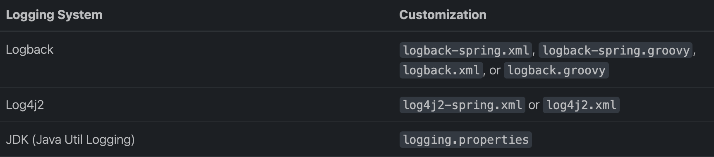
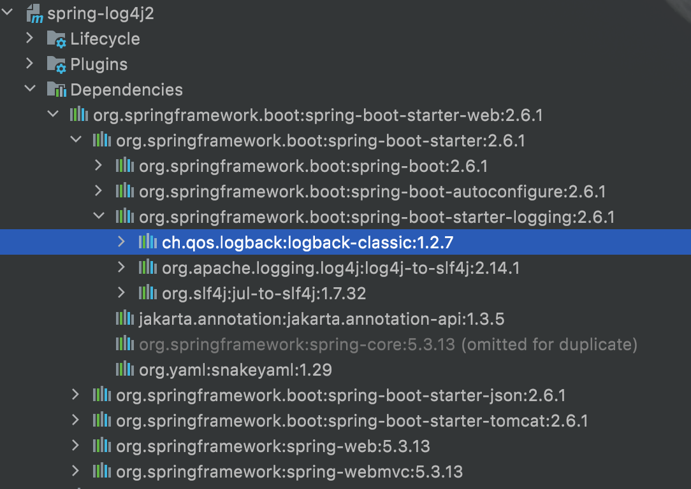

# Spring Boot Logging

- Spring Boot 1.6.1
- Maven
- JDK 8

## Console DEBUG enabled

SpringBoot 기본적으로 로그 레벨은 `INFO`다. 

아래 설정으로 Application 실행 시 디버그 모드를 활성화할 수 있다.

```text
# jar 실행시 옵션으로 디버그 모드 활성화
java -jar spring-logging.jar --debug
```

```properties
# debug 모드 활성화, default false 
debug=true
```

## logging.level

```properties
logging.level.root=debug
logging.level.org.springframework.web=debug
logging.level.com.gmoon.springlogging=debug
```

## logging.group

```text
# log grouping
logging.group.gmoon=com.gmoon,com.gmoon.springlogging
logging.level.gmoon=debug
```

## 1. Customization

가능하면 커스텀 로깅 파일 이름은  `*-spring.xml` 을 권장한다.



### 1.1. Logback

SpringBoot 는 다양한 Logging framework 중에 기본적으로 `Logback`을 지원한다.

```text
- spring-boot-start-web
    - spring-boot-start
        - spring-boot-starter-logging
            - ch.qos.logback
```



Logback 설정 방법은 비교적 간단하다.

- dependency
- application.properties
- logback-spring.xml

### 1.1.1. Dependency

```xml
<dependency>
    <groupId>org.springframework.boot</groupId>
    <artifactId>spring-boot-starter-web</artifactId>
</dependency>
```

### 1.1.2. logback-spring.xml

```xml
<?xml version="1.0" encoding="UTF-8"?>
<configuration scan="true" scanPeriod="5 seconds">
    <!--<include resource="org/springframework/boot/logging/logback/defaults.xml" />-->
    <!--<include resource="org/springframework/boot/logging/logback/console-appender.xml" />-->
    <property name="CONSOLE_LOG_PATTERN" value="%clr(%d{HH:mm:ss.SSS}){faint} %clr(%5p) %clr([%thread]){magenta} %clr(%-35.40logger{39}){cyan} %clr(:){red} %m%n%wEx"/>

    <statusListener class="ch.qos.logback.core.status.OnConsoleStatusListener"/>

    <appender name="CONSOLE" class="ch.qos.logback.core.ConsoleAppender">
        <!-- encoders are assigned the type
             ch.qos.logback.classic.encoder.PatternLayoutEncoder by default -->
        <encoder>
            <pattern>${CONSOLE_LOG_PATTERN}</pattern>
        </encoder>
    </appender>

    <!-- in the absence of the class attribute, assume
   ch.qos.logback.core.hook.DefaultShutdownHook -->
    <shutdownHook class="ch.qos.logback.core.hook.DelayingShutdownHook"/>

    <logger name="com.gmoon.springlogging" level="INFO" />

    <root level="error">
        <appender-ref ref="CONSOLE"/>
    </root>
</configuration>
```

### 1.1.3. Custom logback file path

기본적으로 SpringBoot는 커스텀된 logging 파일 이름에 대해 **`*-spring.xml`** 으로 인식한다.

- logback-spring.xml
- log4j2-spring.xml

규약을 지키지 않고 임의의 파일명으로 지었다면, 다음 프로퍼티 `logging.config`로 설정 해주자.

```properties
# application.properties
logging.config=classpath:custom-logback.xml
```

## 2. Apache Log4j2


> [이미지 출처 - logging.apache.org](https://logging.apache.org/log4j/log4j-2.12.1/performance.html)

## Reference

- [docs.spring.io - logging](https://docs.spring.io/spring-boot/docs/current/reference/html/features.html#features.logging)
- [docs.spring.io - profile-specific](https://docs.spring.io/spring-boot/docs/current/reference/html/features.html#features.external-config.files.profile-specific)
- [logback.qos.ch](http://logback.qos.ch/manual/configuration.html)