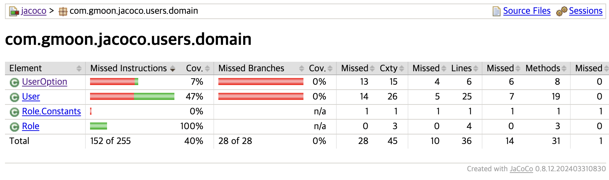
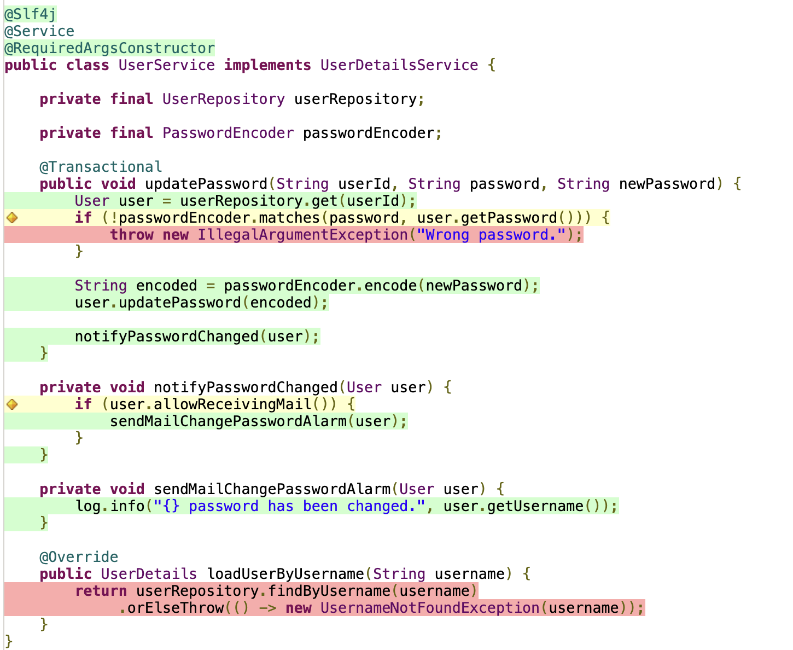

# JaCoCo

JaCoCo는 eclemma 팀에서 공개한 `Java` 기반 코드 커버리지 오픈 소스 라이브러리다.

## Environment

- Java 17
- org.jacoco:jacoco-maven-plugin:0.8.12

## [Using Maven](https://www.eclemma.org/jacoco/trunk/doc/maven)

- [org.jacoco:jacoco-maven-plugin](https://mvnrepository.com/artifact/org.jacoco/jacoco-maven-plugin)

```xml

<reporting>
  <plugins>
    <plugin>
      <groupId>org.jacoco</groupId>
      <artifactId>jacoco-maven-plugin</artifactId>
      <reportSets>
        <reportSet>
          <reports>
            <!-- select non-aggregate reports -->
            <report>report</report>
          </reports>
        </reportSet>
      </reportSets>
    </plugin>
  </plugins>
</reporting>
```

### JaCoCo Goals

- help
  - jacoco-maven-plugin에 대한 도움말을 보여준다.
- prepare-agent
  - 테스트 중인 애플리케이션에 VM 인수를 전달하는 JaCoCo 런타임 에이전트의 속성을 준비하고, 에이전트는 `maven-surefire-plugin`을 통해 테스트한 결과를 가져오는 역할을 수행한다.
- prepare-agent-integration
  - `prepare-agent`와 유사하지만 통합 테스트에 적합한 기본값을 제공한다.
- merge
  - 실행 데이터 파일 세트(.exec)를 단일 파일로 병합한다.
- report
  - 단일 프로젝트 테스트를 마치면 생성되는 코드 검사 보고서를 다양한 형식 중에서 선택 할 수 있게 한다.
- report-integration
  - `report` 와 비슷하지만 통합 테스트에 적합한 기본값을 제공한다.
- report-aggregate
  - Reactor 내의 여러 프로젝트에서 구조화된 보고서를 생성한다. 보고서는 해당 프로젝트가 의존하는 모듈에서 생선된다.
- check
  - 코드 커버리지의 메트릭 충족 여부를 검사한다. 메트릭은 테스트 커버리지를 측정하는 데 필요한 지표를 의미힌다.
  - 메트릭은 `check` 가 설정된 `<execution>` 태그 내에서 `<rule>` 을 통해 설정한다.
- dump
  - TCP 서버 모드에서 실행 중인 JaCoCo 에이전트에서 TCP/IP를 통한 덤프를 생성한다.
- instrument
  - 오프라인 측정을 수행하는 명령이다.
  - 테스트를 실행한 후 `restore-instrumented-classes` goal 로 원본 클래스 파일들을 저장해야 한다.
- restore-instrumented-class
  - 오프라인 측정 전 원본 파일을 저장하는 기능을 수행한다.

### [JaCoCo Rules](https://www.eclemma.org/jacoco/trunk/doc/check-mojo.html)

```xml

<rules>
  <rule>
    <element>BUNDLE</element>
    <limits>
      <limit>
        <counter>INSTRUCTION</counter>
        <value>COVEREDRATIO</value>
        <minimum>0.80</minimum>
      </limit>
      <limit>
        <counter>CLASS</counter>
        <value>MISSEDCOUNT</value>
        <maximum>0</maximum>
      </limit>
    </limits>
  </rule>
</rules>
```

- `<element>`
  - `BUNDLE` (default): 패키지 번들
  - `PACKAGE`: 패키지
  - `CLASS`: 클래스
  - `SOURCEFILE`: 소스 파일
  - `METHOD`: 메소드
- `<limit>`
  - `<counter>`
    - `INSTRUCTION` (default): [Java 바이트코드 명령 수](https://en.wikipedia.org/wiki/List_of_Java_bytecode_instructions)
    - `LINE`: 빈 줄을 제외한 실제 코드의 라인 수
    - `BRANCH`: 조건문 등의 분기 수
    - `COMPLEXITY`: 클래스 수
    - `METHOD`: 메소드 수
    - `CLASS`: 클래스 수
  - `<minimum>` or `<maximum>`
    - 0.0 ~ 1.0 사이의 범위
    - A limit ratio may optionally be declared as a percentage 0.80 and 80% represent the same value.
  - `<value>`
    - `TOTALCOUNT`: 전체 개수
    - `COVEREDCOUNT` (default): 커버된 개수
    - `MISSEDCOUNT`: 커버되지 않은 개수
    - `COVEREDRATIO`: 커버된 비율
    - `MISSEDRATIO`: 커버되지 않은 비율

### Report Analysis



JaCoCo 는 3가지 메트릭을 제공한다.

1. `Lines coverage`
  - 라인 커버리지는 테스트 코드에서 호출된 Java 바이트 코드 명령어 수를 기반으로 실행된 코드의 양을 반영한다.
  - 
    - 녹색: 테스트 중에 모든 분기가 실행되었음을 의미한다.
    - 빨강: 테스트 단계에서 분기가 실행되지 않았음을 의미한다.
    - 노랑: 코드가 부분적으로 덮여 있음을 보여줍니다. 일부 분기는 실행되지 않았다.
2. `Branches coverage`
  - 분기 커버리지 범위는 일반적으로 `if/else` 및 `switch` 문과 관련된 코드에서 실행된 분기의 비율을 표시한다.
3. `Cyclomatic complexity`
  - 순환 복잡도는 선형 결합을 통해 코드의 가능한 모든 경로를 포괄하는 데 필요한 경로 수를 제공함으로써 코드의 복잡도를 반영한다.

### Maven Configuration

```xml

<project>
  <build>
    <plugins>
      <plugin>
        <groupId>org.jacoco</groupId>
        <artifactId>jacoco-maven-plugin</artifactId>

        <configuration>
          <excludes>
            <exclude>**/**Application.class</exclude>
            <exclude>**/global/**</exclude>
            <exclude>**/**Builder.class</exclude>
            <exclude>**/domain/Q**.class</exclude>
          </excludes>
        </configuration>

        <executions>
          <execution>
            <goals>
              <goal>prepare-agent</goal>
            </goals>
          </execution>

          <execution>
            <id>jacoco-report</id>
            <phase>test</phase>
            <goals>
              <goal>report</goal>
            </goals>
          </execution>

          <execution>
            <id>jacoco-check</id>
            <goals>
              <goal>check</goal>
            </goals>

            <configuration>
              <rules>
                <rule>
                  <element>BUNDLE</element>
                  <limits>
                    <limit>
                      <counter>INSTRUCTION</counter>
                      <value>COVEREDRATIO</value>
                      <minimum>0.80</minimum>
                    </limit>
                  </limits>
                  <element>METHOD</element>
                  <limits>
                    <limit>
                      <counter>LINE</counter>
                      <value>TOTALCOUNT</value>
                      <maximum>50</maximum>
                    </limit>
                  </limits>
                </rule>
              </rules>
            </configuration>
          </execution>
        </executions>
      </plugin>
    </plugins>
  </build>

  <reporting>
    <outputDirectory>${basedir}/src/build/report</outputDirectory>
    <plugins>
      <plugin>
        <groupId>org.jacoco</groupId>
        <artifactId>jacoco-maven-plugin</artifactId>
        <reportSets>
          <reportSet>
            <reports>
              <!-- select non-aggregate reports -->
              <report>report</report>
            </reports>
          </reportSet>
        </reportSets>
      </plugin>
    </plugins>
  </reporting>
</project>
```

## Reference

- [www.eclemma.org/jacoco](https://www.eclemma.org/jacoco/)
  - [eclemma - jacoco release notes](https://www.eclemma.org/jacoco/trunk/doc/changes.html)
  - [eclemma - jacoco implementation design](https://www.eclemma.org/jacoco/trunk/doc/implementation.html)
  - [eclemma - User Guide](https://www.eclemma.org/userdoc/index.html)
  - [eclemma docs](https://www.eclemma.org/jacoco/trunk/doc/)
    - [eclemma docs - maven plugin](https://www.eclemma.org/jacoco/trunk/doc/maven)
    - [eclemma docs - API Usage Examples](https://www.eclemma.org/jacoco/trunk/doc/api.html)
- [Apache Maven - Report sections](https://maven.apache.org/plugins/maven-site-plugin/examples/configuring-reports.html#Selecting_Reports_from_a_Plugin:_Configuring_Report_Sets)
- [woowahan techblog - Gradle 프로젝트에 JaCoCo 설정하기](https://techblog.woowahan.com/2661/)
- [baeldung - jacoco](https://www.baeldung.com/jacoco)
